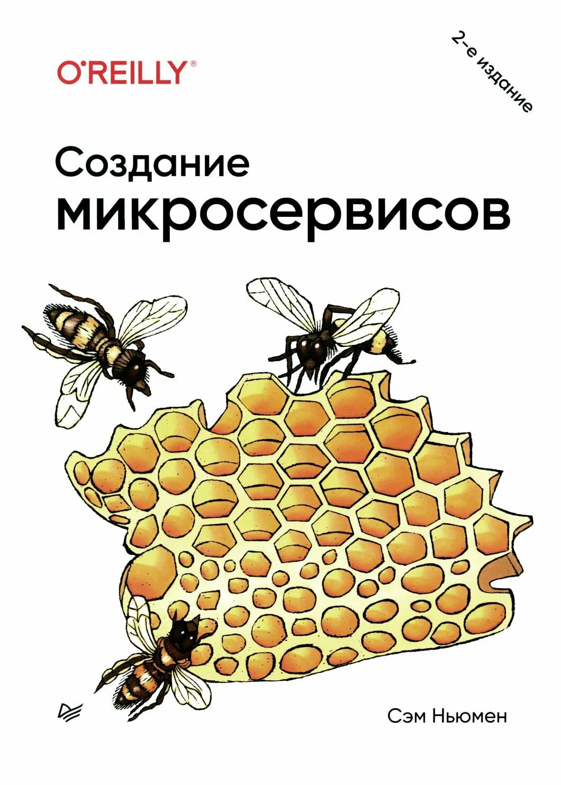

# 📖 Создание микросервисов

Конспект книги 
Создание микросервисов (2-е издание)
Сэм Ньюмен

## 📚 О книге

Книга — практическое руководство по проектированию, построению и сопровождению микросервисных систем, охватывающее:
- Что такое микросервисы, их сильные стороны и риски
- Моделирование границ сервисов: сокрытие информации, связность, связанность, DDD
- Разделение монолита на части
- Стили взаимодействия и технологии коммуникации (REST, gRPC, GraphQL, брокеры сообщений)
- Рабочие потоки, распределённые транзакции и саги
- Сборку, развертывание и тестирование
- Наблюдаемость, безопасность, отказоустойчивость и масштабирование
- Пользовательские интерфейсы, организационные структуры и роль эволюционного архитектора

## 📑 Структура конспекта

### Главы
- [01. Что такое микросервисы](./chapters/ГЛАВА%201%20Что%20такое%20микросервисы.md)
- [02. Как моделировать микросервисы](./chapters/ГЛАВА%202%20Как%20моделировать%20микросервисы.md)
- [03. Разделение монолита на части](./chapters/ГЛАВА%203%20Разделение%20монолита%20на%20части.md)
- [04. Стили взаимодействия микросервисов](./chapters/ГЛАВА%204%20Стили%20взаимодействия%20микросервисов.md)
- [05. Реализация коммуникации микросервисов](./chapters/ГЛАВА%205%20Реализация%20коммуникации%20микросервисов.md)
- [06. Рабочий поток](./chapters/ГЛАВА%206%20Рабочий%20поток.md)
- [07. Сборка](./chapters/ГЛАВА%207%20Сборка.md)
- [08. Развертывание](./chapters/ГЛАВА%208%20Развертывание.md)
- [09. Тестирование](./chapters/ГЛАВА%209%20Тестирование.md)
- [10. От мониторинга к наблюдаемости](./chapters/ГЛАВА%2010%20От%20мониторинга%20к%20наблюдаемости.md)
- [11. Безопасность](./chapters/ГЛАВА%2011%20Безопасность.md)
- [12. Отказоустойчивость](./chapters/ГЛАВА%2012%20Отказоустойчивость.md)
- [13. Масштабирование](./chapters/ГЛАВА%2013%20Масштабирование.md)
- [14. Пользовательские интерфейсы](./chapters/ГЛАВА%2014%20Пользовательские%20интерфейсы.md)
- [15. Организационные структуры](./chapters/ГЛАВА%2015%20Организационные%20структуры.md)
- [16. Эволюционный архитектор](./chapters/ГЛАВА%2016%20Эволюционный%20архитектор.md)
- [Послесловие: подведём итог основных тем](./chapters/Послесловие.md)

## 🔗 Связанные конспекты

- [ГЛАВА 17 Архитектура микросервисов](../fundamental-software-architecture/chapters/ГЛАВА%2017%20Архитектура%20микросервисов.md) — «Фундаментальный подход к программной архитектуре»
- [ГЛАВА 14 Микросервисы](../learning-domain-driver-design/chapters/ГЛАВА%2014%20Микросервисы.md) — «Изучаем DDD»
