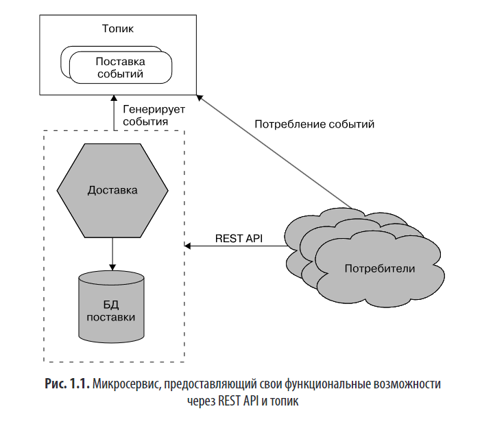
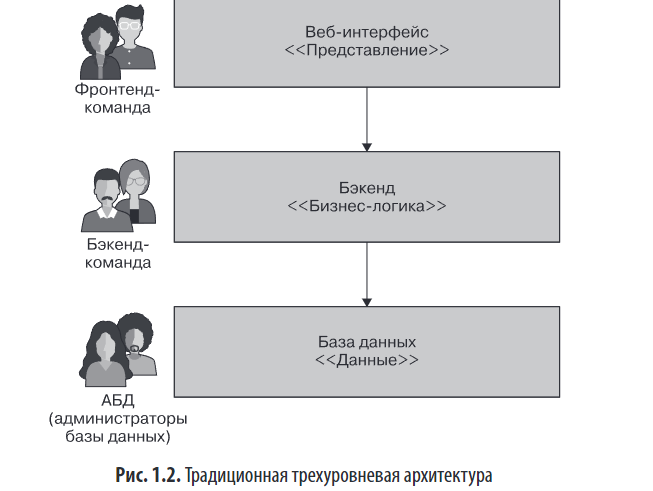
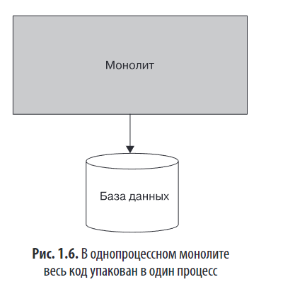
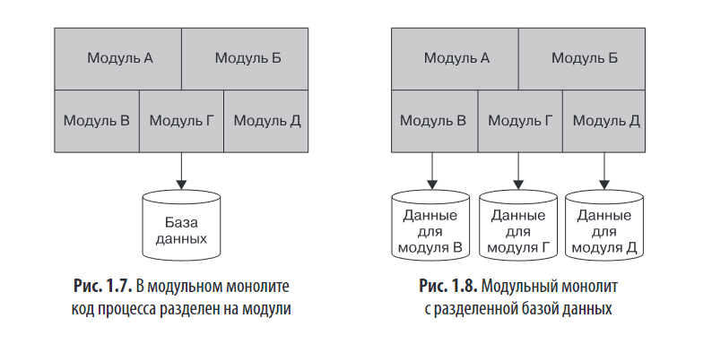
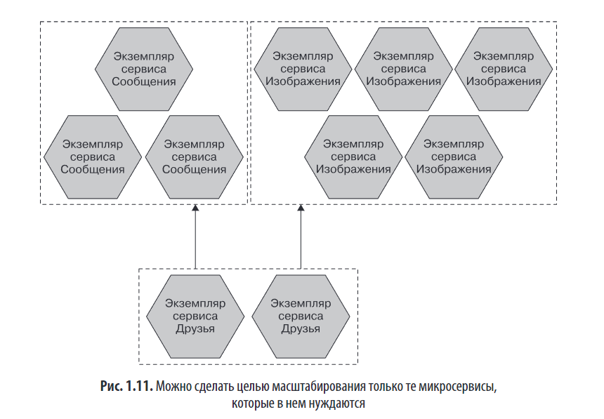

# Глава 1. Что такое микросервисы

### 🔹 Основное определение
- **Микросервис** — это *независимо развертываемый сервис*, моделируемый вокруг **предметной области бизнеса**(DDD forever).
- Инкапсулирует функциональность и предоставляет её через сетевые интерфейсы (REST API, очереди и т.п.).
- Внутренняя реализация (технологии, БД и т.д.) **скрыта** от внешнего мира → принцип **скрытия информации** (information hiding).
- Сокрытие и инкапсуляция позволяет изменять сервисы независимо, не затрагивая других, что снижает связанность (coupling) и повышает связность (cohesion).
- Микросервисы можно рассматривать как уточнённый, практический подход к сервис-ориентированной архитектуре (SOA; см. [главу 16 «Оркестрированная сервис-ориентированная архитектура»](../../fundamental-software-architecture/chapters/ГЛАВА%2016%20Оркестрированная%20сервис-%20ориентированная%20архитектура.md) в конспекте «Фундаментальный подход к программной архитектуре»), избегающий типичных ошибок SOA — таких как общие базы данных, недостаточная независимость развёртывания и чрезмерная зависимость от сложных промежуточных решений (например, SOAP и ESB). В отличие от классической SOA, микросервисы делают ставку на простоту, децентрализацию и автономность команд и компонентов.

### 🔹 Ключевые характеристики
1. **Независимое развертывание**  
   - Изменение одного сервиса не требует развертывания всей системы.
   - Обязательное условие успешной микросервисной архитектуры.
   - Требует: слабой связанности, стабильных контрактов, отсутствия общей БД.

1. **Моделирование вокруг бизнес-домена** (DDD везде) 
   - Используется **предметно-ориентированное проектирование** (Domain-Driven Design, DDD).
   - Сервисы — это **сквозные срезы** бизнес-функциональности (UI + логика + данные).
   - Противоположность технической декомпозиции (например, трёхуровневой архитектуре)., микросервисы стремятся к **сильной связности внутри сервиса** и **слабой связанности между сервисами**, ориентируясь на бизнес-контекст, а не на техническую декомпозицию.
   - 

3. **Инкапсуляция данных и контроль состояния**  
   - У каждого микросервиса — *собственная база данных*.
   - Совместное использование БД **категорически не рекомендуется**, т.к. нарушает независимость.

4. **Размер сервиса**  
   - Не измеряется в строках кода.
   - Должен быть «размером с вашу голову» — *понятен одной команде*.
   - Ориентир: **минимизация интерфейса** (мало точек взаимодействия → проще поддерживать).

5. **Гибкость**  
   - Архитектура даёт новые возможности, но имеет **цену** (сложность, накладные расходы).
   - Переход к микросервисам должен быть **постепенным**.

---

## ПРИМЕР Компания MusicCorp

Компания **MusicCorp** использует классическую **трехуровневую архитектуру** (UI, бэкенд, БД), где за каждый уровень отвечает отдельная команда (фронтенд-разработчики, бэкенд-разработчики, администраторы БД). При необходимости внести даже **небольшое бизнес-изменение** — например, добавить возможность выбора любимого музыкального жанра — приходится координировать **все три команды**, что замедляет разработку и усложняет внедрение.

Этот подход отражает **закон Конвея**: _«Архитектура системы повторяет коммуникационную структуру организации»_. Поскольку команды сформированы по **техническим компетенциям**, а не по бизнес-задачам, архитектура получается **технологически связной**, но **бизнес-функционально разрозненной**.

В качестве альтернативы предлагается **вертикальная (сквозная) организация** — команды формируются вокруг **бизнес-возможностей** (например, «профиль покупателя»). Такая команда отвечает за **весь стек** (UI, логику, данные) в рамках своей области. Это позволяет:

- вносить изменения **локально**, без координации с другими командами;
- ускорить **развертывание** и **реакцию на бизнес-требования**;
- выстроить архитектуру вокруг **предметной области**, а не технологий.

Такой подход реализуется через **микросервисы**, каждый из которых — это **инкапсулированный бизнес-срез**, а также через **потоковые команды** (stream-aligned teams), которые полностью владеют своей частью ценности для пользователя и могут работать **независимо и быстро**.

Таким образом, **микросервисная архитектура** и **современная организационная структура** взаимно поддерживают друг друга, фокусируясь на **бизнес-результатах**, а не на технологических границах.

---

### 🔹 Отличия от SOA
- Микросервисы — это **частный случай SOA**, но с акцентом на:
  - независимое развертывание,
  - отсутствие общей БД,
  - бизнес-ориентированную декомпозицию.
- Классическая SOA часто страдала от монолитных баз данных, тяжелых протоколов (SOAP) и централизованного middleware.

---

### 🔹 Монолиты: три типа
1. **Однопроцессный монолит**  
   - Весь код в одном процессе → простота развертывания, но сложность масштабирования и изменений.

   

1. **Модульный монолит**  
   - Логически разделён на модули, но развертывается как единое целое.
   - Может быть хорошим промежуточным решением (пример: Shopify).

   

1. **Распределённый монолит**  
   - Множество сервисов, но развертываются *вместе* → худшее из двух миров: сложность распределённости + отсутствие независимости.

---

### 🔹 Проблема «конфликта доставки»
- В больших монолитах множество команд работают над одним кодом → конфликты релизов, неясность ответственности.
- Микросервисы позволяют чётко разграничить зоны ответственности → меньше координации.

---

### 🔹 Преимущества монолитов

Монолиты — особенно модульные и однопроцессные — имеют важные преимущества:

- **Простота развёртывания**, мониторинга, отладки и тестирования благодаря отсутствию распределённости.
- **Лёгкое повторное использование кода** внутри одной кодовой базы без необходимости выносить логику в отдельные сервисы или библиотеки.

Монолит — это **обоснованный и часто разумный выбор архитектуры**, особенно на ранних этапах или при умеренной сложности системы. Относиться к нему как к «устаревшему» — ошибка. Микросервисы стоит выбирать **только при наличии веской причины**, а не по умолчанию.

---

## МИКРОСЕРВИСЫ - Технологии, обеспечивающие развитие

### Микросервисы требуют новых подходов к эксплуатации из-за распределённости. Хотя не стоит сразу внедрять множество новых технологий, некоторые **ключевые инструменты** критически важны:

1. **Агрегирование логов и распределённая трассировка**  
    — Необходимы для отладки и понимания поведения системы.  
    — Используйте **идентификаторы корреляции**, чтобы связывать логи одной цепочки вызовов.  
    — Примеры: **Humio**, **Jaeger** (open-source), **Honeycomb**, **Lightstep**.
2. **Контейнеры и Kubernetes**  
    — Контейнеры (например, Docker) обеспечивают изоляцию и лёгкое развёртывание.  
    — **Kubernetes** помогает управлять масштабированием и отказоустойчивостью, но имеет сложность — лучше начинать с управляемых облачных решений (EKS, AKS, GKE).  
    — Не торопитесь внедрять Kubernetes при небольшом количестве сервисов.
3. **Потоковая передача данных**  
    — Заменяет традиционные пакетные интеграции и общие БД.  
    — **Kafka** — стандарт для надёжной, масштабируемой передачи событий.  
    — **Apache Flink** — для потоковой обработки.  
    — **Debezium** — для захвата изменений в базах данных и трансляции их в Kafka.
4. **Публичное облако и бессерверные технологии**  
    — Облачные провайдеры (AWS, Azure, GCP) предлагают **управляемые сервисы**, снижающие операционную нагрузку.  
    — **Бессерверные (serverless)** решения, особенно **FaaS** (например, AWS Lambda), позволяют фокусироваться на коде, не заботясь об инфраструктуре.

**Главный принцип**: сначала решайте проблемы, вызванные распределённостью, и только потом внедряйте технологии, которые их устраняют.

---

### 🔹 Преимущества микросервисов кратко

| Преимущество                       | Описание                                                                                  |
| ---------------------------------- | ----------------------------------------------------------------------------------------- |
| **Технологическая неоднородность** | Разные сервисы могут использовать разные языки, БД, фреймворки.                           |
| **Надёжность**                     | Отказ одного сервиса не ломает всю систему (принцип *переборок* (bulkhead).).             |
| **Масштабируемость**               | Можно масштабировать только проблемные части.                                             |
| **Простота развертывания**         | Частые, безопасные релизы с возможностью быстрого отката.                                 |
| **Согласование с организацией**    | Поддержка *потоковых команд* (Team Topologies): каждая команда — за свой бизнес-срез.     |
| **Компонуемость**                  | Функциональность легко перекомпоновывать для разных каналов (мобильный, веб, API и т.д.). |

🔹 Преимущества микросервисов развернуто

Микросервисы предлагают ряд ключевых преимуществ, обусловленных **независимостью сервисов**, **инкапсуляцией** и **ориентацией на бизнес-домены**:

1. **Технологическая неоднородность**  
    — Каждый микросервис может использовать **свой стек технологий** (язык, СУБД, фреймворк), выбирая оптимальное решение под конкретную задачу (например, графовая БД для соцсети, документная — для сообщений).  
    — Позволяет **безопасно экспериментировать** с новыми технологиями в изолированной части системы.  
    — Обновления (например, версии JVM или фреймворка) можно проводить **по одному сервису**, снижая риски.

   

2. **Повышенная надёжность**  
    — Границы сервисов служат **«переборками» (bulkheads)**: сбой в одном сервисе не обязательно выводит из строя всю систему.  
    — Однако требует **осознанного подхода к отказоустойчивости**: сети и узлы могут падать — нужно продумывать обработку таких сценариев.

3. **Гибкое масштабирование**  
    — Масштабируется **только тот сервис, который в этом нуждается**, а не вся система целиком.  
    — Это снижает затраты (особенно в облаке) и повышает эффективность использования ресурсов.  
    — Пример: Gilt перешёл на микросервисы, чтобы справляться со всплесками трафика, и теперь управляет >450 сервисами.

    

4. **Простота и скорость развёртывания**  
    — Изменения в одном сервисе можно **развёртывать независимо**, без перезапуска всей системы.  
    — Упрощает **откат** при проблемах и позволяет чаще выпускать обновления — как у Amazon и Netflix.
5. **Согласование архитектуры и организационной структуры**  
    — Микросервисы естественным образом поддерживают **малые, автономные команды**, каждая из которых владеет своим сервисом.  
    — Это повышает продуктивность и упрощает адаптацию к изменениям в бизнесе.
6. **Компонуемость и многоканальность**  
    — Функциональность легко **повторно использовать** в разных контекстах (веб, мобильное приложение, API для партнёров и т.д.).  
    — В отличие от монолита с «единой точкой входа», микросервисы позволяют **гибко собирать приложения** под разные сценарии взаимодействия с пользователем.

> **Важно**: преимущества реализуются только при грамотном проектировании — микросервисы не решают проблемы «автоматически», а вводят новые сложности (сетевые задержки, согласованность данных, мониторинг).

---

### 🔹 Слабые стороны и риски микросервисов кратко

| Проблема | Комментарий |
|---------|------------|
| **Сложность для разработки** | Невозможно локально запустить всю систему → замедление циклов разработки. |
| **Технологическая перегрузка** | Соблазн использовать всё новое сразу → рост сложности. |
| **Стоимость** | Больше ресурсов, процессов, лицензий, времени на освоение. |
| **Отчётность** | Нет единой БД → нужно строить data lake, streaming-ETL или event sourcing. |
| **Мониторинг и отладка** | Требуются **агрегация логов**, **распределённая трассировка** (Jaeger, Honeycomb). |
| **Безопасность** | Больше сетевого трафика → необходима защита (шифрование, аутентификация между сервисами). |
| **Тестирование** | Сквозные тесты дороже и менее надёжны → нужны контрактные тесты, канареечные релизы. |
| **Задержки** | Сетевые вызовы добавляют latency → нужно контролировать цепочки вызовов. |
| **Согласованность данных** | Нет распределённых транзакций → используем **саги** и **согласованность в конечном счёте**. |

### 🔹 Слабые стороны и риски микросервисов развернуто

Микросервисы, несмотря на свои преимущества, вносят **ряд сложностей**, большинство из которых связаны с природой **распределённых систем**. Вот основные риски и вызовы:

---

### 1. **Ухудшение опыта разработчика**

- Локальный запуск всей системы становится невозможным при росте количества сервисов (особенно на ресурсоёмких стеках, например JVM).
- Использование облачных зависимостей, которые нельзя развернуть локально, вынуждает разработчиков работать в облаке, что **замедляет циклы обратной связи**.
- Модель «коллективного владения» (любой разработчик может работать с любым сервисом) становится трудноосуществимой.

---

### 2. **Технологическая перегрузка**

- Соблазн использовать «все новые технологии сразу» (Kubernetes, FaaS, разные языки и БД) может привести к **технологическому фетишизму**.
- Это усложняет обучение, поддержку и увеличивает когнитивную нагрузку.
- Рекомендация: **внедрять новые инструменты по мере необходимости**, а не превентивно.

---

### 3. Стоимость

- **Краткосрочные расходы растут**: больше процессов, машин, сетей, лицензий, инфраструктуры.
- **Организационные изменения** замедляют разработку, пока команды осваивают новую парадигму.
- Микросервисы — **не инструмент для снижения издержек**, а для **ускорения бизнес-ценности** (новые функции, гибкость, масштабируемость).

---

### 4. **Проблемы с отчётностью**

- В монолите данные централизованы — отчёты строятся напрямую из одной БД.
- В микросервисах данные **разделены по изолированным базам**, что усложняет аналитику.
- Решения: **потоковая передача данных (например, через Kafka)**, озёра данных, или агрегация в централизованное хранилище.

---

### 5. **Сложность мониторинга и отладки**

- Система состоит из десятков/сотен процессов — сбой одного сервиса не всегда критичен, но его выявление требует **расширенной наблюдаемости**.
- Необходимы **распределённая трассировка** (например, Jaeger), агрегация логов, корреляционные ID.
- Простой «бинный» статус (работает/не работает) больше не применим.

---

### 6. **Безопасность**

- Больше данных передаётся по сети → растёт риск **перехвата** (MITM-атаки).
- Требуется усиленная защита: **шифрование, аутентификация, авторизация между сервисами** (например, mTLS, JWT, сервисные mesh-сети).

---

### 7. **Тестирование**

- **Сквозные тесты** становятся дороже, медленнее и менее надёжными (из-за сетевых сбоев, таймаутов).
- Возрастает зависимость от **контрактного тестирования**, **тестирования в продакшене**, **канареечных релизов**.
- Необходимо пересматривать стратегию тестирования в пользу **модульных и контрактных подходов**.

---

### 8. Время ожидания (latency)**

- Внутренние вызовы теперь — **сетевые**, с сериализацией и десериализацией.
- Общая задержка операции **увеличивается**, особенно при цепочках вызовов.
- Требуется **измерение сквозной задержки** (например, через Jaeger) и чёткое понимание **допустимых порогов**.

---

### 9. **Согласованность данных**

- Отсутствие общей транзакции между сервисами → **невозможно обеспечить строгую согласованность**.
- Приходится использовать **саги**, **согласованность в конечном счёте**, **обработку ошибок и компенсирующие операции**.
- Это требует **фундаментального переосмысления работы с данными**.

---

### Главный вывод:

Микросервисы — **не панацея**, а **компромисс**. Они оправданы при наличии **сложного бизнеса**, потребности в **независимом развёртывании**, **масштабировании** и **гибкости**. Но внедрять их стоит **постепенно**, осознанно и только тогда, когда выгоды перевешивают издержки.

---

### 🔹Микросервисы — это **архитектурный выбор, а не универсальное решение**. Их применение требует тщательной оценки контекста: предметной области, зрелости продукта, размера команды и эксплуатационных возможностей.

---

### ❌ **Кому микросервисы НЕ подходят:**

1. **Стартапы и новые продукты**  
    — Предметная область ещё не стабилизировалась, границы сервисов будут часто меняться.  
    — Координация изменений между сервисами дорогостояща и замедляет итерации.  
    — Главная цель — быстро проверить гипотезу и найти product-market fit, а не строить масштабируемую архитектуру.
2. **Небольшие команды (до 5–10 разработчиков)**  
    — «Налог на микросервисы»: значительная часть ресурсов уходит на инфраструктуру, мониторинг, развёртывание, а не на создание функциональности.  
    — Лучше начать с **модульного монолита**, а позже, при необходимости, декомпозировать.
3. **Продукты, развёртываемые клиентами (on-premise / boxed software)**  
    — Микросервисы усложняют установку и эксплуатацию.  
    — Клиенты не готовы управлять Kubernetes, сетями, сервис-мешами и т.п.  
    — Для них важна простота развёртывания (например, один установочный пакет).

---

### ✅ **Где микросервисы работают хорошо:**

1. **Крупные и быстро растущие компании**  
    — Позволяют **масштабировать команды**: множество разработчиков могут работать параллельно без конфликтов.  
    — Архитектура согласуется с организационной структурой (закон Конвея).
2. **SaaS-продукты (Software as a Service)**  
    — Требуют **непрерывной работы** и **частых релизов** → микросервисы дают **независимое развёртывание**.  
    — Гибкое **масштабирование** только нужных компонентов → эффективное использование ресурсов (особенно в облаке).
3. **Многосредовые и многоканальные системы**  
    — Когда нужно поддерживать веб, мобильные приложения, API для партнёров, IoT и т.д.  
    — Микросервисы обеспечивают **повторное использование** и **компонуемость** функциональности.
4. **Использование возможностей облака**  
    — Легко комбинировать разные модели развёртывания: **FaaS**, **PaaS**, **управляемые VM** — под конкретные задачи.  
    — Технологическая гибкость: каждый сервис может использовать оптимальный стек.

---

### 💡 Ключевой вывод:

> **Не начинайте с микросервисов — начинайте с понимания проблемы.**  
> Микросервисы оправданы, когда **бизнес-сложность**, **масштаб команды** или **требования к эксплуатации** делают монолит невыгодным.  
> В остальных случаях — **отложите их** и сфокусируйтесь на доставке ценности. Монолит можно разделить позже, когда вы точно знаете, **где проходят границы доменов**.

---

### 🔹 Заключение
- Микросервисы — **не серебряная пуля**, а **архитектурный выбор с компромиссами**.
- Их ценность раскрывается **в правильном контексте**: зрелый домен, масштаб, команда, DevOps-культура.
- Главный совет автора: **не начинайте с микросервисов**, если у вас нет веской причины. Лучше начать с модульного монолита и декомпозировать позже.
