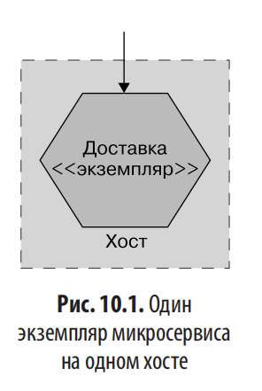
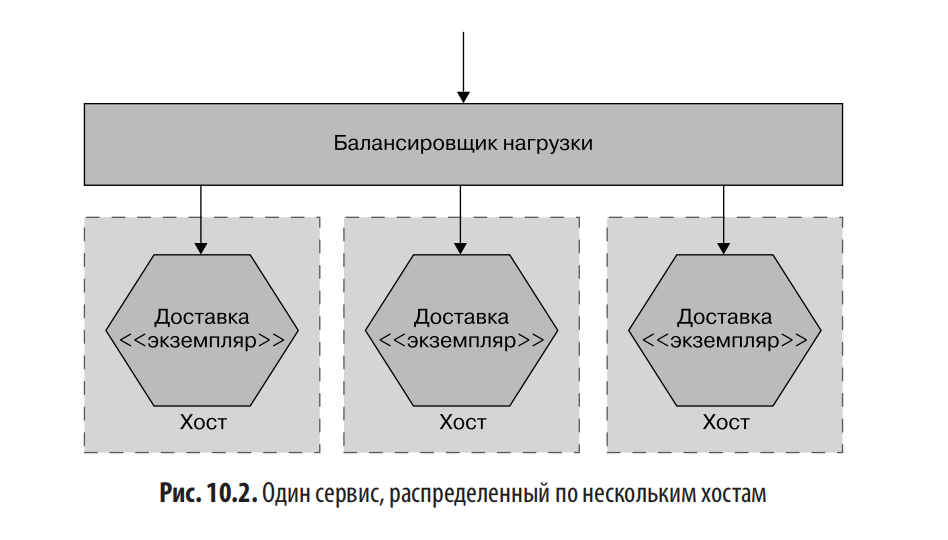
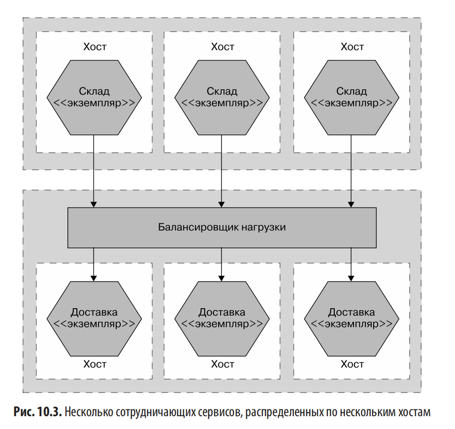
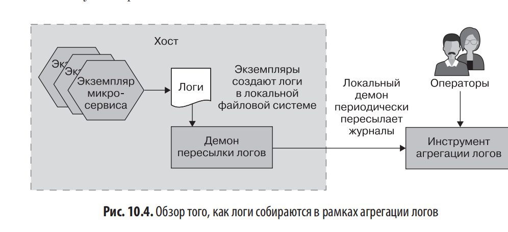
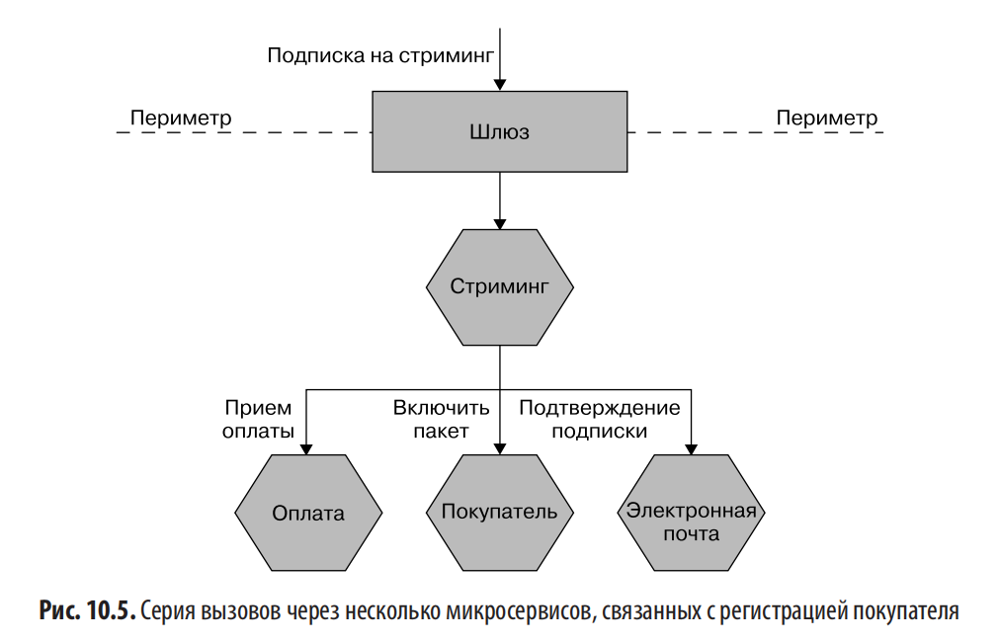
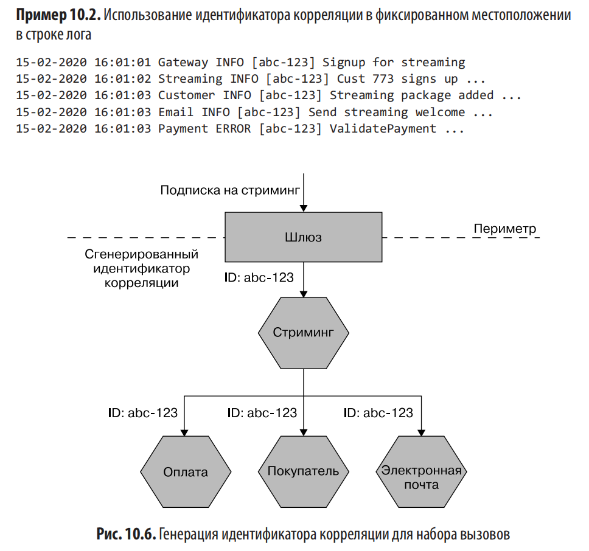
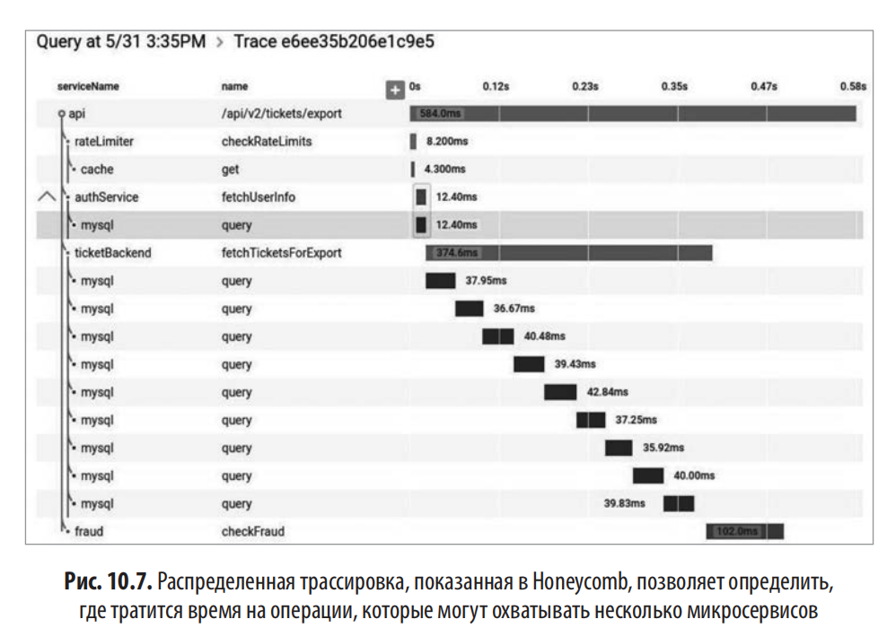

# Глава 10. От мониторинга к наблюдаемости

## Проблемы эксплуатации микросервисов

### Сбой, паника и замешательство

- В монолите — очевидная точка расследования. В микросервисах:
  - много серверов для мониторинга,
  - много логов,
  - много мест, где сетевая задержка может всё испортить,
  - круг «подозреваемых» резко расширяется.

### Три эволюционных этапа сложности
- **Один микросервис — один сервер**: хватает трёх уровней наблюдения: метрики хоста (CPU, память), логи самого сервиса (для диагностики ошибок) и внешний мониторинг приложения (время отклика, health-check эндпоинты).

  

- **Один микросервис — несколько серверов**: нужна агрегация метрик и логов, возможность детализации, мультиплексоры SSH как временный костыль; время отклика можно снимать с балансировщика.

При масштабировании до нескольких серверов с балансировщиком нагрузки мониторинг усложняется.

Нужно уметь изолировать проблему: высокая загрузка CPU на всех хостах указывает на проблему сервиса, а на одном — на проблему конкретного хоста (например, неконтролируемый процесс ОС). 

Метрики хостов теперь нужно агрегировать, сохраняя возможность детализации по каждому хосту отдельно. Для логов заходить на каждый сервер вручную становится утомительно — временно помогают SSH-мультиплексоры и grep, но подход быстро устаревает. 

Время отклика можно фиксировать на балансировщике нагрузки, но стоит учитывать, что сам балансировщик может стать узким местом, поэтому может понадобиться замерять время отклика и на нём, и на самих микросервисах. 

Балансировщик также должен уметь исключать неисправные узлы, для чего важно понимать, как выглядит «здоровый» сервис.

- **Несколько микросервисов — несколько серверов**: При переходе к множеству микросервисов на множестве хостов сложность резко возрастает. Ключевые проблемы: как найти нужную ошибку в тысячах строк логов на разных хостах, как отличить проблему конкретного сервера от системной, как отследить ошибку через цепочку вызовов между сервисами. Агрегирование метрик и логов становится жизненно важным, но недостаточным — нужно уметь просеивать огромный поток данных. Главное здесь — смена мышления: от статичного мониторинга к активной наблюдаемости и эксплуатационному тестированию.

## Наблюдаемость и мониторинг

### Определения
- **Наблюдаемость** — степень, в которой можно понять внутреннее состояние системы по её внешним выводам. **Свойство системы**.

 это свойство системы, показывающее, насколько хорошо можно понять её внутреннее состояние по внешним выходным данным. Чем она выше, тем легче разобраться в проблеме. Концепция существует десятилетия, но в разработке ПО стала популярна недавно. Она требует целостного взгляда на ПО как на систему, а не набор разрозненных частей. Парадокс в том, что внешние выходные данные часто нужно специально создавать и использовать разные инструменты для их понимания.

- **Мониторинг** — то, **что мы делаем**. Деятельность.

Мониторинг — это деятельность, наблюдение за системой. Традиционный подход предполагает заранее продумать возможные сбои и настроить оповещения. Но в распределённых системах возникают непредвиденные проблемы. Наблюдаемая система позволяет задавать вопросы, которые заранее и не пришли бы в голову.

Итого: мониторинг — это то, что мы делаем, наблюдаемость — свойство системы.

### Критика «трёх столпов наблюдаемости»
- Популярная модель: метрики, логи, распределённая трассировка (у New Relic — **MELT**: metrics, event, logs, traces).
- Автор считает её упрощённой:
  - сводит свойство системы к деталям реализации,
  - границы между понятиями размыты (метрики можно писать в логи, трассировку строят из логов),
  - продвигается, в том числе, чтобы продавать отдельные инструменты.
- Более общая рамка: любая информация — это **событие**, доступное для сбора и опроса. Из потока событий можно спроецировать трейсы, индексы, метрики. 

## Строительные блоки наблюдаемости
Главная цель — сделать пользователей счастливыми: узнавать о проблемах раньше них, быстро восстанавливать работу системы и иметь достаточно информации для анализа причин и предотвращения повторений.

Для этого выделяются строительные блоки наблюдаемости:

- Агрегация логов.(сбор информации от нескольких микросервисов)
- Агрегация метрик.(сбор необработанных данных для выявления проблем и планирования ёмкости и, возможно,даже масштабирования)
- Распределённая трассировка.(отслеживание потока вызовов между сервисами для диагностики и замера задержек)
- «Всё ли у нас в порядке?» — SLA/SLO/SLI, бюджеты ошибок.(удовлетворяет ли сервис потребности потребителей)
- Оповещение.(О чем следует оповещать? Как выглядит хорошее оповещение?),
- Семантический мониторинг.(нестандартный взгляд на работоспособность)
- Тестирование в эксплуатации.

## Агрегация логов

### Ключевой совет автора
- **Внедрить инструмент агрегации логов — обязательное условие** перед началом работы над микросервисами.
- Причины:
  - крайне высокая отдача,
  - если даже это не получается — значит, организация не готова к микросервисам (проверка зрелости).

### Как это работает
- Микросервисы пишут логи локально → локальный демон (агент) периодически пересылает их в центральное хранилище.
- Микросервису **не нужно знать** об агрегаторе — спецAPI не требуется.
- Нужно понимать режимы сбоев доставки логов (чтобы знать, где они могут теряться).

### Общий формат
- Нужен стандартный формат: дата, время, имя микросервиса, уровень лога в одних и тех же местах.
- **Переформатирование на агенте** — плохая практика (дорого по CPU, приводило к реальным инцидентам). Лучше приводить лог к нужной форме в самом сервисе.
- Для структурированных запросов (по customer_id, order_id) — **JSON**, но он хуже читается глазами без дополнительных инструментов.
- Единого отраслевого стандарта так и не появилось.

### Идентификаторы корреляции

- Пример: клик на кнопку регистрации → Шлюз → Стриминг → Оплата → Покупатель → Электронная почта.
- При ошибке только в *Оплате* — контекст потерян. у нас не получится увидеть эту ошибку в более широком контексте, в котором она возникает.
- Решение: на входе (обычно в Шлюзе) генерируется **уникальный ID**, который протаскивается через все вызовы и пишется в каждую строку лога.(идентификаторов корреляции, о чем мы впервые упомянули в главе 6 при обсуждении саги. Когда выполняется первый вызов, вы генерируете уникальныйидентификатор, используемый для сопоставления всех последующих вызовов,связанных с запросом.)
- Требует стандартизации и дисциплины.
- **Внедрять как можно раньше  — дооснащать постфактум сложно.

### Привязка по времени — опасности
- Нельзя полагаться на таймштампы логов для определения **точного порядка** вызовов:
  - часы разных машин расходятся,
  - **Протокол сетевого времени (Network Time Protocol, NTP)** уменьшает расхождение, но не устраняет его,
  - даже секундный рассинхрон может инвертировать порядок событий.
- Два ограничения логов: не дают ни точного времени, ни причинно-следственной связи.
- Альтернатива: логические часы Лэмпорта(счетчик используется для отслеживания порядка вызовов) или **распределённая трассировка**. (ПОЗЖЕ)

### Реализации
- Популярный open source стек: **Fluentd → Elasticsearch → Kibana**.
- Проблемы Elasticsearch:

  - позиционируется как БД, но **по замыслу это поисковый индекс** (не источник истины),
  - дорого
  - в прошлом были проблемы с потерей данных (Jepsen),
  - компания Elastic сменила лицензию на **SSPL** — это вызвало волну недовольства, AWS форкнула проект под Apache 2.0.
- Коммерческие альтернативы: **Splunk** (дорого), **Humio** (нравится автору), **Datadog**.
- Облачные штатные решения: **CloudWatch** (AWS), **Application Insights** (Azure).

### Недостатки логов
- Несинхронные часы → неточный порядок и время.
- **Огромные объёмы данных** по мере роста числа сервисов. ->
	- Рост затрат (железо, плата провайдеру).
	- Проблемы масштабирования у индексирующих решений (одна команда справлялась только с 6 неделями логов на самый крупный кластер Elasticsearch).
- Humio — упор на эффективный приём данных, а не на индексацию.
- Логи содержат чувствительную информацию → нужно ограничивать доступ, что мешает коллективному владению; могут быть мишенью атак. **«Если вы не храните данные — их нельзя украсть.»**

## Агрегация метрик

### Зачем
- Определить, что для системы «хорошо», можно только по статистике за длительный период.
- Нужно легко собирать метрики с новых экземпляров, агрегировать и детализировать.
- Помогает в **планировании мощности** (особенно в эпоху IaaS с масштабированием за минуты).

### Разрешение данных
- Свежие данные — высокое разрешение (например, раз в 10 сек за 30 мин).
- Старые — агрегированные (например, средние по часу).
- Минус: приходится заранее решать, **что можно потерять**.

### Кардинальность — низкая vs высокая
- **Кардинальность** ≈количество полей, которые можно легко запросить в выбранной точке данных.
- Цитата Чарити Мейджорс: метрика дешёва, **теги дороги** — много тегов ломает механизм хранения. 
> Метрика — это точка данных, одно число с именем
> и некоторыми идентифицирующими тегами. Весь контекст, который вы можете
> получить, должен быть помещен в эти теги. Но запись всех этих тегов обходится
> дорого из-за того, как метрики хранятся на диске. Хранение метрики обходится
> очень дешево, а тега — очень дорого. Поэтому хранение большого количества
> тегов на одну метрику быстро выведет из строя ваш механизм хранения данных

- Системы для низкой кардинальности (например, **Prometheus**) плохо справляются с высокой кардинальностью. В доке Prometheus прямо запрещено использовать в метках user_id, email и т.п.
- Высокая кардинальность = возможность задавать системе вопросы, которые не были продуманы заранее.

### Реализации
- Open source: автор сейчас рекомендует **Prometheus** (раньше советовал Graphite).
- Для высокой кардинальности — **Honeycomb**, **Lightstep** (их называют решениями для трассировки, но они хорошо работают с кардинальностью).

### ⚠ Вставка про сами системы мониторинга
- Инструменты наблюдаемости — **тоже продакшн-системы**, требуют такой же осмотрительности, как и рабочее ПО.
- Могут быть вектором атак (пример — **атака на цепочку поставок SolarWinds**).

## Распределённая трассировка

### Как это работает
- Локальная активность пишется в **спан** (span).
- Спаны связаны единым **trace ID**.
- Центральный коллектор собирает спаны в **трейс**.
- В каждом спане: время начала/окончания, логи, произвольные пары ключ–значение.

### Выборка (sampling)
- Собирать всё — убьёт систему.
- Варианты:
  - **агрессивная случайная выборка** (Google Dapper, Jaeger по умолчанию — 1/1000),
  - **динамическая выборка** (Honeycomb, Lightstep): например, все ошибки + 1 из 100 успешных похожих операций.

### Реализация
- Код инструментируется через стандартный API (**OpenTracing**, но более современный **OpenTelemetry**).
- способ отправить эту информацию в спане в коллектор —Локальный агент пересылки спанов в коллектор (буферизация, изменение выборки). Так же как и при агрегировании логов, агент запускается локальноив своем экземпляре микросервиса и периодически отправляет информацию из спана центральному сборщику.
- сборщик, способный получить эту информацию и разобраться во всем этом.
- Open source: **Jaeger**.
- Коммерция: **Lightstep**, **Honeycomb**.
- Автор рекомендует выбирать инструменты с поддержкой **OpenTelemetry**.

## Всё ли у нас в порядке? (SRE-подход)

### Проблема бинарного «здоров/нездоров»
- В распределённых системах чёрно-белое мышление не работает.
- Аналогия с пчелиным ульем: одна больная пчела ≠ больной улей.
- Оценка по отдельным метрикам (CPU, время отклика) — лишь косвенный индикатор. Таким образом, можно собрать много информации, но сама по себе она не дает понимания, работает ли система должным образом. Для этого нам нужно начать думать немного шире в плане определения приемлемого поведения
обеспечения надежности систем (site reliability engineering, SRE)
### Аббревиатуры
- **SLA** (service-level agreement) — соглашение с пользователями с последствиями при нарушении. Обычно «абсолютный минимум» (пример: AWS гарантирует 90% аптайма отдельного EC2, а не выполняет — не берёт деньги за час). 
- **SLO** (service-level objective) — что обещает конкретная команда. Выполнение всех SLO обычно сильно превышает SLA; могут быть амбициознее SLA. Пример SLO может включать такие вещи, как ожидаемое время безотказной работы или приемлемое время отклика для данной операции. SLO могут описывать другие цели, не изложенные в SLA
- **SLI** (service-level indicator) — реальный показатель того, что делает ПО (время отклика, регистрации, ошибки, заказы). Нужны для проверки SLO.

### Бюджеты ошибок
- Формализация допустимого количества ошибок.
- Пример: SLO 99,9% в квартал → можно «лежать» 2 ч 11 мин за квартал — это и есть бюджет.
- Даёт свободу пробовать новое: большой запас → можно рискнуть; бюджет исчерпан → остановка и работа над надёжностью.

## Оповещение

### Не все проблемы одинаковы
- Ключевой вопрос: **«стоит ли этой проблеме будить кого-то ночью?»**
- Пример Google: жёсткие диски крепят липучкой, потому что выходят из строя постоянно — система спроектирована так, что это не требует срочного реагирования.

### Усталость от оповещений
- **Три-Майл-Айленд (1979)** — частичное расплавление реактора, операторы захлебнулись в сигнализациях, полезное предупреждение не заметили. Один из операторов: «с удовольствием выбросил бы панель».
- **Boeing 737 MAX** — 346 погибших; отчёт NTSB: одновременные множественные оповещения превышают умственные ресурсы пилотов, сужают фокус → запоздалые или неверно приоритизированные действия.
- Вывод: больше оповещений ≠ лучше. Замечание про термины: «тревога» (alarm) и «оповещение» (alert) автор использует как синонимы.

### Правила хорошего оповещения (EEMUA)
Оповещение должно быть: 
- **актуальным, -Убедитесь, что оповещение представляет ценность.
- уникальным, -Убедитесь, что оповещение не дублирует другое.
- своевременным, -Необходимо получить оповещение достаточно быстро, чтобы вовремя отреагировать на него.
- приоритизированным, - Предоставьте оператору достаточно информации, чтобы он мог решить, в каком порядке следует обрабатывать предупреждения.
- понятным, -Информация в предупреждении должна быть ясной и читаемой.
- диагностичным, -Должно быть ясно, что не так.
- консультативным, -Помогите оператору понять, какие действия необходимо предпринять
- сфокусированным**.- Обратите внимание на наиболее важные вопросы

## Семантический мониторинг

### Суть
- Вместо поиска ошибок — ответ на вопрос: **«ведёт ли себя система так, как мы ожидаем?»**
- Пример для MusicCorp, «модель корректной работы»:
  - новые покупатели могут регистрироваться,
  - в пиковые часы продажи ≥ 20 000 $/час,
  - заказы отгружаются с нормальной скоростью.
- Эти утверждения становятся основой SLO.
- Согласование модели — задача **владельца продукта**; оператор обеспечивает, чтобы разговор состоялся.

### Два способа сверки с моделью
- Мониторинг реальных пользователей.
- Синтетические транзакции

### Мониторинг реальных пользователей
- Смотрим, что реально происходит: регистрации, заказы и т.п.
- Проблема: нужные данные могут быть в БД, с задержкой.
- Решение: бизнес-метрики складывать в то же хранилище, что и технические.
- Минусы:
  - шумно,
  - сообщает о **уже случившемся** → клиент уже недоволен.

## Тестирование в эксплуатации

### Мысль Чарити Мейджорс
- Не тестировать в проде = не репетировать с оркестром, потому что дома соло звучало прекрасно.

### Синтетические транзакции
- Искусственно инициируется полноценное «пользовательское» поведение с известным входом/выходом.
- История автора (2005, инвестбанк): фейковые события в очередь каждую минуту через Nagios; результат уходил в «мусорную» книгу; отсутствие переоценки в течение N — инцидент.
- Оказались гораздо лучшим индикатором проблем, чем низкоуровневые метрики (но их не заменяют — нужны для диагностики).

### Реализация синтетических транзакций
- Использовать уже имеющиеся end-to-end тесты (хуки для запуска и проверки уже есть).
- Подводные камни:
  - адаптация к меняющимся оперативным данным, фейковые пользователи с известным набором данных,
  - **контроль побочных эффектов**: история об e-commerce, которая случайно прогнала тесты в проде → в офис привезли кучу стиральных машин.

### Другие виды тестирования в эксплуатации
- **A/B-тестирование** — две версии функциональности, пользователи видят одну из них, сравнение эффективности.
- **Канареечный релиз** — новая версия для малой доли пользователей, постепенное расширение или откат.
- **Параллельное выполнение** — обе версии работают одновременно, запрос идёт в обе, результаты сравниваются; пользователь видит только одну.
- **Дымовые тесты** — после деплоя в прод, но до релиза. убедиться, что ПО работает должным образом.
- **Синтетические транзакции** — как описано выше.В систему внедряется полномасштабное фейковое взаимодействие с пользователем. Часто это очень похоже на сквозной тест, который вы могли бы написать.
- **Хаос-инжиниринг** — намеренное внедрение сбоев (глава 12). Пример: Netflix **Chaos Monkey** отключает виртуалки в проде.

## Стандартизация

- Наблюдаемость — область, где стандартизация **особенно важна**.
- Единый формат логов, одно хранилище метрик, единый нейминг метрик (а не `ResponseTime` vs `RspTimeSecs`).
- Реализуется как платформа с базовыми строительными блоками — часто силами платформенной команды (глава 15).

## Выбор инструментов

### Демократичность
- Инструменты должны быть доступны всем, а не только сеньор-операторам.
- Слишком дорогие инструменты, запрещённые в некритичных средах, блокируют обучение разработчиков.
- Использовать одни и те же инструменты в dev/test и в проде.

### Простота интеграции
- Поддержка **открытых стандартов** (OpenTracing → OpenTelemetry) снижает трудозатраты и упрощает смену поставщика.

### Обеспечение контекста (категории из блога Lightstep)
- Временной, относительный, реляционный, пропорциональный.

### Своевременность
- Информация нужна за **секунды**, не минуты/часы.

### Масштабирование под **свой** масштаб, а не под Google
- Бен Сигелман (Lightstep, создатель Dapper): Google делает 5 млрд RPC/сек и вынужден идти на жёсткие компромиссы (агрессивная выборка).
- При масштабе в 1000 раз меньше можно позволить гораздо более мощные функции.
- Учитывать и технические возможности инструмента, и **экономику** — сможете ли вы продолжать за него платить.

## Эксперт в машине
- Поставщики десятилетиями обещают «умные» системы, сейчас волна ML/AI с «автоматическим обнаружением отклонений».
- Автор скептичен: полностью автоматизировать экспертизу нельзя.
- Кейс со стартапом в medical data: data scientists нашли паттерн пациентов, но понять смысл смог только врач.
- Инструменты могут сказать «что-то выглядит странно», но что с этим делать — определяет человек.
- Эксперт в системе — **человек-оператор**, задача инструментов — дать ему правильные вопросы и информацию.

## Приступая к работе (базовый чек-лист)
- Базовые метрики хостов (CPU, I/O) + связка экземпляр микросервиса ↔ хост.
- Время отклика сервисных интерфейсов + логирование последующих вызовов.
- **Идентификаторы корреляции — сразу**.
- Логирование ключевых бизнес-этапов.
- Базовые инструменты: метрики + агрегация логов.
- Распределённую трассировку — не обязательно с первого дня, особенно если разворачивать самому; managed-сервис — можно сразу.
- **Синтетические транзакции для ключевых операций** — настоятельно рекомендуется.
- Умение **просеивать** данные и задавать вопросы системе важнее самого сбора.

## Резюме
- Распределённые системы сложны, проблемы часто непредсказуемы.
- Смена мышления: от **пассивного мониторинга** к **активной наблюдаемости**, от статических дашбордов — к детальному drill-down.
- Начинать просто: агрегация логов + ID корреляции → затем распределённая трассировка.
- Отказаться от бинарного «здоров/неисправен», перейти к **SLO** и приоритезированным оповещениям, чтобы бороться с усталостью от них.
- Главное — принять, что заранее всё не узнаешь. Учись справляться с неизвестностью.
