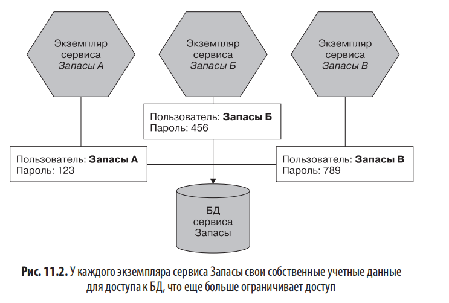
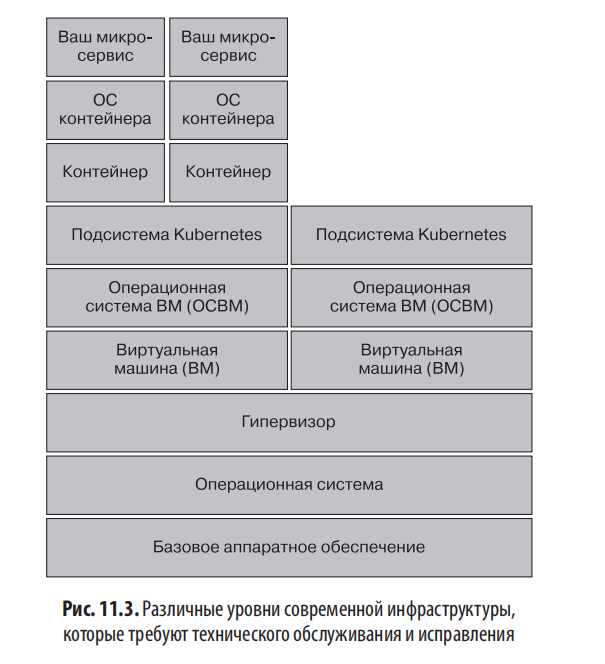
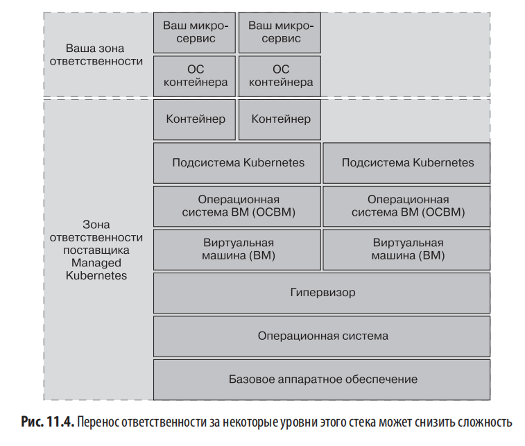
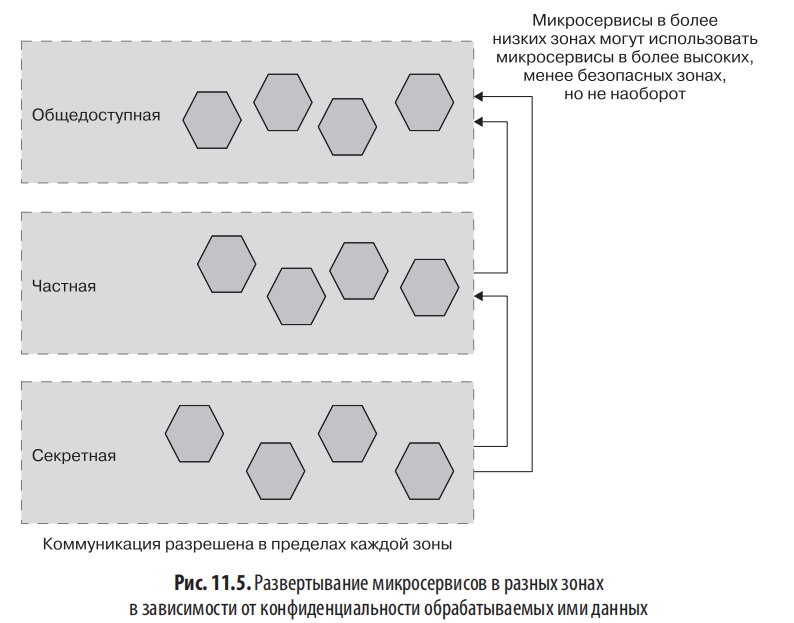
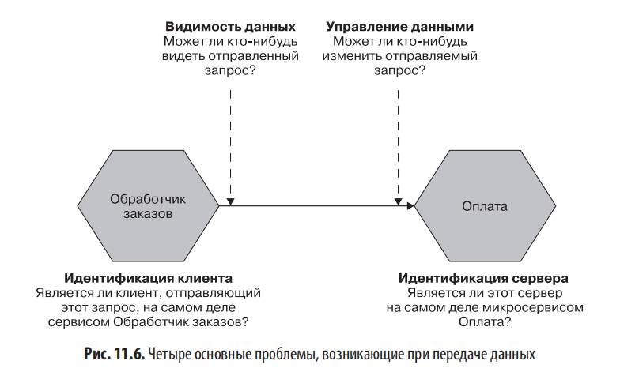
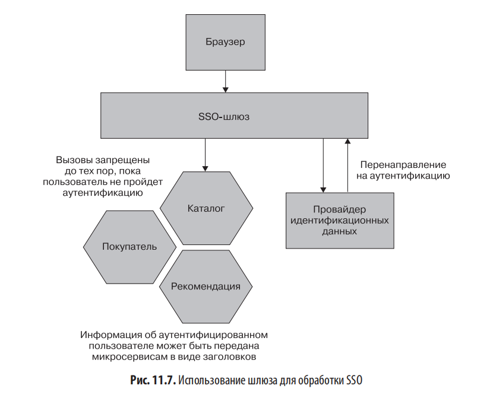
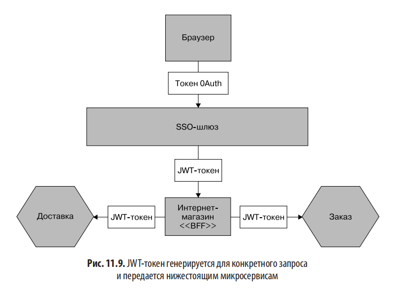

# Глава 11. Безопасность

## Введение

В главе выделены аспекты безопасности, которые стоит понимать рядовому разработчику, архитектору или специалисту по эксплуатации в микросервисной архитектуре. Необходимость в экспертах никуда не делась, но общая осведомлённость о безопасности жизненно важна для ПО.

**Дихотомия микросервисов и безопасности:**

- С одной стороны — больше данных передаётся по сетям, инфраструктура сложнее, площадь поверхности атаки выше
- С другой — широкие возможности для глубокой обороны и ограничения объёма доступа

Микросервисы могут сделать систему как менее, так и более безопасной — это тонкий баланс.

**Темы главы:**

- Основные принципы
- Пять функций кибербезопасности
- Основы безопасности приложений
- Безусловное доверие vs нулевое доверие
- Защита данных
- Аутентификация и авторизация

---

## Основные принципы

Проблема безопасности: вы защищены настолько, насколько сильна защита вашего наиболее слабого звена. Аналогия: бессмысленно ставить устойчивую к взлому входную дверь с подсветкой и камерами, оставив черный ход открытым.

### Принцип наименьших привилегий

Предоставлять **минимальный доступ**, необходимый стороне для выполнения функциональности, и только на **конкретный период времени**.

Преимущество: если учётные данные скомпрометированы, злоумышленник получит максимально ограниченный доступ.

Пример: если у микросервиса доступ к БД только для чтения, то злоумышленник получит только доступ для чтения. Если срок действия учётных данных истёк до компрометации — украденные данные бесполезны.

### Глубокая оборона

Аналогия с замками в Великобритании (Дуврский замок):

- Расположен на большом холме
- Имеет не одну, а две стены
- После преодоления стен — большая и внушительная крепость (башня)

Проблема одного механизма защиты: если злоумышленник найдёт способ его взломать или если механизм защищает только от определённых типов атак.

Микросервисы способствуют глубокой обороне:

- Разбивая функциональность на разные микросервисы и ограничивая объём задач
- Запуская микросервисы в разных сегментах сети
- Применяя различные технологии, чтобы одна уязвимость нулевого дня не повлияла на всё

> [!NOTE]
> **Средства контроля безопасности**
> 
> - **Превентивный** — предотвращение нападения (безопасное хранение секретов, шифрование данных, аутентификация и авторизация)
> - **Детективный** — оповещение об атаке (брандмауэры приложений, службы обнаружения вторжений)
> - **Реагирующий** — помощь во время/после атаки (автоматизированная повторная сборка, рабочие резервные копии, план связи на случай инцидента)

Для надлежащей защиты нужна комбинация всех трёх типов.

### Автоматизация

Автоматизация — ключевой фактор в микросервисных архитектурах:

- Управляет растущей сложностью
- Увеличивает скорость доставки
- Компьютеры быстрее, эффективнее и с меньшей вариативностью, чем люди
- Уменьшает количество человеческих ошибок
- Упрощает реализацию принципа наименьших привилегий
- Помогает восстанавливаться после инцидента
- Позволяет отзывать и ротировать ключи безопасности

### Встраивание безопасности в процесс доставки

Исторически безопасность рассматривалась как нечто второстепенное — после написания кода. Аналогично проблемам с тестированием, юзабилити и эксплуатацией за последние 20 лет.

Джонни Шнайдер сравнивает подход к юзабилити с «возникновением запоздалой мысли, которую добавляют поверх основного блюда».

**Автоматизированные инструменты для проверки уязвимостей:**

- **Zed Attack Proxy (ZAP)** — сканер на основе работы OWASP, воссоздаёт вредоносные атаки
- **Brakeman** (https://brakemanscanner.org) — статический анализ для Ruby
- **Snyk** (https://snyk.io) — обнаружение зависимостей с известными уязвимостями

Эти инструменты решают только локальные проблемы и не заменяют понимание безопасности на системном уровне.

---

## Пять функций кибербезопасности

Модель NIST (National Institute of Standards and Technology, США) из пяти частей:

1. **Выявление** потенциальных злоумышленников
2. **Защита** ключевых активов
3. **Обнаружение** атак, прошедших защиту
4. **Реагирование** на инциденты
5. **Восстановление** работоспособности

### Выявление

Люди плохо понимают риски, зацикливаются на неправильных вещах. Разработчики сразу говорят о JWT-токенах и MTLS — ищут технические решения известных им проблем.

**Пример из практики автора:** в одной организации обсуждали установку камер видеонаблюдения в приёмных после инцидента с проникновением. Дискуссия разделилась на два лагеря (за слежку / против слежки), пока один сотрудник не указал, что у входной двери главного офиса много лет был неисправный замок.

**Моделирование угроз** — поставить себя на место злоумышленника, думать как он. Важен взгляд со стороны, поэтому внешняя помощь полезна.

При моделировании угроз нужно смотреть **целостно** — сосредоточение на малом подмножестве системы приведёт к ложному ощущению безопасности.

📚 Рекомендуемая книга: Адам Шостак, «Моделирование угроз: Проектирование для обеспечения безопасности».

### Защита

Микросервисы предоставляют более широкую область для атаки, но и больше возможностей для углублённой обороны.

### Определение

Сложнее заподозрить неладное в микросервисной архитектуре:

- Больше сетей для мониторинга
- Больше машин
- Больше источников информации

Помогают: агрегирование логов, системы обнаружения проникновений, такие инструменты как **Aqua** (https://oreil.ly/OQn0O) для контейнеров.

### Реакция

Эффективное реагирование на инциденты:

- Понимание масштабов нарушения
- Какие данные были раскрыты
- При раскрытии PII (personally identifiable information) — следовать процедурам уведомления
- GDPR требует сообщать о нарушениях персональных данных в течение **72 часов**

Внутренняя культура: организации с культурой взаимных обвинений усваивают уроки хуже. Открытость и безопасность дают лучшие возможности для извлечения уроков.

### Восстановление

Способность снова запустить систему после атаки и применить полученный опыт. В микросервисной архитектуре больше подвижных элементов — автоматизация и резервное копирование критически важны.

---

## Основы безопасности приложений

### Учётные данные

Две ключевые области:

1. **Учётные данные пользователей и операторов** — часто самое слабое место
2. **Секреты** — фрагменты информации, критические для запуска микросервисов

#### Учётные данные пользователей

По отчёту Verizon за 2020 год — в **80% хакерских атак** использовалась та или иная форма кражи учётных данных (фишинг, перебор паролей).

**Рекомендации (по Трою Ханту, NIST, NCSC UK):**

- Использовать менеджеры паролей
- Длинные пароли
- Избегать сложных правил паролей
- Избегать обязательной регулярной смены пароля

**Пример Code Spaces:** компания прекратила деятельность после того, как злоумышленник получил доступ к корневой учётной записи AWS и уничтожил все ресурсы и резервные копии (которые работали под той же учётной записью). Иронично, что компания предлагала «надёжный, безопасный Svn-хостинг, Git-хостинг и управление проектами».

**Пример клиента автора:** кто-то потратил более **10 000 долларов** на майнинг биткоинов через украденные API-ключи. Существуют боты, сканирующие учётные данные для запуска криптомайнеров.

#### Секреты

Примеры секретов:

- Сертификаты для TLS
- SSH-ключи
- Пары открытых/закрытых API-ключей
- Учётные данные для доступа к БД

**Аспекты жизненного цикла секрета:**

- **Создание** — как изначально создаётся
- **Распределение** — как попадает в нужное место
- **Хранение** — доступ только авторизованным сторонам
- **Мониторинг** — знаем ли мы, как используется
- **Ротация** — можем ли изменить без проблем

**Инструменты:**

- **Kubernetes Secrets** — встроенное решение, ограниченное по функциональности, но доступно «из коробки»
- **Hashicorp Vault** (https://www.vaultproject.io) — швейцарский армейский нож для секретов; поддерживает ограниченные по времени учётные данные
- **consul-template** (https://oreil.ly/qNmAZ) — динамическое обновление секретов в файле конфигурации
- **AWS Secrets Manager** (https://oreil.ly/cuwRX)
- **Azure Key Vault** (https://oreil.ly/rV3Sb)

#### Ротация

Цель — ограничить ущерб при компрометации. Если ключи меняются раз в неделю — у злоумышленника только неделя.

**Ограниченные по времени API-ключи AWS** — генерируются на лету, действительны менее часа. Даже если попали в общедоступный GitHub — бесполезны после истечения срока.

Vault от Hashicorp генерирует ограниченные по времени учётные данные для БД — сведения о подключении формируются на лету для конкретного экземпляра микросервиса.

Болезненность ротации: некоторые компании сталкиваются с инцидентами при смене ключей. Часто потому, что неясно, для чего используются те или иные учётные данные.

#### Аннулирование

Если данные попали не в те руки — нужна возможность автоматически отзывать и восстанавливать учётные данные.

Подходы:

- Микросервис напрямую считывает секреты из Kubernetes Secrets/Vault → может получать уведомления об изменении
- Микросервис считывает при запуске → нужен перезапуск на ходу

> [!TIP]
> **Сканирование в поисках ключей**
>
> Случайная проверка закрытых ключей в репозиториях — распространённый вариант утечки. GitHub автоматически сканирует репозитории.
> 
> - **git-secrets** (https://oreil.ly/Ra9ii) — сканирует коммиты, может работать как хук
> - **gitleaks** (https://oreil.ly/z8xrf) — аналогичный инструмент с дополнительными функциями

#### Ограничение области действия

Реализация принципа наименьших привилегий.

**Пример:** микросервис Запасы получает имя пользователя/пароль для БД. Процесс Debezium (https://debezium.io) получает доступ только для чтения для ETL через Kafka. При компрометации Debezium — только чтение.


**Улучшение:** каждый экземпляр сервиса Запасы получает **свой набор учётных данных**:

- Можно ротировать независимо
- Можно отозвать для одного экземпляра
- Легче выяснить источник утечки
- Легче отслеживать дорогостоящие запросы



### Исправление (патчинг)

**Пример Equifax (2017):** известная уязвимость в Apache Struts использована для несанкционированного доступа. Скомпрометированы данные **более 160 миллионов человек**. Компенсация — **700 миллионов долларов**. Патч был доступен за несколько месяцев до атаки.

**Уровни инфраструктуры под Kubernetes** требуют обслуживания и исправления. Управляемый Kubernetes у облачного провайдера резко сокращает объём владения.





**Контейнеры:**

- Считаются неизменяемыми
- Содержат не только ПО, но и ОС
- Основаны на образах (расширения других образов)
- Если контейнер не менялся 6 месяцев — патчи ОС не применялись
- **Aqua** (https://www.aquasec.com) анализирует запущенные контейнеры

**Сторонний код:** в Equifax уязвимость была в Struts. Инструменты:

- **Snyk**
- **Анализатор кода GitHub** — автоматически сканирует зависимости, отправляет pull-запросы для обновления

### Резервное копирование (бэкап)

Автор: «создание резервных копий похоже на чистку зубов зубной нитью — большинство людей говорят, что делают это, хотя на самом деле нет».

Не нужно создавать полные копии машин — инфраструктуру можно пересобрать из исходного кода. Фокус — на наиболее значимом состоянии (данные в БД, логи приложений).

**Резервная копия Шрёдингера** — копия, которая может быть резервной копией, а может и нет, пока не попытаешься восстановиться. Решение: регулярно фактически восстанавливать данные, например использовать бэкапы для генерации тестовых данных.

**Хранение бэкапов отдельно:** Code Spaces хранила бэкапы в том же AWS-аккаунте, который был взломан. Бэкапы должны быть:

- В отдельной учётной записи
- На отдельных облачных ресурсах
- Возможно, в другом регионе или у другого провайдера

### Повторная сборка (ребилд)

**Пример руткита:** руткит изменил основные системные команды (`ls`, `ps`), чтобы скрыть следы. Обнаружили, только сверив хеши с официальными пакетами. Пришлось переустановить сервер с нуля.

Возможность стереть и пересобрать сервер эффективна:

- При известной атаке
- Для уменьшения воздействия настойчивых злоумышленников
- Даже без знания о вредоносном ПО

Требует:

- Качественной автоматизации
- Надёжных бэкапов
- Использования того же процесса для восстановления, что и для развёртывания

Контейнерные платформы (Kubernetes) — ребилд почти незаметен при обычных развёртываниях. Но: можно ли восстановить **саму платформу** с нуля? Управляемый Kubernetes — просто; самостоятельно установленный — нетривиально.

---

## Безусловное или нулевое доверие

### Безусловное доверие

Любые вызовы внутри периметра считаются доверенными. Самая распространённая форма доверия в организациях. Часто это не сознательное решение — люди просто не знают о рисках.

При проникновении в сеть начинается «настоящий кошмар» — перехват, изменение данных, подмена личности.

### Нулевое доверие

> Джилл, мы отследили звонок — он идёт из дома! — Из к/ф «Когда звонит незнакомец»

Воспринимать окружение как **уже скомпрометированную среду**. Это не продукт, а **образ мышления**.

Концепция периметра бессмысленна — также называется «вычисления без периметра».

**Цитата Яна Шауманна:** с нулевым доверием можно принимать «нелогичные» решения о доступе — например, разрешать подключения из Интернета к внутренним сервисам, потому что внутренняя сеть имеет ту же степень доверия, что и Интернет (никакой).

Нулевое доверие нельзя включить мгновенно — это основополагающий принцип, требующий постоянных инвестиций.

### Доверие — спектр

Не обязательно выбирать одно из двух. Степень доверия зависит от конфиденциальности.

**Пример MedicalCo** — компания с медицинскими данными. Классификация информации:

- **Общедоступная** — можно делиться с третьими сторонами
- **Частная** — доступна только вошедшим в систему (страховой план клиента)
- **Секретная** — крайне конфиденциальная (информация о здоровье)

Микросервисы развёртывались в зонах в соответствии с самыми конфиденциальными данными, которые они использовали:

- Сервис, использующий общедоступные данные → общедоступная зона
- Использующий общедоступные + приватные → частная зона
- Имеющий доступ к секретным → секретная зона

Сервисы в более защищённых зонах могут обращаться к менее защищённым, но не наоборот.

В общедоступной зоне — близко к безусловному доверию, в секретной — нулевое доверие.



---

## Защита данных

### Данные в процессе передачи

**Четыре ключевые проблемы:**



#### 1. Идентификация сервера

Убедиться, что сервер подлинный. HTTPS — HTTP с TLS. Браузер проверяет сертификат.

Историческая справка: «S» в HTTPS раньше относилась к SSL (Secure Socket Layer), заменённому на TLS. Термин SSL всё ещё употребляется. Библиотека OpenSSL реализует TLS.

SOAP или gRPC можно запускать поверх HTTPS.

#### 2. Идентификация клиента

Подтверждение и аутентификация вышестоящего микросервиса.

Способы:

- Общий секрет
- Сертификат на стороне клиента для подписи
- **Mutual TLS (MTLS)** — взаимная аутентификация, обе стороны проверяют друг друга

В Интернете MTLS используется редко, в микросервисах (особенно при нулевом доверии) — гораздо чаще.

Исторически проблема — инструментарий. Vault помогает распространению сертификатов. Желание упростить MTLS — основная причина внедрения сервисных сетей.

#### 3. Видимость данных

Может ли кто-то подсмотреть данные? HTTPS/MTLS шифруют данные. Проблема: обратные прокси (Squid, Varnish) могут кэшировать HTTP, но не HTTPS.

#### 4. Управление данными

Изменение данных злоумышленником (например, сумм платежа).

HTTPS защищает от управления данными. Альтернатива при открытой передаче — **HMAC (hash-based message authentication code)**: вместе с данными отправляется хеш, получатель сверяет.

### Данные в состоянии покоя

Данные на хранении — ответственность. Часто нарушения происходят из-за хранения данных в незашифрованном виде или с фундаментальными недостатками механизма.

#### Используйте хорошо знакомые подходы

- Использовать встроенное шифрование БД где возможно
- **Никогда** не реализовывать собственные алгоритмы шифрования
- Использовать проверенные библиотеки
- Подписаться на рассылки уязвимостей
- Для паролей — **«солёное» хеширование** (https://oreil.ly/kXUbY)
- Плохо реализованное шифрование хуже отсутствия — ложное чувство безопасности

#### Выберите свои цели

Шифровать всё проще концептуально, но:

- Логи для диагностики проблем
- Вычислительные затраты
- Миграции БД при рефакторинге схем

Разумный подход — ограничить шифрование известным набором таблиц.

#### Будьте экономны

Концепция **Datensparsamkeit** (немецкое законодательство о конфиденциальности) — хранить только минимально необходимый объём.

Примеры экономии:

- Заменить последние цифры IP-адреса на «x»
- Хранить возрастной диапазон + почтовый индекс вместо имени/возраста/пола/даты рождения

Преимущество: если данных нет — их нельзя украсть и нельзя запросить (например, госучреждением).

#### Всё дело в ключах

Где хранятся ключи? Нельзя хранить ключ в той же БД, которую он шифрует.

Решения:

- Отдельное устройство безопасности
- Отдельное хранилище ключей (Vault)
- Встроенное шифрование БД (SQL Server прозрачное шифрование данных) — но изучите, как обрабатываются ключи

Принцип: шифровать сразу, расшифровывать только по требованию, незашифрованные данные нигде не хранить.

#### Шифрование резервных копий

Если данные шифруются в работающей системе — бэкапы тоже должны быть зашифрованы.

---

## Аутентификация и авторизация

**Аутентификация** — подтверждение личности (логин+пароль, отпечаток, лицо).

**Авторизация** — сопоставление действий участника с разрешёнными.

**Принципал** (principal) — абстрактное обозначение того, кто/что проходит проверку.

**SSO (Single Sign-On)** — единый вход, чтобы не вводить логин/пароль для каждого сервиса.

### Аутентификация между сервисами

- MTLS
- API-ключи для хеширования запросов

### Аутентификация человека

**Многофакторная аутентификация (MFA):**

- Коды SMS
- Magic links по email
- Мобильные приложения: **Authy** (https://authy.com)
- Аппаратные устройства: **YubiKey** (https://www.yubico.com) — USB, NFC
- Биометрия (лица, отпечатки)

Раньше говорили о 2FA (двухфакторной); MFA — расширение концепции. Для ключевых сервисов и доступа к исходному коду MFA обязательна.

### Общие реализации единого входа

Принципал пытается получить доступ → перенаправление на **провайдер идентификационных данных (IdP)** → IdP запрашивает логин/пароль или MFA → после успешной аутентификации передаёт информацию поставщику услуг.

**Внешние IdP:** Google (OpenID Connect).

**Внутренние IdP:** обычно связаны со службой каталогов:

- **LDAP** (Lightweight Directory Access Protocol)
- **Active Directory (AD)**

Иногда IdP и служба каталогов — одно и то же, иногда раздельны. **Okta** — удалённый поставщик удостоверений SAML с 2FA, может ссылаться на службы каталогов компании.

**Стандарты:**

- **SAML** — на основе SOAP, сложен в работе, теряет популярность
- **OpenID Connect** — реализация OAuth 2.0, использует REST, стал доминирующим

### SSO-шлюз

Не реализовывать перенаправление в каждом микросервисе. Использовать **шлюз как прокси-сервер** между сервисами и внешним миром.

Передача информации о пользователе нижестоящим:

- HTTP-заголовки (Shibboleth + Apache + SAML IdP)
- **JWT-токены**



**Опасности:**

- Сложнее запускать микросервис изолированно (нужна возможность запуска за шлюзом легко)
- Ложное чувство безопасности — не забывать о глубокой обороне
- Шлюз может разрастаться, становясь точкой связанности и расширяющейся поверхностью атаки

### Детализированная авторизация

Шлюз = грубая аутентификация (например, отказ всем не вошедшим в систему).

**Пример ролей:**

- `ПЕРСОНАЛ` — доступ к приложению поддержки
- `КОЛЛ_ЦЕНТР` — данные клиента кроме платёжных, возврат до некой суммы
- `ЛИДЕР_ГРУППЫ_КОЛЛ_ЦЕНТРА` — возвраты в больших размерах

**Антипаттерн:** излишне мелкие роли типа `КОЛЛ_ЦЕНТР_ВОЗВРАТ_СРЕДСТВ_50_ДОЛЛАРОВ`. Информация о поведении сервиса оказывается в системе, управляемой другой частью организации. Кошмар для обслуживания.

Принцип: использовать **общие роли**, смоделированные по способу работы организации.

### Проблема иерархии полномочий

**«Проблема запутанного заместителя» (confused deputy problem)** — микросервис с меньшими привилегиями заставляет вышестоящий сервис выполнить действие.

**Пример MusicCorp:**

- Браузер ↔ микросервис Интернет-магазин (BFF — backend for frontend)
- Аутентификация через OpenID Connect
- Клиент жмёт `/orderStatus/12345`
- Интернет-магазин вызывает сервисы Заказ и Доставка

Проблема: что мешает клиенту запрашивать чужие заказы, перебирая идентификаторы? Аутентификация есть, но авторизации недостаточно.

### Авторизация в вышестоящих элементах, централизованная

Выполнить всю авторизацию при поступлении запроса (в SSO-шлюзе или сервисе Интернет-магазин).

**Проблемы:**

- Безусловное доверие (Заказ и Доставка считают запросы разрешёнными)
- Вышестоящий элемент должен знать функциональность нижестоящих
- Развёртывание нового микросервиса требует обновления шлюза → не «независимое»

### Децентрализованная авторизация

Авторизация в том же микросервисе, где находится функциональность. Сервис Заказ сам решает, валиден ли вызов.

Нужно надёжно передать в Заказ информацию о пользователе. Простая передача имени в заголовке — кто угодно может его подделать.

Решения: вложенные утверждения SAML («столь же болезненные, как их звучание»), но в последнее время — **JWT-токены**.

---

## Веб-токены JSON (JWT)

JWT позволяют хранить заявки о пользователе в строке. Имеют подпись и возможно шифрование. Чаще используются для авторизации.

### Формат

JSON-структура (заявки):

```json
{
  "sub": "123",
  "name": "Sam Newman",
  "exp": 1606741736,
  "groups": "admin, beta"
}
```

Стандарт описывает «публичные заявки» (https://oreil.ly/2Yo5X) — например, `exp` для истечения срока. Не использовать эти поля для своих целей.

Закодированный токен — одна строка из трёх частей через точку:

```
eyJhbGciOiJIUzI1NiIs...  .  eyJzdWIiOiIxMjMi...  .  Z9HMH0DGs60I0P5bVV...
```

1. **Заголовок** — информация об алгоритме подписи
2. **Полезная нагрузка** — заявки (JSON)
3. **Подпись** — гарантия неподделанности

Сайт https://jwt.io — обзор библиотек по публичным заявлениям.

Токен передаётся через HTTP-заголовок `Authorization` или в метаданных сообщения. Может идти поверх TLS для скрытия от наблюдателей.

### Использование токенов

**Типичный поток:**

1. Покупатель входит, после аутентификации генерируется токен сеанса (OAuth-токен) на клиентском устройстве
2. Запросы попадают на шлюз
3. Шлюз генерирует **JWT-токен на каждый запрос**
4. JWT передаётся нижестоящим микросервисам
5. Микросервисы проверяют подпись и извлекают заявки



**Альтернатива:** JWT генерируется при первоначальной аутентификации и хранится на клиенте — но тогда срок действия = срок сеанса, что плохо.

**Преимущество генерации на каждый запрос:**

- Короткий срок действия
- Проще менять ключи
- Не требует изменения процесса аутентификации с клиентом

По сравнению с вложенными утверждениями SAML — JWT значительно упростили децентрализацию авторизации.

### Проблемы

#### 1. Управление ключами

Получателю нужен открытый ключ для проверки подписи. Vault может извлекать и обрабатывать ротацию ключей. Жёсткое кодирование открытого ключа в конфигурации — проблема при смене.

#### 2. Срок действия токена

Сложно при длительном времени обработки. Размещение заказа → асинхронные процессы могут идти часами/днями (оплата, уведомления, упаковка, отправка).

Подходы команд:

- Создавать специальный токен для контекста
- Перестать использовать токен в определённой точке потока

Автор не имеет окончательного решения, но об этом нужно знать.

#### 3. Размер токена

Пример клиента автора (управление музыкальными правами): для одного трека потенциально требовалось до **10 000 записей** в токене.

Решение: для сложного варианта — JWT для начальной простой авторизации + последующий поиск в хранилище данных. Основная часть системы продолжала работать с простыми токенами.

---

## Резюме

Создание защищённой системы — это не один сценарий. Безопасность требует **целостного видения** с использованием **моделирования угроз**.

Для защиты нужна **комбинация средств контроля**. **Глубокая оборона** — не только множество защит, но и многогранный подход.

Декомпозиция на детализированные сервисы даёт больше возможностей:

- Снижает влияние нарушения
- Позволяет балансировать издержки безопасности — сложнее там, где данные конфиденциальны, легче там, где риски ниже

📚 Рекомендуемая книга: Лора Белл, Майкл Брантон-Сполл, «Безопасность разработки в Agile-проектах».

Далее в книге — тема **отказоустойчивости**.
