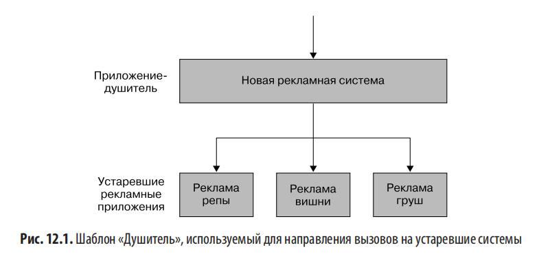
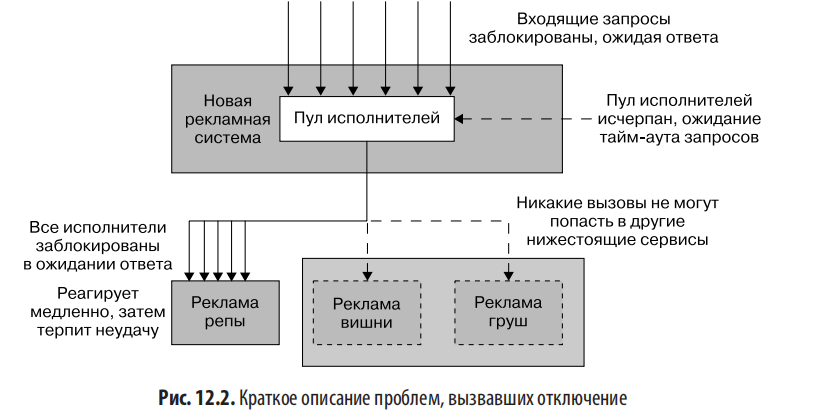
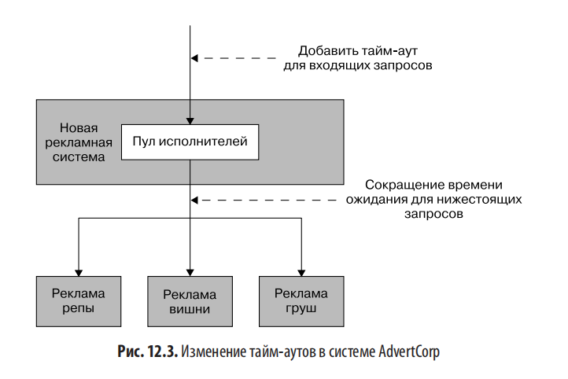
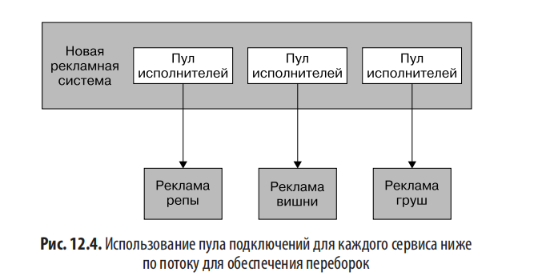
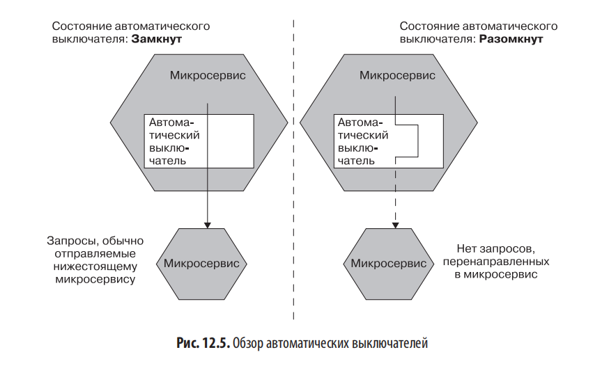
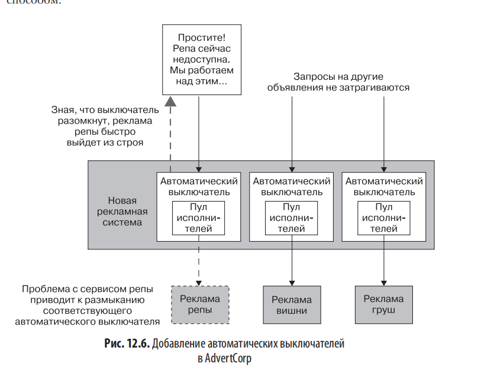
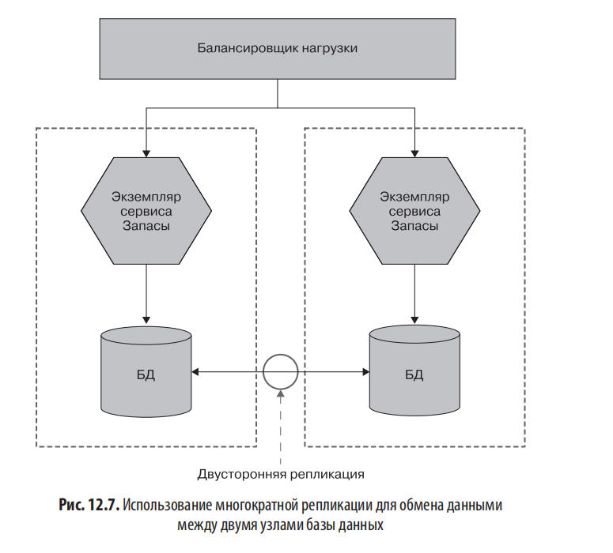

# Глава 12. Отказоустойчивость

## Введение

ПО становится всё более важной частью жизни, поэтому необходимо постоянно улучшать его качество. Сбой ПО может оказать значительное влияние на людей, даже если оно не относится к категории «критически важных для безопасности».

Во время пандемии COVID-19 такие услуги, как онлайн-покупки продуктов, превратились из удобства в необходимость для людей, не имевших возможности покинуть свои дома.

Ожидания пользователей от ПО изменились:

- Реже приходится поддерживать ПО только в рабочее время
- Снижается терпимость к простоям из-за технического обслуживания

Для многих организаций основная причина выбора микросервисной архитектуры — **перспектива повышения отказоустойчивости** предлагаемых услуг. При этом внедрение микросервисов — только часть головоломки.

---

## Что такое отказоустойчивость

За пределами ИТ существует более широкая сфера **инженерии надёжности**, которая рассматривает концепцию отказоустойчивости применительно к множеству систем — от пожаротушения до управления воздушным движением, биологических систем и операционных залов.

**Дэвид Д. Вудс** разработал четыре концепции отказоустойчивости:

- **Надёжность** — способность поглощать ожидаемые возмущения
- **Восстановление** — способность восстанавливаться после травмирующего события
- **Стабильная расширяемость** — насколько хорошо справляемся с неожиданной ситуацией
- **Непрерывная адаптивность** — способность постоянно адаптироваться к меняющимся условиям, заинтересованным сторонам и требованиям

### Надёжность

Концепция, согласно которой встраиваем механизмы для решения **ожидаемых** проблем в ПО и процессы.

В контексте микросервисной архитектуры ожидаемые возмущения:

- Хост вышел из строя
- Время ожидания сетевого подключения истекло
- Микросервис недоступен

Способы повышения надёжности:

- Автоматически развернуть запасной хост
- Выполнить повторную попытку подключения
- Обработать сбой определённого микросервиса стабильным образом

**Надёжность распространяется и на людей**: если за ПО отвечает один человек, нужен резервный сотрудник на случай его болезни или недоступности во время инцидента.

Надёжность требует **предварительных знаний**:

- На основе предвидения (понимание системы, служб, сотрудников)
- На основе ретроспективного анализа (после неожиданного события)

**Проблема**: повышение надёжности усложняет систему и может породить новые источники проблем. Пример — перенос на Kubernetes: улучшает аспекты надёжности, но вводит новые потенциальные болевые точки. Любая попытка повысить надёжность требует анализа затрат и выгод и оценки готовности к усложнению.

### Восстановление

Ключевая часть построения отказоустойчивой системы — насколько хорошо система восстанавливается после сбоев.

Часто люди тратят время и энергию на исключение возможности сбоя, но оказываются неподготовленными, когда он происходит. По мере роста и усложнения системы устранение любой потенциальной проблемы становится непосильной задачей.

Способы улучшения восстановления:

- Наличие резервных копий (проверенных!)
- План действий на случай сбоя
- Понимание ролей людей в случае сбоя
- Определение ответственного за урегулирование
- Понимание, когда и как сообщать пользователям

Попытка продумать действия во время самого отключения проблематична из-за стресса и хаоса.

### Стабильная расширяемость

Имеет дело с **неожиданным**. Если мы не готовы к неожиданностям, получаем уязвимую систему — при приближении к пределам прочности всё разваливается.

Организации с **плоской структурой** и распределённой ответственностью часто лучше подготовлены к неожиданностям. Если люди ограничены строгими правилами, их способность справляться с непредвиденным ограничена.

**Опасный побочный эффект автоматизации**: позволяет выполнять больше задач с меньшим количеством людей, но приводит к сокращению штата. Автоматизация не справится с неожиданностью — способность стабильно расширять систему зависит от наличия людей с нужными навыками, опытом и ответственностью.

### Непрерывная адаптивность

Требует не быть самодовольными. Цитата Дэвида Вудса:

> «Независимо от того, насколько хорошо мы справлялись раньше и насколько успешными мы были, будущее может быть другим, а мы — неподготовленными. Наши системы могут оказаться ненадёжными и хрупкими перед лицом нового будущего».

То, что катастрофического отключения ещё не было, не означает, что оно не может произойти. **Хаос-инжиниринг** может быть полезным инструментом для непрерывной адаптивности.

Парадокс: стремление к небольшим автономным командам может привести к потере общей картины. Существует баланс между глобальной и локальной оптимизацией, и он не статичен.

**Культура производства**, где люди свободно обмениваются информацией без опасения наказания, жизненно важна для обучения после инцидента. Изучение сюрпризов требует времени, энергии и людей — это сокращает ресурсы для краткосрочных функций. Решение использовать непрерывную адаптивность — поиск точки равновесия между краткосрочными результатами и долгосрочной адаптивностью.

Работа над непрерывной адаптивностью требует **постоянных, а не разовых вложений** — должна быть ключевой частью организационной стратегии и культуры.

---

## Микросервисная архитектура

Микросервисная архитектура помогает достичь свойства **надёжности**, но этого недостаточно для отказоустойчивости.

Способность обеспечивать отказоустойчивость — это **свойство людей**, создающих и эксплуатирующих систему, а не самого ПО.

### Сбои повсюду

- Жёсткие диски могут выйти из строя
- ПО может дать сбой
- Сеть ненадёжна

В определённом масштабе сбои становятся **статистической вероятностью**. Чем больше жёстких дисков, тем выше вероятность отказа в конкретный день.

Принятие возможности неудачи помогает: если можем справиться с отказом микросервиса, легче выполнить и обновление сервиса (запланированное отключение проще незапланированного).

Многие организации внедряют процессы для предотвращения сбоев, но мало думают об облегчении восстановления.

**Пример Google**:

- Сбой компьютера не приводит к прерыванию обслуживания клиента
- Каждый сервер имеет собственный локальный источник питания (на случай сбоя в дата-центре)
- Жёсткие диски крепятся липучками, а не винтами, для быстрой замены

При увеличении масштаба избежать отказов невозможно даже с самым дорогим оборудованием. Зная, что система справится с отказом сервера, можно идти на осознанный компромисс — иметь много дешёвых машин вместо дорогих.

### Сколько — это слишком много?

Понимание кросс-функциональных требований — учёт долговечности данных, доступности сервисов, пропускной способности и приемлемой задержки.

Примеры:

- Автомасштабирование — гигантское преимущество, но излишне для отчётной системы, запускаемой два раза в месяц
- Непрерывное развёртывание — имеет смысл для электронной коммерции, но не для внутренней корпоративной базы знаний

То, сколько сбоев допустимо, зависит от пользователей. Пользователи не всегда могут чётко сформулировать требования — нужно задавать вопросы и помогать им понять относительные затраты.

**Общие кросс-функциональные требования:**

**Время отклика/задержка**

- Сколько времени должны занимать различные операции
- Полезно установить целевые показатели для процентилей
- Цель должна включать число одновременных подключений/пользователей
- Пример: «время отклика 2 секунды на 90-м процентиле при 200 одновременных подключениях в секунду»

**Доступность**

- Можно ли ожидать перебоев
- 24/7 ли система
- Измерение простоев полезно для исторической отчётности

**Долговечность данных**

- Насколько допустима потеря данных
- Как долго хранить
- Логи сеансов — год или меньше
- Финансовые транзакции — многие годы

Формулирование этих требований в виде **целей SLO** (см. главу 10) — хороший способ закрепить их в процессе доставки ПО.

---

## Снижение функциональности

Способность **безопасно снижать функциональность** — важная часть построения отказоустойчивой системы при распределённой функциональности.

**Пример с веб-сайтом электронной коммерции:**

- Сервис подробной информации о товаре
- Сервис цены и уровня запасов
- Сервис корзины покупок

Если сбой одного сервиса делает всю страницу недоступной, мы создали менее отказоустойчивую систему.

Нужно понять влияние каждого сбоя и решить, как грамотно снизить функциональность:

- Уровень запасов недоступен → продолжаем продажу
- Корзина недоступна → большая проблема, но можно показать каталог, спрятать корзину или заменить её сообщением «Скоро вернёмся!»

В монолите работоспособность бинарна — работает или нет. В микросервисах больше нюансов. Правильное решение часто **не техническое, а бизнес-решение**:

- Закрыть весь сайт
- Позволить просматривать каталог
- Заменить корзину номером телефона для заказа

Для каждого ориентированного на клиента интерфейса нужно спросить: «Что произойдёт, если это не удастся?» — и знать, что делать.

---

## Шаблоны стабильности

### История AdvertCorp

Технический руководитель проекта AdvertCorp (онлайн-объявления). Задача — объединить существующие сервисы для разных типов рекламы. Использовался **шаблон «Душитель»** для перехвата вызовов и перенаправления к старым системам.



Самый прибыльный продукт перенесён в новую систему, остальная реклама — в старых приложениях (длинный шлейф информации). Нагрузка — около 6000–7000 запросов в секунду на пике. Большая часть кэшировалась, но поиск продуктов — нет.

**Что случилось**: однажды утром перед полуденным пиком система замедлилась и упала. Все узлы достигли 100% CPU. Виновник — рекламная система **«репы»** (один из старейших, слабо поддерживаемых сервисов) — стала отвечать очень медленно.

> Очень медленное реагирование — один из худших режимов сбоя. Если система не работает, это обнаруживается быстро. Когда она работает медленно — ожидание затормаживает всю систему, вызывает конфликт ресурсов и каскадный сбой.

**Найденные проблемы:**

- Использовался пул HTTP-соединений для нижестоящих подключений
- У потоков пула были тайм-ауты на HTTP-вызов (правильно)
- Все исполнители брали тайм-аут из-за медленного сервиса
- Поступающие запросы зависали в ожидании исполнителей
- Тайм-аут ожидания исполнителей в библиотеке **по умолчанию был отключён!**
- Поддерживалось 40 одновременных подключений, за 5 минут — пик ~800

Сервис «репы» использовался **менее 5% клиентов**, доход ещё меньше. С медленными системами работать гораздо сложнее, чем с быстро падающими. **В распределённой системе задержка убивает.**

Дополнительные проблемы:

- Общий пул HTTP-соединений для всех исходящих запросов — один медленный сервис исчерпал всех исполнителей
- Несмотря на тайм-ауты и ошибки, трафик продолжал отправляться — усугубляли ситуацию



**Три исправления:**

1. Корректировка тайм-аутов
2. Внедрение **переборок** для разделения пулов соединений
3. Внедрение **автоматического выключателя** для остановки вызовов в нерабочую систему

### Тайм-ауты

Тайм-ауты легко упустить, но в распределённой системе важно использовать их правильно:

- Слишком долго ждать → замедление системы
- Слишком быстро отказаться → провал работающего вызова
- Без тайм-аутов → зависание всей системы

**Две проблемы AdvertCorp:**

1. Пропущенный тайм-аут в пуле HTTP-запросов (поток блокировался до доступности исполнителя)
2. Слишком долгое ожидание (30 секунд) ответа от системы репы

**Контекст вызова**: реклама репы запрашивается при просмотре пользователем сайта. Никто не ждёт 30 секунд для загрузки страницы — пользователь обновит её через 5–15 секунд. Это вызывает каскад дополнительных запросов.

**Решение**: обычно ответ < 1 секунды, цель страницы — 4–6 секунд:

- HTTP-тайм-аут установлен в 1 секунду
- Тайм-аут на доступность HTTP-исполнителя — 1 секунда
- Максимум — 2 секунды ожидания



**Рекомендации по тайм-аутам:**

- Установить тайм-ауты для всех **внепроцессных вызовов**
- Указать значения по умолчанию для всех элементов системы
- Записывать возникновение тайм-аутов в логи
- Смотреть на «нормальное» время отклика нижестоящих сервисов и использовать для определения порога

**Тайм-аут для всей операции**: установка тайм-аута для одного вызова может быть недостаточной. Если общая операция отображения страницы должна завершиться за 1000 мс, и к моменту вызова нижестоящего сервиса прошло 300 мс, остальные вызовы не должны превышать 700 мс. Оставшееся время должно передаваться вниз по потоку.

> Не думайте только о тайм-ауте для отдельного вызова — также подумайте о тайм-ауте для всей операции и прервите её, если общее время превышено.

### Повторные попытки

Некоторые проблемы носят временный характер: пакеты перепутаны, скачки нагрузки на шлюзах. Повторный вызов может иметь смысл (аналогия — обновление веб-страницы).

**Какие сбои повторять**: при HTTP-протоколе коды ответов помогают:

- **404 Not Found** — повторная попытка вряд ли поможет
- **503 Service Unavailable** или **504 Gateway Time-out** — временные ошибки, повтор оправдан

Перед повтором — пауза. Если первоначальный сбой из-за нагрузки, бомбардировка ухудшит ситуацию.

**Учёт повторов в тайм-аутах**: при тайм-ауте 500 мс, до 3 повторов с интервалом 1 сек → ожидание до 3.5 секунд. Можно не делать третью попытку при превышении общего тайм-аута. Для непользовательских операций долгое ожидание приемлемее.

### Переборки

Концепция из книги **«Release It!» Майкла Нейгарда**. В судоходстве переборка — часть судна, которая герметизируется для защиты остальной части. Если есть течь, закрываем двери, теряем часть, но сохраняем судно.

**В AdvertCorp пропустили шанс**: нужно было использовать **разные пулы соединений для каждого нисходящего подключения**. Тогда исчерпание одного пула не повлияло бы на другие.



**Разделение ответственности** — тоже способ реализации переборок. Разделяя функциональность на отдельные микросервисы, снижаем вероятность распространения сбоя.

Рекомендации:

- Начать с отдельных пулов подключений для каждого нисходящего соединения
- Использовать автоматические выключатели

**Переборки — наиболее важные модели**:

- Тайм-ауты и автовыключатели **высвобождают** ограниченные ресурсы
- Переборки **изначально не допускают** ограниченности ресурсов
- Могут отклонять запросы — **сброс нагрузки**
- Иногда отклонение запроса — лучший способ предотвратить перегрузку

### Автоматические выключатели

Аналогия с автоматами в доме: защищают от скачков напряжения, можно отключать вручную для безопасной работы.

В ПО (из «Release It!»): автоматический механизм для герметизации переборки. Защищает:

- Потребителя от проблем
- Нижестоящий сервис от дополнительных вызовов

Рекомендуется устанавливать на **все синхронные вызовы**, идущие по потоку. Готовые реализации широко доступны.

**Принцип работы:**

- После определённого числа сбоев (ошибок или тайм-аутов) автомат **срабатывает**
- В «разомкнутом» состоянии все запросы быстро завершаются с ошибкой
- Через интервал отправляются тестовые запросы
- При достаточном количестве успешных ответов автомат **сбрасывается**

**Определение «неудачного запроса»** для HTTP — обычно тайм-аут или подмножество кодов 5XX.

**Сложности настройки:**

- Не отключать слишком быстро
- Не держать отключённым слишком долго
- Убедиться в восстановлении сервиса перед отправкой трафика
- Начать с разумных значений по умолчанию, корректировать по случаям



**Варианты действий при срабатывании:**

- Поставить запросы в очередь для повтора (для асинхронных задач)
- Быстро завершить с ошибкой (для синхронных цепочек)
- Распространить ошибку вверх по цепочке
- Снизить функциональность

**В AdvertCorp**: обернули нисходящие вызовы автоматическими выключателями. При срабатывании веб-сайт показывал, что реклама репы недоступна. Остальная часть сайта работала, клиенты получали понятное сообщение — всё автоматизировано.



**Ручное использование**: можно открыть автоматы вручную перед плановым техобслуживанием. Следующий шаг — скрипт автоматического размыкания/замыкания как часть процесса развёртывания.

**Главное преимущество**: быстрый сбой лучше постепенного. Можно проверять состояние автомата раньше — если микросервис недоступен, прервать операцию до её начала.

### Изоляция

Чем сильнее связь между микросервисами, тем больше один влияет на другой. Технологии, позволяющие нижестоящему сервису быть в автономном режиме (промежуточное ПО, буферизация), снижают влияние сбоев.

**Преимущества изоляции:**

- Меньше работы по координации
- Большая автономия команд
- Свободное управление и развитие сервисов

**Изоляция на физическом уровне**: два логически изолированных микросервиса на одном хосте всё равно зависят друг от друга. То же касается общей инфраструктуры БД.

**Способы обеспечения изоляции:**

- Независимые хосты с собственной ОС и ресурсами
- Виртуальные машины или контейнеры
- Разные физические машины

**Издержки**: больше инфраструктуры и инструментов управления, прямые расходы, усложнение системы, новые точки потенциального отказа.

Изоляция повышает надёжность, но редко даётся бесплатно. **Выбор компромисса** между изоляцией, затратами и сложностью жизненно важен.

### Избыточность

Большее количество ресурсов повышает надёжность:

- Несколько человек, знающих БД (на случай отпуска/ухода)
- Несколько экземпляров микросервиса (на случай отказа одного)

Определение необходимой избыточности зависит от:

- Понимания режимов отказа
- Влияния недоступности
- Стоимости добавления

**Пример AWS**: нет SLA на время безотказной работы одного экземпляра EC2. Нужно поддерживать несколько экземпляров. Экземпляры в зонах доступности — гарантий на одну зону тоже нет, поэтому распределение по нескольким зонам.

Избыточность помогает не только для резервирования, но и для **масштабирования под нагрузку**.

### Промежуточное ПО

**Брокеры сообщений** (см. главу 5) обеспечивают **гарантированную доставку**: брокер берёт на себя повторные попытки и тайм-ауты. ПО написано экспертами с глубоким пониманием.

> Привлечение умных людей к работе на вас — хорошая идея.

В случае AdvertCorp промежуточное ПО для «запрос — ответ» с системой репы не сильно помогло бы — ответы клиентам всё равно не приходили. Уменьшение конкуренции за ресурсы привело бы к накоплению устаревших запросов.

**Альтернатива**: инвертировать взаимодействие — система репы транслирует последние объявления для последующего использования. Но при проблемах с системой репы клиент всё равно не получит лучшие цены.

Промежуточное ПО полезно для проблем с надёжностью, **но не в каждой ситуации**.

### Идемпотентность

В **идемпотентных операциях** результат не меняется после первого применения, даже при многократном повторении. Можно повторять вызовы без неблагоприятных последствий — полезно для воспроизведения сообщений при восстановлении.

**Пример неидемпотентного вызова** — добавление бонусных баллов:

```xml
<credit>
  <amount>100</amount>
  <forAccount>1234</account>
</credit>
```

Каждый повторный вызов добавит 100 баллов.

**Пример идемпотентного вызова**:

```xml
<credit>
  <amount>100</amount>
  <forAccount>1234</account>
  <reason>
    <forPurchase>4567</forPurchase>
  </reason>
</credit>
```

Если правило — одно начисление за заказ, повторный вызов не увеличит баллы.

Особенно полезно для совместной работы на основе событий — при асинхронной доставке могут быть окна, когда два исполнителя видят одно сообщение.

**Важное замечание**: идемпотентность относится к **базовой бизнес-операции**, а не ко всему состоянию системы. Логи, мониторинг времени отклика — нормально фиксировать при каждом вызове.

**HTTP-методы GET и PUT** определены в спецификации как идемпотентные, но сервис должен реально обрабатывать их идемпотентно. Использование HTTP не даёт идемпотентности автоматически.

### Распределение рисков

Не класть все яйца в одну корзину — несколько сервисов на одном хосте упадут вместе.

**Хост — виртуальная концепция**: если все виртуальные хосты на одном физическом сервере, падение сервера убивает все. Платформы виртуализации позволяют распределять по физическим блокам.

**Сети SAN** (storage area network): корневые разделы ВМ часто на одной SAN. При сбое SAN — отключение всех ВМ. Сети SAN большие, дорогие, рассчитаны на бесперебойность, но за 10 лет автор видел минимум 2 крупных сбоя SAN.

**Другие формы разделения:**

- Сервисы не в одной стойке дата-центра
- Распределение по нескольким дата-центрам
- Учёт SLA провайдера

**Пример AWS**: разделена на **регионы** (отдельные облачные хосты), каждый — на **зоны доступности** (эквивалент дата-центра). Гарантий на отдельный узел или зону нет. SLA — 99.95% безотказной работы по региону за месяц. Распределение по зонам и регионам.

**Гарантии SLA**: поставщики ограничивают свою ответственность. При невыполнении SLA компенсация может быть минимальной. Стоит держать **план Б (или В)** — например, резервная платформа аварийного восстановления у другого поставщика.

---

## Теорема CAP

Математическое доказательство, что в распределённой системе нельзя получить всё одновременно.

**Три свойства** (можно сохранить только два из трёх):

- **Согласованность (Consistency)** — один и тот же ответ при обращении к нескольким узлам
- **Доступность (Availability)** — каждый запрос получает ответ
- **Устойчивость к разделению (Partition tolerance)** — система справляется с невозможностью связи между частями

Эрик Брюер опубликовал первоначальную гипотезу, позже получено математическое доказательство.

**Пример**: микросервис «Запасы» в двух дата-центрах с двумя БД, синхронизирующимися через репликацию.



**Сценарий сбоя**: сетевое соединение между ДЦ перестаёт работать. Записи в ДЦ1 не попадают в ДЦ2, и наоборот.

### Жертвуя согласованностью

Микросервис продолжает работать. Изменения в ДЦ1 не видны в ДЦ2 — запросы видят устаревшие данные.

- Система **доступна** — оба узла обслуживают запросы
- **Устойчива к разделению**
- **Теряет согласованность**

Это **AP-система**.

При продолжении приёма записей нужно повторно синхронизировать БД в будущем. Чем дольше разделение, тем сложнее синхронизация.

Реальность: даже без сбоя сети репликация не мгновенна. Системы, отказывающиеся от согласованности ради устойчивости к разделению и доступности, считаются **в конечном счёте согласованными** — обновления видны не сразу, пользователи могут видеть старые данные.

### Жертвуя доступностью

Для согласованности каждый узел должен знать, что его копия совпадает с другими. При разделении узлы не могут координироваться → отказ отвечать на запросы.

Это **CP-система**. Сервис решает, как ухудшить функциональность до восстановления.

**Согласованность между узлами сложна**:

- Чтобы прочитать с локального узла — спросить другой узел
- Заблокировать первый узел от обновления до завершения чтения
- **Транзакционное чтение между узлами** — медленно, требует блокировок
- Считывание может заблокировать всю систему

**Распределённые системы должны ожидать сбоя**: при блокировке записи на удалённом узле и потере связи — что делать? Блокировки трудны даже в одном процессе, гораздо сложнее в распределённой системе.

**Распределённые транзакции** (глава 6) сложны именно из-за обеспечения согласованности.

> Друзья не позволяют друзьям писать своё собственное распределённое согласованное хранилище данных.

Если нужно строго согласованное хранилище — использовать готовые решения (например, **Consul** — обсуждался в главе 5).

### Жертвуя устойчивостью к разделению

Если нет устойчивости к разделению, система не может работать через сеть — должна быть единым процессом, работающим локально.

> CA-системы не существуют в мире распределённых систем.

### AP или CP?

Зависит от обстоятельств:

- AP-системы легче масштабируются и строятся
- CP-системы требуют больше работы из-за распределённой согласованности

Бизнес-контекст определяет выбор:

- Устаревшие на 5 минут записи инвентаря — ок?
- Баланс клиента в банке — может быть устаревшим?

### Это не «всё или ничего»

Система в целом не обязательно исключительно AP или CP:

- Каталог MusicCorp — AP (устаревание не критично)
- Сервис «Запасы» — CP (нельзя продать то, чего нет)

Даже отдельные сервисы могут не относиться к одному типу.

**Пример микросервиса «Баланс баллов»**:

- Отображение баланса — устаревшее значение допустимо
- Обновление баланса — должно быть актуальным (нельзя потратить больше, чем есть)

Компромиссы CAP сводятся к **индивидуальным возможностям микросервисов**.

**Согласованность/доступность — не «всё или ничего»**. Например, **Cassandra** позволяет компромиссы на уровне вызовов:

- Строгая согласованность — чтение ждёт ответа всех реплик
- Кворум реплик
- Один узел — самый быстрый ответ, но возможна непоследовательность

Сообщения о «победе» над CAP-теоремой — это создание систем, где одни возможности CP, другие AP. **Математическое доказательство остаётся в силе.**

### А теперь реальный мир

Многое из обсуждения — про электронный мир (биты и байты). Но мы строим отражение реального мира, который не контролируем.

**Пример системы «Запасы» MusicCorp**: 100 копий альбома _Give Blood_ от Brakes. Один продан → 99. Но если копию уронили и сломали → реально 98, в системе 99.

**Идея**: сделать AP-систему инвентаризации, иногда связываясь с пользователем для уведомления об отсутствии товара. Это **гораздо проще строить и масштабировать** и обеспечивает корректность.

Какими бы согласованными ни были системы, они не знают всё о реальном мире. **AP-системы часто оказываются правильным решением**. CP-системы не решают всех проблем, помимо сложности построения.

> **Антихрупкость**
> 
> В первом издании автор рассказывал о концепции антихрупкости Нассима Талеба — системы выигрывают от сбоев и беспорядка. Источник вдохновения для частей Netflix, особенно хаос-инжиниринга. Но **антихрупкость — подмножество концепции отказоустойчивости**. Концепция стала раздутой в ИТ из-за узкого мышления об отказоустойчивости (только надёжность и восстановление, игнорирование остального).

---

## Хаос-инжиниринг

Получил название от методов Netflix. Полезный подход для повышения отказоустойчивости — для обеспечения надёжности или как часть непрерывной адаптивности.

**Проблема с термином**: путаница в значении. Многие понимают как «запустить инструмент в ПО и посмотреть, что будет». Этому способствует то, что сторонники часто продают такие инструменты.

**Лучшее определение** (Принципы хаос-инжиниринга, https://principlesofchaos.org):

> Хаос-инжиниринг — это дисциплина, заключающаяся в экспериментировании с системой с целью укрепления уверенности в способности системы выдерживать турбулентные условия в эксплуатации.

**Слово «система» — широкое**: не только ПО и аппаратное обеспечение, но **совокупность людей, процессов, культуры, ПО и инфраструктуры**. Хаос-инжиниринг шире, чем «давайте выключим машины и посмотрим, что произойдёт».

### Игровые дни

До появления хаос-инжиниринга использовались **игровые дни** для проверки готовности к событиям.

- Планируется заранее
- В идеале запускается неожиданно для участников
- Проверка сотрудников и процессов в реалистичной, но вымышленной ситуации

В Google это распространённая практика. Google идёт дальше — **DiRT (disaster recovery test)** — имитация крупномасштабных катастроф (землетрясения).

**Поиск слабых мест**: пример из книги **Расса Майлза «Изучение хаос-инжиниринга»**. Упражнение для изучения зависимости от сотрудника Боба:

- Боб изолирован в комнате
- Не мог помочь команде во время имитируемого отключения
- В итоге пришлось вмешаться — команда по ошибке вошла в эксплуатационную систему и уничтожала данные

### Эксперименты в эксплуатационной среде

**Netflix** работает на огромных масштабах на инфраструктуре AWS. Понимание: подготовка к отказам и знание, что ПО справится — разные вещи.

**Инструменты Netflix («обезьянья армия»)**:

- **Chaos Monkey** — отключает случайные машины в определённые часы дня в эксплуатационной среде
- **Chaos Gorilla** — отключает целую зону доступности
- **Latency Monkey** — имитирует медленное сетевое подключение

Разработчики должны быть готовы — это не теория, а практика.

### От надёжности к запредельному

В узкой форме хаос-инжиниринг повышает **надёжность** — способность справляться с ожидаемыми проблемами. Netflix знала о недоступности отдельных ВМ → создала Chaos Monkey.

При использовании как части подхода для постоянной проверки отказоустойчивости — больше применений: вопросы «что, если», постоянное сомнение в понимании.

**Инструменты:**

- **Chaos Toolkit** (https://chaostoolkit.org) — популярный open-source проект
- **Reliably** (https://reliably.com) — компания создателей Chaos Toolkit
- **Gremlin** (https://www.gremlin.com) — самый известный поставщик

> Использование инструмента хаос-инжиниринга **не делает систему отказоустойчивой**.

---

## Поиск виновных

После сбоя сначала фокусируемся на восстановлении (разумно), но дальше слишком часто следуют **взаимные обвинения**.

«Анализ первопричин» подразумевает наличие первопричины — часто хочется, чтобы это был человек.

### История с Telstra

Telstra (телекоммуникационная компания Австралии, бывший монополист) — серьёзный сбой голосовой связи. В Австралии много изолированных сельских общин, последствия особенно серьёзны.

Почти сразу главный операционный директор Telstra заявил:

> «Мы отключили данный узел, так как, к сожалению, человек, который занимался этим вопросом, не следовал инструкциям и повторно подключил клиентов к неправильно функционирующему узлу... Это досадная человеческая ошибка».

**Проблемы заявления:**

- Сделано через несколько часов после отключения
- За это время «вскрыли» всю сложную систему и точно нашли виновного
- Если один человек может обрушить телеком — это говорит о компании, а не о человеке
- Сотрудникам ясно дано понять — компания с удовольствием укажет на них пальцем

### Культура страха

Обвинение людей создаёт **культуру страха**:

- Люди не хотят сообщать о проблемах
- Теряется возможность учиться на неудачах
- Те же ошибки повторяются

**Создание организации**, где люди спокойно признают ошибки, важно для:

- Культуры обучения
- Разработки более надёжного ПО
- Приятной среды работы

После заявления Telstra столкнулась с **серией последующих сбоев**. Исполнительный директор подал в отставку.

**Рекомендация**: книга **Джона Оллспоу «Постмортемы без упреков и культура справедливости»**.

Отказоустойчивости нужен **вопрошающий ум** — стремление исследовать слабые места. Требует **культуры обучения**, обучения на практике. После катастрофы — максимально использовать собранную информацию, чтобы уменьшить вероятность повторения.

---

## Резюме

По мере роста важности ПО растёт стремление к отказоустойчивости. **Нельзя добиться отказоустойчивости только через ПО и инфраструктуру** — нужно заботиться о сотрудниках, процессах и организациях.

**Четыре основные концепции отказоустойчивости (Дэвид Вудс):**

- **Надёжность** — способность поглощать ожидаемые возмущения
- **Восстановление** — способность восстанавливаться после травмирующего события
- **Стабильная расширяемость** — насколько хорошо справляемся с неожиданной ситуацией
- **Непрерывная адаптивность** — способность постоянно адаптироваться к меняющимся условиям, заинтересованным сторонам и требованиям

**Микросервисы** дают способы повышения **надёжности**, но это не бесплатно — нужно выбирать варианты.

**Ключевые шаблоны стабильности:**

- Автоматические выключатели
- Тайм-ауты
- Резервирование
- Изоляция
- Идемпотентность
- Переборки

Нужно решать, **когда и где применять** эти инструменты.

**Уровень отказоустойчивости определяется пользователями и владельцами бизнеса**. Технолог отвечает за «как», но знание «сколько» требует тесного общения с пользователями.

Цитата Дэвида Вудса о непрерывной адаптивности:

> Независимо от того, насколько хорошо мы справлялись раньше и насколько успешными мы были, будущее может быть другим, а мы — неподготовленными. Наши системы могут оказаться ненадёжными и хрупкими перед лицом нового будущего.

Задавая одни и те же вопросы, не понять готовность к будущему. **Постоянное обучение и сомнение во всём** — ключ к повышению отказоустойчивости.

**Связь со следующей главой**: один из шаблонов — резервирование — эффективен. Это переход к масштабированию микросервисов, которое не только помогает с нагрузкой, но и реализует резервирование, повышая надёжность.

---

## Ключевые термины

- **Отказоустойчивость** — свойство системы (людей + ПО + процессов) справляться с проблемами
- **Надёжность** — способность к ожидаемым возмущениям
- **Восстановление** — возврат к работе после сбоя
- **Стабильная расширяемость** — реакция на неожиданное
- **Непрерывная адаптивность** — постоянное изменение под новые условия
- **Тайм-аут** — максимальное время ожидания ответа
- **Переборка (bulkhead)** — изоляция ресурсов для предотвращения распространения сбоя
- **Автоматический выключатель (circuit breaker)** — механизм быстрого отказа при сбоях нижестоящего сервиса
- **Сброс нагрузки** — отклонение запросов для предотвращения перегрузки
- **Идемпотентность** — свойство операции давать тот же результат при повторении
- **CAP-теорема** — выбор из 3 свойств: согласованность, доступность, устойчивость к разделению
- **AP-система** — доступность + устойчивость к разделению
- **CP-система** — согласованность + устойчивость к разделению
- **В конечном счёте согласованная (eventually consistent)** — система, где обновления распространяются не мгновенно
- **Хаос-инжиниринг** — дисциплина экспериментов для проверки устойчивости
- **Игровой день** — упражнение для проверки готовности команды
- **Шаблон «Душитель»** — постепенный перенос функциональности из старой системы в новую
