# Глава 13. Масштабирование

> «Тебе понадобится лодка побольше.» — Шеф Броуди, из х/ф «Челюсти»

Системы масштабируют по одной из двух причин:

- повысить **производительность** системы;
- повысить ее **надежность**.

---

## Четыре оси масштабирования

Не существует единственно верного способа масштабирования — используемый метод зависит от типа ограничений.

Модель для описания типов масштабирования — **куб масштабирования** из книги «Искусство масштабирования» (Abbott M. L., Fisher M. T.). Модель разбивает масштабирование на три категории:

- функциональная декомпозиция;
- горизонтальное дублирование;
- разделение данных.

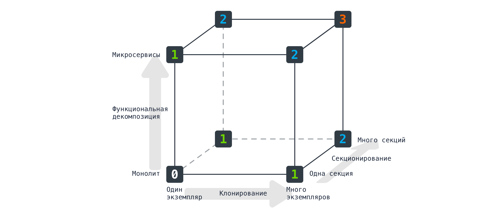

Ценность модели в том, что она помогает понять: систему можно масштабировать по одной, двум или всем трем осям в зависимости от потребностей.

В мире виртуализированной инфраструктуры автор добавляет четвёртую ось — **вертикальное масштабирование** (при таком подходе модель перестаёт быть кубом).

### Краткий обзор четырёх осей

- **Вертикальное масштабирование** — приобретение более мощной машины.
- **Горизонтальное дублирование** — наличие нескольких устройств, способных выполнять одну и ту же работу. (репликация — несколько одинаковых узлов держат одни и те же данные и выполняют одну работу)
- **Разделение данных** — разделение работы на основе какого-либо атрибута данных (например, группы клиентов). (шардирование — разные узлы держат разные подмножества данных, разделённые по ключу)
- **Функциональная декомпозиция** — разделение работы в зависимости от типа (например, декомпозиция микросервиса). (**партиционирование** в его функциональном/вертикальном смысле — разные узлы или сервисы делают разную работу)

В качестве примера рассматривается реальная компания **FoodCo** (название анонимизировано), осуществляющая прямую доставку продуктов питания клиентам в ряде стран.

---

## Вертикальное масштабирование

Приобретение большего сервера с более быстрым процессором и улучшенным I/O часто снижает задержку и повышает пропускную способность.

### Кейс FoodCo

- Одна из проблем — растущая конкуренция при записи в основную БД.
- Вертикальное масштабирование обычно — оптимальный вариант для быстрого масштабирования операций записи в реляционной БД.
- FoodCo уже несколько раз модернизировала инфраструктуру БД и продвинулась до максимально комфортного уровня.
- Даже более мощная машина вряд ли решит проблему в долгосрочной перспективе, учитывая прогнозы роста.

Исторически вертикальное масштабирование было проблематичным из-за времени покупки оборудования, бюджетных согласований, доставки, неиспользуемых мощностей в дата-центрах. Виртуализация и общедоступное облако существенно помогли справиться с этой формой масштабирования.

### Реализация

- В виртуализированной инфраструктуре — просто изменить размер ВМ, чтобы использовать больше базового оборудования (быстро и почти без риска).
- Если ВМ занимает всё базовое оборудование — придётся покупать ещё.
- При работе на «голом железе» без запасного оборудования — придётся докупать.
- Если требуется покупка новой инфраструктуры (рост затрат и времени), можно пропустить эту форму и рассмотреть горизонтальное дублирование.
- В облаке можно арендовать почасово полностью управляемые машины. Например, экземпляр AWS **u-24tb1.metal** предоставляет 24 Тбайт памяти. Существуют машины, адаптированные под высокую производительность I/O, ЦП или ГП.

### Ключевые преимущества

- В виртуализированной/облачной инфраструктуре внедрение быстрое.
- Большая часть работы по масштабированию — эксперименты, поэтому быстрые и безрисковые действия стоит делать на ранней стадии.
- Упрощает выполнение других типов масштабирования (например, перемещение БД на более мощную машину позволяет разместить логически изолированные БД для новых микросервисов в рамках функциональной декомпозиции).
- Код или БД вряд ли потребуют изменений (при условии сохранения ОС и чипсетов). Модификации могут быть ограничены, например, увеличением объёма памяти через флаги среды выполнения.

### Ограничения

- По мере увеличения масштаба процессоры **не становятся быстрее** — мы получаем больше ядер. Этот сдвиг произошёл за последние 5–10 лет.
- ПО, написанное без расчёта на многоядерное оборудование, не обязательно получит большие приросты при переходе с 4- на 8-ядерную систему. Изменение кода для использования многоядерности может быть масштабным мероприятием и требует изменения идиом программирования.
- Большая машина мало что даст для повышения надёжности — если машина сломалась, она сломалась.
- Цена растёт не всегда пропорционально ресурсам. Иногда экономически эффективнее содержать много слабых машин, чем мало мощных.

---

## Горизонтальное дублирование

Дублирование части системы для обработки большей нагрузки. Требует способа распределить работу между дубликатами.

Прост в реализации и часто — одна из идей, которые стоит попробовать на ранней стадии. Если монолитная система не справляется — запустить несколько копий и посмотреть, поможет ли.

### Реализации

**Балансировщик нагрузки** — наиболее очевидная форма. Распределяет запросы по нескольким копиям функциональности (например, между экземплярами микросервиса Каталог MusicCorp).

- Все балансировщики должны иметь механизм распределения нагрузки, определять недоступные узлы и удалять их из пула.
- С точки зрения потребителя балансировщик полностью прозрачен — можно считать его частью логической границы микросервиса.
- Раньше использовалось выделенное оборудование, но сейчас — в основном программное обеспечение, часто на стороне клиента.

**Шаблон конкурирующих потребителей** (из книги «Шаблоны интеграции корпоративных приложений» Хоупа и Вулфа).

- Пример MusicCorp: новые песни загружаются и должны быть перекодированы для стримингового предложения. Есть общая очередь и набор экземпляров сервиса **Транскодер песен**, потребляющих задания.
- Для увеличения пропускной способности увеличивают количество экземпляров Транскодер песен.

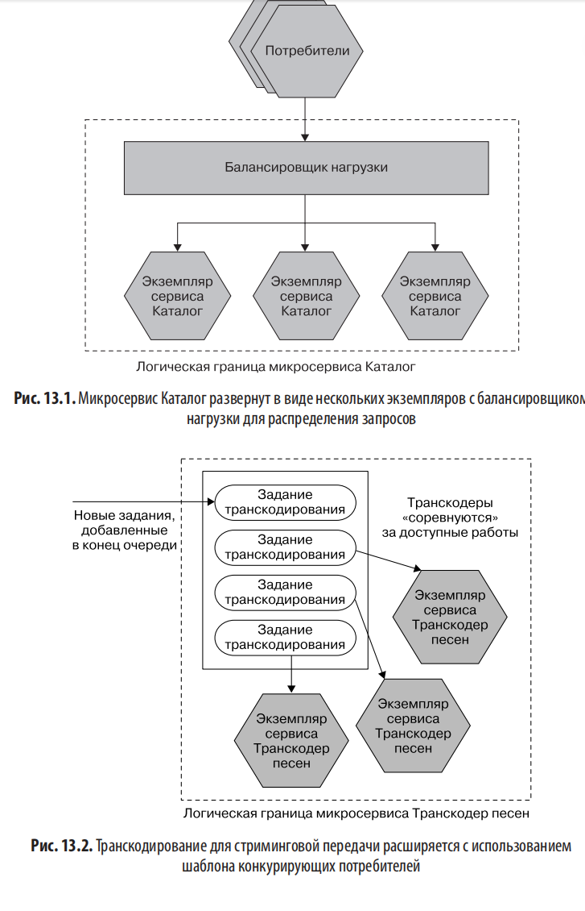

**Реплики для считывания** (кейс FoodCo).

- Использовались для снижения нагрузки чтения на основную БД.
- Уменьшили нагрузку чтения на основной узел, освободив ресурсы для записи.
- Сработало эффективно, так как большая часть нагрузки была связана с чтением.
- Маршрутизация (основная БД или реплика чтения) обрабатывается внутри микросервиса. Для потребителей неважно, куда попадает их запрос.

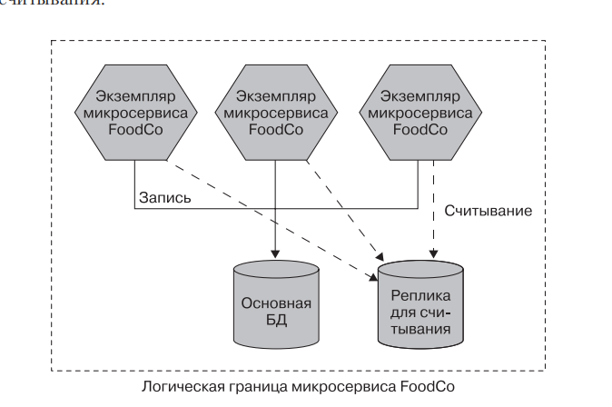

### Ключевые преимущества

- Довольно просто реализовать.
- Редко требуется обновлять приложение — распределение нагрузки делается извне (очередь брокера, балансировщик).
- Если вертикальное масштабирование недоступно — это следующий подход.
- При лёгком распределении работы — элегантный способ снижения конкуренции за вычислительные ресурсы.

### Ограничения

- Требует дополнительной инфраструктуры (стоит дороже).
- Может быть **грубым инструментом**: запускаются полные копии монолита, даже если проблема только в части функциональности.
- Большая часть работы — реализация механизмов распределения нагрузки (от HTTP-балансировки до брокеров сообщений и реплик БД).
- Некоторые системы требуют, чтобы все запросы одного сеанса шли на одну реплику — это требует **постоянной балансировки нагрузки сессии**, что ограничивает выбор механизмов. Систем с такими требованиями автор рекомендует избегать.

---

## Разделение данных

Распределение нагрузки на основе аспекта данных. Более сложная территория.

### Реализация

Берём ключ, связанный с рабочей нагрузкой, применяем к нему функцию, получаем **раздел** (sharding/сегмент), куда распределяется работа.

**Пример** (плохой, но иллюстративный): запросы с фамилией A–М идут в одну БД, Н–Я — в другую.

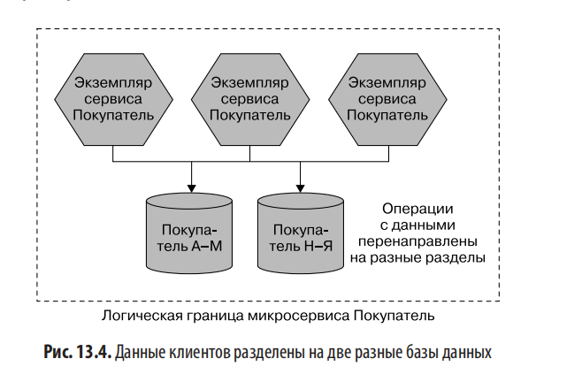

**Разделение на уровне БД** — имеет смысл, если технология БД изначально поддерживает концепцию (например, Cassandra использует сегменты, Kafka — разделённые топики).

**Разделение на уровне экземпляра микросервиса** — определение раздела из входящего запроса (например, через прокси-сервер, используя заголовки запроса). Это полезно, если нужны выделенные экземпляры микросервиса для кэширования в памяти. Позволяет масштабировать каждый раздел и на уровне БД, и на уровне экземпляра.

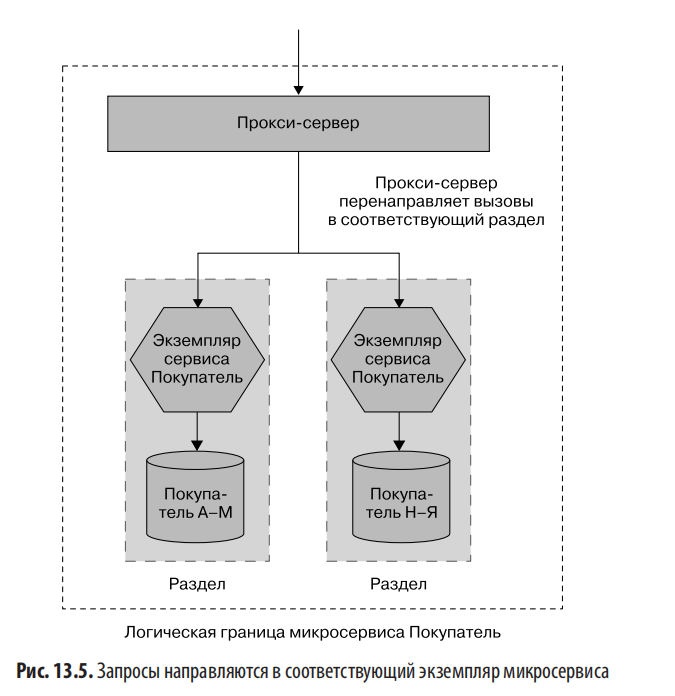

Разделение должно быть **внутренней деталью реализации** микросервиса — это даёт свободу изменять или заменять схему.

**Географическое разделение** — один раздел на страну/регион.

### Почему FoodCo отказалась от разделения по странам

- Планируется географическая экспансия.
- Цель — обслуживать несколько географических точек из одной системы.
- Постоянное создание новых разделов резко увеличило бы стоимость выхода на новые рынки.

### Ключевые преимущества

- Хорошо масштабируется для **транзакционных рабочих нагрузок** (особенно для операций записи).
- Облегчает техническое обслуживание: обновления — по разделам, простой затрагивает только один раздел.
- Географическое разделение полезно для **юрисдикционных требований** (например, данные граждан ЕС — внутри ЕС).
- Хорошо комбинируется с горизонтальным дублированием.

### Ограничения

- **Ограниченная полезность для надёжности**: при сбое одного из 4 разделов 25% запросов не выполнятся. Поэтому разделение обычно комбинируют с горизонтальным дублированием.
- **Правильный выбор ключа раздела сложен**.
    - Пример с фамилиями: в Китае < 4000 фамилий, 100 самых популярных охватывают > 80% населения и приходятся на диапазон Н–Я в мандаринском.
    - Лучше — разделение по **уникальному идентификатору** клиента (равномерное распределение + устойчиво к смене имени).
- Добавление новых разделов обычно несложно: Cassandra поддерживает динамическое распределение, Kafka позволяет добавлять разделы постфактум (но уже добавленные сообщения не перемещаются).
- **Изменение схемы разделения — очень сложно**. Автор знает клиента, который отключал работающую систему на **три дня** для изменения схемы.
- **Запросы по нескольким сегментам** сложны:
    - либо запрашивать каждый сегмент и объединять в памяти;
    - либо создать альтернативное хранилище для чтения;
    - часто обрабатывается асинхронным механизмом с кэшем (Mongo использует map/reduce).
- Масштабирование БД для записи — этап, где возможности БД сильно различаются. Часто меняют технологию БД. Покупка более мощной машины — самый быстрый способ; параллельно можно рассмотреть другие БД.
- Книга по выбору: **NoSQL** (Прамодкумар Дж. С., Мартин Ф.) — обзор различных стилей NoSQL: графовых, документных, столбцовых, ключ-значение.

Разделение данных — трудоёмкая задача, особенно для существующих данных, но **код приложения** скорее всего будет затронут лишь незначительно.

---

## Функциональная декомпозиция

Извлечение функциональности с независимым масштабированием. Извлечение функциональности и создание нового микросервиса — почти канонический пример.

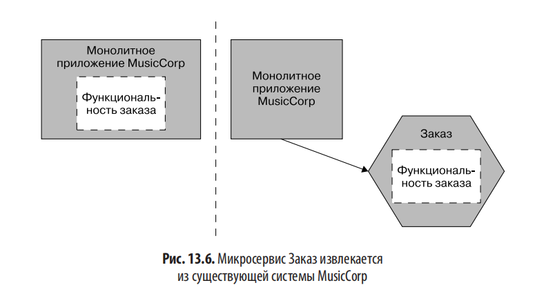

### Кейс FoodCo

- Исчерпан потенциал вертикального масштабирования.
- Использовано горизонтальное дублирование.
- Отказались от разделения данных.
- Остаётся — функциональная декомпозиция.
- Ключевые данные и рабочие нагрузки удаляются из основной системы и БД.
- Выявленные решения: перенос данных доставки и меню в выделенные микросервисы.
- Дополнительное преимущество: возможность для растущей команды доставки организоваться вокруг владения новыми микросервисами.

### Реализация

Подробное обсуждение — см. главу 3.

### Ключевые преимущества

- **Правильная настройка инфраструктуры**: редкая функциональность — отключается, скромные требования — на маленьких машинах, нагруженная — комбинация с другими осями.
- Гибкость в оптимизации стоимости инфраструктуры — ключевая причина, по которой крупные SaaS-поставщики активно используют микросервисы.
- Открывает возможность построить систему, способную выдержать **частичный отказ функциональности** (см. главу 12).
- Больше возможностей использовать **различные технологии**: разные языки программирования, БД, более подходящие для конкретного типа работы.
- Облегчает **масштабирование организации** (см. главу 15).

### Ограничения

- Сложно и **вряд ли принесёт пользу в краткосрочной перспективе**.
- Из всех форм масштабирования наибольшее влияние на код приложения (фронтенд и бэкенд).
- Может потребовать значительного объёма работы на уровне данных.
- Увеличение количества микросервисов → повышение общей сложности системы → больше элементов для обслуживания, поддержки, повышения надёжности и масштабирования.
- Автор предпочитает **выжимать максимум из других возможностей**, прежде чем рассматривать функциональную декомпозицию. Мнение может измениться, если переход даст много дополнительных полезных свойств (как у FoodCo — расширение команды разработчиков).

---

## Сочетание моделей

Идея куба масштабирования — не мыслить узко. Часто имеет смысл масштабировать по нескольким осям.

**Пример MusicCorp**:

1. Извлекаем функциональность **Заказ** (функциональная декомпозиция).
2. Создаём несколько копий микросервиса Заказ (горизонтальное дублирование).
3. Запускаем разные сегменты Заказ для разных географических регионов (разделение данных) + горизонтальное дублирование в каждой границе.

Масштабирование вдоль одной оси упрощает продвижение по другим. Без первоначальной функциональной декомпозиции мы были бы ограничены применением методов к монолиту в целом.

Не обязательно масштабировать по всем осям — но важно знать про эти механизмы и понимать плюсы/минусы каждого.

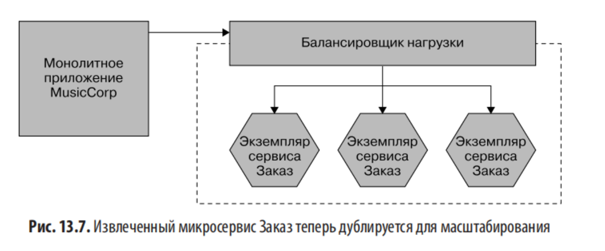

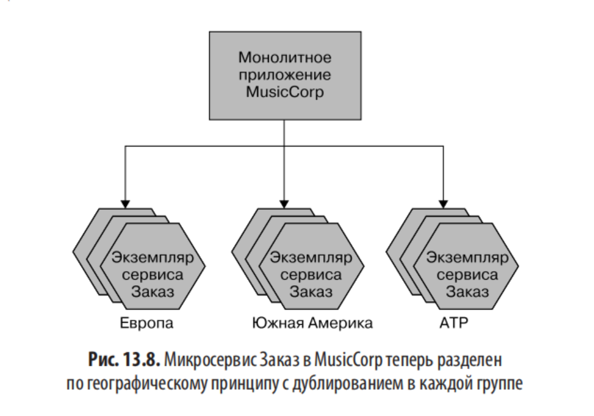

---

## Начните с малого

> «Реальная проблема в том, что программисты тратят слишком много времени, заботясь об эффективности в неподходящих местах и в неподходящее время. Преждевременная оптимизация — корень всего зла (или по крайней мере большей его части) в программировании.» — Дональд Кнут, «Искусство программирования»

- Оптимизация для несуществующих проблем — пустая трата времени и усложнение системы.
- Любая оптимизация должна быть продиктована реальной потребностью.
- Добавление сложности → новые источники уязвимости (см. главу 12, подраздел «Надёжность»). Масштабируя одну часть, создаём слабость в другой.
- Даже выявив узкое место, нужен **процесс экспериментирования**, чтобы убедиться в правильности гипотезы.
- Полезный инструмент — **набор автоматизированных нагрузочных тестов**: запустить, получить базу, воссоздать узкое место, внести изменения, понаблюдать различия. Это применение научного метода.

### Врезка: CQRS и источники событий

**CQRS** (Command Query Responsibility Segregation — «Разделение ответственности командных запросов») — альтернативная модель хранения и запроса информации. Ответственность за чтение и запись — в **отдельных моделях**. Независимые модели можно развернуть отдельно — масштабирование чтения и записи независимо.

Часто (но не всегда) используется с **источником событий** (event sourcing) — состояние сущности проецируется из истории событий, вместо хранения текущего состояния как отдельной записи.

CQRS на уровне приложения делает нечто похожее на реплики для считывания на уровне данных (упрощение).

**Личное мнение автора**:

- Видит ценность, но считает сложным в качественной реализации.
- Знает очень умных людей, столкнувшихся с серьёзными проблемами.
- Относиться к CQRS как к одной из самых сложных форм масштабирования. Лучше попробовать что-то попроще.
- Если ограничены в чтении — **репликация** значительно менее рискованный и более быстрый подход.
- Те же опасения по поводу источников событий — подходит хорошо в некоторых ситуациях, но множество проблем.
- Оба шаблона требуют значительного **сдвига в мышлении** разработчиков.

С точки зрения архитектуры микросервиса использование CQRS/event sourcing — **внутренняя деталь реализации**. Должно быть незаметно для потребителей. Это даёт гибкость передумать или изменить способ использования шаблонов.

---

## Кэширование

Сохранение предыдущего результата операции для использования в последующих запросах — без пересчёта.

### Пример

Микросервис **Рекомендации** проверяет уровень запасов перед рекомендацией товара. Локальная копия уровней запасов хранится в сервисе Рекомендации (кэш на стороне клиента). Источник достоверности — микросервис **Запасы**.

- **Попадание в кэш (cache hit)** — запись найдена локально.
- **Кэш-промах (cache miss)** — необходимо извлечь из микросервиса Запасы.
- Нужен **механизм аннулирования** — чтобы знать, когда данные настолько устарели, что их нельзя использовать.

### Для производительности

- Избегаем сетевых вызовов → снижается задержка и нагрузка на нижестоящие микросервисы.
- Уменьшается необходимость пересоздавать данные при каждом запросе (например, дорогостоящий JOIN-запрос для топа товаров по жанрам).

### Для масштабирования

- Перенаправление операций чтения в кэши — снижение конкуренции в системе.
- Пример: реплики БД — нагрузка чтения уходит на реплики, основной узел разгружается.
- В широком смысле: размещение кэшей между клиентами и источником снижает нагрузку на источник.

### Для надёжности

- Наличие данных в локальном кэше → работа даже при недоступности источника.
- Механизм аннулирования должен **не удалять устаревшие данные автоматически**, а хранить их до обновления, иначе при недоступности источника — кэш-промах без возможности получения данных.
- По сути — приоритет доступности над согласованностью.
- Пример **The Guardian**: периодическое сканирование «живого» сайта для создания статической версии — на случай сбоя. Не свежий контент, но сайт отображается.

---

## Где кэшировать

### На стороне клиента

Данные кэшируются за пределами источника. Пример: микросервис Продажи хранит локально хеш-таблицу ID → название альбома (вместо обращений к Каталог).

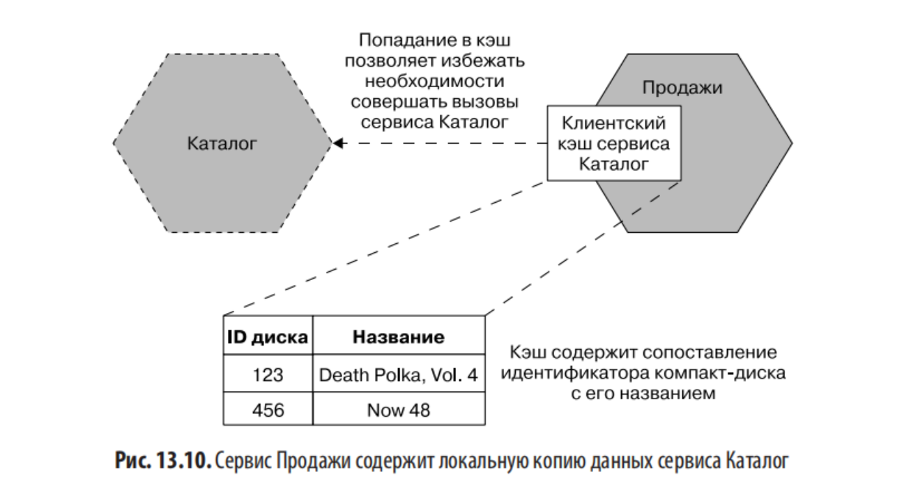

Клиентский кэш может кэшировать **только часть** информации (например, только название альбома).

**Преимущества**:

- Эффективны — избегаем сетевого вызова.
- Подходят для повышения **устойчивости и надёжности**.

**Недостатки**:

- **Ограниченные возможности механизмов аннулирования**.
- **Несогласованность между клиентами**: если Продажи, Рекомендации и Акции имеют кэши данных Каталога — при изменении данные обновятся не одновременно. Чем больше клиентов, тем серьёзнее проблема. Уведомления помогают уменьшить, но не устранить.

**Смягчающий фактор — общий кэш на стороне клиента** (Redis, memcached):

- Избегаем проблемы несогласованности.
- Эффективнее по ресурсам (меньше копий, память — частое ограничение).
- Минус: клиентам нужно совершать сетевое перемещение к общему кэшу.
- Размывает границу между клиентским и серверным кэшем.

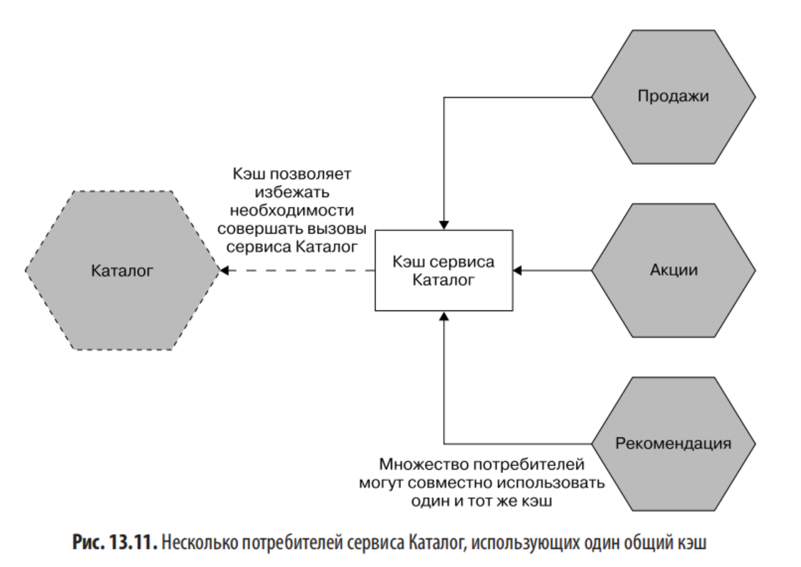

### На стороне сервера

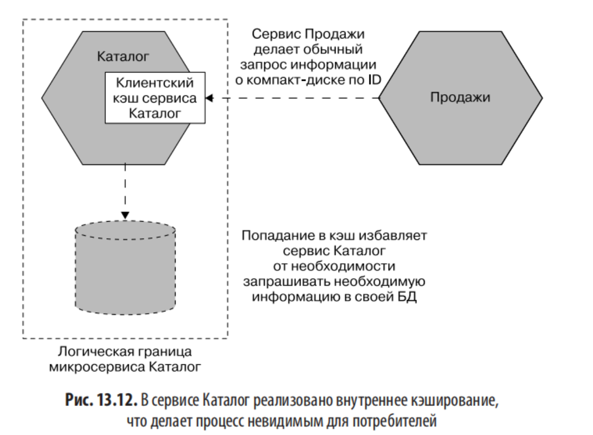

Микросервис Каталог сам поддерживает кэш от имени потребителей. Для Продажи обработка кэша прозрачна.

- Управление кэшем — полностью на Каталоге.
- Проще реализовать **замысловатые механизмы аннулирования** (например, сквозную запись).
- Нет проблемы разных кэшированных значений у разных пользователей.
- С точки зрения потребителя — это деталь внутренней реализации (можно использовать обратный прокси, Redis, реплики БД).

**Основная проблема**: сокращает возможности оптимизации задержек — потребителям всё равно нужно обращаться к микросервису.

**Когда полезно**: прозрачное повышение производительности для всех потребителей. Микросервис, который широко используется, может извлечь огромную выгоду.

### Кэш запросов

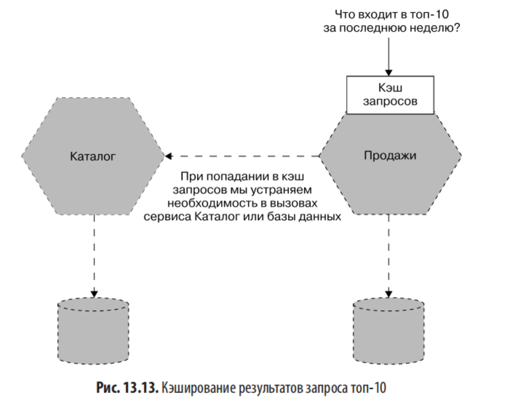

Хранение кэшированного ответа на исходный запрос. Пример: храним актуальные топ-10, последующие запросы возвращают кэш — ни поиска в Продажах, ни в Каталоге.

**Преимущества**:

- **Самый эффективный кэш с точки зрения скорости**.

**Недостатки**:

- Очень **специфичен** — кэшируется только результат этого конкретного запроса.
- Другие операции в Продажи/Каталог не попадают в кэш.

---

## Аннулирование

> «В информатике есть только две трудные задачи: аннулирование кэша и именование элементов.» — Фил Карлтон

Аннулирование — процесс удаления данных из кэша. Прост в концепции, сложен в исполнении.

### Время жизни (TTL)

Простейший механизм. Каждая запись действительна определённое время.

- Простой **TTL** (например, 5 минут).
- Альтернатива — **временная метка** истечения (полезно для многоуровневых кэшей).
- **HTTP** поддерживает оба варианта: заголовок `Cache-Control` (TTL) и `Expires` (временная метка).
- Источник может сообщать клиентам, как долго кэшировать (пример: микросервис Запасы выдаёт короткий TTL для быстро продающихся товаров).
- Идея «подсказок от источника» мощная — клиент делает осознанный выбор.

**Проблема**: грубый инструмент. Если данные изменились через секунду после получения копии — кэш будет работать с устаревшими данными ещё ~5 минут. Простота должна балансироваться с допустимостью устаревания.

### Условные GET-запросы

HTTP-возможность через **ETag** (Entity Tag).

- ETag меняется при изменении значения ресурса.
- Условный GET: заголовок `If-None-Match: <ETag>`.
- Если ресурс не изменился — ответ **304 Not Modified**.
- Если изменился — ответ **200 OK** с новым ресурсом и ETag.

**Особенности**:

- Запрос всё равно идёт от клиента к серверу (не помогает экономить сетевые перемещения).
- Полезно для **избежания затрат на регенерацию ресурсов** (если генерация дорогая — например, тяжёлые запросы к БД).

### На основе уведомлений

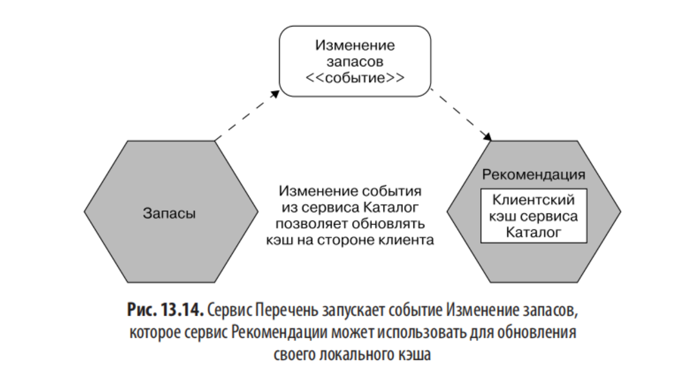

Используем события, чтобы абоненты знали об аннулировании.

Пример: сервис Рекомендации поддерживает кэш на стороне клиента. Записи аннулируются, когда Запасы запускает событие **Изменение запасов**.

**Преимущество**: уменьшает потенциальное окно устаревания — окно ограничено временем отправки и обработки уведомления. Самый элегантный механизм по мнению автора.

**Недостаток**: сложнее в реализации. Естественное место — **брокер сообщений** (модель издатель-подписчик). См. главу 5, раздел «Брокеры сообщений». Управление брокером — накладные расходы, но если уже используется — стоит воспользоваться.

**Проблема**: нужно знать, **работает ли механизм уведомлений**. Если событий долго нет — то ли товары не продаются, то ли механизм сломался. Решение — отправлять событие **«пульс»** через тот же механизм. Если пульс не получен — клиент предполагает проблему: сообщает пользователю или отключает функциональность.

**Содержимое уведомления**:

- Только «значение изменилось» → потребитель идёт к источнику.
- Текущее состояние данных → загружается в кэш напрямую.
- Уведомление с данными → проблемы с размером и риск раскрытия конфиденциальных данных.
- Компромисс рассматривался в главе 4, раздел «Что входит в событие».

### Сквозное кэширование

Данные обновляются одновременно с состоянием в источнике.

- В кэше на стороне сервера это просто (одна транзакция: БД + кэш в памяти).
- Если кэш в другом месте — сложно понять, что значит «одновременно».
- Из-за этого нюанса сквозное кэширование обычно используется **на стороне сервера**.
- Преимущество: окно устаревания фактически устраняется.
- Кэши на стороне сервера в целом менее полезны → ограничивают эффективность.

### Кэш с последующей записью

Сначала обновляется кэш, потом источник. Кэш как буфер.

- Запись в кэш быстрее → ускорение последующих чтений → источник обновится позже.
- **Основная проблема — потенциальная потеря данных** при ненадёжном кэше.
- **Что есть источник?** Если сначала обновили кэш, кто фактический источник истины?
- При кэшировании важно разделять: какие данные кэшированы (потенциально устарели), а какие — актуальны.
- В микросервисных архитектурах применяется **реже** — другие формы кэширования достаточны, а сложность обработки потери данных высока.

---

## Золотое правило кэширования

> Будьте осторожны с повсеместным кэшированием!

- Чем больше кэшей между вами и источником — тем устаревшее данные и сложнее определить актуальность.
- Сложнее определить, где аннулировать данные.

**Пример проблемы вложенного кэширования**:

- Сервис Запасы кэширует уровни (TTL = 1 мин).
- Сервис Рекомендации кэширует данные Запасы (TTL = 1 мин).
- При истечении клиентского кэша — запрос к Запасы, но попадает в его серверный кэш (уже устаревший на минуту).
- Итог: данные в Рекомендации могут быть устаревшими на **2 минуты**, хотя кажется, что не больше минуты.

**Как избегать**:

- Использовать **временные метки**, а не TTL.
- Помнить о вложенном кэшировании.

**Главное правило**:

> Идеальное количество мест для кэширования равно нулю. Все остальное — оптимизация. Относитесь к кэшированию в первую очередь как к оптимизации производительности. Кэшируйте в как можно меньшем количестве мест.

---

## Свежесть или оптимизация

Если 5-минутный TTL даёт неприемлемое окно устаревания → уменьшить TTL до 1 мин.

- Окно сокращается в 5 раз.
- Обращений к источнику — в 5 раз больше.
- Нужно учитывать задержки и нагрузку.

**Баланс — понимание требований**:

- Пользователи хотят свежие данные, но только если система не падает под нагрузкой.
- Иногда безопаснее **отключить функции** при сбое кэша, чем перегрузить источник.
- Балансирование между несколькими осями масштабирования — причина делать всё проще: меньше кэшей → проще понимать систему.

---

## Отравление кэша: поучительная история

**Компания AdvertCorp** (см. главу 12) переносила приложения по шаблону **«Душитель»**. Новое ПО работало как прокси, перехватывая вызовы. Для устаревших приложений применялись заголовки HTTP-кэша.

**Что случилось**:

1. После рутинного релиза появилась ошибка: небольшое число страниц не выполняло логическое условие вставки заголовка кэша → заголовок не менялся.
2. Нижестоящее приложение ранее тоже изменялось — добавилось значение `Expires: Never`. Раньше это не работало, теперь — да.
3. Использовался **Squid** для кэширования HTTP-трафика. Заметили проблему — запросы стали обходить Squid.
4. Исправили код, выпустили релиз, очистили область кэша Squid вручную. **Этого было недостаточно.**

**Кэши между сервером и клиентом**:

- CDN.
- Кэши интернет-провайдеров.
- **Кэш браузера** — практически вне контроля.

Страницы с `Expires: Never` застряли в кэшах пользователей навсегда (до заполнения кэша или ручной очистки).

**Единственное решение** — изменить URL страниц, чтобы они были перезагружены.

> Кэширование — очень мощное решение, но нужно понимать **полный путь данных** от источника к месту назначения.

---

## Автоматическое масштабирование

Требует полностью автоматизированной инициализации виртуальных хостов и развёртывания экземпляров.

### Прогнозирующее (по тенденциям)

- Например, пик нагрузки 9:00–17:00 → запуск экземпляров в 8:45, отключение в 17:15.
- Платформы вроде **AWS** имеют хорошую встроенную поддержку → экономия денег.
- Нужны данные о том, как меняется нагрузка (по дням, неделям, сезонам).

### Реактивное (по событиям)

- Вызов экземпляров при росте нагрузки или сбоях.
- Удаление, когда они не нужны.
- Важно: **скорость масштабирования**. Если уведомление о росте — через пару минут, а масштабирование — 10 минут, надо резервировать мощности на этот разрыв.
- **Нагрузочные тесты** практически необходимы для проверки правил автомасштабирования. Без них — узнаём о проблемах только в эксплуатации.

### Пример новостного сайта

- Чёткие ежедневные тренды (рост до обеда, спад потом). Выходные — ниже.
- Чёткая тенденция → превентивное масштабирование.
- Крупная новость → неожиданный всплеск → большие мощности в короткие сроки.

### Наблюдение автора

- Автомасштабирование чаще используется для **обработки сбоев экземпляров**, чем для реакции на нагрузку.
- AWS: правила вроде «в группе должно быть не менее 5 экземпляров» — при отказе автоматически запускается новый.
- Забавная игра в «ударь крота»: кто-то забывал отключить правило при удалении экземпляров для обслуживания, а они продолжали возвращаться.

### Рекомендации

- Сначала использовать автомасштабирование для условий сбоя (пока собираются данные).
- При запуске для нагрузки — следить, чтобы уменьшение масштаба не происходило слишком быстро.
- В большинстве ситуаций **иметь больше мощности, чем нужно — лучше, чем не иметь достаточно**.

---

## Начинаем все сначала

Архитектура, с которой вы начинаете, может оказаться не той, что нужна при большой нагрузке.

- Некоторые формы масштабирования (вертикальное, горизонтальное дублирование) почти не влияют на архитектуру.
- В определённые моменты — нужно сделать что-то радикальное.

### Кейс Gilt (см. главу 8, «Изолированное выполнение»)

- Монолитное приложение Rails работало хорошо **2 года**.
- Бизнес рос → перепроектирование стало необходимым.

### Что может означать перепроектирование

- Разделение существующего монолита.
- Выбор новых хранилищ данных.
- Внедрение новых методов: переход с синхронных запросов на событийные системы.
- Внедрение современных платформ развёртывания.
- Изменение технологических стеков.

### Опасность преждевременного проектирования

- Соблазн строить масштабные проекты с самого начала.
- В начале мы не знаем, что хотим построить и будет ли проект успешным.
- Нужно быстро экспериментировать.
- Заранее построенная масштабная система → перегружены подготовкой к нагрузке, которая может не наступить.

### История **Эрика Райса**

Потратил полгода на продукт, который никто не скачал. Мог бы вместо этого:

- разместить ссылку на странице, выдающую 404 при клике, чтобы узнать спрос;
- или провести 6 месяцев на пляже — и получить те же знания.

> Необходимость изменения систем для масштабирования — не признак неудачи. Это **признак успеха**.

---

## Резюме

Микросервисы предоставляют множество вариантов для масштабирования.

**Четыре оси масштабирования** (резюме):

- **Вертикальное масштабирование** — приобретение более мощной машины.
- **Горизонтальное дублирование** — несколько устройств, выполняющих одну работу.
- **Разделение данных** — разделение по атрибуту данных.
- **Функциональная декомпозиция** — разделение по типу работы (декомпозиция микросервиса).

**Ключевые выводы**:

- Понимать, чего вы хотите: методы для снижения **задержки** ≠ методы для увеличения **объёма**.
- Многие формы масштабирования **увеличивают сложность** системы.
- Важно быть нацеленными на цель и избегать **преждевременной оптимизации**.

Далее — наиболее заметная часть системы: **пользовательский интерфейс**.

---

## Ключевые термины и понятия

- **Куб масштабирования** — модель из «Искусство масштабирования».
- **Шаблон конкурирующих потребителей** — из «Шаблоны интеграции корпоративных приложений».
- **Реплики для считывания** — read replicas БД.
- **Sharding / сегменты** — разделение данных.
- **CQRS** — Command Query Responsibility Segregation.
- **Event Sourcing** — источник событий.
- **TTL** — Time To Live.
- **ETag** — Entity Tag (HTTP).
- **Условный GET** — `If-None-Match`, ответы `304 Not Modified` / `200 OK`.
- **Сквозное кэширование** — write-through.
- **Кэш с последующей записью** — write-behind.
- **Шаблон «Душитель»** — Strangler pattern.
