# Глава 14. Пользовательские интерфейсы

## Введение

UI — место, где **микросервисы объединяются во что-то имеющее смысл для потребителей**. Многие разработчики хотят создавать красивые и функциональные UI, а не только предоставлять клиентам «холодный, жесткий, мрачный API».

### Историческая эволюция UI

- **Ранний период**: «тучные» программные клиенты на настольных компьютерах (Motif, Swing). Часто содержали серверный компонент.
- **Эпоха Интернета**: UI стали «тонкими», логика — на сервере. Серверные программы отображали страницу целиком и отправляли её в браузер. Взаимодействие через GET/POST.
- **JavaScript**: добавление динамического поведения. Веб-приложения стали такими же «тучными», как старые десктоп-клиенты.
- **Мобильные приложения**: разнообразный ландшафт платформ и технологий.

---

## К цифровым технологиям

Организации отходят от разделения веб- и мобильных приложений и думают о цифровых технологиях **более комплексно**.

Понимание того, что **нельзя точно предсказать**, как потребитель будет взаимодействовать с продуктами, привело к внедрению **более детализированных API**, подобных микросервисам.

Думать о UI следует как о **месте, где сплетаются различные нити возможностей**. Проблему нужно рассматривать с двух сторон:

1. **Кто** несёт ответственность за UI (организационные аспекты)
2. **Как** реализовать интерфейсы (шаблоны)

---

## Модели владения

### Проблема многоуровневой архитектуры

Традиционная многоуровневая архитектура: ответственность за UI — у интерфейсной команды, за бэкенд — у другой. Добавление простого элемента управления требует работы **трёх разных команд**, что замедляет доставку из-за необходимости постоянной координации.

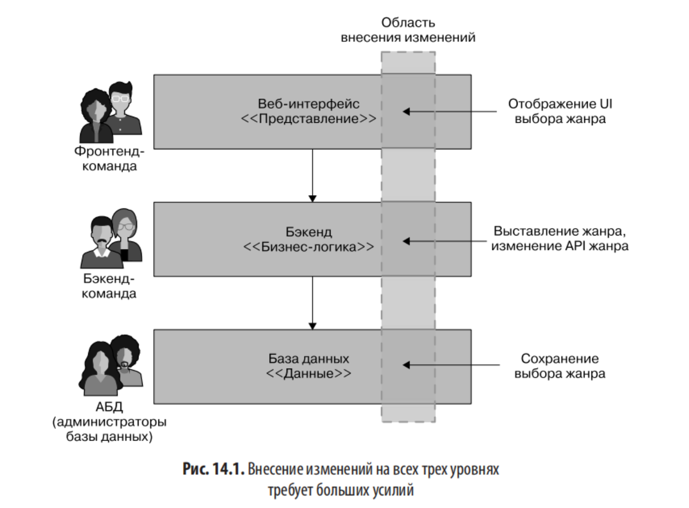

### Предпочтительная модель

**UI разделён на части и управляется командой**, которая также управляет серверными компонентами. Одна команда несёт ответственность за все изменения.

> Команды, полностью владеющие сквозной функциональностью, могут вносить изменения быстрее. Полное владение побуждает каждый коллектив создавать прямой контакт с конечным пользователем.

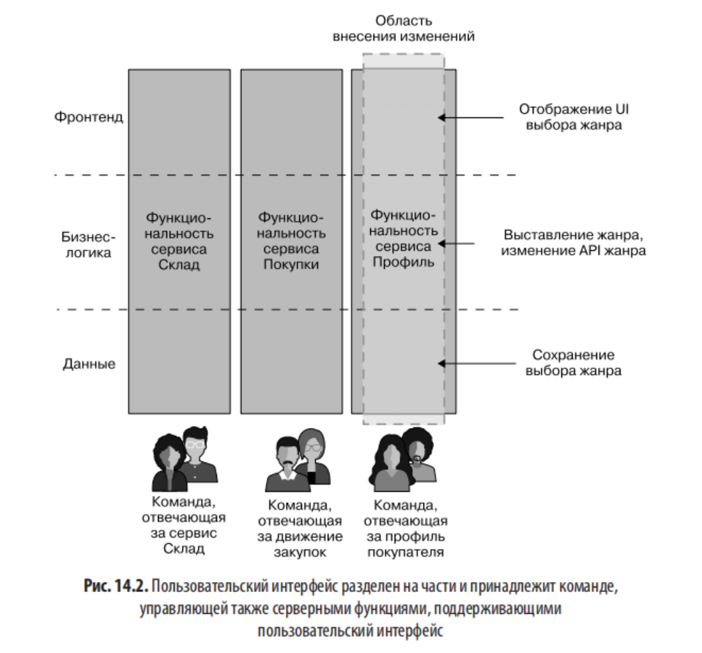

Несмотря на это, **выделенная фронтенд-команда** остаётся более распространённой моделью среди компаний, использующих микросервисы.

---

## Драйверы для специализированных фронтенд-команд

Три ключевых фактора:

### 1. Нехватка специалистов

Создание UI требует специальных навыков (взаимодействие, графический дизайн, технические ноу-хау). Возникает соблазн собрать всех специалистов вместе.

### 2. Стремление к согласованности

Одна команда → согласованный внешний вид, единый набор элементов управления, единый дизайн.

### 3. Технические проблемы

**Одностраничные приложения (SPA)** исторически сложно разделить на части. Фреймворки: Angular, React, Vue. Концепция **микрофронтенда** позволяет применять SPA-фреймворки, избегая монолитного UI.

---

## На пути к потоковым командам

Специальная фронтенд-команда — **ошибка**, если оптимизируется пропускная способность, так как создаются новые точки передачи данных.

### Потоковая команда (по Скелтону и Паис, «Топологии команд»)

> Коллектив, ориентированный на единый, значимый поток работы... уполномоченный создавать и предоставлять потребительские или пользовательские ценности как можно быстрее, безопаснее и независимей, не требуя передачи другим командам части работы.

Это **фуллстек-команды** (а не фуллстек-разработчики). Преимущества:

- Очевидная прямая связь с конечным пользователем
- Меньше недоразумений при внедрении функций
- Фокус на гарантии предоставления нужного

### Пример FinanceCo

Финтех-фирма в Европе. Команды получают **ориентированные на клиента KPI**: успех определяется не количеством функций, а улучшением пользовательского опыта.

> Чем сильнее отдаляетесь от конечного пользователя, тем труднее понять, успешен ли ваш вклад.

---

## Обмен специалистами

Хороших разработчиков (особенно со специализацией) **трудно найти**. Для UI нужны: специалисты по iOS, Android, веб-разработке, дизайнеры по взаимодействию, графические дизайнеры, эксперты по доступности.

### Проблема традиционного подхода

Объединение всех специалистов в одну команду → **разрозненность организаций**. Это лишает других разработчиков возможности приобрести востребованные навыки.

### Историческая аналогия

Раньше все изменения в БД выполнял **центральный пул АБД**. Результат: разработчики плохо понимали БД, а опытные АБД занимались тривиальными задачами. После передачи работы командам — разработчики стали лучше разбираться, а АБД сосредоточились на сложных проблемах.

### Способы привлечения специалистов

1. **Интеграция в команды** (полная или частичная — разделение времени между командами)
2. **Команды поддержки** (Скелтон и Пейс): помогают другим командам, выступают как внутренние консультанты
3. **Сообщества практиков** — например, сообщество UI, охватывающее все команды

---

## Обеспечение согласованности

### Способы поддержания согласованности

- Модель с командой поддержки (специалисты с несколькими командами)
- Общие ресурсы: руководство по стилю CSS, общие компоненты UI

### Пример Financial Times

**Команда Origami** создаёт веб-компоненты в сотрудничестве с дизайнерами. Команда поддержки предоставляет:

1. Опыт в поставке готовых компонентов
2. Гарантию соответствующего пользовательского опыта

### Контрпример: Amazon

Драйвер согласованности **не универсально правильный**. У ранних версий торгового сайта Amazon была большая несогласованность. У AWS — совершенно разные модели взаимодействия у разных продуктов, UI запутанный.

> Скорость доставки превосходит согласованность пользовательского опыта, по крайней мере в том, что касается AWS.

Это результат стремления Amazon сократить внутреннюю координацию между командами и проявление автономии групп разработки.

---

## Решение технических проблем

Эволюция UI: от текстовых терминалов с зелёным экраном → настольные приложения → сетевые → мобильные. Прошли полный цикл и ещё немного.

Элементы UI в основном те же, что 20 лет назад: кнопки, флажки, формы, поля со списком. Изменилась **технология**.

### Ключевые проблемы

- **Одностраничные приложения** — проблемы декомпозиции UI
- **Разнообразие устройств** — требуют разных решений

Пользователи хотят взаимодействовать с ПО **беспрепятственно** через унифицированный UI, не заботясь о модульности/монолитности.

---

## Шаблон: монолитный интерфейс

**Описание**: всё состояние и поведение UI определяются в самом пользовательском интерфейсе с вызовами резервных микросервисов.

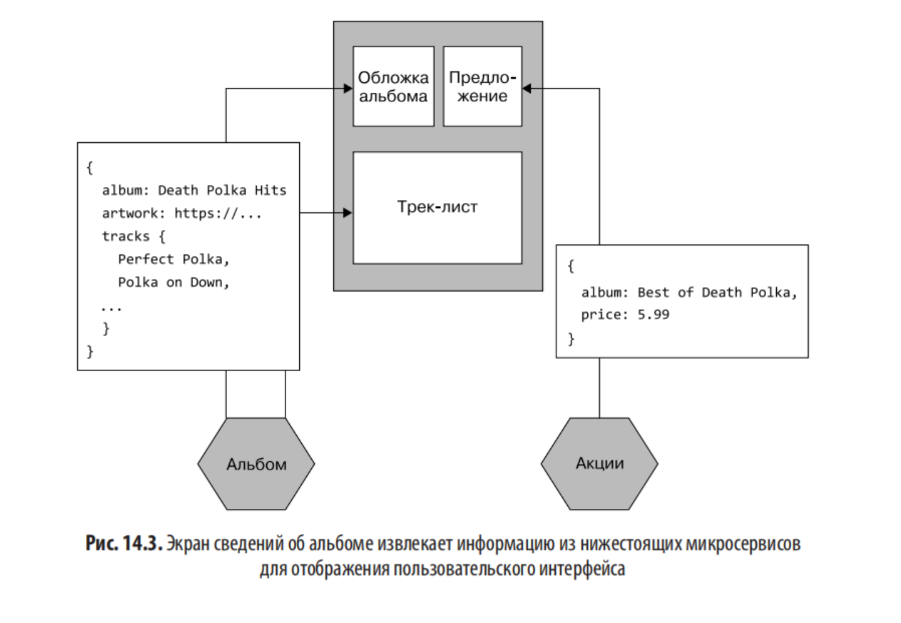

### Пример MusicCorp

Экран сведений об альбоме:

- Запрос к микросервису **Альбом** для информации об альбоме и списке композиций
- Запрос к микросервису **Акции** для специальных предложений
- Микросервисы возвращают **JSON**

### Когда использовать

- Наиболее распространён для **монолитных SPA** со специальной фронтенд-командой
- Требования к микросервисам простые: обмен информацией в формате, который легко интерпретирует UI
- Веб → текстовый формат (JSON); нативные/«тучные» приложения → возможен двоичный протокол

### Недостатки

1. По природе монолитного UI — драйвер для выделенной фронтенд-команды
2. Несколько команд с общей ответственностью → разногласия
3. Мало возможностей адаптации ответов для разных устройств
    - Пример: мобильный клиент отображает 10 полей заказа, но микросервис возвращает 100
    - Решение: указывать UI, какие поля возвращать (но это требует поддержки от каждого микросервиса)

> Шаблон работает лучше всего, когда требуется, чтобы вся реализация и поведение UI находились в одном развертываемом модуле.

Если над ПО работает более одной команды — **бороться с этим желанием**, чтобы не скатиться к многоуровневой архитектуре.

---

## Шаблон: микрофронтенды

**Определение** (Кэм Джексон):

> Архитектурный стиль, в котором независимо поставляемые фронтенд-приложения объединяются в единое целое.

Где микросервисы обеспечивают независимую развёртываемость бэкенда, **микрофронтенды — для фронтенда**.

Концепция приобрела популярность из-за проблем **монолитных веб-интерфейсов с большим количеством JavaScript** (типично для SPA).

### Реализация

Два ключевых метода декомпозиции для веб-интерфейсов:

1. **Разбиение на основе виджетов** — объединение частей интерфейса в общий экран
2. **Декомпозиция на основе страниц** — UI разделяется на независимые веб-страницы

### Когда использовать

- Для внедрения сквозных потоковых команд при отходе от многоуровневой архитектуры
- При сохранении многоуровневой архитектуры, но большой функциональности фронтенда

### Ключевая проблема

Иногда возможности микросервиса **не вписываются в виджет или страницу**. Например, динамические рекомендации, которые должны запускаться при поиске. Чем более сквозной формой взаимодействия, тем ниже подходит модель.

---

## Автономные системы (SCS) (self-contained system)

**SCS** — архитектурный стиль, возникший из-за отсутствия внимания к проблемам UI в первые годы микросервисов.

### Критерии SCS

- Каждая SCS — автономное веб-приложение без общего UI
- Каждая SCS принадлежит одной команде
- По возможности — асинхронная связь
- Никакой бизнес-код не может быть общим для систем SCS

### Оценка автора

- Подход **не прижился** так, как микросервисы
- Согласие со многими принципами, особенно «одна SCS — одна команда»
- Подход **чрезмерно узкий и предписывающий**
- Пример проблемы: «автономное веб-приложение» исключает многие типы взаимодействия
- Манифесты, подобные SCS, могут направить на путь сосредоточения на деятельности, а не на принципах и результатах
- SCS — ориентированный на технологии подход к продвижению организационной концепции

---

## Шаблон: декомпозиция на основе страниц

**Описание**: UI разбивается на несколько веб-страниц, каждый набор может обслуживаться из разных микросервисов.

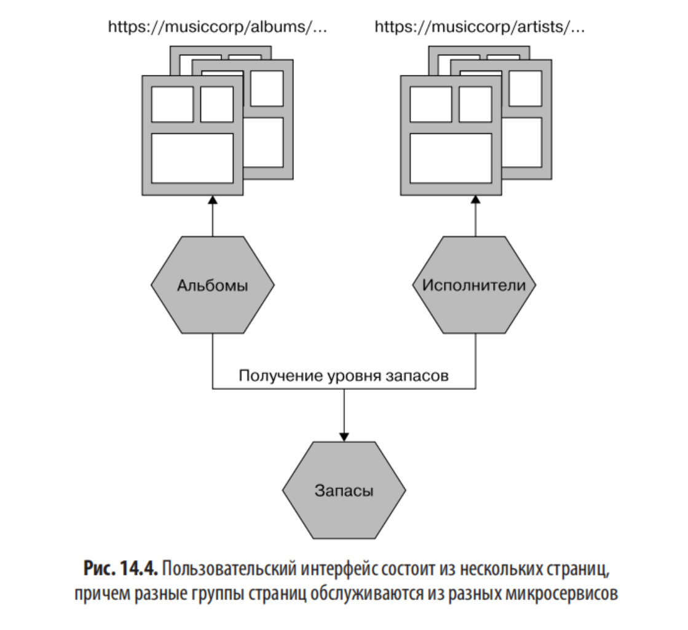

### Пример MusicCorp

- Запросы для `/albums/` → микросервис **Альбомы**
- Запросы для `/artists/` → микросервис **Артисты**
- Общая навигация объединяет страницы
- Микросервисы извлекают данные (например, уровни запасов из микросервиса **Запасы**)

Команда, владеющая микросервисом, может отобразить полный UI от начала до конца.

### Преимущества

- **Адаптация к разным устройствам** через прогрессивное улучшение / постепенную деградацию
- **Простота технической реализации**: не нужен JavaScript или iFrame
- Нажатие на ссылку → запрос новой страницы

### Где использовать

- Полезна для монолитного интерфейса и микрофронтенда
- **Выбор по умолчанию** для разбиения UI веб-сайта
- Веб-страница — базовая концепция Интернета

> В стремлении использовать SPA эти UI становятся всё более редкими, до такой степени, что пользовательский опыт, который лучше подходил бы для веб-сайта, превращается в SPA.

Можно комбинировать с другими шаблонами, например, создать страницу с виджетами.

---

## Шаблон: декомпозиция на основе виджетов

**Описание**: экран содержит виджеты, которые можно изменять независимо.

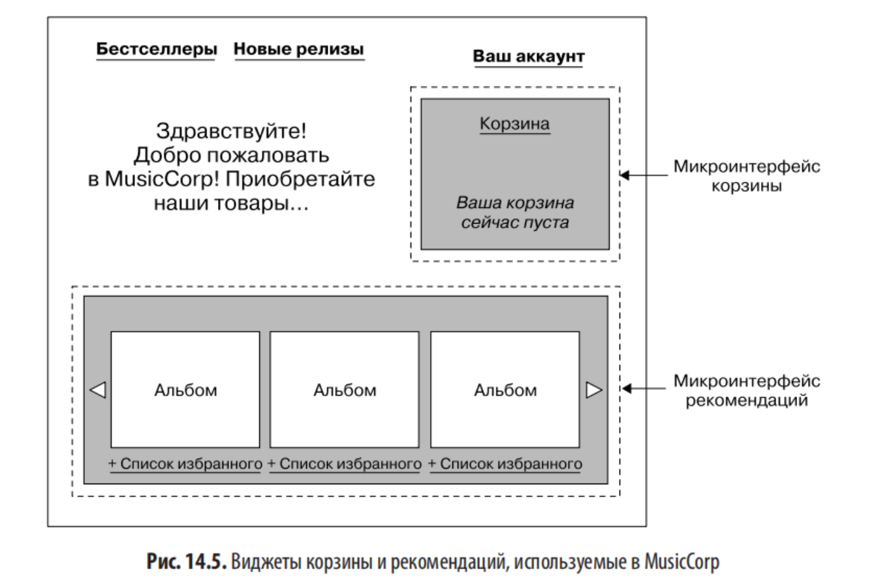

### Пример MusicCorp

Два виджета:

- **Виджет корзины** покупок
- **Виджет рекомендаций** — карусель с возможностью переключения и фильтрации

Взаимодействие виджета с микросервисами:

- Виджет рекомендаций → микросервис **Рекомендации**, микросервис **Список избранного**

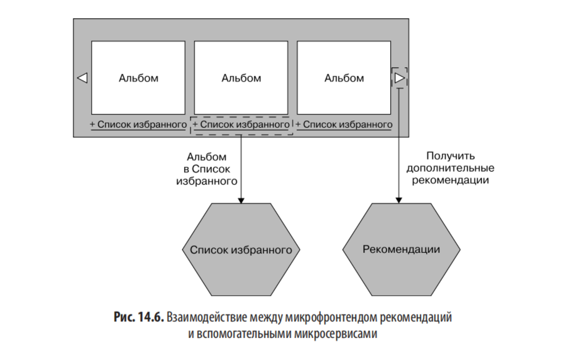

### Пример Spotify

Активно использует виджеты:

- Список воспроизведения
- Информация об исполнителе
- Информация о подписчиках

Виджеты комбинируются по-разному в зависимости от ситуации.

### Контейнерное приложение

Нужно «контейнерное» приложение, определяющее:

- Основную навигацию
- Какие виджеты включить

Сборочный слой может быть простым: шаблоны на стороне сервера или клиента.

### Реализация

- Простой веб-сайт → HTML-фрагменты через шаблонизацию (клиент/сервер)
- Сложное JavaScript-поведение → риск конфликтов с другими частями страницы
- Виджет нужно упаковать так, чтобы он **не нарушал другие аспекты UI**

### Зависимости

**iFrames** — стараются избегать (проблемы с размером и взаимодействием). Вместо этого:

- Шаблоны на стороне сервера
- Динамическая вставка в браузер на клиенте

#### Проблема версий фреймворков

- Виджет рекомендаций может использовать React v16, а корзины — React v15
- Полезно для опробования технологий и постепенного обновления
- **Риск**: множественное дублирование зависимостей → разрастание размера загружаемой страницы

Пример (на момент написания книги):

- Загрузка страницы CNN — **7,9 Мбайт**
- Дистрибутив Alpine Linux — **5 Мбайт**
- 7,9 Мбайт — самый маленький размер некоторых страниц

### Коммуникация между виджетами внутри страницы

Виджеты должны взаимодействовать друг с другом.

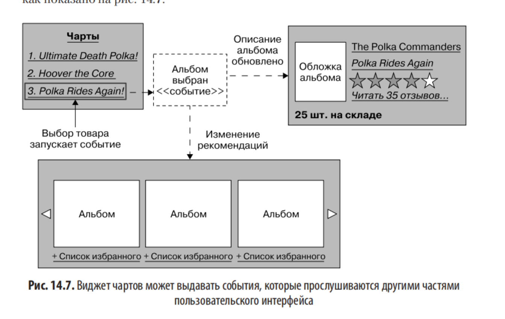

#### Пример

- Пользователь выбирает альбом в чарте бестселлеров
- Виджет чартов выдаёт **нестандартное событие** (например, «Альбом выбран»)
- Виджеты рекомендаций и сведений об альбоме **подписываются** на событие и реагируют

> Это взаимодействие имитирует событийное взаимодействие между микросервисами, только внутри браузера.

### Веб-компоненты

Стандарт **должен быть** очевидным способом реализации виджетов. Описывает создание UI-компонента, изолирующего HTML, CSS, JavaScript.

**Проблемы**:

- Долго утверждался стандарт
- Долго ждали поддержку браузеров
- Первоначальная работа застопорилась

Автор пока не встречал организаций, использующих веб-компоненты от микросервисов. Возможно, в будущем — но с оговорками.

### Когда использовать

**Преимущества**:

- Несколько потоковых команд могут вносить вклад в один UI
- Большая гибкость, чем у декомпозиции страниц
- Команды поддержки могут предоставлять повторно используемые виджеты (как Origami в FT)

**Рекомендация**: при использовании SPA-фреймворка и необходимости разделить ответственность → подход микрофронтендов с виджетами как подход по умолчанию.

**Опасения**:

1. Работа по настройке отдельного объединения компонентов (единовременные затраты)
2. **Размер полезной нагрузки** — небольшое изменение зависимостей виджета может резко увеличить размер страницы

Рекомендация: автоматические проверки для предупреждения при превышении порога размера страницы.

Для простых статических виджетов — легко включить через шаблонизацию.

---

## Ограничения

Пользователи взаимодействуют с ПО через **разные устройства**, каждое со своими ограничениями.

### Типы ограничений

- **Десктоп**: используемый браузер, разрешение экрана
- **Слабовидящие**: программы чтения с экрана
- **Ограниченная подвижность**: ввод с клавиатуры

### Этические и юридические аспекты

- Игнорирование клиентов с особыми потребностями лишает их доступа к услугам
- В Великобритании **Закон о равенстве 2010 года, раздел 20** обеспечивает доступ к веб-сайтам для людей с ограниченными возможностями
- Невозможность навигации привела к судебным искам и штрафам

### Мобильные ограничения

- Проблемы с пропускной способностью мобильных сетей
- Разрядка батареи устройства
- Разные типы взаимодействий:
    - На планшете нельзя щёлкнуть правой кнопкой мыши
    - На мобильном — дизайн под большой палец одной руки
- **SMS-интерфейсы** в местах с ограниченной связью (например, на глобальном юге)

### Общее решение

Фильтрация и агрегирование вызовов на стороне клиента:

- Удаление невостребованных данных
- Объединение нескольких вызовов в один

Далее рассматриваются шаблоны:

1. **Центральный объединяющий шлюз**
2. **Бэкенд для фронтенда (BFF)**
3. **GraphQL**

---

## Шаблон: центральный объединяющий шлюз

**Описание**: расположен между внешними UI и нижестоящими микросервисами, выполняет фильтрацию и объединение вызовов для всех UI.

### Пример без объединения

Экран информации о последних заказах клиента:

- Вызов микросервиса **Покупатель** → возвращает полную информацию (даже если нужно несколько полей)
- Вызов микросервиса **Заказ** → извлечение деталей заказов
- Результат: два вызова + лишние данные

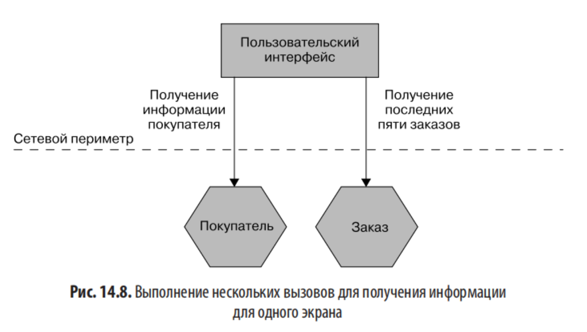

### С объединяющим шлюзом

- UI выполняет **один вызов** в шлюз
- Шлюз выполняет все необходимые вызовы
- Шлюз объединяет результаты в один ответ
- Отбрасывает невостребованные данные

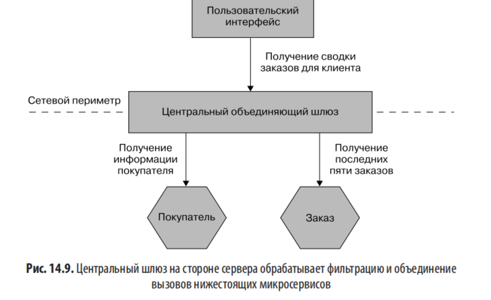

### Пакетные вызовы

Вместо 10 отдельных вызовов для 10 идентификаторов → один пакетный запрос шлюзу.

### Преимущества

- Сокращение количества вызовов внешнего клиента
- Уменьшение объёма передаваемых данных
- Значительные преимущества по полосе пропускания и задержке

### Владение

**Кто владеет шлюзом?**

- Те, кто создаёт UI?
- Те, кто владеет микросервисами?

Часто шлюз делает так много, что им владеет **специальная команда** → возврат к **изолированной многоуровневой архитектуре**.

> Логически шлюз должен принадлежать команде (командам), создающей UI.

**Проблема**: в организациях со специальной фронтенд-командой эта команда может не обладать навыками для создания критичного бэкенд-компонента.

### Узкое место

- Несколько команд изменяют шлюз → координация замедляет доставку
- Одна команда владеет шлюзом → становится узким местом

### Различные типы UI

Возможности устройств различаются:

- Меньше места на экране у мобильных
- Большое количество подключений → разряд аккумулятора и расход трафика
- Разные сценарии использования

#### Пример розничного магазина

- **Десктоп**: просмотр товаров, заказ онлайн, резервирование
- **Мобильный**: сканирование штрихкодов, контекстные предложения в магазине

Мобильные клиенты делают **разные и более редкие вызовы**, отображают другие данные.

#### Пример MusicCorp

Веб- и мобильный интерфейсы используют один шлюз для экрана сводки, но запрашивают разные наборы информации:

- Веб: дополнительная информация о клиенте + краткое описание товаров
- Мобильный: меньше данных

Это приводит к **двум разным вызовам объединения** в шлюзе.

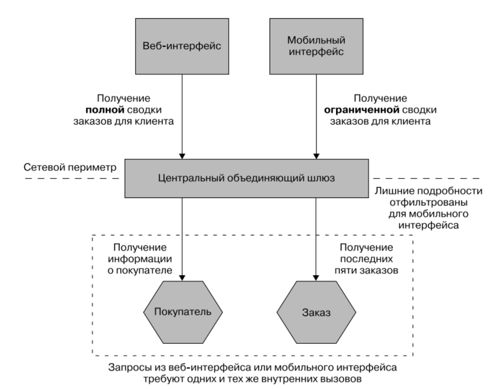

### Раздувание шлюза

Шлюз может стать раздутым:

- Разные нативные мобильные приложения
- Веб-сайты для клиентов
- Внутренние интерфейсы администрирования

Единый агрегирующий бэкенд → **узкое место** для многих команд, работающих над одним артефактом.

### Многочисленные проблемы

Шлюз может решать общие проблемы:

- Управление API-ключами
- Аутентификация пользователей
- Маршрутизация вызовов

→ Решается через **API-шлюзы** (доступны в разных размерах и по разным ценам).

#### Предостережение

- При покупке продукта приходится работать в чужой среде
- Ограниченный инструментарий
- Странный DSL вместо привычного языка (например, JSON-конфигурации)
- Перенос функциональности усложняется

**Совет**: использовать API-шлюзы для общих задач, **но не для объединения и фильтрации**.

### Худший сценарий

Объединяющий шлюз становится таким сложным, что нужна специальная команда. Для развёртывания новой функции потребуется:

- Фронтенд-команда
- Команда объединения
- Команда (команды) микросервисов

→ Резко замедляется разработка.

### Когда использовать

- **Для отдельной команды**, разрабатывающей UI и бэкенд → может работать
- При большой согласованности UI часто **отпадает необходимость** в объединении
- При использовании выделенного API-шлюза — **размещать логику фильтрации и объединения в другом месте**

Если нужна агрегация, но проблемы централизации → **BFF**.

---

## Шаблон: бэкенд для фронтенда (BFF)

**Основное отличие от центрального шлюза**: BFF **одноцелевой** — разработан для конкретного UI.

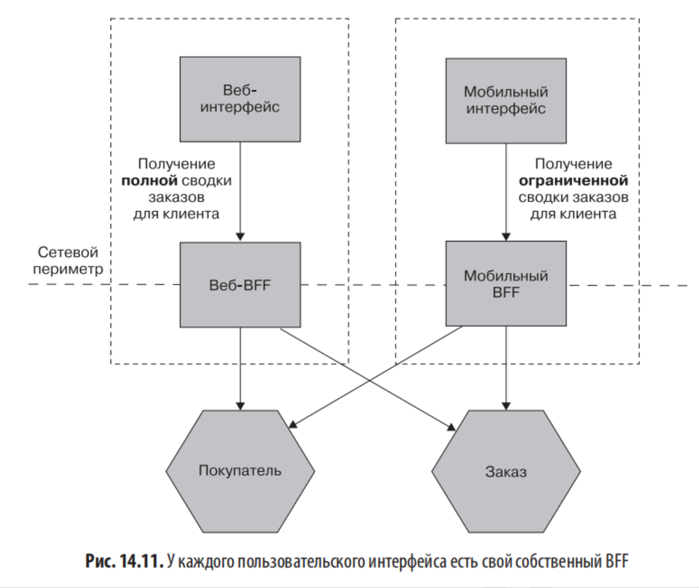

### Пример MusicCorp

Веб- и мобильный торговые интерфейсы получают **собственные объединяющие бэкенды**.

### Преимущества

- Обходит проблемы центрального шлюза
- Не становится узким местом для нескольких команд
- Меньше беспокойств о связанности с UI
- **Уровень связанности более приемлем**

### Концептуальная модель

UI разделён на две части:

1. **Клиентское устройство** (веб-интерфейс или нативное приложение)
2. **Серверная часть** (BFF)

BFF тесно связан с конкретным пользовательским опытом и поддерживается **той же командой**, что и UI. Это:

- Упрощает определение API
- Упрощает адаптацию API
- Упрощает подготовку выпуска клиента и сервера

### Сколько должно быть BFF

#### Подход 1 (предпочитает автор): один BFF на тип клиента

**Пример REA**: приложения для Android и iOS имели **разные BFF**, несмотря на схожую функциональность.

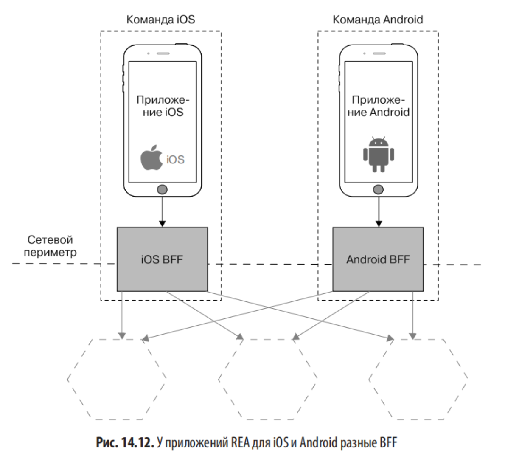

#### Подход 2: один BFF для нескольких типов клиентов одного UI

**Пример SoundCloud**: единый BFF для приложений iOS и Android.

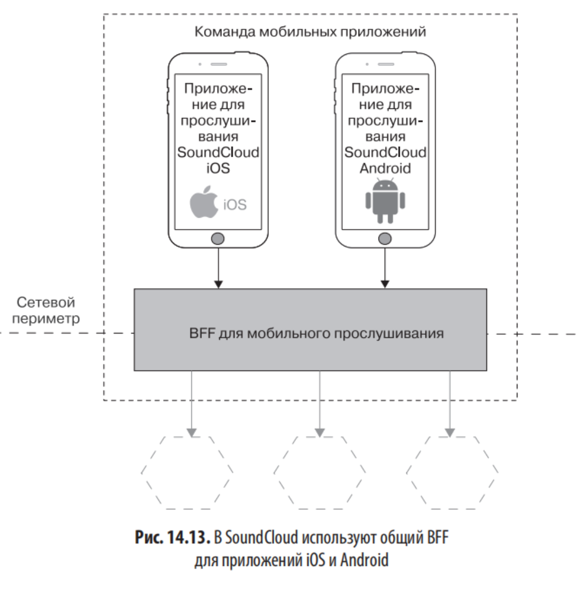

### Опасение по второй модели

Чем больше типов клиентов используют один BFF, тем выше **соблазн раздуть BFF** несколькими задачами.

### Принцип «Один опыт — один BFF» (Стюарт Глидоу из REA)

- Похожий опыт iOS/Android → один BFF
- Сильно расходящийся опыт → отдельные BFF
- Одна и та же функция может требовать переработки для разных платформ

### Влияние организационной структуры

ПО работает лучше, когда **ориентировано на границы команды**. BFF не исключение.

> Закон Конвея снова побеждает.

#### Пересмотр SoundCloud

Инженеры SoundCloud считают, что им стоило бы пересмотреть единый BFF. У них была единая мобильная команда, но фактически это была смесь специалистов Android/iOS, работающих над разными приложениями → фактически **две отдельные команды**.

### Повторное использование и BFF

Проблема: дублирование между BFF (объединение, код взаимодействия с микросервисами и т.д.).

Дублирование может быть и в клиентах, но в BFF его легче обнаружить, так как серверные стеки технологий обычно общие.

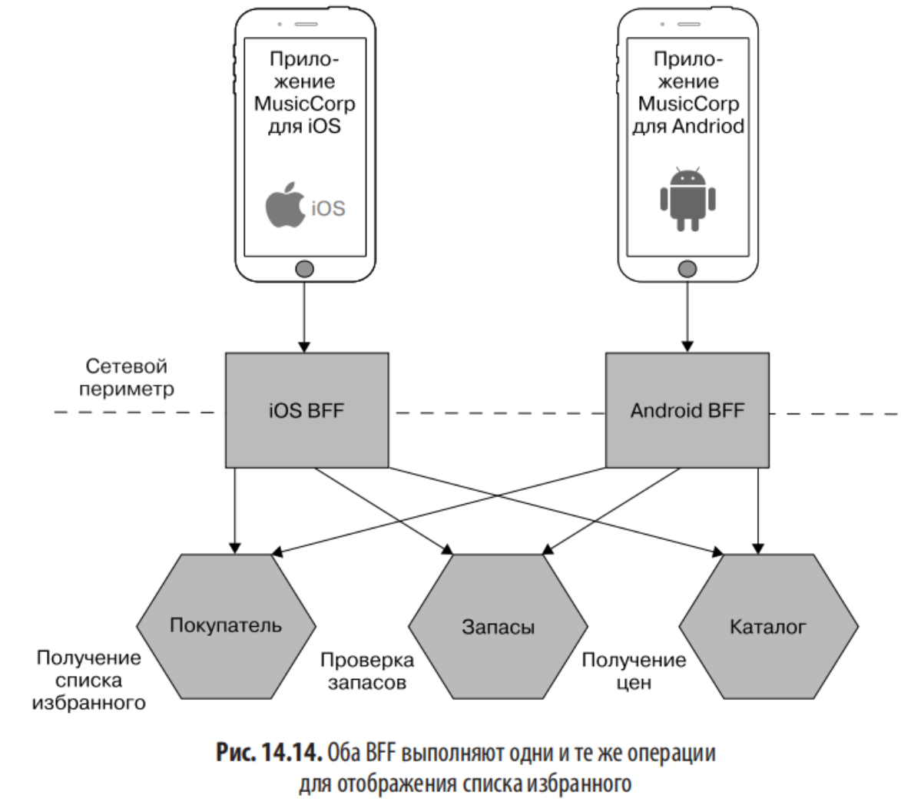

#### Реакция: объединение BFF обратно?

**Опасение**: можно потерять больше, чем получить.

#### Подход автора

- Внутри одного микросервиса — **рефакторинг дублирования** в абстракции
- Между микросервисами — **не делать так**
- Извлечение общего кода может привести к **сильной связанности**

#### Два варианта извлечения общего кода

**Вариант 1: Общая библиотека**

- Часто дешевле
- Но **более рискованно**
- Общие библиотеки — основной источник связанности
- Особенно проблематично для клиентских библиотек вызова нижестоящих сервисов
- Подходит, когда код — чисто внутренняя проблема сервиса

**Вариант 2: Новый микросервис**

- Хорошо работает, когда функциональность относится к области бизнеса
- Разновидность: передача обязанностей по агрегированию микросервисам ниже по потоку

#### Пример со списком избранного MusicCorp

Отображение списка избранного с информацией о наличии и цене:

|Товар|Наличие|Цена|
|---|---|---|
|The Brakes, Give Blood|На складе!|$5,99|
|Blue Juice, Retrospectable|Нет в наличии|$7,50|
|Hot Chip, Why Make Sense?|Покупайте скорее! (Осталось 2)|$9,99|

Данные распределены:

- Микросервис **Покупатель** — список избранного, ID элементов
- Микросервис **Каталог** — название и цена
- Микросервис **Запасы** — уровни запасов

Оба BFF (iOS и Android) выполняют одни и те же 3 вызова.


**Решение**: извлечь общее поведение в новый микросервис **Список избранного**, который используется обоими BFF.

> Старая пословица о создании абстракции при реализации в третий раз — хорошее правило даже на уровне сервиса.

Создание сервиса оправдано, если:

- Транзакционные издержки создания низкие
- Код используется более чем в паре мест

### BFF для настольных веб-сайтов и не только

Веб-приложения для десктопа обычно на мощных устройствах с хорошей связью → можно делать вызовы напрямую без BFF.

#### Когда BFF полезен для веб

- Большая часть веб-интерфейса на стороне сервера (шаблонизация на сервере)
- Упрощает кэширование: обратный прокси перед BFF кэширует объединённые вызовы

#### BFF для сторонних клиентов

**Пример**: предоставить BFF для:

- Извлечения информации о выплате роялти третьей стороной
- Стриминга на устройства с приставкой

Технически это уже не BFF (на сторонних потребителях нет UI), но шаблон тот же.

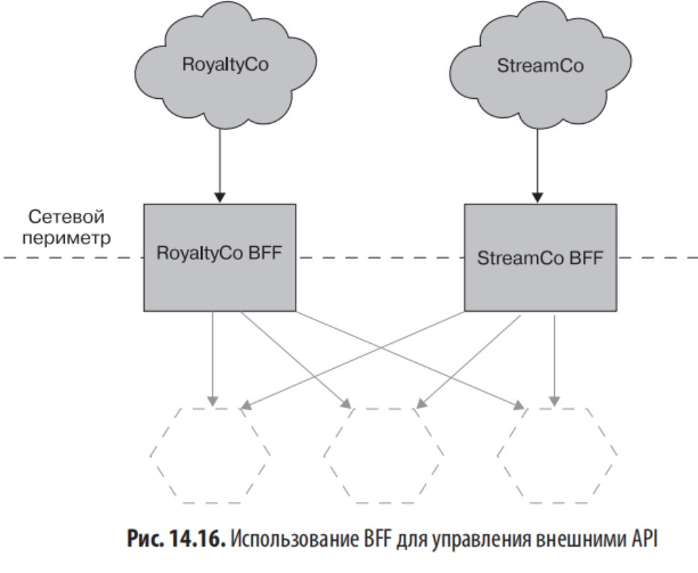

**Преимущества**:

- Третьи стороны часто не могут изменить выполняемые вызовы
- Без BFF приходится поддерживать старые версии API
- С BFF — изменение API для Facebook не нарушит совместимость с другими

### Когда использовать BFF

- **Только веб-интерфейс**: BFF имеет смысл при значительном объёме объединения
- **Мобильный UI или третья сторона**: рекомендуется BFF для каждого типа клиентов **с самого начала**
- Можно пересмотреть, если стоимость развёртывания дополнительных сервисов высока
- Разделение между UI-разработчиками и нижестоящими сервисами → ещё больше склоняет к BFF

---

## GraphQL

**GraphQL** — язык запросов, позволяющий клиентам создавать запросы для доступа к данным или их преобразования.

### Сравнение с REST

**REST GET для ресурса Заказ** → возвращает все поля.

**Что, если нужна только общая сумма?**

- Игнорировать другие поля
- Альтернативный ресурс (Сводка заказов)

**GraphQL**: отправить запрос только на нужные поля.

### Пример запроса

```graphql
{
  order(id: 123) {
    date
    total
    status
    delivery {
      company
      driver
      duedate
    }
  }
}
```

Запросили:

- Заказ 123: дату, сумму, статус
- Доставку: компанию, водителя, время прибытия

### Преимущества

1. **Запрос только нужных полей**
2. **Сокращение количества обходов** — данные доставки в одном запросе, без дополнительного вызова

### Типизация

Явное определение типов — **ключевая часть GraphQL**.

### Резолвер

**Резолвер GraphQL**:

- Находится на стороне сервера
- Преобразует запросы GraphQL в вызовы для извлечения информации
- В микросервисной архитектуре отображает запрос на эквивалентный вызов микросервиса

### GraphQL для реализации шаблонов

Можно использовать для реализации:

- Объединяющего шлюза
- BFF

### Гибкость

- Изменение объединения/фильтрации = изменение запроса от клиента
- Не нужны изменения на сервере (если типы поддерживают запрос)
- Не нужно поле — исключить из запроса
- Нужно новое поле (например, количество баллов) — добавить в запрос

> Это значительное преимущество по сравнению с BFF, требующим изменений в самом BFF при изменении логики объединения.

### Сервер GraphQL и команды

- Меньше вероятность, что GraphQL-сервер станет общим оспариваемым ресурсом
- Но изменения на сервере нужны при предоставлении новых типов или полей
- Несколько бэкенд-элементов GraphQL могут быть выровнены по границам команд
- **GraphQL становится способом реализации BFF**

### Опасения

Опасения автора подробно изложены в **главе 5**.

---

## Гибридный подход

Многие варианты **не обязательно универсальны**.

### Пример организации

- **Декомпозиция на основе виджетов** для веб-сайта
- **BFF** для мобильных приложений

### Ключевой момент

- Сохранять целостность базовых возможностей
- Логика заказа музыки / изменения данных клиента должна жить **внутри сервисов**, обрабатывающих эти операции
- Не распределять логику по всей системе
- Не закладывать слишком много поведения в промежуточные слои

---

## Резюме

- Декомпозиция функциональности **не обязательно останавливается на серверной части**
- Наличие выделенных фронтенд-команд **не неизбежно**
- Существует несколько способов создания UI с поддержкой микросервисов
- Целенаправленная сквозная доставка возможна

### Следующая глава

Переход от технической стороны к человеческой: взаимодействие микросервисов и организационных структур.

---

## Ключевые шаблоны главы (сводка)

|Шаблон|Описание|Когда использовать|
|---|---|---|
|**Монолитный интерфейс**|Всё состояние и поведение UI в самом UI с вызовами микросервисов|Одна команда для UI и микросервисов; единый развертываемый модуль|
|**Микрофронтенды**|Независимо поставляемые фронтенд-приложения объединяются в одно|Сквозные потоковые команды; уход от многоуровневой архитектуры|
|**Декомпозиция на основе страниц**|UI разбивается на независимые веб-страницы|Выбор по умолчанию для веб-сайтов|
|**Декомпозиция на основе виджетов**|Экран содержит независимо изменяемые виджеты|Богатый веб-UI на SPA-фреймворках|
|**Центральный объединяющий шлюз**|Фильтрация/объединение вызовов для всех UI|Одна команда для UI и бэкенда; избегать раздувания|
|**BFF (Backend for Frontend)**|Одноцелевой бэкенд для конкретного UI|Мобильный UI, сторонние клиенты, разделение между UI и бэкендом|
|**GraphQL**|Язык запросов для динамической выборки данных|Реализация BFF или объединяющего шлюза с гибкими запросами|

---

## Ключевые термины

- **Потоковая команда** — коллектив, ориентированный на единый поток работы, без передачи частей работы другим командам
- **Команда поддержки** — помогает другим командам, как внутренние консультанты
- **Фуллстек-команда** (не разработчик) — команда, отвечающая за всю функциональность
- **SPA (Single-Page Application)** — одностраничное приложение
- **SCS (Self-Contained System)** — автономная система, архитектурный стиль
- **BFF (Backend for Frontend)** — бэкенд, разработанный для конкретного UI
- **Резолвер GraphQL** — серверный компонент, преобразующий GraphQL-запросы в вызовы
