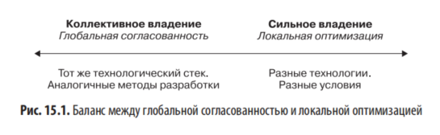
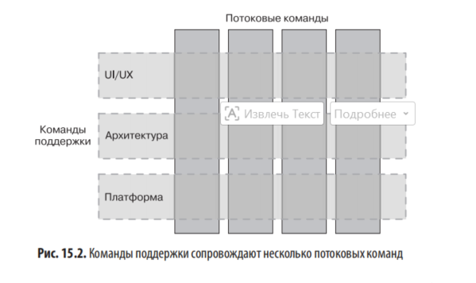
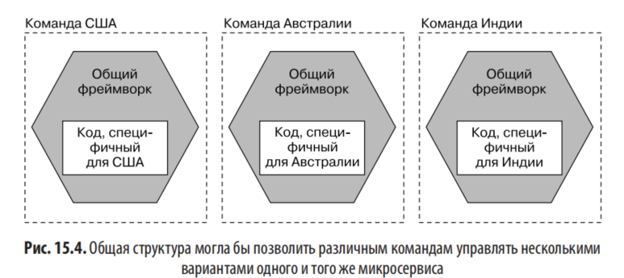
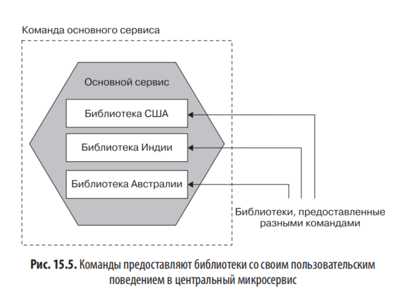

# Глава 15. Организационные структуры

## Слабо связанные организации

Переход на микросервисную архитектуру без изменения организационной структуры снижает полезность микросервисов — можно потратить деньги на изменение архитектуры, не получив отдачи от инвестиций.

### Характеристики автономных, слабо связанных команд

По Николь Форсгрен, Джезу Хамблу и Джину Киму (книга «Ускоряйся!»), ключевым моментом является возможность команды:

- вносить крупномасштабные изменения в проект своей системы без разрешения кого-либо за пределами команды;
- вносить крупномасштабные изменения в проект своей системы, не полагаясь на то, что другие команды будут вносить изменения в свои системы, и не создавая значительного фронта работ для других;
- завершать свою работу, не общаясь и не координируя действия с людьми, не входящими в команду;
- развертывать и выпускать свой продукт или сервис по требованию, независимо от других сервисов, с которыми он взаимодействует;
- проводить большую часть тестирования по мере необходимости, не запрашивая интегрированной тестовой среды;
- выполнять развертывания в обычное рабочее время с минимальным временем простоя.

> Потоковая команда соответствует видению слабо связанной организации.

Достижение слабо связанных организационных структур требует **децентрализации управления и контроля**.

---

## Закон Конвея

Закон Мура: плотность транзисторов в интегральных схемах удваивается каждые два года.

### Формулировка Мелвина Конвея (статья «Как комитеты создают новое?», Datamation, апрель 1968)

> Любая организация, разрабатывающая систему (определяемую здесь более широко, чем просто информационные системы), неизбежно создаст проект, структура которого будет копией коммуникационной структуры организации.

Эрик С. Рэймонд в «Словаре нового хакера» (MIT Press): «Если у вас есть четыре группы, работающие над компилятором, вы получите четырехпроходной компилятор».

**Слабо связанная организация приводит к слабо связанной архитектуре (и наоборот).**

### Подтверждение

Когда Конвей представил статью в Harvard Business Review, журнал отклонил её, заявив, что теория не обоснована. С момента первоначального представления проведён ряд исследований.

### Слабо и тесно связанные организации

Исследование MacCormack, Baldwin, Rusnak «Exploring the Duality Between Product and Organizational Architectures: A Test of the Mirroring Hypothesis» (Research Policy 41, № 8, октябрь 2012):

- **Тесно связанные организации**: фирмы, выпускающие коммерческие продукты, объединённые с чётко согласованными видениями и целями.
- **Слабо связанные организации**: распределённые сообщества с открытым исходным кодом.

Вывод: более слабо связанные организации создавали более модульные, менее связанные системы; ПО тесно связанной организации было менее модульным.

### Windows Vista

Эмпирическое исследование Microsoft (Nagappan, Murphy, Basili, «The Influence of Organizational Structure on Software Quality», ICSE '08):

- Изучалось влияние организационной структуры Microsoft на качество Windows Vista.
- Рассматривалось множество факторов подверженности ошибкам компонентов.
- Индексы, связанные с организационными структурами (например, количество инженеров, работавших над фрагментом кода), оказались **наиболее статистически значимыми показателями** — важнее, чем сложность кода.

### Netflix и Amazon

**Amazon:**

- С самого начала понимали преимущества того, что команды владеют всем жизненным циклом управляемых систем.
- Знали, что небольшие команды могут работать быстрее, чем большие.
- Появились **«команды на две пиццы»**: команда не должна быть настолько большой, чтобы её нельзя было накормить двумя пиццами.
- Оптимальный размер команды — примерно 8–10 человек, ориентированных на клиента.
- Эта движущая сила стала основной причиной разработки Amazon Web Services — нужен был инструментарий для самодостаточности рабочих групп.

**Netflix:**

- Извлекли уроки из Amazon.
- С самого начала строили структуру на основе небольших независимых команд, чтобы сервисы были независимы друг от друга.
- Разработали организационную структуру под архитектуру системы, которую хотели.
- Распространялось на планы рассадки — разработчики, чьи сервисы взаимодействуют, сидят рядом.

---

## Размер команды

Большинство ответов на вопрос об «идеальном» размере команды — от 5 до 10 человек.

Исследование Rodriguez, Sicilia, Garcia, Harrison «Empirical Findings on Team Size and Productivity in Software Development» (Journal of Systems and Software, 85, № 3, 2012):

> Производительность наихудшая в тех проектах, в которых средний размер команды — девять или более человек.

Когда малочисленная группа сосредоточена на одних и тех же результатах, легче сохранять единство и координировать работу.

Гипотеза автора (непроверенная): географическая разобщенность или большие различия в часовых поясах вызовут проблемы, ограничивающие оптимальный размер.

---

## Понимание закона Конвея

Если хочется, чтобы слабо связанная архитектура позволяла легче вносить изменения, необходима и слабо связанная организация.

По «Ускоряйся!»: при слабо связанной хорошо инкапсулированной архитектуре с соответствующей организационной структурой:

1. Можно добиться более высокой производительности доставки — увеличить темп и стабильность при одновременном снижении выгорания и проблем развертывания.
2. Можно существенно увеличить размер инженерной организации и **линейно или лучше, чем линейно**, повысить производительность по мере её увеличения.

Сдвиг в крупных компаниях: уход от централизованных моделей командования и контроля. Чем больше предприятие, тем больше централизованный характер снижает эффективность принятия решений.

**Хитрость**: создание крупных компаний из небольших автономных команд.

---

## Маленькие команды, большая организация

### Закон Брукса

> Добавление рабочей силы к запаздывающему программному проекту делает его еще более запаздывающим. — Фред Брукс

Эссе «Мифический человеко-месяц»: метод «человеко-месяца» как метод оценки проблематичен. Привлечение большего числа людей не ускоряет проект линейно.

Чтобы привлечь больше людей к решению, работа должна быть разделена на параллельные подзадачи. Часто возникает необходимость в координации — это даёт дополнительные издержки. Чем более взаимосвязана работа, тем менее эффективно добавлять людей.

**Самым затратным при поставке ПО является необходимость взаимодействия.** Чем больше координации между командами, тем медленнее работа.

### Из книги «Думай как Amazon» (Джон Россман):

> «Команда на две пиццы» автономна. Взаимодействие с другими командами ограничено, а когда оно происходит, то хорошо документируется, а интерфейсы чётко определены. Она владеет всеми аспектами своих систем и несёт за них ответственность.

### Команда API («Топологии команд», Skelton & Pais)

Понятие команды API определяет, как рабочая группа взаимодействует с остальной частью организации:

- Будет ли удобно другим командам взаимодействовать с нами?
- Насколько просто новой команде освоить код и методы работы?
- Как мы реагируем на запросы и предложения других команд?
- Будет ли бэклог и дорожная карта продукта видимыми и понятными остальным?

---

## Об автономии

> В какой бы отрасли вы ни работали, всё зависит от ваших сотрудников, от того, насколько правильно они выполняют свои обязанности, насколько они уверены в себе, мотивированы, свободны и хотят реализовать свой потенциал. — Джон Тимпсон

### Примеры

**W. L. Gore and Associates** (известна разработкой Gore-Tex): ни одно бизнес-подразделение не насчитывает более 150 человек, чтобы все знали друг друга.

**Робин Данбар** (антрополог): теория когнитивных ограничений социальных групп — группа может вырасти до 150 человек, прежде чем ей придётся отделиться.

**Timpson** (британский ретейлер): отменил внутренние правила и заменил их двумя:

- «выгляди подобающе»;
- «положи деньги в кассу».

### Предостережение

Учиться у других организаций — нормально, но бездумное копирование без понимания, **почему** другая организация делает то, что она делает, практически никогда не приводит к желаемому результату.

---

## Сильное или коллективное владение

### Сильное владение

- Команда владеет микросервисом и сама решает, какие изменения внести.
- Внешняя команда должна попросить команду-владельца или отправить запрос на извлечение (команда-владелец решает, при каких обстоятельствах принять).
- Команда может владеть более чем одним микросервисом.
- Контроль: стандарты кодирования, идиомы программирования, когда развёртывать, какая технология используется, платформы развёртывания.

Из «Думай как Amazon»:

> Когда речь заходит о знаменитых «командах на две пиццы» в Amazon, большинство людей упускают суть. Дело не в размере команды. Речь идёт о её автономии, подотчётности и предпринимательском мышлении.

Допускает большую локальную вариативность. Например, одна команда выбирает функциональный стиль Java — это решение влияет только на них. Но если все используют REST через HTTP, а команда выбрала gRPC — это может вызвать сложности у потребителей.

### Как далеко заходит сильное владение

**Владение полным жизненным циклом**: одна команда разрабатывает, вносит изменения, развёртывает, управляет в эксплуатации и сворачивает микросервис.

- Снижает требования к внешней координации.
- Тикеты не запрашиваются у операционных команд.
- Никакие внешние стороны не подписывают изменения.

Не достигается в одночасье, может потребоваться годы, особенно в крупной компании. Потребует культурных изменений и корректировок ожиданий (например, поддержка ПО в нерабочее время).

Сильное владение для организаций с несколькими командами — наиболее разумная модель для получения максимальной отдачи от микросервисов. Начать с владения изменениями кода, со временем перейти к полному жизненному циклу.

### Коллективное владение

- В микросервис вносятся изменения любой из нескольких команд.
- Главное преимущество — возможность перемещать людей туда, где они необходимы.
- Полезно при узких местах из-за нехватки людей.
- Требует **высокой согласованности**: нельзя позволить себе широкий выбор технологий или различные модели развертывания, если ожидается работа над разными микросервисами каждую неделю.

Может подорвать одно из ключевых преимуществ микросервисов (цитата Джеймса Льюиса): «приобретая микросервисы, вы покупаете себе новые возможности».

Из исследования MacCormack:

> В организациях с сильной связанностью... даже если это не явный управленческий выбор, проект естественным образом также становится более тесно связанным.

При большом числе разработчиков тщательная координация для коллективного владения становится существенным негативным фактором.

### Уровень команд или уровень организации

- **Внутри команды**: высокая степень коллективной ответственности (все могут вносить изменения в кодовую базу). Многопрофильная команда, сосредоточенная на сквозном предоставлении ПО, должна быть хороша в коллективном владении.
- **На уровне организации**: для автономии команд важна сильная модель владения.

### Баланс моделей

Чем больше коллективное владение → тем важнее последовательность. Чем больше сильное владение → тем больше допустима локальная оптимизация.

Баланс не фиксируется, его меняют со временем. Пример: предоставить свободу в выборе языка программирования, но требовать развёртывания на одной облачной платформе.

Лучшие организации постоянно переоценивают этот баланс.

---

## Команды поддержки

По «Топологиям команд», команды поддержки работают для поддержки потоковых команд.

Пример: команда поддержки помогает другим коллективам в формировании эффективного и последовательного пользовательского опыта.

### Сценарий с языками программирования

Каждая команда выбирает свой язык. Локально это имеет смысл. Но на уровне организации:

- Хочется ли поддерживать несколько различных языков?
- Как это влияет на наём новых сотрудников?
- Как это усложняет распределение ролей?

Небольшая группа поддержки работает в разных командах и помогает объединять людей для обсуждения подобных вопросов.

### Архитекторы как команда поддержки

Старомодный архитектор говорил бы людям, что делать. Современный архитектор:

- изучает ландшафт;
- выявляет тенденции;
- помогает объединять людей;
- выступает рупором, помогающим другим командам выполнять работу.

Не единица управления, а вспомогательная функция. Иногда используется термин «главный инженер».

### Выявление общих проблем

Сценарий: команды по-разному решают проблему создания БД с тестовыми данными, и она ни для кого не приоритетна. Команда поддержки видит, что многие команды могли бы извлечь выгоду из правильного решения — задачу необходимо решать централизованно.

---

## Профессиональные сообщества

Профессиональное сообщество (community of practice, CoP) — межсекторальная группа, способствующая обмену опытом между коллегами.

Из книги Эмили Веббер «Building Successful Communities of Practice»:

> Профессиональные сообщества создают правильную среду для социального, эмпирического обучения и реализации комплексной учебной программы, что приводит к ускоренному обучению участников... Это может способствовать формированию культуры обучения.

### Отличия CoP от команд поддержки

|Аспект|Команда поддержки|CoP|
|---|---|---|
|Занятость|Полная ставка или значительная часть времени|Несколько часов в неделю|
|Фокус|Воплощение изменений в жизнь, работа с командами|Обучение, обсуждения|
|Состав|Стабильный|Часто меняется|

Могут эффективно работать вместе. Пример: Kubernetes CoP делится с командой платформы опытом о проблемах работы с кластером.

---

## Платформа

Потоковые команды нужно обеспечить набором инструментов самообслуживания — это **платформа**.

### Пример: Uswitch (RVU)

Из статьи Пола Инглза «Convergence to Kubernetes» (Medium, 18 июня 2018): переход от прямого использования низкоуровневых сервисов AWS к платформе на Kubernetes, чтобы потоковые команды могли больше сосредоточиться на новых функциях.

> Мы изменили нашу организацию не потому, что хотели использовать Kubernetes, — мы использовали Kubernetes, потому что хотели изменить нашу организацию.

### Что должна давать платформа

- Управление желаемым состоянием микросервисов
- Агрегирование логов
- Авторизация и аутентификация между микросервисами

Платформа должна давать командам пропускную способность, чтобы они могли сосредоточиться на функциях.

### Команда платформы

Технологические стеки сложны, требуют специальных знаний. Опасность: команды платформы упускают из виду цели существования.

- **Пользователи команды платформы — другие разработчики.**
- Задача — облегчить им жизнь.
- Платформа должна соответствовать потребностям использующих её команд.
- Работать с командами для учёта их отзывов.

Автор предпочитает называть такую команду «службой доставки» или «поддержкой доставки» — задача не в создании платформы, а в упрощении разработки и доставки функциональности.

Команда платформы работает почти как **внутренний консультант** и проводит работу по разработке продукта.

### Мощёная дорога

Принцип: сообщать чёткие требования и предоставлять механизмы для их лёгкого выполнения.

Пример: требование, чтобы все микросервисы общались через MTLS. Платформа автоматически обеспечивает MTLS для микросервисов на ней.

**Ключевой момент**: мощёная дорога не обязательна. Это самый простой способ добраться до пункта назначения, но команда может пойти своим путём.

Пол Инглз об OKR команды платформы:

> Мы устанавливали OKR по количеству команд, которые хотели бы внедрить платформу, по количеству приложений, использующих сервис автоматического масштабирования платформы, по доле приложений, переключенных на сервис динамических учётных данных платформы. Мы никогда не требовали обязательного использования платформы, поэтому установление ключевых результатов по количеству подключённых команд заставило нас сосредоточиться на решении проблем, которые способствовали бы принятию платформы.

Если ставить необоснованные барьеры — люди найдут обходы. Эффективнее объяснять **почему** что-то должно быть сделано и облегчать выполнение.

Чёткие ограничения (быть независимым от облачного поставщика, шифрование PII в покое) — сообщаются явно. Платформа упрощает их выполнение.

Опасность управления всем через платформу без объяснений: если платформа не подходит, люди обойдут её и не будут знать ограничений.

---

## Общие микросервисы

Автор — сторонник сильных моделей владения: один микросервис принадлежит одной команде. Но микросервисы, принадлежащие нескольким командам, встречаются часто.

### Слишком трудно разделить

Высокая стоимость разделения микросервиса на части. Типично для больших монолитных систем.

**FinanceCo** (финтех): использует сильную модель владения с высокой автономией. Существующее монолитное приложение разделялось медленно — стоимость работы в общей кодовой базе была очевидной.

### Сквозные изменения

Иногда сквозные изменения неизбежны.

Пример FinanceCo: переход от «одна учетная запись = один пользователь» к модели, где одна учетная запись обслуживает несколько пользователей. Сформировали отдельную команду, но работа сводилась к запросам на извлечение в микросервисы других команд.

Реструктуризация для исключения одного набора сквозных изменений может подвергнуть другому набору. В FinanceCo решили, что данное изменение настолько исключительно, что трудности приемлемы.

### Узкие места в доставке

Пример MusicCorp: команда веб-сайта добавляет жанры, команда мобильных приложений делает виртуальные рингтоны. Обе требуют изменений в микросервисе Каталог. Половина команды Каталога занята сбоем, другая половина — пищевым отравлением после фудтрака.

**Варианты избежать совместного использования:**

1. **Ждать** — переключиться на другое.
2. **Добавить людей** в команду, отвечающую за Каталог. Чем стандартизированнее технологический стек, тем легче. Но стандартизация снижает способность принимать правильные решения.
3. **Разделить микросервис**: общий каталог музыки и каталог рингтонов. Преждевременно, если изменения для рингтонов незначительны.

---

## Решение с открытым исходным кодом внутри компании

Доверенные коммиттеры — хранители кода. Внешние участники отправляют запросы на извлечение.

Шаблон работает и внутри организации: люди, изначально работавшие над сервисом, могут быть разбросаны по организации, но могут иметь права на фиксацию или принимать запросы.

### Роль доверенных коммиттеров

Нужен способ проверки и утверждения изменений. Проверка идиоматической согласованности, соответствия рекомендациям по программированию.

Любой способ работы (свои изменения / гейткипинг) требует времени. Нужно решить: стоит ли работа гейткипера хлопот, может ли основная команда заниматься более полезным делом?

### Завершённость

Чем менее стабильным или завершённым является сервис, тем сложнее разрешить внешним коммиттерам вносить исправления. Пока не создана конструктивная основа, команда не знает, что значит «хорошо».

Большинство проектов open source не принимают заявки от внешних коммиттеров до готовности ядра первой версии. Та же модель применима внутри организации — если сервис зрелый (например, корзина), его можно открыть для участников.

### Инструментарий

- Распределённое управление версиями с запросами на извлечение.
- Возможность обсуждать и комментировать запросы.
- Лёгкая сборка и развёртывание ПО.
- Чёткие конвейеры сборки и развертывания, централизованные хранилища артефактов.
- Чем более стандартизирован технологический стек, тем проще участникам.

---

## Подключаемые модульные микросервисы

### Пример FinanceCo

Один микросервис стал узким местом. Команды страны фокусировались на специфике страны, но требовали изменений в центральном сервисе. Команда центрального микросервиса справлялась, но структурно ситуация не устойчивая.

Большое количество запросов на извлечение — признак различных проблем:

- Серьёзно ли воспринимаются запросы от других команд?
- Должен ли микросервис сменить владельца?

### Изменение владения

Пример MusicCorp: команда взаимодействия с клиентами отправляет много запросов в команду маркетинга по микросервису Рекомендации. Команде взаимодействия с клиентами имеет смысл взять на себя управление.

В FinanceCo такая возможность отсутствует — запросы из нескольких разных команд.

### Запустить несколько вариаций

Каждая команда страны запускает свою версию общего микросервиса. Проблема — дублирование кода.

Решение: команда центрального микросервиса предоставляет **фреймворк** (существующий микросервис только с общей функциональностью). Каждая команда страны запускает свой экземпляр скелета, подключая собственные функции.

Ограничение: общую функциональность нельзя обновить во всех вариантах одновременно без масштабного поэтапного релиза. Каждая команда должна использовать последнюю версию и повторно развернуть.

Автор сталкивался с таким сценарием один-два раза. Изначально искал способы разделить обязанности или переназначить владение. Опасения:

- Внутренние фреймворки могут раздуваться.
- Могут ограничивать процесс разработки команд-пользователей.
- Начинаются с благих намерений, но проблемы появляются не сразу.

### Сторонний вклад через библиотеки

Каждая команда страны предоставляет библиотеку с функциональностью; библиотеки упаковываются в один общий микросервис.

**Плюс**: не нужно запускать дополнительные микросервисы — один центральный обрабатывает функции всех стран.

**Минусы**:

- Команды стран не отвечают за решение о времени запуска их функций.
- Могут внести изменение и запросить развёртывание, но планирует центральная команда.
- Ошибка в библиотеке страны может вызвать проблему — отвечать будет центральная команда.
- Усложняет устранение неполадок.

---

## Обзоры изменений

При open source изменения должны быть рассмотрены перед принятием.

Автор — поклонник рецензирования. Наиболее предпочтительная форма — **немедленный обзор через парное программирование**: код просматривается до фиксации.

Из «Ускоряйся!»:

> Мы обнаружили, что одобрение только изменений с высокой степенью риска не коррелировало с производительностью доставки ПО. Команды, сообщившие об отсутствии процесса одобрения или использовавшие коллегиальную оценку, добились более высоких показателей доставки ПО. Наконец, команды, которым требовалось одобрение внешнего органа, добились более низкой производительности.

> Каковы шансы на то, что посторонний человек, не очень хорошо знакомый с внутренними компонентами системы, сможет просмотреть десятки тысяч строк кода, изменённых потенциально сотнями инженеров, и точно определить влияние на сложную производственную систему?

**Использовать коллегиальные проверки, избегать внешних проверок кода.**

### Синхронные и асинхронные обзоры кода

**Парное программирование**:

- Ведущий (за клавиатурой) и навигатор (вторая пара глаз).
- Постоянный диалог.
- Обзор — неявный постоянный аспект.
- Ошибки исправляются немедленно.

**Без пары**: проверка как можно скорее, как можно синхроннее.

**Асинхронные обзоры через дни** добавляют проблемы:

- Разработчик переключился на другую работу.
- Чтобы обработать обратную связь, нужно вернуться к старой задаче.
- Дальнейшее обсуждение добавляет ещё больше дней.

**Принцип**: делайте обзоры кода быстро. После отправки изменений обзор как можно скорее, обратная связь как можно более синхронно, в идеале — один на один с рецензентом.

### Групповое программирование

Также называется ансамблевое или моб-программирование. Большая группа (возможно вся команда) работает вместе над изменением. Используется в основном для конкретных сложных задач.

Из «Ускоряйся!»: не было корреляции между производительностью доставки и рассмотрением только изменений с высоким риском (по сравнению с положительной корреляцией при коллективной оценке всех изменений).

Сомнения автора:

- Команда — разнородная группа, дисбаланс сил может подорвать цель.
- Не всем комфортно в группе.
- Некоторые процветают, другие чувствуют, что не могут внести вклад.
- Не нужно верить, что любой может «выйти из своей скорлупы» в правильной среде.
- Те же опасения относятся к парному программированию.

Создание инклюзивного рабочего пространства — понимание, как создать среду для безопасного и удобного вклада всех.

Рекомендуемое чтение: «Ensemble Programming Guidebook» Маарет Пюхяярви.

---

## Осиротевший сервис

Небольшие микросервисы с меньшей функциональностью не нуждаются в замене какое-то время. Микросервис Корзина покупок может не меняться месяцами.

**Если структуры команд согласованы с ограниченными контекстами, фактический владелец есть.** Команда контекста потребительских веб-продаж обрабатывает интерфейс и микросервисы Корзина и Рекомендации. Даже если корзина не менялась месяцами — команда внесёт изменения по необходимости.

Преимущество микросервисов: если команда не находит существующую функцию по вкусу — перепись не должна занять много времени.

При нескольких языках и технологических стеках проблема усугубляется, если команда не знакома со стеком.

---

## Тематическое исследование: realestate.com.au

Обзор за 2014 год (моментальный снимок). Текущее состояние REA может отличаться. **Учиться у других — разумно, бездумно копировать — глупо.**

### Структура

- **Бизнес-приложения (lines of business, LOB)**: жилая недвижимость в Австралии, коммерческая недвижимость, зарубежные предприятия.
- С каждым LOB связаны команды (отряды) по доставке ИТ-решений.
- Где-то один отряд, где-то — четыре (для самого крупного направления).
- Люди иногда меняются между командами, но обычно остаются в рамках одной сферы.
- Это способствует повышению осведомлённости в бизнес-области и коммуникации с заинтересованными сторонами.

### Владение

Каждая команда внутри LOB владеет всем жизненным циклом созданных ею сервисов: сборка, тестирование, выпуск, поддержка, вывод из эксплуатации.

**Основная команда службы доставки** (роль команды поддержки) предоставляла консультации, указания и инструментарий подразделениям в LOB.

Сильная культура автоматизации, активное использование AWS для автономии команд.

### Архитектура и интеграция

- **Внутри LOB**: сервисы могут общаться любым способом по решению отрядов.
- **Между LOB**: только асинхронная пакетная связь (одно из немногих незыблемых правил очень маленькой архитектурной команды).
- Эта детализированная коммуникация соответствовала отношениям между частями бизнеса.
- Каждое LOB могло сворачивать свои сервисы по желанию, пока пакетная интеграция работала.

### Результат

С нескольких сервисов в 2010 году до сотен к 2014 году. Быстрое внедрение изменений за счёт автономии.

---

## Географическое распределение

**Размещённые вместе команды**: синхронная коммуникация проста.

**Распределённые команды в близких часовых поясах**: достижимо.

**Команды в разных часовых поясах**: стоимость координации резко возрастает.

### Опыт автора

Архитектор для команд в Индии, Великобритании, Бразилии и США. Утро субботы для автора было пятничным вечером для других команд. Встречи проходили ежемесячно из-за сложности организации.

Асинхронная коммуникация (электронная почта) — задержки значительные. Понедельник утром автора начинался с обработки писем, отправленных в пятницу другими командами.

### Пример проекта

Владение одним микросервисом разделено между двумя географическими точками. Со временем каждое подразделение специализировалось:

- Каждое стало владельцем своей части кодовой базы.
- Снизилась стоимость изменений.
- Появилось детальное представление о связях частей.
- Пути коммуникации в организационной структуре соответствовали детализированному API между половинами кодовой базы.

### Принципы

- **Географические границы между людьми — важный фактор** для определения границ команды и ПО.
- Совместное размещение — лучше всего для единой команды.
- При невозможности совместного размещения — близкие часовые пояса для уменьшения асинхронного общения.
- При открытии офиса в другой стране — серьёзно подумать, какие части системы переместить. Это может определить, какую функциональность отделять следующей.

Из исследования MacCormack: слабо связанная организация (например, географически распределённая) → более модульные системы. Тенденцию одной команды владеть множеством сервисов и склоняться к более тесной интеграции трудно поддерживать в распределённой организации.

---

## Закон Конвея наоборот

Может ли системный проект изменить организацию? Доказательств автор не нашёл, но видел такое.

### Пример

Клиент: крупная типография со скромным веб-сайтом в раннюю эпоху интернета (когда AOL присылал дискеты по почте). Сайт был неважен для работы. Произвольное техническое решение о работе системы.

**Структура системы:**

- Система ввода (создание контента за деньги).
- Центральная система (обработка и дополнение данных).
- Система вывода (создание конечного сайта).

Со временем бизнес изменился: печать сократилась, цифровое присутствие стало доминирующим.

**Организация подстроилась под систему:**

- Три канала / подразделения в ИТ соответствовали трём частям системы: входной, основной, выходной.
- Организационные структуры **не предшествовали** созданию системы — они выросли вокруг неё.
- Системный проект непреднамеренно проложил путь к росту организации.

Для сдвига пришлось вносить изменения в организационную структуру. Это происходило в течение многих лет.

---

## Люди

> Неважно, как это выглядит на первый взгляд, но проблема всегда в людях. — Джерри Вайнберг, Второй закон консалтинга

В микросервисной среде разработчикам сложнее думать о написании кода:

- Последствия вызовов через границы сети.
- Последствия сбоев.

Микросервисы облегчают опробование новых технологий, но переход для инженеров, использовавших один язык и не интересовавшихся операционными проблемами, — резкое пробуждение.

Навязывание полномочий командам:

- Люди, перекладывавшие работу, привыкли иметь на кого свалить вину.
- Полная ответственность может быть некомфортной.
- Разработчики могут не хотеть носить пейджеры для оповещений.

Изменения должны происходить постепенно. На начальном этапе перекладывать ответственность на тех, кто этого больше всего хочет.

### Принципы

- Оценить стремление сотрудников к переменам, не давить.
- Можно выделить отдельную команду для фронтальной поддержки или развёртывания на короткий период.
- Может потребоваться изменить способ найма.
- Привлечение людей с нужным опытом — наглядный пример возможностей.
- Чётко формулировать обязанности в мире микросервисов и объяснять, почему они важны.
- Без людей в команде любое желаемое изменение обречено с самого начала.

---

## Резюме

Закон Конвея подчёркивает опасность навязывания системного проекта, не соответствующего организации.

В сфере микросервисов — сильное владение как норма. Совместное использование микросервисов или коллективное владение в крупном масштабе подрывает преимущества микросервисов.

При несогласованности организации и архитектуры — точки напряжения.

### Дополнительное чтение

- «Топологии команд» (Skelton, Pais)
- Доклад Джеймса Льюиса «Scale, Microservices and Flow» (YOW! Конференции, 10 февраля 2020 года) — на YouTube, 51:03

---

## Ключевые тезисы

- Слабо связанная архитектура требует слабо связанной организации.
- Малые команды (5–10 чел., оптимум до 9) работают эффективнее больших.
- Самое затратное при поставке ПО — взаимодействие; минимизируй координацию между командами.
- Сильное владение для нескольких команд — лучшая модель для микросервисов.
- Коллективное владение требует согласованности, что снижает преимущества микросервисов.
- Команды поддержки и CoP — для горизонтального обмена опытом, не для управления.
- Платформа — «мощёная дорога», необязательная, но удобная.
- Коллегиальные обзоры > внешние; синхронные > асинхронные.
- Географические границы — важный фактор для границ команд и ПО.
- Системный проект может непреднамеренно изменить организационную структуру.
- Без поддержки людей любые изменения обречены.
