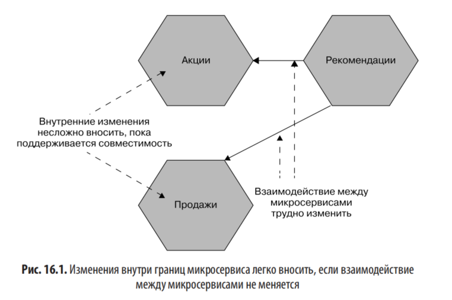
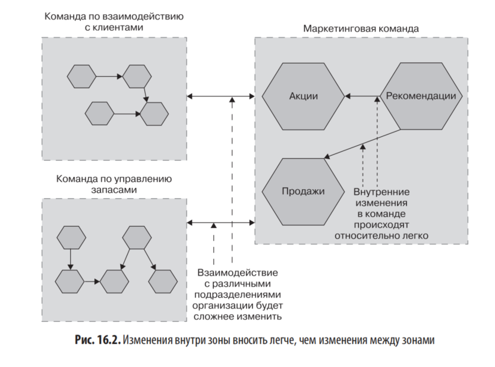
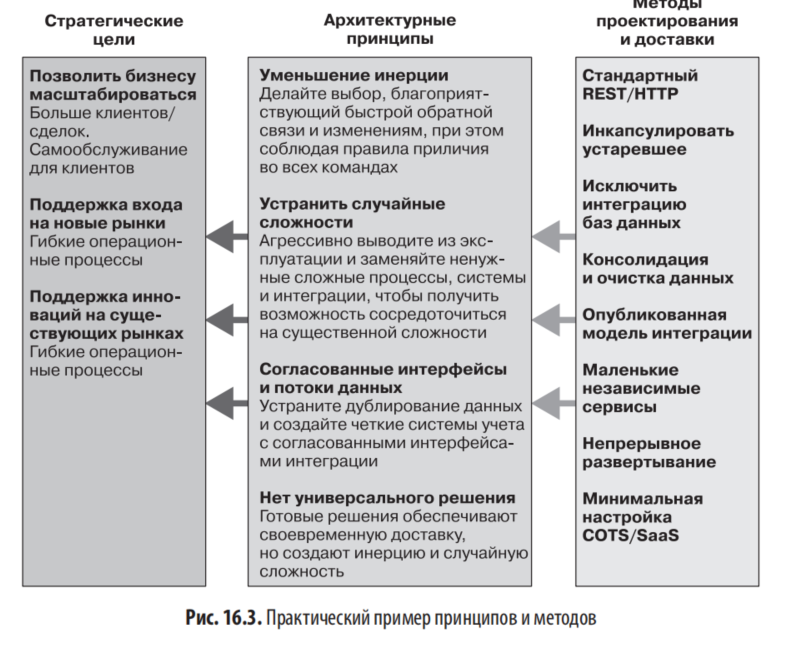
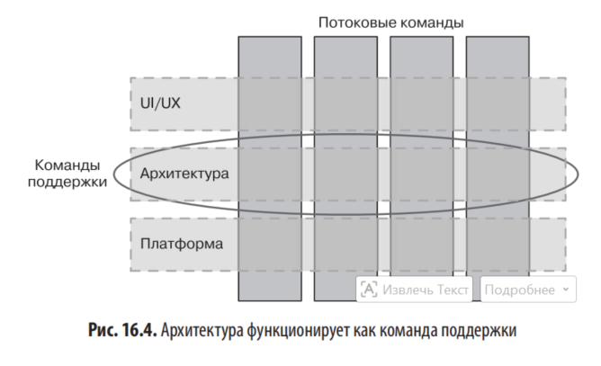

# Глава 16. Эволюционный архитектор

## Роль архитектора и проблемы терминологии

Архитекторы отвечают за то, чтобы система представляла единое техническое видение, помогающее поставлять ПО, необходимое клиентам. Уровни работы архитектора:

- Работа с одной командой (роль архитектора и технического руководителя часто совпадает)
- Определение видения всей программы работы
- Координация работы с несколькими командами по всему миру или целой организацией

Архитекторы оказывают непосредственное влияние на:

- Качество создаваемых систем
- Условия труда коллег
- Способность организации реагировать на изменения

### Проблема заимствования терминов

Отрасль разработки ПО молода — программы создаются всего около 75 лет. Профессия не вписывается в понятные обществу рамки (электрики, сантехники, врачи, инженеры).

**Различия с архитектурой строительной среды:**

- В Великобритании необходимо минимум семилетнее обучение, прежде чем можно называться архитектором
- Архитекторы несут юридическую ответственность за ошибки
- Профессии основаны на знаниях, уходящих корнями в тысячелетия
- Стоимость изменений при проектировании зданий намного выше, чем при разработке ПО
- Удалить бетон не то же самое, что изменить код
- Здания достаточно прочны после постройки, ПО же постоянно меняется

Термин «программная инженерия» был введён в 1960-х годах **Маргарет Гамильтон** как призыв к повышению качества ПО.

## Что такое архитектура ПО

**Определение Ральфа Джонсона:** «Архитектура — это самое важное. Что бы это ни было».

Уточнённое определение Джонсона: «В большинстве успешных программных проектов у опытных разработчиков проекта складывается общее понимание проекта системы. Это общее понимание называется "архитектурой". Оно включает в себя то, как система разделена на компоненты и как они взаимодействуют через интерфейсы».

Архитектура — это **социальная конструкция**, зависит от того, какая часть ПО считается важной в результате достижения группового консенсуса.

**Определение Мартина Фаулера:** «Архитектура — это что-то, что люди воспринимают как трудноизменяемое».

Архитектура ПО — это форма системы. Она возникает по замыслу или случайно. Преданный своему делу архитектор видит всю систему в целом, понимает силы, действующие на неё.

## Делая изменения возможными

**Пример Сигрем-билдинг (архитектор Мис ван дер Роэ):**

- Внешние стены здания неструктурны — окружают стальной наружный каркас
- Основные коммуникации проходят через бетонную сердцевину (лифты, лестницы, вентиляция, водоснабжение, канализация, электрическая система)
- Ни один этаж не получил внутренних перегородок — полная гибкость использования площадей
- Концепция **универсального пространства** — большой однопролетный объем, реконфигурируемый под разные потребности
- Проект здания менялся по мере строительства

## Эволюционное видение для архитектора

Архитекторы ПО должны отказаться от создания идеального конечного продукта и сосредоточиться на помощи в создании основы (фреймворка), в которой системы могут появляться и развиваться.

**Аналогия Эрика Дёрненбурга (Thoughtworks):** архитектор как **градостроитель**, а не как архитектор-строитель.

Градостроитель:

- Изучает множество источников информации
- Оптимизирует планировку города под потребности современных жителей с учётом будущего
- Определяет зоны (промышленные, жилые), позволяющие принимать решения на местном уровне
- Уделяет больше времени тому, как люди и коммунальные службы перемещаются между зонами

## Определение границ системы

Зоны = границы микросервисов или обобщённые группы микросервисов.

Архитекторам нужно меньше беспокоиться о происходящем внутри зоны и больше — о том, что происходит между зонами.

**Пример из текста:** микросервис Рекомендации получает доступ к информации из микросервисов Акции и Продажи. Можно вносить изменения внутри сервисов, пока интерфейсы взаимодействия не меняются.

**Маркетинговая зона** — пример более масштабного уровня, связанного с ответственностью конкретной команды. Внутри зоны можно вносить любые преобразования при сохранении совместимости.

### Технологические стеки и хранилища данных

Возможные проблемы при свободе выбора:

- Сложнее нанимать людей или перемещать их между командами при наличии 10 различных стеков
- Может не хватить опыта для масштабного запуска разных хранилищ данных

**Пример Netflix:** в основном стандартизировал Cassandra как технологию хранения. Ценность инструментария и экспертизы важнее необходимости поддерживать множество платформ.

Принцип: «беспокоиться о том, что происходит между блоками, и быть либеральными в том, что происходит внутри».

## Социальная конструкция

> «Ни один план не выдерживает контакта с врагом». — Гельмут фон Мольтке

**Цитата Грейди Буча:** «В начале процесса создания ПО архитектура программно-интенсивной системы представляет собой изложение видения. В конце архитектура каждой такой системы становится отражением миллиардов маленьких и больших, преднамеренных и случайных проектных решений, принятых на этом пути».

**Пример Comcast:** децентрализация принятия решений с помощью **гильдии архитекторов**, смоделированной по образцу Инженерного совета Интернета (IETF). Джон Мур — главный архитектор ПО Comcast Cable.

## Обитаемость

Термин впервые услышан от **Фрэнка Бушмана**.

**Определение Ричарда Гэбриэла (Patterns of Software):** «Обитаемость — это характеристика исходного кода, позволяющая программистам, приходящим к уже давно кем-то написанному коду, понимать его конструкцию и намерения и изменять его удобно и уверенно».

Рекомендации:

- Архитекторы должны проводить время с командой
- В идеале — писать код с командой
- Для практикующих парное программирование — присоединяться на короткий период
- Участвовать в групповом программировании (mob programming)
- При работе с 4 командами — например, проводить полдня с каждой каждые 4 недели

## Принципиальный подход

> «Правила предназначены для послушания глупцов и руководства мудрецов». — приписывается Дугласу Бейдеру

### Стратегические цели

Указывают, куда движется компания. Определяются на уровне компании или подразделения. Примеры:

- «Расширяйтесь в Юго-Восточную Азию, чтобы открыть новые рынки»
- «Позвольте клиенту достичь как можно больших результатов, используя самообслуживание»

### Принципы

Установленные правила для приведения текущей работы в соответствие с большей целью.

Примеры:

- Команды доставки получают полный контроль на протяжении жизненного цикла ПО
- Вся система должна быть переносимой для развёртывания локально

Рекомендуется **около 10 принципов** — достаточно мало, чтобы запомнить.

**«Двенадцать факторов» Heroku** (http://www.12factor.net) — набор принципов проектирования.

**Ограничение** vs **принцип:** ограничение очень трудно (или невозможно) изменить, принцип — это то, что было решено выбрать.

### Методы

Подробные практические рекомендации по решению задач. Часто зависят от конкретной технологии. Меняются чаще, чем принципы.

Примеры:

- «Все данные лога должны собираться централизованно»
- «HTTP/REST принят стандартным стилем интеграции»

### Сочетание принципов и методов

Принципы одного человека — это методы другого. Для небольшой группы достаточно сочетания принципов и методов. В крупных организациях могут быть разные наборы методов для разных команд при общих принципах (например, .NET и Java команды).

### Пример из жизни

**Эван Боттчер** разработал схему взаимодействия целей, принципов и методов. Методы меняются регулярно, принципы остаются статичными.

## Руководство эволюционной архитектурой

Книга **«Эволюционная архитектура»** (Форд, Парсонс, Куа) описывает **функции приспособленности** для сбора информации об относительной приспособленности архитектуры.

Цитата из книги: «Эволюционные вычисления включают в себя ряд механизмов, позволяющих решению постепенно появляться с помощью небольших изменений в каждом поколении ПО».

Пример функции приспособленности: требование, чтобы ответ от сервиса был получен за 100 миллисекунд или меньше. Функция собирает данные о производительности из тестовой или реальной системы.

Функции приспособленности работают лучше всего в сочетании с тесным сотрудничеством с людьми, создающими систему.

## Архитектура в потоковой организации

Многие обязанности архитектора — это обязанности **поддержки:**

- Чёткое донесение технического видения
- Понимание проблем по мере возникновения
- Помощь в адаптации технического видения

Архитектор относится к команде поддержки. Модель: небольшое количество преданных делу архитекторов (1-2 человека) плюс технологи из каждой группы доставки (как минимум технические руководители).

### Когда не соглашаться с группой

- Обычно следовать групповому решению
- Группа часто мудрее отдельного человека
- Аналогия с обучением ребёнка езде на велосипеде: вмешиваться нужно только когда он направляется в утиный пруд или на проезжую часть
- Отвержение решения команды может подорвать позицию архитектора

### Пример REA (онлайн-компания по продаже недвижимости)

Проблема: владельцы продуктов отвечали за функции, технический долг возлагался на технических руководителей. Решение: владельцы продукта стали отвечать и за технические аспекты ПО (безопасность, производительность).

## Создание команды

Великое ПО исходит от великих людей. В монолитных системах меньше возможностей продвинуться и «завладеть» чем-то. Микросервисы дают несколько автономных кодовых баз — возможность делать людей владельцами отдельных микросервисов.

## Требуемый стандарт

**Цитата Бена Кристенсена (Facebook):** «Это должна быть целостная система, состоящая из множества мелких частей с автономными жизненными циклами, но все они должны быть единым целым».

### Мониторинг

- Общесистемное представление работоспособности, а не специфичное для микросервиса
- Все микросервисы должны одинаково передавать метрики
- Ведение логов в одном месте

### Интерфейсы

- Один стандарт — хорошо, два — не так плохо, 20 — нехорошо
- Учитывать: методы или принципы (HTTP/REST), пагинацию ресурсов, управление версиями конечных точек

### Архитектурная безопасность

- Микросервисы должны защищать себя от нездоровых вызовов
- Использование автоматических выключателей
- Правильное использование кодов ответов (различие между корректным запросом, неверным запросом и сбоем сервера)

## Управление и мощёная дорога

**Определение из COBIT:** «Управление обеспечивает достижение целей предприятия путём оценки потребностей, условий и вариантов заинтересованных сторон, определения направления посредством расстановки приоритетов и принятия решений, а также мониторинга эффективности, соответствия и прогресса согласно утверждённому направлению и целям».

Управление = согласование того, как всё должно быть сделано + обеспечение знания людей об этом + контроль выполнения.

### Примеры

- Письменная документация полезна
- Разработчикам нравится код, который можно запускать и исследовать
- Лучше иметь работающие в системе микросервисы как примеры, а не изолированные «эталоны»

### Адаптированный шаблон микросервиса

**Spring Boot** — успешный пример фреймворка для JVM. Базовый фреймворк лёгкий, можно объединять библиотеки для:

- Проверки работоспособности
- Обслуживания HTTP
- Предоставления метрик

Стандартный шаблон может содержать:

- Библиотеки для обработки автоматических выключателей
- Обработку аутентификации JWT для входящих вызовов
- Соответствующий конвейер сборки

### Осторожность оправданна

- Шаблоны могут подорвать моральный дух и продуктивность при навязывании
- Использование в идеале должно быть **строго опциональным**
- Простота использования для разработчиков — главная направляющая сила
- Опасности совместного использования кода: связанность между микросервисами

**Пример организации:** копирует код шаблона вручную в каждый микросервис, чтобы избежать повышения связанности.

### Мощёная дорога при масштабировании

- **Netflix** стандартизировал JVM
- **Monzo** стандартизировал Go
- Netflix использует **побочные сервисы (sidecar services)**, локально взаимодействующие с JVM
- **Сервисные сети** дают способ снизить нагрузку процесса выполнения общего поведения

## Технический долг

- Существует, когда не можем точно следовать техническому видению
- Иногда возникает из-за изменения видения системы
- Архитектор должен видеть картину в целом и понимать баланс
- Может потребоваться регулярно вести и проверять логи задолженности

## Обработка исключений

- Принципы и методы определяют построение систем
- Решения-исключения стоит фиксировать в логе
- Если исключений много — изменить принцип или метод
- Пример: метод «всегда использовать MySQL» → «Используйте MySQL для большинства требуемых хранилищ, если ожидается большой рост объёмов хранения — используйте Cassandra»

## Резюме — основные обязанности эволюционного архитектора

- **Видение** — обеспечить чётко изложенное техническое видение системы
- **Эмпатия** — понимание влияния решений на клиентов и коллег
- **Сотрудничество** — взаимодействие с максимальным количеством специалистов
- **Адаптивность** — изменение технического видения по требованиям
- **Автономия** — баланс между стандартизацией и самостоятельностью команд
- **Управление** — обеспечение соответствия системы видению

Рекомендуемая литература: «Эволюционная архитектура» и «Лифт архитектора ПО» Грегора Хопа.
