# Глава 2. Как моделировать микросервисы

## 🧩 **Цель главы**
Определить, **как правильно моделировать границы микросервисов**, чтобы обеспечить:
- **Независимость** разработки и развёртывания,
- **Слабую связанность** (low coupling),
- **Сильную связность** (high cohesion),
- Устойчивость к изменениям.

---

## 🔑 **Ключевые принципы проектирования границ микросервисов**

### 1. **Скрытие информации (Information Hiding)**(по Дэвиду Парнасу)****

Скрытие информации — это принцип проектирования, при котором **внутренние детали модуля (или микросервиса) скрываются**, а снаружи доступен только чёткий и минимальный интерфейс.

**Основные преимущества:**

- **Ускоренная разработка**: команды могут работать параллельно и независимо.
- **Понятность**: каждый модуль можно анализировать отдельно.
- **Гибкость**: изменения внутри модуля не затрагивают другие части системы.

Ключевая идея Парнаса: «Связи между модулями — это предположения, которые модули делают друг о друге».

В контексте микросервисов это означает:  
→ чёткий API,  
→ инкапсуляция данных и логики,  
→ возможность независимого развёртывания и эволюции.

Скрытие информации — основа **стабильных и управляемых** микросервисных архитектур.

---

### 2. **Связность (Cohesion)
 «Код, в который вносят изменения как в единое целое, остается единым целым».**
- **Высокая связность** = связанные по смыслу функции находятся в одном микросервисе.
- Цель: при изменении бизнес-логики — трогать **минимум сервисов**.
- Пример: логика обработки заказа должна быть в одном сервисе, а не размазана по нескольким.

> **Правило**: «Код, который меняется вместе, должен быть вместе».
> 

Связность (cohesion) — мера силы взаимосвязанности элементов сервиса; способ и сте- пень, в которой задачи, выполняемые им, связаны друг с другом. — Примеч. пер.

---

### 3. **Связанность (Coupling)( степень взаимосвязи между сервисами)**
- **Низкая связанность** = изменения в одном сервисе **не требуют** изменений в других.
- Опасность: **сильная связанность** ведёт к координации развёртываний → замедление и риски.
> Связанность (coupling) представляет собой степень взаимосвязи между сервисами. При создании систем необходимо стремиться к максимальной независимости сервисов, то есть их связанность должна быть минимальной. — Примеч. пер.

---

## ⚖️ **Взаимосвязь связности и связанности**
- **Закон Константина**: стабильная архитектура = **сильная связность + слабая связанность**.
- Если функциональность размазана — изменения затрагивают много сервисов → **высокая связанность**.
- Чем чётче границы — тем проще развивать систему и команды.
> Связанность и связность тесно переплетены, то есть совпадают в том смысле, что оба понятия описывают взаимосвязь между вещами. Связность применима к отношениям между вещами внутри границы (микросервис в нашем контексте), а связанность представляет отношения между объектами через границу

---

## 📊 **Типы связанности (от слабой к сильной / от хорошей к плохой)**

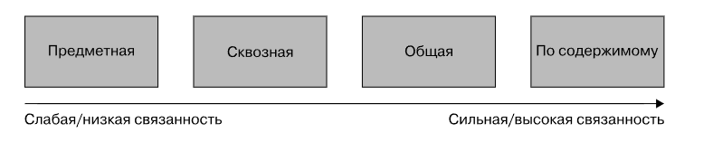

КРАТКО

| Тип | Описание | Риск |
|-----|----------|------|
| **1. Предметная (доменная)** | Сервис A вызывает B, потому что нуждается в его бизнес-функции (например, «Обработчик заказов → Склад»). | Неизбежна, но должна быть **минимальной**. |
| **2. Временная** | Сервисы должны быть **одновременно доступны** (синхронный вызов). | Уязвимость к сбоям; снижает отказоустойчивость. Решение: асинхронность (очереди, события). |
| **3. Сквозная** | Сервис A передаёт данные сервису B, который просто прокидывает их дальше (сервису C). | Изменение в C требует изменения в A и B. **Решение**: делегировать логику B или скрыть детали. |
| **4. Общая** | Несколько сервисов используют **одну БД или файловую систему**. | Изменение схемы ломает все сервисы. Нарушает принцип инкапсуляции. |
| **5. По содержимому (патологическая)** | Один сервис **напрямую пишет в БД другого**. | Полный обход контракта. **Максимально избегать!** |

> **Вывод**: любая форма общей или прямой связанности — признак нарушения границ.

### Типы связанности ПОДРОБНО
### 1. **Предметная (доменная) связанность** — _наименее вредная_

- Один микросервис вызывает другой, потому что ему нужна его **бизнес-функциональность**.
- Пример: «Обработчик заказов» вызывает «Склад» и «Оплата».
- **Неизбежна** в распределённых системах.
- **Рекомендации**:
    - Минимизировать количество зависимостей.
    - Передавать только необходимые данные.
    - Следить, чтобы один сервис не зависел от слишком многих других.

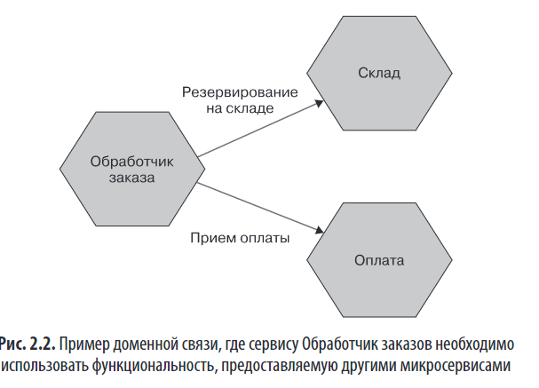

---

### 2. **Временная связанность**

- Один сервис **зависит от одновременной доступности** другого (например, синхронный HTTP-вызов).
- Риски: сбой при недоступности сервиса, блокировки, снижение устойчивости.
- **Решение**: использовать **асинхронное взаимодействие** (очереди, события).

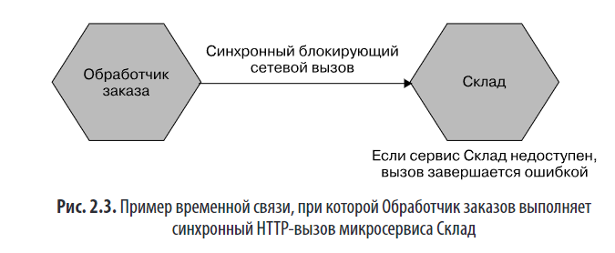

---

### 3. **Сквозная связанность «блуждающая связь»** — _проблемная_

- Сервис A передаёт данные сервису B **только для того, чтобы B передал их сервису C**.
- Проблема: A вынужден знать структуру данных C → изменения в C затрагивают A и B.

  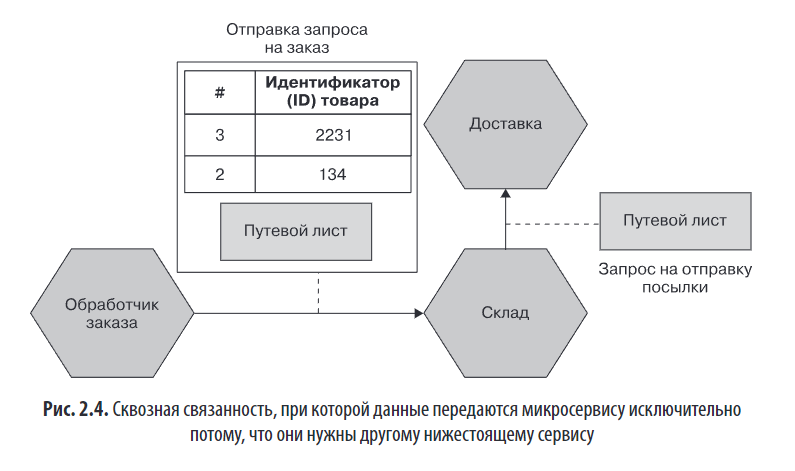

- **Решения**:
    #### 1. **Прямой вызов (обход посредника)**

  

- Обработчик заказов вызывает **Доставку напрямую**.
- **Минусы**:
    - Увеличивает **предметную связанность** (ещё одна зависимость).
    - Логика оркестрации (склад → доставка → обновление склада) переносится в **Обработчик заказов**, усложняя его.
- **Вывод**: решение **ухудшает архитектуру** в данном контексте.

#### 2. **Скрытие деталей реализации**

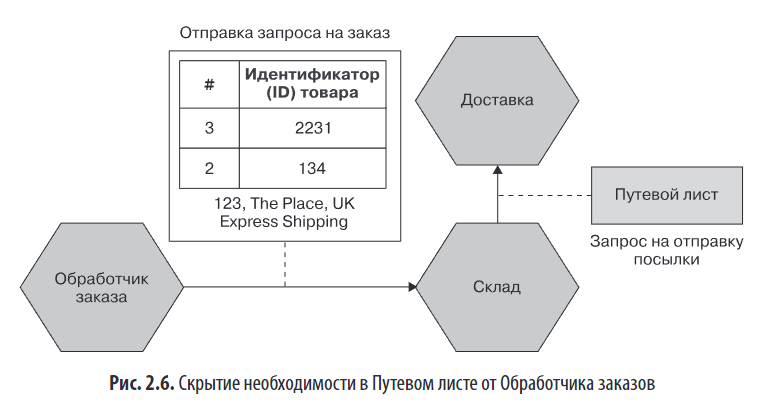

- Обработчик заказов **не отправляет Путевой лист**.
- **Склад** сам формирует его на основе полученных данных (адрес, тип доставки и т.д.).
- **Преимущество**: изменения в контракте Доставки **не затрагивают Обработчик заказов**.
- **Гибкость**: если добавляется новый документ (например, _Таможенная декларация_), Склад может:
    - сгенерировать его сам, или
    - запросить недостающие данные у Обработчика (если они обязательны).
- **Результат**: изменения можно вносить **поэтапно**, а не всем сервисам одновременно.

#### 3. **Передача как неструктурированного объекта**

- Обработчик заказов отправляет Путевой лист **в том виде, в каком он понятен Доставке**.
- **Склад** не анализирует его содержимое — просто **пересылает дальше**.
- **Эффект**: при изменении формата листа **Склад не требует изменений**.
- **Ограничение**: Обработчик и Доставка всё ещё связаны, но **посредник изолирован**.

---

### 4. **Общая связанность**

- Несколько микросервисов **делят общую БД, файловую систему или память**.
- 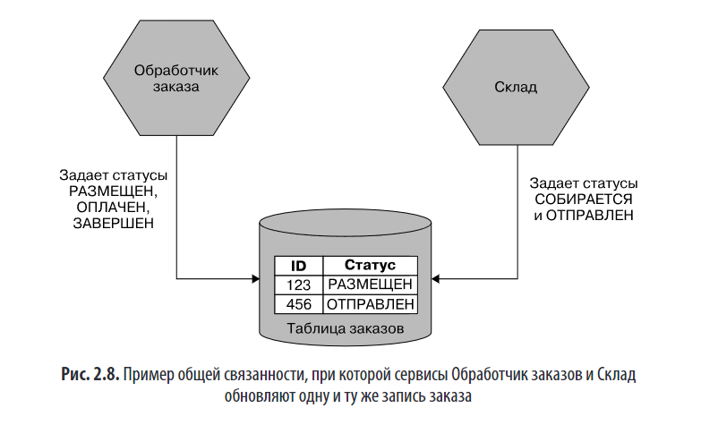
- Риски:
    - Изменение схемы ломает все сервисы.
    - Конкуренция за ресурсы (одна БД — узкое место).
    - Нарушение принципа **инкапсуляции данных**.
    - Логика валидации переходов состояний распределена между сервисами → легко нарушить согласованность.
- **Допустимо только для статических, редко меняющихся справочных данных**.
- Идеальное решение: **один сервис — одна БД**. Если данные нужны другим — предоставлять через API, а не напрямую.
- ### ✅ **Решение: выделить ответственный сервис**

- Создать отдельный микросервис **Заказ**, который:
    - Является **единственным источником истины** для жизненного цикла заказа.
    - Принимает **запросы на изменение статуса** от других сервисов.
    - Сам **валидирует переходы** (например, через конечный автомат) и **отклоняет недопустимые**.

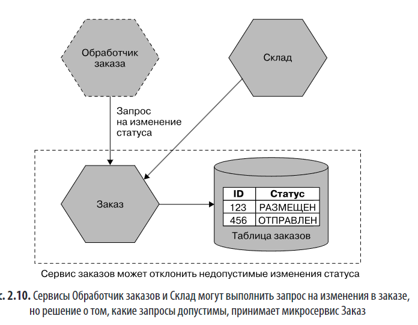

> Это превращает прямую модификацию данных в **управляемое взаимодействие через контракт**.

---

### 5. **Связанность по содержимому** — _патологическая, худшая форма_

**Связанность по содержимому** — это **патологическая (наиболее вредная)** форма связанности, при которой один микросервис **напрямую обращается к внутренним данным другого сервиса**, чаще всего — к его **базе данных**, **минуя публичный API**.

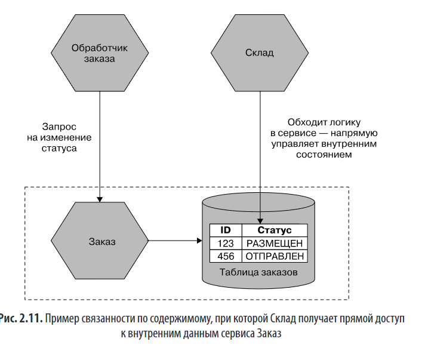

### 🔍 **Суть проблемы**

- Сервис _Склад_ напрямую обновляет таблицу заказов, которую должен управлять сервис _Заказ_.
- Это **обходит логику валидации**, инкапсуляцию и контроль переходов состояний.
- В результате:
    - **Дублируется бизнес-логика** (каждый сервис сам реализует правила),
    - **Нарушается согласованность данных** (возможны недопустимые состояния),
    - **Структура БД становится частью публичного контракта**, хотя должна быть приватной.

---

### ⚠️ **Последствия**

- Невозможно безопасно изменять внутреннюю структуру сервиса _Заказ_, так как другие сервисы зависят от неё.
- **Потеря контроля над интерфейсом**: всё, что лежит в БД, становится «видимым» и «фиксированным».
- **Скрытие информации** — основной принцип модульности — **полностью нарушено**.

---

### ✅ **Решение**

- Запретить прямой доступ к БД другого сервиса.
- Сервис _Склад_ должен взаимодействовать с _Заказом_ **только через его API** (например, отправлять запрос на изменение статуса).
- Сервис _Заказ_ сам **валидирует** запрос и решает, разрешён ли переход.
- Это восстанавливает **инкапсуляцию**, **единый источник истины** и **гибкость изменений**.

---

## 🧠 **Предметно-ориентированное проектирование (DDD) как инструмент моделирования**

### 1. **Единый язык (Ubiquitous Language)**

- **Определение**: Общий язык между разработчиками, аналитиками и экспертами предметной области.
- **Цель**: Устранить разрыв между бизнес-терминами и кодом.
- **Пример неудачи**: В банковской системе все операции (кредиты, покупки, заявки) моделировались как абстрактное «соглашение», что уничтожило семантику предметной области и затруднило коммуникацию.
- **Решение**: Использовать термины бизнеса (например, _«корпоративная ликвидность»_) непосредственно в коде.

### 2. **Агрегат (Aggregate)**

- **Определение**: Группа связанных объектов, управляемых как единое целое с **четкой идентичностью** и **ограниченным жизненным циклом**.
- **Пример**: `Заказ` как агрегат содержит `Позиции`, которые не имеют смысла вне него.
- **Роль в микросервисах**:
    - Агрегат — минимальная **единица владения**.
    - Один микросервис управляет **одним или несколькими** агрегатами.
    - **Не рекомендуется** разделять один агрегат между разными микросервисами.
- **Межсервисные связи**:
    - Использовать **явные ссылки** (например, URI или псевдо-URI вида `soundcloud:tracks:123`) вместо простых ID.
    - Позволяет избежать «скрытых» зависимостей и улучшает читаемость.

      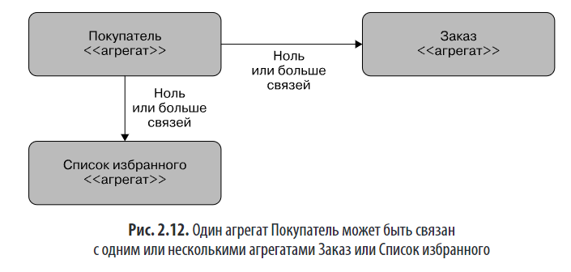
      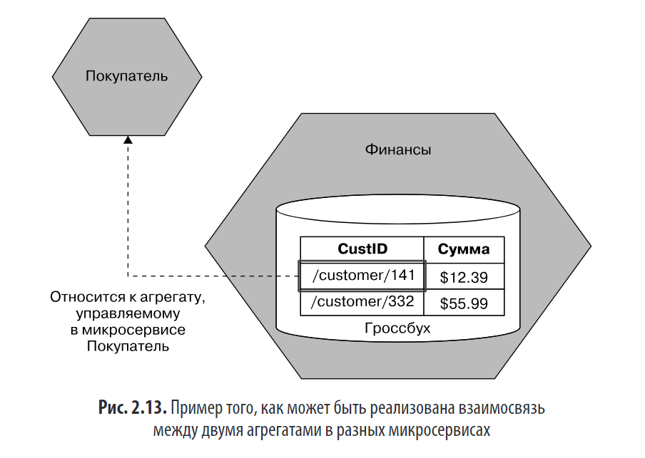

### 3. **Ограниченный контекст (Bounded Context)**

- **Определение**: Четко определённая область, в которой термины и модели имеют **однозначный смысл**.
- **Пример**: У MusicCorp два контекста — **Финансы** и **Склад**. Внутри каждого — своя модель, свои правила.
- **Что скрывается**:
    - Внутренние детали (например, типы погрузчиков на складе) скрыты от других контекстов.
- **Что экспонируется**:
    - Общие понятия (**Единица хранения**, **Покупатель**) могут иметь **разные представления** в разных контекстах (например, _Покупатель_ в финансах vs _Получатель_ на складе).
    - Может быть полезно использовать **разные имена** для одной сущности в разных контекстах, чтобы избежать путаницы.
> **Совет**: микросервис ≈ ограниченный контекст. При росте — разбивайте контекст на подконтексты, но **не разрывайте агрегаты**.

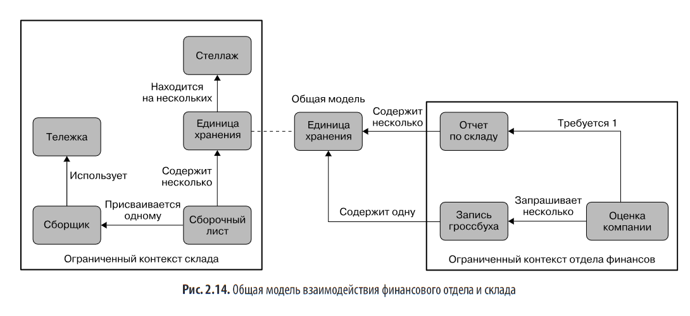

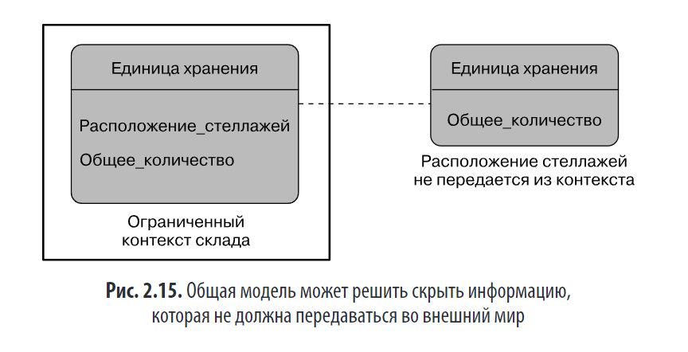

---

## ⚙️ Связь DDD с микросервисами

- **Один микросервис ≈ один или несколько агрегатов внутри одного ограниченного контекста**.
- На ранних этапах лучше начинать с **микросервиса на контекст**, а не на агрегат.
- Позже можно **разделять**, но желательно скрыть это от внешних потребителей через **единый API-шлюз** или фасад.
- Такой подход поддерживает **принцип инкапсуляции** даже на уровне архитектуры.

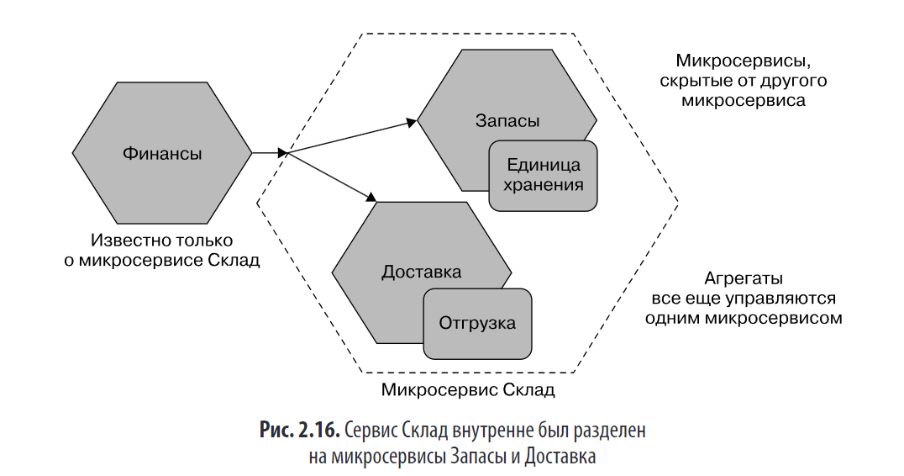

---

## 🎯 Event Storming — метод моделирования предметной области

- **Цель**: Совместная визуализация предметной области с участием технических и нетехнических специалистов.
- **Этапы**:
    1. **События (Domain Events)** → оранжевые стикеры (например, _«Заказ размещен»_).
    2. **Команды (Commands)** → синие стикеры (действия, вызывающие события).
    3. **Агрегаты** → желтые стикеры (существительные, на которые влияют команды/события).
    4. **Группировка в ограниченные контексты**.
- **Преимущества**:
    - Ускоряет выявление ключевых сущностей.
    - Помогает понять взаимосвязи между агрегатами.
    - Работает как для event-driven, так и для request-response систем.

---

## ✅ Почему DDD полезен для микросервисов?

1. **Скрывает сложность** через ограниченные контексты.
2. **Упрощает коммуникацию** благодаря единому языку.
3. **Ускоряет изменения**, так как бизнес-логика локализована в одном месте.
4. **Согласует архитектуру с организационной структурой** (в духе закона Конвея).
5. **Фокусируется на бизнесе**, а не на технологиях.

---

## ⚖️ Альтернативные подходы к определению границ микросервисов

DDD — **не единственный**, но **наиболее устойчивый** подход. Другие факторы:

### 1. **Волатильность**

- Стратегия: выделять часто меняющиеся части в отдельные сервисы.
- **Ограничение**: не помогает при проблемах масштабируемости или безопасности.
- **Критика** бимодальной ИТ-модели («режим 1» vs «режим 2»): упрощает реальность и оправдывает инертность.
- если основной запрос — быстрое время выхода на рынок.

### 2. **Данные**

- **Пример**: PaymentCo разделила систему на _PCI-зону_ (красная) и _обычную_ (зелёная), чтобы ограничить аудит.
- Позволяет соблюдать **GDPR, PCI DSS** и другие регуляторные требования.

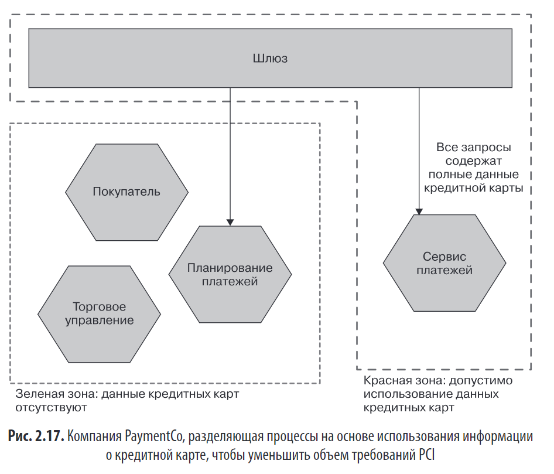

### 3. **Технологии**

- Иногда разные runtime (например, Rust + Python) вынуждают разделять сервисы.
- **Опасность**: не делать границы **только** по технологическому принципу (как в трёхуровневой архитектуре).

### 4. **Организационная структура**

- Закон Конвея: архитектура отражает коммуникации в компании.
- **Плохой пример**: разделение по горизонтали (UI ↔ RPC ↔ БД) между командами → хрупкие, тесно связанные сервисы.
- **Правильный подход**: **вертикальные срезы**, где каждая команда владеет полным стеком одной бизнес-функции.

---

## 🧩 Заключение: гибкость и прагматизм

- Не существует **единственно верного** способа определить границы.
- **DDD — отправная точка**, но важно учитывать:
    - данные,
    - безопасность,
    - организацию,
    - частоту изменений,
    - технологические ограничения.
- **Главный принцип**: **скрытие информации** и **минимизация связности** между сервисами.

> 💡 **Итоговая рекомендация автора**:  
> Начинайте с предметной области и единого языка.  
> Пусть микросервисы отражают **реальную бизнес-логику**, а не артефакты реализации.

---

## ✅ **Итоги**

- Хорошая граница микросервиса = **сильная связность + слабая связанность + скрытие информации**.
- **DDD — мощный инструмент**, но не единственный.
- **Event Storming** помогает совместно с бизнесом найти реальные границы.
- Избегайте:
  - Общих баз данных,
  - Прямого доступа к чужим данным,
  - Технологической или слоистой декомпозиции без бизнес-основы.
- Архитектура должна **поддерживать бизнес-изменения**, а не мешать им.

---

> 📚 **Рекомендуемые книги**:
> - Эрик Эванс — *«Предметно-ориентированное проектирование»* (DDD-база)
> - Вон Вернон — *«Реализация методов DDD»* (практика)
> - Альберто Брандолини — *«Event Storming»*

--- 

Эта глава закладывает **фундамент микросервисного мышления**: не просто "разбить на сервисы", а **разбить правильно — по смыслу, а не по удобству**.
