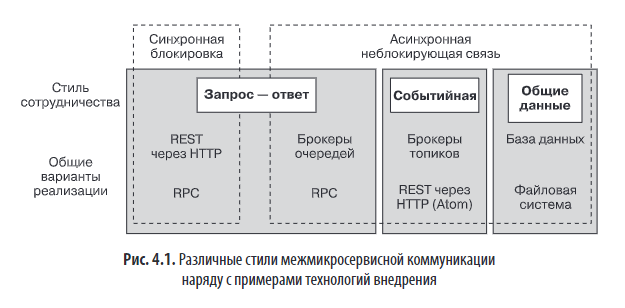
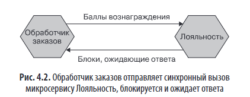
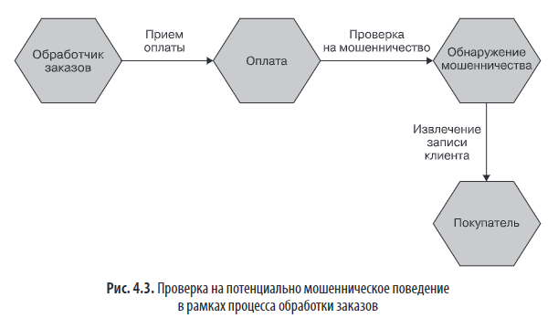
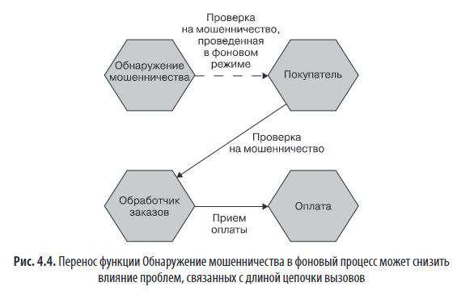
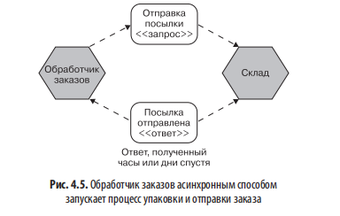
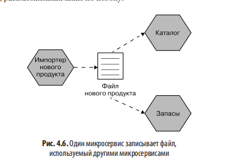
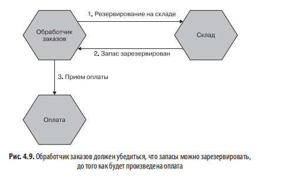
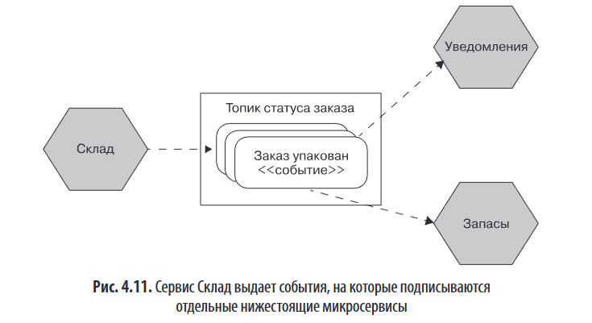
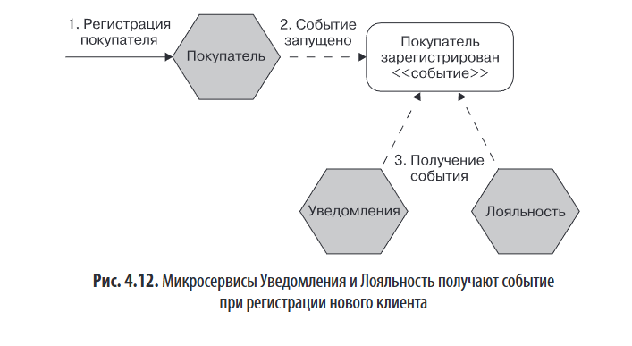
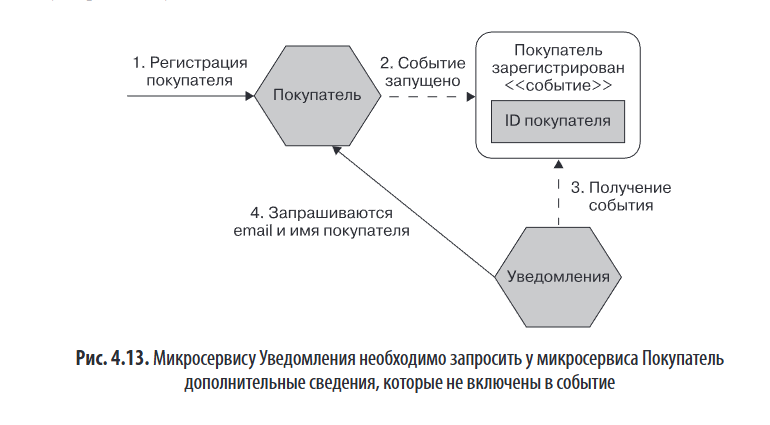

# Глава 4. Стили взаимодействия микросервисов

## 📌 Основная идея главы  
Выбор стиля взаимодействия между микросервисами — ключевой архитектурный вопрос. Глава помогает понять различия между синхронным и асинхронным, «запрос—ответ» и событийным взаимодействием, а также оценить плюсы и минусы каждого подхода.

---

## 🔍 От внутрипроцессного к межпроцессному

### 1. **Производительность**
- Внутрипроцессные вызовы могут быть оптимизированы компилятором (вплоть до встраивания).
- Межпроцессные вызовы требуют сериализации/десериализации, сетевых задержек → выше накладные расходы.
- Это влияет на проектирование API.API, удобный внутри одного процесса, может быть неэффективен между микросервисами (например, из-за множества мелких вызовов). Нужно учитывать размер полезной нагрузки, выбирать эффективные форматы сериализации или даже передавать ссылки на данные вместо самих данных.
- Важно: разработчик должен **осознавать**, что вызов происходит по сети. Слишком прозрачные абстракции, скрывающие сетевую природу взаимодействия, часто приводят к серьёзным проблемам с производительностью.

### 2. **Изменение интерфейсов**
- Внутри процесса изменения легко рефакторятся и разворачиваются атомарно.
- В микросервисах — интерфейсы становятся контрактами между независимыми системами.
- Обратно несовместимые изменения требуют либо одновременного деплоя, либо поэтапной миграции.

### 3. **Обработка ошибок**
- В распределённых системах ошибки **недетерминированы**: тайм-ауты, частичные сбои, сетевые разрывы.
- Важна **семантика ошибок**: например, HTTP-коды:
  - `4xx` — ошибка клиента (не повторять),
  - `5xx` — ошибка сервера (возможно, временная → можно повторить, особенно `503 Service Unavailable`).

> 💡 Разработчик должен осознавать, что вызывает сетевую операцию — нельзя полностью скрывать распределённость за абстракцией.

---

## 🧭 Стили взаимодействия (модель автора)

| Стиль                               | Описание                                                                                               |
| ----------------------------------- | ------------------------------------------------------------------------------------------------------ |
| **Синхронная блокировка**           | Вызывающий сервис ждёт ответа  и блокирует операцию в ожидании ответа. Пример: HTTP REST.              |
| **Асинхронная неблокирующая связь** | Вызов не блокирует отправителя. Подтипы: через общие данные, «запрос—ответ», событийная модель.        |
| **«Запрос — ответ»**                | Инициатор ждёт результата действия. Может быть синхронным или асинхронным.                             |
| **Событийный стиль**                | Сервис публикует факт ("произошло X"), не зная получателей. Получатели реагируют по своему усмотрению. |
| **Общие данные**                    | Сервисы общаются через общее хранилище (файл, БД).                                                     |

Выбор стиля взаимодействия («запрос — ответ» или событийный) — ключевой шаг, определяющий дальнейшие технические решения. «Запрос — ответ» допускает синхронные и асинхронные реализации, событийный стиль — только асинхронный. Окончательный выбор технологии зависит от требований предметной области: задержки, надёжность, безопасность, масштабируемость и др.

#### Смешивание и сочетание

> ⚠️ Архитектура может (и должна) использовать **несколько стилей одновременно** — выбор зависит от контекста. 

---

## 🧱 Подробный разбор шаблонов

### 1. **Синхронная блокировка**

- **Преимущества**: простота, привычность, линейное чтение кода.
- **Недостатки**:
  - **Временная связанность**: оба сервиса должны быть доступны одновременно.
  - **Каскадные сбои**: медленный или недоступный сервис блокирует всю цепочку.
  - **Ограниченная масштабируемость**: длинные цепочки вызовов → исчерпание соединений.
- **Когда использовать**: для простых, коротких операций в критическом пути (например, проверка баланса перед оплатой).

В простых микросервисных архитектурах синхронные блокирующие вызовы допустимы, но становятся проблематичными при длинных цепочках зависимостей. Пример: цепочка «Обработчик заказов → Оплата → Обнаружение мошенничества → Покупатель» — сбой в любом звене или сетевая задержка ломает всю операцию и создаёт нагрузку из-за удерживаемых соединений.

**Решение:** исключить ненужные сервисы из критического пути. Например, вынести проверку на мошенничество в фон — она обновляет данные клиента асинхронно, и результат учитывается при будущих операциях. Это сокращает цепочку, снижает задержку и повышает отказоустойчивость.

Альтернатива — использовать неблокирующее взаимодействие без изменения логики, но пересмотр архитектуры (вынос из критического пути) часто эффективнее.

> ✅ Рекомендация: **сокращать длину цепочек**, выносить необязательные шаги (например, фрод-детекцию) в фон.

---

### 2. **Асинхронная неблокирующая связь**

#### Подстили:

##### a) **Через общие данные**
- Пример: один сервис пишет файл → другие читают.
- **Плюсы**: простота реализации, подходит для legacy-систем, хорошо для больших объёмов данных.
- **Минусы**:
  - Задержка (polling вместо push),
  - Риск связанности через структуру данных,
  - Надёжность зависит от хранилища.
- **Где использовать**: интеграция с устаревшими системами, ETL, batch-обработка.

##### b) **Асинхронный «запрос — ответ»!**
- Реализуется через очереди (например, RabbitMQ): запрос → очередь → обработка → ответ в другую очередь.
- Требуется механизм **корреляции** (например, ID запроса), чтобы связать ответ с исходным действием.
- **Плюсы**: отказоустойчивость, буферизация нагрузки.
- **Минусы**: сложность управления состоянием, риск потери ответа.
- **Где использовать**: длительные операции (например, резервирование на складе, генерация отчёта).

> 💡 Параллельные вызовы (`async/await`, реактивные расширения) могут значительно снизить задержку при множественных запросах.

##### c) **Событийное взаимодействие**

- Сервис публикует **событие** — факт о произошедшем изменении.
- Получатели **подписаны** и реагируют независимо.
- **Плюсы**:
  - Слабая связанность,
  - Масштабируемость,
  - Инверсия ответственности (не "делай X", а "произошло X — решай сам").
- **Минусы**:
  - Сложность отладки и мониторинга,
  - Риск "лавины" обратных вызовов, если события содержат мало данных,
  - Необходимость управления схемой событий как контрактом.

> 📦 **Что включать в событие?**
> - **Минималистичный подход**: только ID → получатель делает обратный вызов (↑ связанность).
> - **Богатое событие**: все необходимые данные → ↓ связанность, но ↑ размер, риск утечки PII.
> - **Рекомендация автора**: включать столько данных, сколько вы готовы отдавать через API.

> ⚠️ **Осторожно!** Асинхронные системы требуют:
> - Очередей недоставленных сообщений (DLQ),
> - Идентификаторов корреляции,
> - Повторных попыток с ограничением,
> - Хорошего логгирования и трассировки.

---

## ⚖️ Сравнение и рекомендации

| Критерий | «Запрос—ответ» | Событийная модель |
|--------|------------------|-------------------|
| Связанность | Выше (знание получателя) | Ниже (публикация без знания подписчиков) |
| Ответ требуется? | Да | Нет |
| Сложность | Ниже | Выше |
| Подходит для | Критического пути, транзакций | Уведомлений, фоновых задач, декомпозиции логики |
| Реализация | HTTP, gRPC | Kafka, RabbitMQ, Atom/RSS |

> ✅ **Гибридный подход — норма**: например, заказ создаётся через синхронный REST, а затем генерирует события для уведомлений, аналитики, лояльности.

---

## 📚 Дополнительно
- Рекомендуется книга: **«Шаблоны интеграции корпоративных приложений»** (Hohpe & Woolf).

---

## 💎 Вывод
Выбор стиля взаимодействия — это **баланс между простотой, надёжностью, связанностью и требованиями бизнеса**.  
Автор склоняется к **асинхронным событийным моделям**, но подчёркивает: **начинайте с простого**, добавляйте сложность только там, где она оправдана.
