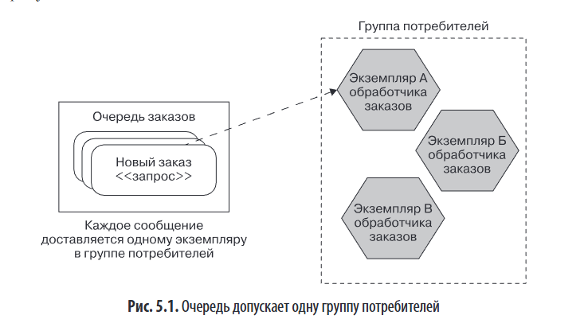
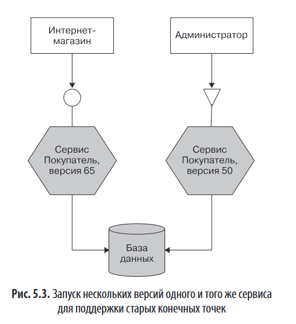
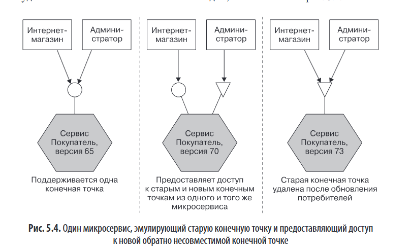
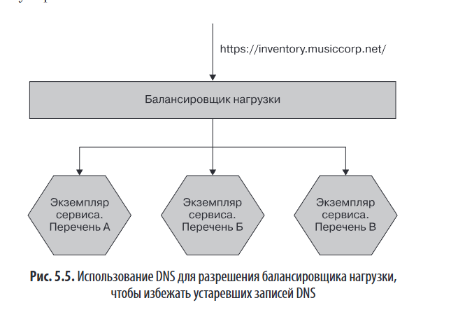
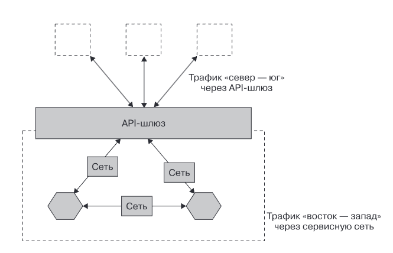
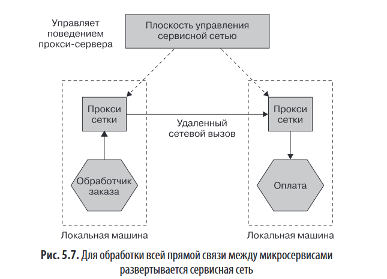

# Глава 5. Реализация коммуникации микросервисов

*Цель главы*: помочь выбрать подходящую технологию взаимодействия между микросервисами на основе архитектурных требований, а не наоборот.

---

### 🔍 Основные принципы выбора технологии

1. **Обратная совместимость**      
   - Изменения в микросервисах не должны ломать клиентов.  
   - Простые операции (например, добавление полей) должны быть безопасными.  
   - Желательна возможность автоматической проверки совместимости до деплоя.

2. **Выразительность интерфейса**  
   - Интерфейс должен быть понятен потребителям.  
   - Рекомендуется использовать **явные схемы** (schema) + документацию.

3. **Технологическая независимость API**  
   - API не должен привязывать к конкретному стеку (например, .NET или JVM).  
   - Это позволяет менять внутреннюю реализацию без влияния на клиентов.

4. **Простота для потребителей**  
   - Клиенты должны легко интегрироваться.  
   - Клиентские библиотеки могут упростить использование, но усиливают связанность → использовать осторожно.

5. **Скрытие внутренней реализации**  
   - Потребители не должны зависеть от внутренней структуры сервиса.  
   - Раскрытие деталей реализации → рост связанности → технический долг.

---

### 🛠️ Технологии коммуникации

#### 1. **Удалённый вызов процедур (RPC)**

- **Описание**: вызов метода на удалённом сервере как локального.
- **Примеры**: SOAP, gRPC, Java RMI, Thrift.
- **IDL** (Interface Definition Language): WSDL (SOAP), Protocol Buffers (gRPC).
### 🔧 Основная идея

Разработчик пишет код так, будто вызывает обычную локальную функцию, но на самом деле:

- запрос уходит по сети,
- выполняется на удалённом сервере,
- результат возвращается обратно.

Это создаёт иллюзию «прозрачности распределённости»: сетевое взаимодействие скрыто за привычным синтаксисом вызова функции.
### 📦 Как работает RPC (упрощённо)

1. **Клиент вызывает функцию** (например, `createCustomer(...)`).
2. **Клиентская заглушка (stub)** сериализует аргументы и отправляет их по сети.
3. **Сервер получает запрос**, десериализует данные.
4. **Серверная заглушка** вызывает реальную функцию на сервере.
5. Результат сериализуется и отправляется обратно клиенту.
6. Клиент получает результат, как если бы функция выполнилась локально.

##### ✅ Преимущества:
- Генерация клиентского кода по схеме.
- Чёткий контракт.
- Высокая производительность (особенно gRPC с HTTP/2).

##### ❌ Проблемы:
- **Технологическая связанность**: например, Java RMI работает только в JVM.
- **Ложное ощущение локальности**: разработчики забывают о сетевых задержках и сбоях.
- **Сложность развёртывания**: при изменении структуры DTO (например, удаление поля `age`) требуется одновременное обновление клиента и сервера.
- **Бинарная сериализация** делает типы «только для расширения» — удалять поля нельзя.

##### 💡 Рекомендации:
- Использовать **gRPC** как современный, производительный и кроссплатформенный RPC.
- Не скрывать сеть полностью — клиенты должны осознавать, что вызов удалённый.
- Использовать **Protolock** для контроля совместимости схем.

---

#### 2. **REST через HTTP**

**REST через HTTP** — это архитектурный стиль взаимодействия между системами, основанный на использовании **HTTP-методов** (`GET`, `POST`, `PUT`, `DELETE` и др.) для работы с **ресурсами**, представленными в виде URI (например, `/customers/123`).

- **Основа**: ресурсы + стандартные HTTP-методы (`GET`, `POST`, `PUT` и т.д.).
- **Гипермедиа (HATEOAS)**: клиент переходит по ссылкам, а не жёстко кодирует URI.

**HATEOAS (Hypermedia as the Engine of Application State)** — это принцип REST, при котором клиент взаимодействует с сервером **не по жёстко заданным URI**, а **через гиперссылки**, возвращаемые самим сервером вместе с данными.

### Кратко:

- Сервер в ответе включает **ссылки на возможные действия** (например, `/artist/theBrakes`, `/instantPurchase/1234`).
- Клиент **не хардкодит адреса**, а следует этим ссылкам, как пользователь — по кнопкам на сайте.
- Это **снижает связанность**: сервер может менять структуру URI без поломки клиента.
- Пример: как на Amazon — даже если место кнопки «Корзина» меняется, вы всё равно её находите и используете.

> 💡 HATEOAS делает API **самонавигируемым**, но требует дисциплины и понимания со стороны разработчиков.

##### ✅ Преимущества:
- Широкая поддержка.
- Экосистема: кэширование (Varnish), балансировка, безопасность, мониторинг.
- Лёгкость интеграции с любыми клиентами (браузеры, мобильные приложения).

##### ❌ Проблемы:
- Нет встроенной генерации клиентского кода (хотя OpenAPI частично решает это).
- Производительность: накладные расходы HTTP/TCP выше, чем у бинарных протоколов.
- HATEOAS редко используется на практике → сложность без ощутимой выгоды.

##### 💡 Рекомендации:
REST — хороший **стандартный выбор** для внешних API и широкой совместимости.
> - очевидным выбором для синхронного интерфейса по модели «запрос — ответ», если вы хотите раз - решить доступ как можно большему количеству клиентов.

- Использовать **OpenAPI/Swagger** для документации и генерации клиентов.
- HATEOAS применять только если есть реальная выгода (редко).

---

#### 3. **GraphQL**

- **Описание**: клиент сам определяет, какие данные ему нужны.
- Используется как агрегатор нескольких микросервисов.

##### ✅ Преимущества:
- Минимизация over-fetching и under-fetching.
- Удобно для мобильных клиентов и UI.

##### ❌ Проблемы:
- **Сложность кэширования**: нет стандартных HTTP-заголовков для CDN.
- **Нагрузка на сервер**: сложные запросы могут «убить» бэкенд (как дорогие SQL-запросы).
- **Плохо подходит для записи**: чаще используют REST для мутаций.
- Может превратить микросервисы в «оболочки БД» → потеря бизнес-логики.

##### 💡 Рекомендации:
- Использовать **по периметру системы** (BFF — Backend for Frontend).
- Не использовать как основной способ внутренней коммуникации между микросервисами.

По сути, GraphQL — это механизм агрегации и фильтрации вызовов, по- этому в контексте микросервисной архитектуры он будет использоваться для агрегирования вызовов нескольких нижестоящих микросервисов. 

---

#### 4. **Брокеры сообщений (асинхронная коммуникация)**

- **Модели**: очередь (точка-точка), топик (публикация-подписка).

## Очереди vs Топики — кратко

| Характеристика | Очередь (Queue) | Топик (Topic) |
|----------------|-----------------|---------------|
| **Модель** | Точка-точка (point-to-point) | Публикация-подписка (pub/sub) |
| **Доставка** | Одно сообщение → **один** потребитель | Одно сообщение → **все** подписанные группы |
| **Группы потребителей** | Одна группа (конкурирующие потребители) | Множество независимых групп |
| **Семантика** | «Кому адресовано» — известно | «Кому адресовано» — скрыто от отправителя |
| **Типичное применение** | Команды, задачи, запрос-ответ | События, широковещательные уведомления |

### Ключевые концепции

- **Группа потребителей** — несколько экземпляров одного сервиса; сообщение получает **только один** экземпляр из группы (балансировка нагрузки).
- **Очередь** = механизм распределения задач между экземплярами сервиса.
- **Топик** = рассылка события всем заинтересованным сервисам (например: «заказ оплачен» → склад + уведомления).
### Простая аналогия
- **Очередь** — как почтовый ящик: письмо забирает один получатель.
- **Топик** — как рассылка по списку: копия письма уходит всем подписчикам.
##### ✅ Преимущества:
- **Гарантированная доставка** (при правильной настройке).
- Поддержка **асинхронных потоков**, событийной архитектуры.
- Kafka: хранение сообщений, масштабируемость, потоковая обработка (KSQL).

## Гарантированная доставка 

**Суть:** Брокер берёт на себя обязательство доставить сообщение получателю, даже если тот временно недоступен. Сообщение хранится до успешной доставки.

### Преимущество перед синхронными вызовами (HTTP)

| Синхронный вызов | Через брокер |
|------------------|--------------|
| Отправитель сам решает: повторить или отказаться при ошибке | Брокер автоматически повторяет доставку |
| Ответственность за надёжность — на отправителе | Ответственность делегирована брокеру |

### Как это работает
- Сообщения **персистятся** (записываются на диск)
- Брокер работает в **кластере** для отказоустойчивости
- Сообщение считается доставленным только после подтверждения от потребителя (ACK)

### Важные нюансы
⚠️ **Гарантии не абсолютны** — зависят от правильной настройки:
- Например, в RabbitMQ кластер требует сети с низкой задержкой, иначе возможна потеря сообщений
- Разные брокеры по-разному трактуют «гарантированную доставку» («at least once», «exactly once»)

✅ **Главное правило:** Перед использованием изучите документацию брокера — как настроить персистентность, кластеризацию и подтверждения доставки.

##### ❌ Проблемы:
- Сложность настройки отказоустойчивости (например, кластер RabbitMQ требует низкой задержки сети).
- «Гарантированная доставка» ≠ «доставка один раз» → возможны дубликаты → нужна **идемпотентность**.
- Порядок сообщений не всегда гарантируется (в Kafka — только внутри партиции).

##### 💡 Рекомендации:
- Использовать Kafka для высоконагруженных систем и потоковой аналитики.
- Всегда проектировать потребителей как **идемпотентные**.
- Для событий использовать **CloudEvents** или **AsyncAPI**.

---

- **Примеры**: RabbitMQ, Kafka, AWS SQS/SNS, ActiveMQ.

Автор выбирает кафку- кафка заебись 

### 🧩 Форматы сериализации

| Тип | Примеры | Особенности |
|-----|--------|-------------|
| **Текстовые** | JSON, XML, Avro (JSON-based) | Читаемы человеком, легко отлаживать. JSON — де-факто стандарт. XML — мощные инструменты (XPath). Avro — схема в payload. |
| **Бинарные** | Protocol Buffers, FlatBuffers, Cap’n Proto | Компактны, быстрые. Protobuf — стандарт для gRPC. |

### Текстовые форматы

Стандартные текстовые форматы, особенно JSON, стали доминировать в REST API благодаря удобству использования в браузерах, простоте и относительной компактности по сравнению с XML. Хотя разница в размере между JSON и XML часто незначительна (особенно при сжатии), JSON воспринимается как более лёгкий. Однако он уступает XML в выразительности и инструментальной поддержке — например, XPath и CSS-селекторы для XML позволяют гибко извлекать данные, тогда как аналог JSONPath менее распространён.

Альтернативой служит Avro, сочетающий JSON-подобную структуру со схемами, которые передаются вместе с данными — это удобно для систем обмена сообщениями. Несмотря на популярность JSON, у XML остаются нишевые преимущества, особенно в сложных интеграциях и микросервисных архитектурах.

### Двоичные форматы

Двоичные форматы сериализации (например, **Protocol Buffers**, **Cap’n Proto**, **FlatBuffers**, **Simple Binary Encoding**) позволяют значительно сократить размер полезной нагрузки и ускорить чтение/запись по сравнению с текстовыми форматами вроде JSON или XML. Они особенно актуальны для высоконагруженных или **низколатентных распределённых систем**.

Однако большинству приложений такие оптимизации **не критичны** — зачастую эффективнее просто **уменьшить объём передаваемых данных** или **сократить число вызовов**. Если же требуется максимальная производительность, стоит провести **собственное сравнение** форматов под конкретные сценарии использования, так как заявленные преимущества не всегда отражают реальные условия.

> **Автор предпочитает XML** за инструменты (XPath), но признаёт доминирование JSON.

---

### 📐 Схемы и управление изменениями

#### Почему нужны схемы?
- Делают контракт явным.
- Позволяют автоматически проверять **структурные разрывы** (удаление полей, изменение типов).
- Снижают нагрузку на тестирование.

#### Типы разрывов (нарушений контракта):

- **Структурные**  
    Изменение формата данных (например, удаление полей, добавление обязательных параметров), из‑за которого клиенты не могут корректно вызвать API.  
    → Обнаруживаются с помощью **схем**.
- **Семантические**  
    Изменение поведения при сохранении той же структуры (например, `calculate(a, b)` теперь умножает числа вместо сложения).  
    → Выявляются **только тестами**, так как нарушают логические ожидания потребителей.

### Стоит ли использовать схемы
Использование **явных схем** при взаимодействии микросервисов позволяет легко выявлять **структурные разрывы контракта** до релиза, освобождая тестирование для поиска более сложных — **семантических** — проблем.

Даже если схемы отсутствуют, **неявная схема всё равно существует** — она закодирована в ожиданиях потребителя и логике обработки данных. Явное её оформление делает контракт прозрачным, упрощает коммуникацию между командами и служит страховкой от ошибок.

Аргументы против схем («они требуют усилий и не дают выгоды») автор считает следствием недостатка инструментов или воображения. Вместе с тем, в **монолитных или тесно связанных системах**, где клиент и сервер управляются одной командой, отказ от схем может быть оправдан — за счёт низкой стоимости изменений.
#### Инструменты сравнения схем:
- **Protolock** (Protobuf)
- **openapi-diff** (OpenAPI)
- **json-schema-diff-validator**
- **Confluent Schema Registry** (Avro, Protobuf, JSON Schema)

---

### Избегание критических изменений
### 🔑 Основная цель

Не ломать взаимодействие между микросервисами при изменении их контрактов. 
### 🛡️ Как избежать критических (некомпетентных) изменений

1. **Наращивание изменений**  
    Добавляйте новые поля/методы — **не удаляйте старые**. Это сохраняет обратную совместимость.
2. **Устойчивое считывание (Tolerant Reader)**  
    Потребитель должен игнорировать ненужные или неизвестные поля.  
    → Используйте гибкие методы извлечения данных (например, XPath для XML).  
    → Следуйте **закону Постела**: _«Будь консервативен в том, что отправляешь, и либерален в том, что принимаешь»_.
3. **Правильные технологии**
    - **Protocol Buffers**: номера полей позволяют безопасно добавлять новые.
    - **Avro**: схема передаётся вместе с данными → клиенты могут адаптироваться.
    - **REST + HATEOAS**: гипермедиа-ссылки позволяют менять URL без ломки клиентов.
4. **Явный интерфейс**  
    Чётко определяйте контракт:
    - Для REST — через **OpenAPI**, **JSON Schema**.
    - Для событий — через **AsyncAPI** или **CloudEvents** (CNCF-стандарт).  
        → Явная схема делает границы ответственности понятными и защищает от случайных нарушений.
5. **Своевременное выявление разрывов**
    - Используйте инструменты сравнения схем:

        - `protolock` — для Protocol Buffers
        - `json-schema-diff-validator` — для JSON Schema
        - `openapi-diff` (Azure) — для OpenAPI

    - Интегрируйте проверки в CI: **если обнаружено несовместимое изменение — сборка падает**.
    - Можно использовать **Confluent Schema Registry** даже вне Kafka.

### 🔄 Управление критическими изменениями

#### Стратегии:

1. **Поэтапное развертывание**  
   - Обновление клиента и сервера одновременно.  
   - ❌ Нарушает принцип независимого деплоя → риск «распределённого монолита».

1. **Сосуществование версий сервиса** (минуты часы) 
   - Запуск v1 и v2 параллельно.  
   - ❌ Удваивает сложность: багфиксы, данные, маршрутизация.  
   - Допустимо краткосрочно (канареечный релиз).

   

1. **Эмуляция старого интерфейса в одном сервисе** ✅  
   - Один сервис предоставляет `/v1/customer` и `/v2/customer`.  
   - Позволяет постепенно мигрировать клиентов.  
   - После отключения старой версии — чистка кода.  
   - Пример: Netflix поддерживает старые API для устаревших ТВ-приставок.

#### Рекомендации:
- Использовать **паттерн «расширение и сжатие»**: сначала добавить новый интерфейс, потом удалить старый.
- Версионирование в URI (`/v1/...`) или заголовках — оба варианта допустимы.
- Для RPC — разные пространства имён (`v1.createCustomer`).

Предпочтительный подход — **эмуляция старых конечных точек** вместо долгосрочного сосуществования нескольких версий микросервиса.

Кратковременное совместное развертывание (например, при канареечных или сине-зелёных релизах) допустимо, особенно если команда контролирует и сервис, и его потребителей. Однако **частое использование поэтапных релизов** ведёт к **распределённому монолиту** и потере независимости развёртывания.

Эмуляция считается проще и безопаснее, чем поддержка нескольких версий в продакшене.

---

### 🤝 Общественный договор и отслеживание

- Заранее договориться с клиентами:
  - Как будут вноситься изменения?
  - Сколько времени даётся на миграцию?
  - Кто отвечает за обновление клиента?

- **Отслеживать использование**:
  - Чтобы контролировать миграцию с устаревшего интерфейса, **отслеживайте его использование**:

- Логируйте все обращения к конечным точкам.
- Требуйте от клиентов передавать **идентификатор** (например, в заголовке `User-Agent` или через API-ключ в шлюзе).

Это позволяет точно знать, кто ещё использует старый интерфейс, и **оперативно взаимодействовать** с командами для завершения миграции.

- **Крайние меры**:
  - Через год — просто отключить старый API (если предупреждали).
  - «Замедление» устаревших клиентских библиотек (как в одном кейсе).

---

### 📦 DRY и повторное использование кода

Принцип **DRY** (Don’t Repeat Yourself) призывает избегать дублирования **логики и знаний**, а не просто кода — это упрощает поддержку и снижает риск ошибок.

Однако в **микросервисной архитектуре** совместное использование кода (например, через общие библиотеки) может создать **скрытые зависимости**, нарушить независимость развёртывания и привести к **распределённому монолиту**.

Поэтому повторное использование кода между микросервисами требует осторожности: иногда **умеренное дублирование** предпочтительнее жёсткой связанности.

- **Общие библиотеки** 

Совместное использование кода через **общие библиотеки между микросервисами** может создать **скрытую связанность**, особенно если библиотека содержит **доменные сущности или контракты**. Это нарушает независимость развёртывания: изменение библиотеки требует обновления всех сервисов и даже очистки очередей от старых сообщений.

Безопасно использовать общие библиотеки только для **внутренней, невидимой логики** (например, логирование, трассировка).

Важно помнить: **разные микросервисы будут использовать разные версии библиотеки**, и это нормально — главное допускать такое сосуществование.

Если же **обязательно нужно обновлять логику везде одновременно**, лучше вынести её в **отдельный микросервис**, а не в общую библиотеку.

- **Клиентские библиотеки**:

**Клиентские библиотеки** могут упростить использование сервиса и избежать дублирования, но несут риски:

- **Утечка серверной логики** в клиент → нарушение инкапсуляции и связность.
- **Снижение технологической гибкости**, если клиенты обязаны использовать конкретную библиотеку.
- **Зависимость при обновлениях**: если библиотека меняется вместе с сервером, клиенты теряют возможность независимого развёртывания.

**Рекомендации**:

- Разделяйте **транспортный код** (HTTP, сериализация) и **логику взаимодействия с сервисом**.
- Идеальный пример — **AWS SDK**: базовый API остаётся открытым, а SDK создаются сообществом или отдельной командой, а не разработчиками самого API.
- **Клиенты должны сами решать**, когда обновлять библиотеку — это критично для независимости микросервисов.

В Netflix клиентские библиотеки используются не столько для дедупликации, сколько для реализации **надёжности, отказоустойчивости и масштабируемости** — но даже там со временем возникли проблемы с связанностью.

---

### 🔎 Обнаружение сервисов (Service Discovery)

**Обнаружение сервисов** — механизм, позволяющий находить и использовать микросервисы в динамичной среде. Состоит из двух частей:

1. **Регистрация**: сервис сообщает «Я здесь!».
2. **Поиск**: потребитель находит нужный сервис.

Особенно важно в условиях частого масштабирования и перезапуска экземпляров. Существует множество подходов к реализации — от простых реестров до продвинутых систем с поддержкой отказоустойчивости и балансировки.

| Метод | Плюсы | Минусы |
|------|------|--------|
| **DNS** | Простота, универсальность | TTL → кэширование, медленное обновление. Лучше использовать с балансировщиком. |
| **ZooKeeper** | Надёжность, иерархия | Устаревает, сложен. |
| **Consul** | HTTP API, DNS-сервер (SRV), health checks, consul-template | Отличный выбор для гибридных сред. |
| **etcd + Kubernetes** | Встроен в K8s, метки → динамическое объединение подов в сервисы | Только для K8s. |
| **Собственная система** (например, через AWS Tags) | Гибкость | Не стоит изобретать — уже есть готовые решения. |

### Система доменных имен (DNS)
**DNS** — простой и универсальный способ обнаружения микросервисов: связывает имя (например, `accounts.musiccorp.net`) с IP-адресом или балансировщиком нагрузки.

**Плюсы**:

- Широко поддерживается.
- Удобен для организации сред через соглашения (например, `accounts-dev.musiccorp.net`).

**Минусы**:

- **TTL** вызывает задержку при обновлении записей — клиенты могут использовать устаревший IP.
- Кэширование DNS (включая JVM) усугубляет проблему.
- Неудобен для динамических сред с «одноразовыми» хостами.

**Рекомендация**:

- Для одного экземпляра — можно ссылаться напрямую через DNS.
- Для нескольких экземпляров — пусть DNS указывает на **балансировщик нагрузки**, а он уже управляет реальными хостами.
- В сложных сценариях лучше использовать специализированные системы обнаружения сервисов (например, **Consul**).

### Динамические реестры сервисов

Из-за **недостатков DNS** (медленное обновление из-за TTL, плохая поддержка динамических сред) появились **специализированные системы обнаружения сервисов**.

Большинство из них используют **центральный реестр**, куда сервисы **регистрируются** и откуда клиенты их **находят**.

Такие системы часто предоставляют **дополнительные функции** — балансировку, health-checks, метаданные — что может быть как полезно, так и излишне в зависимости от контекста.

- ### ZooKeeper 

**ZooKeeper** — распределённая система координации, изначально созданная для Hadoop. Может использоваться для **обнаружения сервисов**, хранения конфигураций, синхронизации, выбора лидера и др.

Особенности:

- Требует кластер из **минимум 3 узлов** для отказоустойчивости.
- Предоставляет **иерархическое дерево данных** с возможностью **наблюдения за изменениями** (watchers).
- Подходит для хранения расположения сервисов и динамических настроек (например, уровней логирования).

**Однако**: существуют **более эффективные и современные решения** для обнаружения сервисов (например, Consul, Eureka), поэтому **ZooKeeper сегодня не рекомендуется использовать именно для этой задачи**.

- Consul

**Consul** — это система обнаружения сервисов и управления конфигурацией, которая превосходит ZooKeeper в удобстве использования.

Ключевые особенности:

- Встроенный **DNS-сервер** с поддержкой **SRV-записей** (IP + порт), что позволяет интегрироваться с существующими DNS-совместимыми системами без изменений.
- **HTTP/RESTful API** для регистрации сервисов, проверок работоспособности, работы с KV-хранилищем.
- Встроенные **health-checks** — упрощают мониторинг и исключение неработающих узлов.
- Интеграция с инструментами:
    - **consul-template** — динамически обновляет конфигурационные файлы (например, для HAProxy).
    - **Vault** — для безопасного управления секретами.

Consul особенно полезен в динамичных средах и легко встраивается в разные технологические стеки.

- etcd и Kubernetes

**Kubernetes** использует встроенное хранилище **etcd** (аналог Consul) для управления конфигурацией и **обнаружения сервисов**.

Сервисы в Kubernetes автоматически находят подходящие **поды** по меткам, а трафик распределяется между ними — это избавляет от необходимости внешних инструментов вроде Consul.

**Если вся инфраструктура работает на Kubernetes**, встроенных средств обычно достаточно.  
**В гибридных средах** (Kubernetes + другие платформы) удобнее использовать **единый внешний инструмент обнаружения сервисов**, такой как Consul.

- Разверните собственную систему

Развертывание **собственной системы обнаружения сервисов** (например, через теги AWS и кастомные CLI/UI-инструменты) возможно и работало в прошлом, но сегодня **не рекомендуется**:

- Современные инструменты (Consul, Kubernetes, etcd и др.) уже решают эти задачи надёжнее и эффективнее.
- Самописные решения — это **изобретение колеса**, часто с худшими характеристиками и поддержкой.

Лучше использовать **зрелые, специализированные системы**, чем реализовывать своё.

---

### 🌐 API-шлюзы vs Сервисные сети

| Аспект      | **API-шлюз**                             | **Сервисная сеть**                                |
| ----------- | ---------------------------------------- | ------------------------------------------------- |
| Назначение  | Трафик **«север–юг»** (внешний → внутрь) | Трафик **«восток–запад»** (между микросервисами)  |
| Функции     | Auth, rate limiting, logging, API-keys   | mTLS, discovery, retries, tracing, load balancing |
| Реализация  | Ambassador, Kong, AWS API Gateway        | Istio, Linkerd, Consul Connect                    |
| Архитектура | Централизованный прокси                  | Sidecar-прокси (Envoy) рядом с каждым сервисом    |
|             |                                          |                                                   |
|             |                                          |                                                   |

- **API-шлюз** работает на границе системы (**трафик «север — юг»**) и управляет **внешними запросами** к микросервисам (аутентификация, маршрутизация, ограничение скорости и т.д.).
- **Сервисная сеть** обрабатывает **внутренние взаимодействия между микросервисами** (**трафик «восток — запад»**) — обеспечивает обнаружение сервисов, отказоустойчивость, мониторинг и т.п.

Оба подхода позволяют вынести общую логику (например, логирование, retry) **из кода микросервисов** в инфраструктурный слой, но эта логика должна быть **универсальной**, а не зависеть от конкретного сервиса.

⚠️ Некоторые API-шлюзы пытаются выполнять функции сервисных сетей, что может привести к путанице и неправильному использованию.

### 🎯 API-шлюзы

API-шлюз — это **обратный прокси**, ориентированный на **трафик «север — юг»**: он маршрутизирует внешние запросы (от веб- и мобильных клиентов) к внутренним микросервисам.

### ✅ Типичные функции

- Маршрутизация запросов
- Аутентификация (например, API-ключи)
- Ограничение скорости (rate limiting)
- Логирование
- Порталы для разработчиков (для внешних потребителей)

### ⚠️ Исторический контекст и мисселинг

В эпоху «API-экономики» шлюзы продвигались как инструмент монетизации, но реальная потребность оказалась скромнее. Многие компании купили **перегруженные функциями продукты**, которые им не нужны.

> Большинство организаций используют шлюзы **не для сторонних разработчиков**, а для собственных клиентов (веб/мобильные приложения).

### 🧭 Где использовать

- В **Kubernetes**: можно использовать легковесные шлюзы (например, **Ambassador**) или стандартные ingress-контроллеры.
- Для **внешних API с множеством сторонних клиентов** — более функциональные шлюзы оправданы.
- Допустимо использовать **несколько шлюзов** под разные задачи — это улучшает разделение ответственности.

### ❌ Чего избегать

1. **Агрегация вызовов в шлюзе**  
    — Превращает шлюз в часть бизнес-логики.  
    — Лучше использовать:
    - **GraphQL**
    - **BFF (Backend For Frontend)**
    - **Саги** (для оркестрации бизнес-процессов)
2. **Переписывание протоколов** (например, «SOAP → REST»)  
    — REST — это архитектурный стиль, а не просто HTTP + JSON.  
    — Такая логика **не должна жить в промежуточном слое**.
3. **Использование шлюза для внутреннего трафика («восток — запад»)**  
    — Добавляет задержку и сетевые hops.  
    — Для этого предназначены **сервисные сети** (service meshes), а не API-шлюзы.

### 🔑 Главный принцип

> **Каналы должны быть «глупыми», конечные точки — «умными»**.

Бизнес-логика должна оставаться в микросервисах, где её легко тестировать, изменять и развертывать независимо. Шлюз — лишь инфраструктурный посредник.

## 🎯 **Сервисная сеть**

**Сервисная сеть** (service mesh) выносит общую логику взаимодействия между микросервисами (**трафик «восток — запад»**) из кода в инфраструктурный слой, обеспечивая:

- единообразие,
- независимость от языка программирования,
- упрощённое управление.

---

### ✅ Общие функции

- mTLS (двустороннее шифрование),
- балансировка нагрузки,
- обнаружение сервисов,
- идентификаторы корреляции (для трассировки),
- тайм-ауты, retry, circuit breaking.

Эти функции **универсальны**, не содержат бизнес-логики и подходят для централизованного управления.

---

### ⚙️ Как работает

- Каждый микросервис сопровождается **локальным прокси** (sidecar), например **Envoy**.
- Прокси перехватывает весь входящий/исходящий трафик — вызов остаётся локальным на хосте → минимизация задержек и сетевых рисков.
- В **Kubernetes** sidecar размещается в том же **поде**, что и сервис.
- **Плоскость управления** (control plane) координирует поведение всех прокси: распространяет сертификаты, настраивает политики и собирает телеметрию.

---

### 🔑 Преимущества перед общими библиотеками

- Не нужно обновлять и пересобирать каждый микросервис при изменении сетевого поведения.
- Поддержка **полиглотных систем** (разные языки).
- Централизованное, но гибкое управление (например, тайм-ауты можно задать per-service через конфигурацию).

---

### ❓ Это не «умный канал»?

Нет — если в сервисную сеть помещается **только универсальная, неспецифичная логика** (без бизнес-правил). Это соответствует принципу: **каналы — глупые, конечные точки — умные**.

---

### ⚠️ Когда использовать?

- **Подходит**, если:
    - У вас **много микросервисов**,
    - Используется **Kubernetes**,
    - Есть микросервисы на **разных языках**,
    - Требуется стандартизация надёжности и безопасности.
- **Не стоит внедрять**, если:
    - Микросервисов мало (например, <5),
    - Нет Kubernetes,
    - Команда не готова к дополнительной сложности.

---

### 🛠️ Популярные реализации

- **Istio** (Google, основан на Envoy, мощный, но сложный),
- **Linkerd** (CNCF-выпускник, легковесный, написан на Rust, проще в эксплуатации).

> Обе платформы прошли через серьёзную эволюцию. Сегодня экосистема стала **значительно стабильнее**, чем в первые годы.

---

### 💡 Итог

Сервисная сеть — мощный инструмент для **масштабируемых, полиглотных микросервисных систем**, но требует зрелой инфраструктуры и осознанного внедрения. Не решение «по умолчанию», а **стратегический выбор**.

---

### 📖 Документирование и реестры сервисов

При переходе на микросервисы возникает множество API, и важно понимать:

- **что делает каждый сервис**,
- **как его использовать**.

Без актуальной документации потребители не смогут эффективно взаимодействовать с сервисами.

---

### 📐 Явные схемы — основа документации

- Схемы (например, **OpenAPI** для REST, **AsyncAPI** или **CloudEvents** для событий) описывают **структуру**, но **не поведение**.
- Без схем документация становится объёмной и легко устаревает.
- Схемы помогают **автоматизировать** и **проверять актуальность** документации.

> OpenAPI особенно популярен: поддерживается множеством инструментов для генерации порталов документации.

---

### 🌐 Порталы и автоматизация

- Инструменты вроде **Ambassador Developer Portal** могут **автоматически обнаруживать** и отображать OpenAPI-документацию новых сервисов.
- Для событий:
    - **AsyncAPI** — аналог OpenAPI для асинхронных интерфейсов.
    - **CloudEvents** (CNCF-проект) — стандартизированный формат событий с поддержкой JSON и Protocol Buffers.

---

### 🧠 Самоописывающаяся система

Идея — собрать информацию о сервисах **программно**, а не вручную:

- Использовать данные из:
    - систем обнаружения (**Consul**, **etcd**),
    - health-check’ов,
    - трассировки (идентификаторы корреляции),
    - схем (OpenAPI, CloudEvents),
    - мониторинга.

Это позволяет создать **динамический, актуальный реестр сервисов** — не просто вики-страницу, а живую систему.

---

### 🗂️ Реестры сервисов в практике

- **Financial Times → Biz Ops**:
    - Централизованный каталог + метрики «здоровья» сервиса.
    - Оценивает, насколько команда следует best practices (документация, health-check’и и т.д.).
    - Построен на графовой БД → гибкость модели данных.
- **Spotify → Backstage** (open source):
    - Универсальный **сервисный каталог**.
    - Поддерживает плагины: от создания сервисов до интеграции с Kubernetes.
- **Ambassador → Service Catalog**:
    - Узкоспециализированный каталог для Kubernetes.

---

### 💡 Рекомендации

1. Начните с простого: статическая страница или вики с минимальными данными из системы.
2. Постепенно добавляйте **автоматически собираемую информацию**.
3. Стремитесь к **самоописывающейся системе** — это ключ к управлению сложностью в крупных микросервисных архитектурах.

> Документация — не опциональный артефакт, а **критическая часть контракта** между сервисами.

---

### ✅ Итоговые рекомендации

1. **Выбирайте технологию под задачу**, а не наоборот.
2. **Используйте схемы** — они экономят время и предотвращают ошибки.
3. **Стремитесь к обратной совместимости** — это основа независимого деплоя.
4. При несовместимых изменениях — **эмулируйте старый интерфейс**, не форсируйте миграцию.
5. **Не усложняйте шлюзы и сервисные сети** — не превращайте их в ESB.
6. **Делайте систему самоописывающейся** — через реестры, OpenAPI, мониторинг.
7. **Помните о людях** — документация, контакты, понятные контракты.
