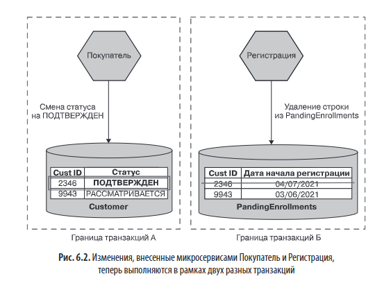
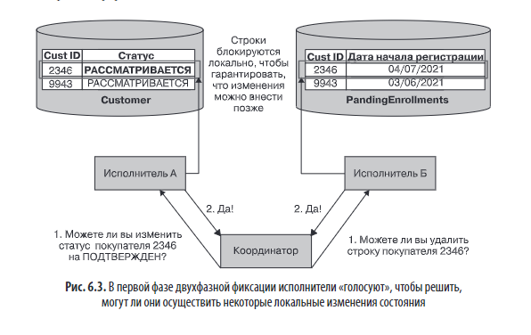
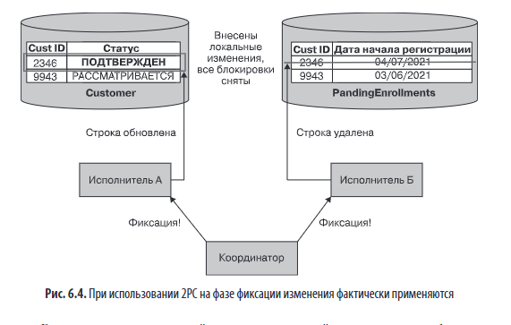
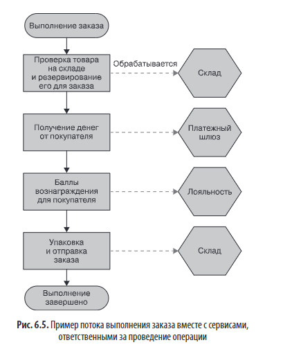
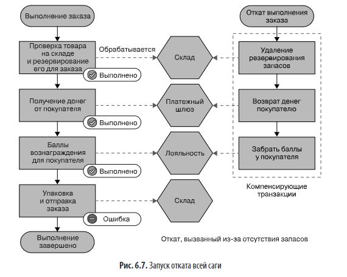
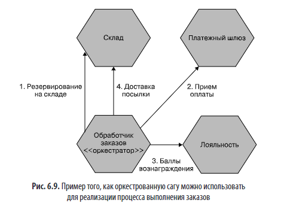
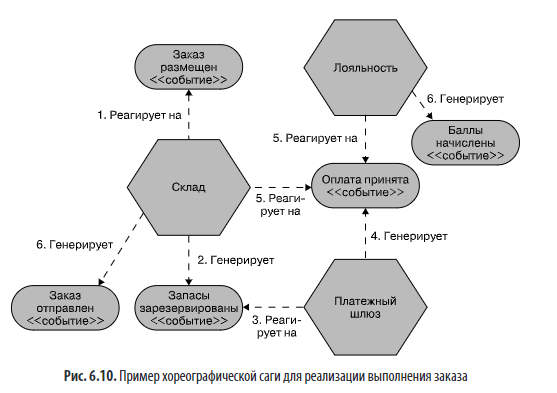

# Глава 6. Рабочий поток

## 📌 **Основная проблема**
Когда бизнес-процесс требует взаимодействия нескольких микросервисов, возникает сложность в обеспечении **согласованности данных** и **надежного выполнения операций**. Традиционные транзакции базы данных (ACID) не работают напрямую в распределённой среде.

---

## 🔐 **Транзакции ACID: кратко**
- **Атомарность**: все действия либо выполняются, либо откатываются.
- **Согласованность**: данные остаются в валидном состоянии.
- **Изоляция**: параллельные транзакции не мешают друг другу.
- **Устойчивость**: после коммита изменения сохраняются даже при сбое.

> В микросервисах каждый сервис управляет своей БД → транзакции ограничены одним сервисом → **глобальная атомарность теряется**.

Каждый микросервис сохраняет ACID-гарантии внутри своей базы данных. Но когда одна бизнес-операция требует изменений в нескольких сервисах (например, подтвердить клиента + удалить из очереди), эти изменения выполняются в **независимых транзакциях**. В результате:

- ✅ Обе транзакции завершились — данные согласованы.
- ⚠️ Первая прошла, вторая упала — возникает несогласованное состояние (клиент подтверждён, но запись в очереди осталась).

Таким образом, **локальная атомарность сохраняется, глобальная — нет**. Это ключевая проблема микросервисов: отказ от распределённых транзакций (вроде 2PC) в пользу отказоустойчивости и независимости развёртывания приводит к необходимости реализовывать согласованность на уровне приложения (например, через паттерн **Сага**).

---

## ⚠️ **Распределённые транзакции и двухфазная фиксация (2PC)**

### 🔹 Что такое 2PC?

**Двухфазная фиксация (Two-Phase Commit, 2PC)** — это протокол координации распределённых транзакций, обеспечивающий согласованность изменений в нескольких узлах системы.

### 🔹 Две фазы алгоритма

1. **Фаза подготовки (Prepare phase)**
    - Координатор опрашивает всех участников (исполнителей): _«Готовы ли вы применить изменения?»_
    - Участники проверяют возможность выполнения операции (например, соблюдение ограничений).
    - Если участник **согласен**, он **гарантирует** будущее применение изменений и **блокирует** соответствующие ресурсы.
    - Если хотя бы один участник отказывается — транзакция откатывается.
2. **Фаза фиксации (Commit phase)**
    - Если все участники ответили «да», координатор отправляет команду **фиксации**.
    - Участники **применяют изменения** и **снимают блокировки**.
    - Если кто-то не ответил или произошёл сбой — отправляется команда **отката**.

### ❌ **Проблемы 2PC**:
### 🔹 Проблемы и ограничения 2PC

- **Нарушение изоляции (ACID)**:  
    Изменения применяются **не атомарно** — между моментами фиксации у разных участников может быть задержка → система временно находится в **неконсистентном состоянии**.
- **Блокировки**:  
    Участники **удерживают блокировки** на время всей транзакции → риск **взаимоблокировок** и **снижения производительности**.
- **Сложность при сбоях**:
    - Если участник «подготовился», но не ответил на фиксацию — система может зависнуть.
    - Некоторые сценарии требуют **ручного вмешательства**.
- **Масштабируемость**:  
    Чем больше участников и выше сетевая задержка — тем **больше вероятность проблем** и **дольше время блокировки**.
- **Подходит только для коротких транзакций**:  
    Длительные операции делают систему **медленной и уязвимой**.

**Итог:** 2PC технически обеспечивает атомарность, но ценой производительности, надёжности и независимости сервисов. Поэтому в микросервисных архитектурах его обычно **избегают**, предпочитая паттерны вроде **Саги** с компенсирующими транзакциями и событийной согласованностью

> **Вывод автора**: **избегать распределённых транзакций** в микросервисах.

---

Распределённые транзакции (вроде 2PC) **не подходят для микросервисов** — они сложны, медленны, нарушают независимость сервисов и создают риски отказов.

**Что делать вместо них:**

1. **Не разделять то, что требует строгой атомарности.** Оставьте такие данные в одном сервисе/БД.
2. **Откладывайте декомпозицию**, если не можете обеспечить согласованность без распределённых транзакций.
3. **Используйте паттерн «Сага»** — для долгих, распределённых операций с компенсирующими действиями вместо блокировок.

> Распределённые транзакции внутри одной логической БД (как в Google Spanner) — другое дело, но это требует экстремально сложной инфраструктуры (атомные часы, глобальная синхронизация), недоступной в обычных системах.

**Вывод:**  
👉 **Просто скажите «нет» распределённым транзакциям между микросервисами.**

---

## 🧩 **Альтернатива: шаблон «Сага»**

Сага — это **паттерн координации долгоживущих операций** в распределённых системах (например, микросервисах), **без блокировок** и **без распределённых транзакций**.

- Разбивает одну логическую операцию (например, оформление заказа) на **последовательность локальных ACID-транзакций**, каждая из которых выполняется в отдельном сервисе.
- Каждый шаг — независим, кратковременен и не блокирует ресурсы надолго.
- **Атомарности в классическом ACID-смысле нет**: если один шаг падает, откат делается **компенсирующими действиями** (например, «отменить резервирование»), а не автоматической откатной транзакцией.
- Позволяет явно моделировать бизнес-процесс и его возможные сценарии (включая ошибки).

### 🔁 **Режимы восстановления при сбое**:

Сага — распределённый паттерн, поэтому **откат не работает как в ACID-транзакциях**. Вместо этого применяются два режима восстановления:

### 1. **Обратное восстановление (откат через компенсирующие транзакции)**

- Используется при **бизнес-сбоях** (например, товара нет на складе, недостаточно средств у клиента).
- Для каждого выполненного шага создаётся **компенсирующая транзакция**, которая _семантически отменяет_ действие (например, возврат денег, отправка письма об отмене).
- **Важно**: нельзя «стереть» прошлое (письмо уже отправлено), но можно _логически нейтрализовать_ последствия.
- Компенсации — это **новые транзакции**, а не откаты до точки фиксации.

---

### 2. **Прямое восстановление (повтор с места сбоя)**

- Система **сохраняет состояние** саги и позволяет **повторить шаг** позже.
- Требует **идемпотентности** операций (повтор не должен ломать данные).

> ⚠️ **Сага не предназначена для обработки технических сбоев сама по себе** — они должны решаться на уровне инфраструктуры (повторы, очереди, resilience-паттерны). Сага фокусируется на **бизнес-логике**.

---

### Смешанный подход

- В реальных системах часто **комбинируют оба режима**:
    - Откат при критичных бизнес-ошибках (например, отмена заказа).
    - Повтор при временных проблемах (например, не удалось отправить посылку сегодня — попробуем завтра).

---

### Оптимизация: упорядочение шагов

- Перенос **рискованных или обратимых действий** на более поздние этапы **уменьшает необходимость компенсаций**.
- Пример: начислять баллы лояльности **только после отправки заказа**, а не сразу после оплаты.

---

## 🎭 **Стили реализации саг**

Существует два основных стиля реализации саг — **оркестрованные** и **хореографические**. Оба решают одну задачу (координация распределённых действий), но по-разному.

### 1. **Оркестрованные саги**

- Есть **центральный оркестратор** (например, `OrderHandler`).
- Он **управляет последовательностью шагов** и **реагирует на ошибки**.
- Использует **запрос-ответ** взаимодействие.

✅ **Плюсы**:
- Чёткая, явная модель бизнес-процесса.
- Простота отладки и мониторинга.
- Легко обучать новых разработчиков.

❌ **Минусы**:
- Высокая связанность (оркестратор знает все сервисы).
- Риск превращения сервисов в «глупые» исполнители.

- **Рекомендации**:
    - Использовать разные оркестраторы для разных процессов (например, `RefundService`, `OrderService`).
    - Избегать универсальных BPM-инструментов, если они не дружат с разработчиками.
    - Для тех, кто всё же хочет BPM — рассмотреть **Camunda** или **Zeebe** (developer-friendly, open source).

---

### 2. **Хореографические саги**

Хореографическая сага направлена на распределение ответственности за функ-
ционирование саги между несколькими взаимодействующими сервисами. Если 
оркестрация — это командно-контрольный подход, то хореографические саги 
представляют собой архитектуру «доверяй, но проверяй»

- Нет центрального контроллера. Сервисы взаимодействуют через **события**.
    - Каждый сервис реагирует на события, в которых заинтересован.
    - Пример: `OrderPlaced` → `InventoryService` резервирует товар → публикует `InventoryReserved`.
- **Преимущества**:
    - **Слабая связанность**: сервисы не знают друг о друге.
    - Лучше масштабируется между командами.
    - Естественно поддерживает параллелизм (несколько сервисов реагируют на одно событие).
- **Недостатки**:
    - Сложно понять **общую картину процесса** (логика размазана).
    - Труднее отслеживать состояние саги и выполнять компенсации.
- **Решение**:
    - Использовать **идентификатор корреляции** (correlation ID) во всех событиях.
    - Можно создать отдельный сервис для агрегации событий и визуализации состояния заказа.

---

## 🔄 **Смешанный подход**
- Можно комбинировать оркестрацию и хореографию.
- Например: внешний процесс — хореографический, внутренний (в рамках одного домена) — оркестрованный.

> Главное — **сохранять возможность отслеживать состояние** саги и выполнять компенсацию при необходимости.

---

### 4. **Выбор стиля: практические рекомендации**

|Сценарий|Рекомендуемый стиль|
|---|---|
|Одна команда владеет всем процессом|**Оркестрация** — проще управлять|
|Несколько независимых команд|**Хореография** — меньше зависимостей|
|Команда не знакома с событиями|**Оркестрация** — ниже порог входа|
|Масштабируемость и слабая связанность важны|**Хореография**|

### Итог

- **Оркестрация** = контроль, простота, но выше связанность.
- **Хореография** = гибкость, слабая связанность, но сложнее отслеживать.
- **Обязательно** использовать **correlation ID** и **логирование/трассировку** в любом случае.
- Не бойтесь **смешивать стили**, если это упрощает архитектуру.

---

## 📊 **Сравнение: Саги vs Распределённые транзакции**

| Критерий                     | Распределённые транзакции (2PC) | Саги |
|-----------------------------|-------------------------------|------|
| Атомарность                 | Да (строгая)                  | Нет (семантическая) |
| Блокировки                  | Долгие, системные             | Минимальные |
| Масштабируемость            | Плохая                        | Хорошая |
| Отказоустойчивость          | Низкая                        | Высокая |
| Явное моделирование бизнес-логики | Нет                          | Да |
| Подходит для долгих процессов | Нет                          | Да |

> **Вывод**: Саги — **предпочтительный путь** для микросервисов.

---
