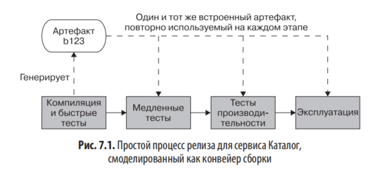
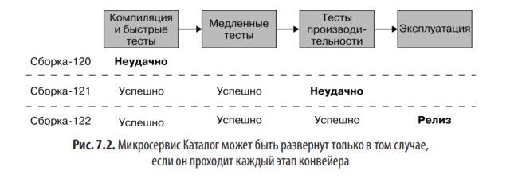
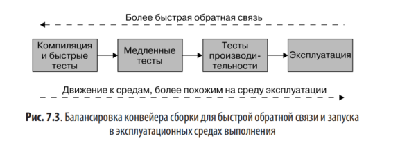
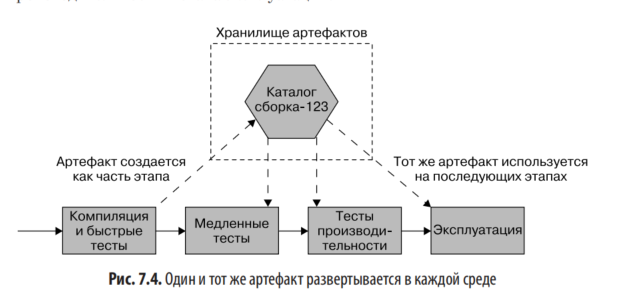
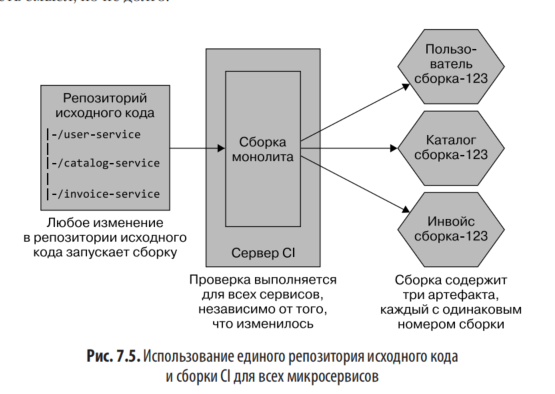
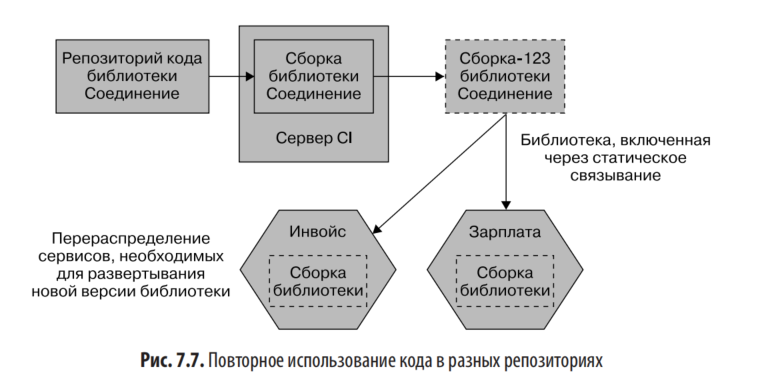
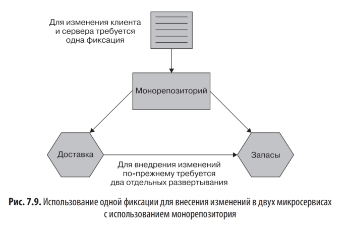
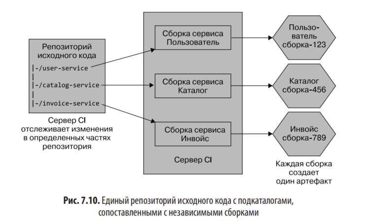
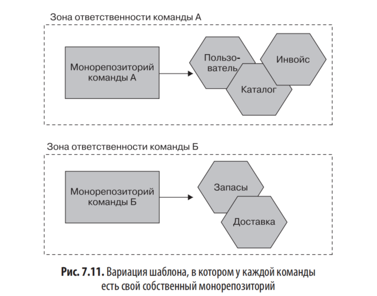

# Глава 7. Сборка

## 📌 Основная цель главы  
Рассмотреть, как процессы сборки, интеграции и управления исходным кодом должны адаптироваться при переходе к архитектуре микросервисов.

---

## 🔁 Непрерывная интеграция (CI)

### 🔹 Что такое CI?

**Непрерывная интеграция (Continuous Integration, CI)** — практика частой (ежедневно или чаще) интеграции кода в общую ветку с автоматической проверкой корректности изменений.

---

### 🔹 Как работает CI?

- При **фиксации кода** в репозиторий CI-сервер:
    - извлекает изменения,
    - **собирает проект**,
    - **запускает тесты** и статический анализ,
    - **создаёт артефакты** (например, Docker-образы, бинарники).

---

### 🔹 Ключевые принципы

- **Артефакты создаются один раз** и **повторно используются** на всех этапах (тестирование, staging, production).
- Артефакты хранятся в **специальном хранилище**, чтобы обеспечить **трассируемость**: от кода → к артефакту → к развертыванию.
- Весь процесс **автоматизирован** и **воспроизводим**.

---

### 🔹 Преимущества CI

- Быстрая обратная связь по качеству кода.
- Раннее выявление ошибок интеграции.
- Автоматизация сборки и тестирования.
- Поддержка подхода **«инфраструктура как код»**.
- Повышенная прозрачность и надёжность релизов.

---

> 💡 CI особенно важна в микросервисных архитектурах, где каждый сервис должен быть независимо собираемым, тестируемым и развертываемым.

### 🔹 CI ≠ просто использование Jenkins/CircleCI/Travis

Наличие CI-инструмента **не означает**, что вы действительно практикуете непрерывную интеграцию.
### 🔹 Три ключевых признака настоящей CI (по Джезу Хамблу):

1. **Интеграция в основную ветку ≥ 1 раз в день**  
    → Частая фиксация предотвращает «интеграционный ад».
2. **Наличие автоматических тестов**  
    → Без тестов CI проверяет только сборку, но не корректность поведения.
3. **Приоритетное исправление «красной» сборки**  
    → При сбое команда **останавливает всё**, кроме исправления — чтобы не усугублять проблемы.

### 🔹 Вывод

Настоящая CI — это **дисциплина и культура**, а не просто настроенный пайплайн.  
Без соблюдения этих принципов вы получаете **ложное чувство безопасности**, а не гибкость и надёжность.

---

## 🌿 Модели ветвления

### Проблема ветвления функций (feature branches)
- Долгоживущие ветки задерживают интеграцию → сложные слияния.
- Увеличивают рис к конфликтов и снижают скорость доставки.

### Альтернатива: **Магистральная разработка (Trunk-Based Development, TBD)**
- Все разработчики работают в одной основной ветке.
- Незавершённые функции скрываются с помощью **флагов функций (feature flags)**.
- Поддерживает частую интеграцию и упрощает релизы.

### Рекомендации:
- Избегайте долгоживущих веток.
- Используйте короткие ветки (< 1 дня).
- Отчёт DORA/Puppet (2016, 2019): высокопроизводительные команды используют TBD и минимизируют количество активных веток.

> 💡 - GitFlow и длинные PR уместны в open source (из-за ненадёжных контрибьюторов).В сплочённых командах с доверием — **TBD эффективнее**.

---

## 🏗️ Конвейеры сборки и непрерывная доставка (CD)

### 🔹 Конвейер сборки (Build Pipeline)

- **Цель**: ускорить обратную связь и повысить эффективность тестирования.
- **Принцип**: разбиение сборки на **этапы (стадии)**:
    - Сначала — **быстрые и дешёвые проверки** (unit-тесты, линтеры).
    - Затем — **медленные и дорогие** (интеграционные, E2E, нагрузочные).
- **Один артефакт** создаётся один раз и **используется на всех этапах** → гарантирует, что тестируется именно то, что будет развёрнуто.

### 🔹 Непрерывная доставка (Continuous Delivery, CD)

- Каждая фиксация в main — **потенциальный релиз**.
- Весь путь от коммита до production **моделируется как конвейер** с автоматизированными и/или ручными этапами.
- Инструменты CI/CD **визуализируют прогресс** и статус каждой версии.
- Если сборка **проваливает этап** — она не проходит дальше; команда получает чёткую обратную связь.

> ✅ Цель CD: **в любой момент можно безопасно развернуть** последнюю успешную версию.
>
> 

### 🔹 Непрерывное развертывание (Continuous Deployment, CDP)

- **Автоматическое развёртывание в production** каждой успешной сборки — **без ручного подтверждения**.  
- Это **расширение CD**: если CD — «можно развернуть», то CDP — «развёртываем всегда».

|Подход|Ручное решение о релизе?|Автоматизация|
|---|---|---|
|**Continuous Delivery**|Да|Высокая, но с возможностью ручного контроля|
|**Continuous Deployment**|Нет|Полная — всё, что прошло проверки, летит в прод|

---

### 🔹 Практические выводы

- CD помогает **выявлять узкие места** в процессе релиза.
- По мере автоматизации (тестов, развёртываний) команды **естественно приближаются к CDP**.
- Даже без CDP, внедрение CD **значительно повышает надёжность и скорость доставки**.

---

### 🔹 Требования к инструментам CI/CD

- Идеальный инструмент **изначально поддерживает непрерывную доставку (CD)**, а не просто CI.
- Должен позволять:
    - **Определять и визуализировать конвейеры**,
    - Моделировать **как автоматизированные, так и ручные этапы** (например, UAT),
    - Отслеживать **прогресс версии ПО** от коммита до production.

> ❌ «Доработка» CI-инструментов под CD часто приводит к сложным и неудобным системам.

---

### 🔹 Баланс между скоростью и точностью сред

- **Ранние этапы**: быстрая обратная связь → менее точные, но быстрые среды (например, локальная разработка).
- **Поздние этапы**: максимальное приближение к production → медленнее и дороже.
- **Компромисс**: баланс между **скоростью обнаружения ошибок** и **достоверностью тестирования**.

> 💡 Некоторые виды тестирования (дымовое, параллельное) всё чаще проводятся **непосредственно в production**.

---

### 🔹 Создание артефактов: ключевые принципы

1. **Создавайте артефакт один раз**  
    → избегайте повторной сборки на разных этапах.
2. **Используйте один и тот же артефакт во всех средах**  
    → гарантирует, что тестируется **то же самое**, что и развёртывается.
3. **Храните артефакт в централизованном хранилище**  
    → например, Artifactory, Nexus, Docker Registry.
4. **Конфигурация — вне артефакта**  
    → параметры (логирование, URL, ключи) должны задаваться **внешне** (через env-переменные, config-файлы, секреты).

> ✅ Пример: уровень логов `DEBUG` в тестах → `INFO` в production — **без пересборки артефакта**.

---

## 🗂️ Сопоставление исходного кода и сборок 
с микросервисами: три подхода

### 1. **Один гигантский репозиторий + одна гигантская сборка**
- Все микросервисы в одном репозитории.
- Любая фиксация → пересборка **всех** сервисов. - Создаются **все артефакты сразу**, даже если изменён только один сервис.
- ❌ Минусы:
  - Долгая сборка даже при мелком изменении.
  - Неясно, какие сервисы нужно деплоить.
  - Одна ошибка — блокировка всего релиза(**других команд**).
  - Нарушает **независимость развёртывания**
- ✅ Может работать **только на старте проекта** (одна команда, несколько сервисов).

  

> Это **наихудшая форма монорепозитория** для микросервисов.  
> Подходит **только на старте**, но быстро становится **узким местом**.  
> Предпочтительнее использовать **многосборочные монорепозитории** или **поли-репозитории**..

---

### 2. **Мультирепозиторий (one repo per service)**

- Каждый микросервис — в своём репозитории.
- Чёткое соответствие: репозиторий ↔ сборка ↔ артефакт ↔ владелец.
- ✅ Плюсы:
  - Простая **независимая доставка**..
  - Чёткая **граница ответственности**.
  - Удобно при **разных командах** на разных сервисах.
- ❌ Минусы:
  1. **Сложность синхронных изменений**:  
    → Изменение API одного сервиса и адаптация другого требуют **двух отдельных коммитов** → нет атомарности.
2. **Повторное использование кода**:  
    → Требует выноса общего кода в **библиотеки** → усложняет управление версиями и обновлениями.

    

- Общий код → выносится в **библиотеку**.
- Сервисы подключают её как **зависимость по версии**.
- Обновление требует **пересборки всех зависимых сервисов**.
- **Нет атомарного релиза** → нарушает независимость.
- Сложно отслеживать использование и удалять старые версии.

> ⚠️ Избегайте общих библиотек без крайней необходимости — дублирование часто безопаснее связанности

3. **ИЛИ ВСЕТО ОТДЕЛЬНЫХ БИБЛИОТЕК ПОВТОРЫ КОДА Риск высокой связанности**:  
    → Если часто меняете несколько сервисов вместе — **границы сервисов, вероятно, неправильные**.
4. **Управление множеством репозиториев**:  
    → Требует инструментов (IDE, скрипты) для удобной работы.
### 🔹 Когда использовать

- Хорошо подходит для **небольших и больших команд**, если сервисы **по-настоящему независимы**.
- **Не подходит**, если изменения **часто затрагивают несколько сервисов** — это сигнал пересмотреть архитектуру.

> 💡 **Ключевой принцип**: _Затруднённость межсервисных изменений — не баг, а фича: она помогает выявить плохие границы.

---

### 3. **Монорепозиторий (monorepo)**
### 🔹 Суть подхода

- Весь код (нескольких микросервисов или проектов) хранится в **одном репозитории**.
- Позволяет делать **атомарные коммиты** сразу в нескольких сервисах.
- Упрощает **повторное использование кода** на уровне исходных файлов (без упаковки в библиотеки).

> 🌟 Примеры: Google, Microsoft, Facebook, Uber — используют монорепо в огромных масштабах.

---

### 🔹 Преимущества

- **Атомарные изменения** между сервисами (например, API + клиент за один коммит).
- **Простое переиспользование кода** без версионирования зависимостей.
- **Повышенная видимость** чужого кода → лучше понимание системы.

---

### 🔹 Недостатки и сложности

- **Сборка усложняется**: нужно определять, какие подкаталоги затронуты → запускать только нужные CI-пайплайны.
- При изменении общего кода может потребоваться **пересборка всех зависимых сервисов**.
- **Не даёт атомарного развёртывания** → всё ещё нужно соблюдать принцип независимости релизов.
- Требует **сложных инструментов** при масштабировании (Bazel, VFS for Git и др.).

---

### 🔹 Владение кодом

- В малых командах (≤20 человек) — подходит **коллективное владение**.
- В крупных — требуется **явное распределение ответственности**:
    - Используются механизмы вроде файла `CODEOWNERS` (GitHub), чтобы назначать владельцев за папки/файлы.
    - Поддерживается модель **слабого владения**: можно править чужой код, но с ревью от владельца.

---

### 🔹 Инструментарий

- **Google**: Bazel (сборка), Piper (VCS), собственные IDE-плагины.
- **Microsoft**: VFS for Git — виртуальная ФС файловая система для работы с гигантскими репозиториями.
- **JavaScript-экосистема**: Lerna — управление множеством пакетов в одном репозитории.

> ⚠️ Эти решения требуют **огромных инвестиций** — не нужны большинству компаний.

---

### 🔹 Варианты применения

1. **Глобальный монорепо** (Google): все команды в одном репозитории.
2. **Командный монорепо**: у каждой команды — свой монорепо со своими сервисами.  
    → Баланс между удобством и масштабируемостью.

---

### 🔹 Когда использовать?

- ✅ **Маленькие команды** (до ~20 разработчиков): просто, эффективно.
- ✅ **Очень крупные компании** с ресурсами на инструменты и поддержку.
- ❌ **Средние компании**: часто сталкиваются с «болевыми точками» без возможности их решить.

> 💡 **Главное**: не копируйте Google без понимания контекста. Монорепо — это **решение под конкретные проблемы**, а не универсальный best practice.

---

## 🧩 Повторное использование кода

- В мультирепозитории — через **версионированные библиотеки**.
- В монорепозитории — можно напрямую ссылаться на файлы.
- ⚠️ Главное: **не нарушать принцип независимого развёртывания**.
- Совместное использование кода → **повышенная связанность** → потенциальная угроза микросервисной архитектуре.

---

**Какой подход использовал бы я?:**

- Автор **предпочитает мультирепозитории** (по одному репозиторию на микросервис).
- **Монорепозиторий** даёт удобство (атомарные коммиты, лёгкое переиспользование кода), но **создаёт проблемы при масштабировании**:  
    → сложности с владением,  
    → зависимость от специализированных инструментов,  
    → трудный переход на другой подход в будущем.
- Особенно рискован для **быстрорастущих компаний**, где изначально «всё работает», но позже возникает **ошибка утопленных затрат**.
- Несмотря на развитие инструментов (Bazel и др.), их **реальное применение вне крупных компаний (Google, Microsoft) остаётся низким**.

> ✅ **Вывод**: _Мультирепозитории — проще, безопаснее и масштабируемее для большинства команд._

---

## ✅ Резюме рекомендаций автора

| Практика | Рекомендация |
|--------|--------------|
| **CI** | Ежедневные коммиты в main, тесты, приоритет на исправление сборки |
| **Ветвление** | Trunk-Based Development, короткие ветки |
| **Артефакты** | Создавать один раз, использовать везде |
| **Репозитории** | Предпочтительно **мультирепозиторий** |
| **Монорепозиторий** | Только если есть ресурсы на поддержку сложных инструментов |
| **Границы сервисов** | Если часто меняете несколько сервисов — пересмотрите их |
