# Глава 8. Развертывание

## 📘 **Конспект Главы 8: Развертывание микросервисов**

### 🔹 **1. От логического к физическому представлению**
- Архитектурные диаграммы показывают микросервисы как логические блоки, скрывая физическую сложностьк. (например, «Инвойс» → «Зааз»).

  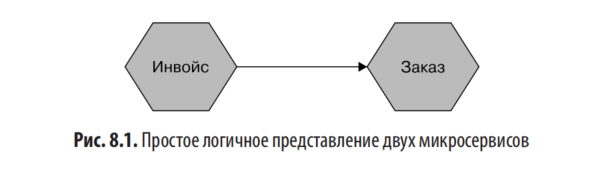

- На практике каждый микросервис:
  - **развёртывается в нескольких экземплярах** — для масштабируемости и отказоустойчивости;
- использует **балансировщик нагрузки** для распределения запросов;
- **распределяется по нескольким зонам доступности** (multi-AZ) — AWS, Azure, GCP не предоставляют SLA для одной машины или одной зоны.

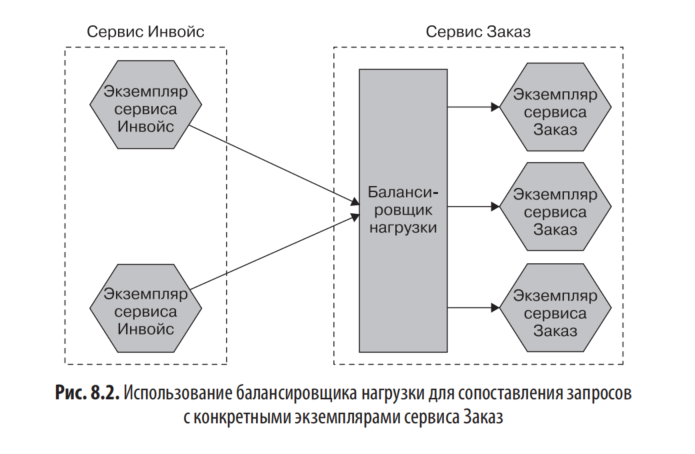
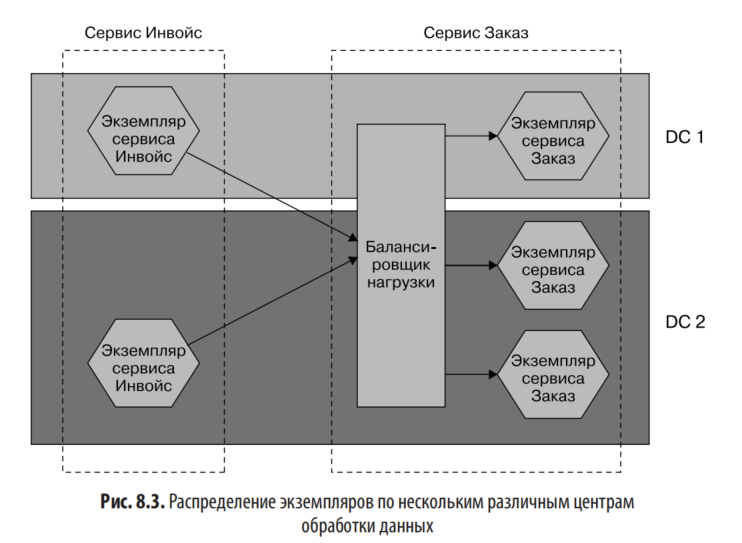

💡 *Облачные провайдеры (AWS, Azure, GCP) не предоставляют SLA для одной машины или зоны — необходимо использовать несколько зон.*

---

### 🔹 **2. Базы данных в микросервисной архитектуре**

**Ключевой принцип:** каждый микросервис владеет своей базой данных — «не делиться БД между сервисами».

Несколько экземпляров одного микросервиса **могут использовать одну БД** — это не нарушает принцип, потому что логика управления остаётся внутри одного сервиса.

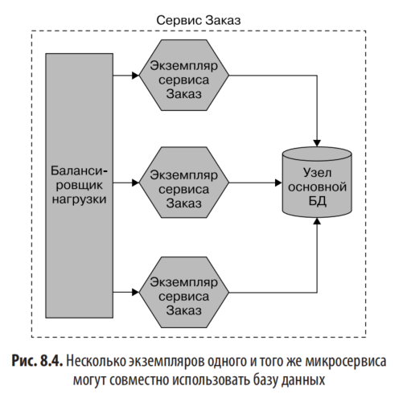

Масштабирование БД

  - **Реплики чтения (read replicas):** операции чтения направляются на реплики, запись — на основной узел. Это снижает нагрузку на мастер, так как масштабировать запись (в отличие от чтения) сложнее. 

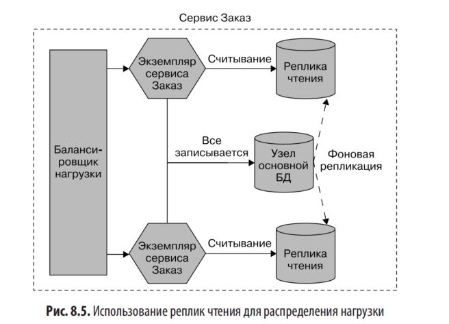

  - **Шардинг:** требуется для масштабирования записи — более сложная техника.

  #### 🏢 Модели размещения БД:

  Развертывание и масштабирование базы данных в архитектуре микросервисов может осуществляться двумя основными способами:

1. **Общая физическая инфраструктура** — несколько логически изолированных БД (например, для сервисов «Заказ» и «Инвойс») размещаются на одной СУБД и аппаратной платформе. Это снижает затраты и упрощает управление, но создаёт риски: сбой инфраструктуры затронет сразу несколько сервисов.   

   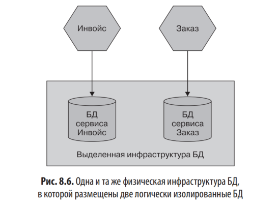

2. **Выделенная инфраструктура на сервис** — каждый микросервис использует свою собственную БД, особенно в облачных средах (например, AWS RDS). Такой подход обеспечивает лучшую изоляцию, отказоустойчивость и контроль, а облачные сервисы берут на себя задачи резервного копирования, обновлений и масштабирования. Но выше стоимость

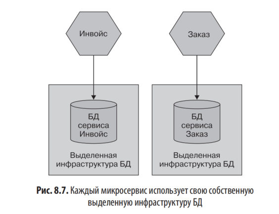

---

### 🔹 **3. Среды выполнения (environments)**
**Среды выполнения** — это различные окружения, через которые проходит ПО перед попаданием в продакшен (например: локальная среда разработчика → CI → тестовая/предпродакшен → продакшен).

Каждая среда служит своей цели:

- **Локальная** — быстрая обратная связь при разработке.
- **CI** — автоматизированное тестирование (часто с упрощённой топологией).
- **Тестовая/предпродакшен** — ручная или интеграционная проверка.
- **Продакшен** — реальная эксплуатация с полной инфраструктурой.

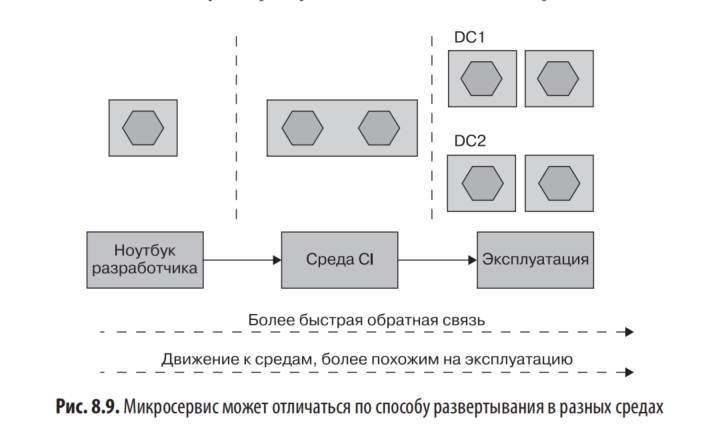

Идеально, чтобы все среды были идентичны продакшену, но на практике они упрощаются для скорости и экономии. Важно:

**Ключевые принципы:**

- Чем раньше обнаружена ошибка — тем дешевле исправить.
- Конфигурация, зависящая от среды, должна быть отделена от артефакта сервиса.
- Количество экземпляров и топология могут отличаться между средами — это нормально и должно поддерживаться параметризацией.
- **Главный принцип**: один логический микросервис может разворачиваться по-разному в разных средах, но его код должен оставаться неизменным.

---

### 🔹 **4. Основные принципы развертывания микросервисов**

#### ✅ **1. Изолированное выполнение**

**Изолированное выполнение** — ключевой принцип микросервисов, обеспечивающий их независимость.

Размещение нескольких микросервисов на одном хосте (физическом или виртуальном) упрощает управление инфраструктурой, но создаёт серьёзные проблемы:

- **Конкуренция за ресурсы**: один перегруженный сервис может «задушить» другие.
- **Сложность мониторинга и отладки**: трудно отделить метрики одного сервиса от другого.
- **Зависимости**: конфликтующие требования к окружению усложняют развёртывание.
- **Потеря автономии команд**: требуется централизованная координация изменений.

Пример из практики Gilt: совместное размещение микросервисов привело к каскадным сбоям из-за неравномерной нагрузки.

**Решение** — запускать каждый микросервис в изолированной среде:

- _Идеально_ — один экземпляр на один хост (дорого).
- _Оптимально_ — **контейнеры** (Docker): достаточная изоляция при низкой стоимости и быстром запуске.
- Облачные PaaS/FaaS (Heroku, AWS Lambda) обеспечивают изоляцию «из коробки».

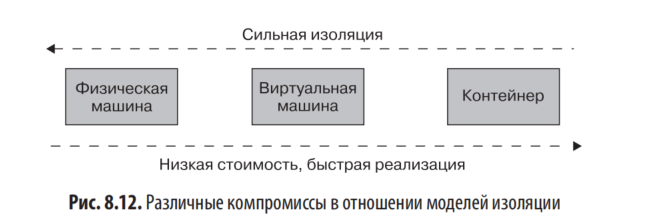

**Вывод**: изоляция критична для независимого развёртывания, масштабирования и отказоустойчивости микросервисов. Контейнеризация — оптимальный баланс между изоляцией, стоимостью и удобством.

#### ✅ **2. Автоматизация**
По мере роста числа сервисов ручное управление становится неэффективным.

**Что автоматизировать:** развёртывание, настройку инфраструктуры, обновления БД, мониторинг.

**Примеры результата автоматизации:**

- **realestate.com.au:** 2 сервиса за 3 месяца → 70+ за 18 месяцев.
- **Gilt:** ~10 сервисов через год → 450+ спустя несколько лет (~3 сервиса на разработчика).

#### ✅ **3. Инфраструктура как код (IaC)**
**Инфраструктура как код (IaC)** — это подход, при котором настройка и управление инфраструктурой описываются в машиночитаемом виде (коде), а не выполняются вручную.

Ключевые преимущества:

- **Воспроизводимость**: любую среду можно развернуть в точном состоянии.
- **Контроль версий**: все изменения фиксируются, что упрощает аудит и откат.
- **Тестирование и автоматизация**: конфигурации можно проверять как обычный код.
- **Повышение надёжности**: особенно критично при воссоздании сред «на дату» (например, для расследований или багов).

Популярные инструменты:

- Декларативные: **Ansible**, **Chef**, **Puppet**, **Terraform** (для облачных ресурсов).
- Платформенные: **AWS CloudFormation**, **AWS CDK**.
- Современные подходы: **Pulumi** (использует обычные языки программирования).

#### ✅ **4. Развертывание без простоя (zero-downtime deployment)**
**Цель — вышестоящие потребители не замечают релизов. - Развертывание без простоя** — ключевой элемент независимости микросервисов, позволяющий выпускать обновления без остановки сервиса и без уведомления клиентов.

Преимущества:

- Повышает частоту и безопасность релизов (пример: Financial Times).
- Позволяет разворачивать ПО в рабочее время — снижает нагрузку на команду и риск ошибок.
- Улучшает пользовательский опыт: потребители не замечают обновлений.

Подходы:

- **Rolling update (постепенное):** старые экземпляры постепенно заменяются новыми. Kubernetes поддерживает из коробки.
- **Сине-зелёное развёртывание:** параллельная среда с новой версией, затем переключение трафика.

При асинхронной коммуникации (очереди) реализовать проще; при синхронной — сложнее (долгоживущие соединения). 

#### ✅ **5. Управление желаемым состоянием (desired state management)**
**Управление желаемым состоянием** — это подход, при котором вы декларативно описываете, как должна выглядеть ваша система (например: «4 экземпляра сервиса с 2 ГБ памяти каждый»), а платформа автоматически поддерживает это состояние.

Если экземпляр падает — платформа сама запускает замену без ручного вмешательства.

**Платформы:** Kubernetes, AWS Auto Scaling Groups, Azure Scale Sets, **Nomad** (поддерживает смешанные нагрузки: контейнеры, VM, batch).

Ключевые особенности:

- Если текущее состояние отклоняется (например, падает экземпляр), платформа сама восстанавливает его.
- Освобождает разработчиков и операторов от ручного управления инфраструктурой.
- Поддерживается такими платформами, как **Kubernetes**, **AWS Auto Scaling Groups**, **Azure Scale Sets**, **Nomad** (подходит для смешанных рабочих нагрузок — контейнеры, VM, батч-задачи и др.).

Важный нюанс:  
Если забыть, что желаемое состояние активно, можно столкнуться с неожиданным поведением — например, платформа будет автоматически пересоздавать удалённые вручную ресурсы, что может привести к лишним затратам (как в примере с AWS EC2).

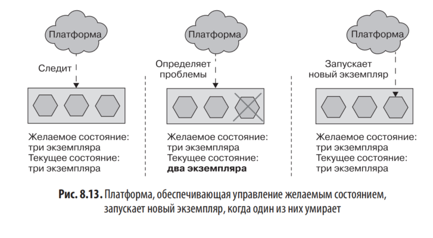

**Предварительные условия для управления желаемым состоянием**:

1. **Полностью автоматизированное развертывание** — платформа должна уметь запускать экземпляры микросервисов без ручного вмешательства.
2. **Быстрое время запуска** — если экземпляр падает, его замена должна появляться быстро; иначе потребуется избыточная мощность для покрытия времени восстановления.
3. **Готовность к использованию специализированных платформ** — лучше использовать проверенные решения (например, Kubernetes, Nomad), а не писать своё.
4. **Оптимальный момент внедрения** — не стоит внедрять управление желаемым состоянием на старте; сначала освойте базовые практики микросервисов, а затем подключайте сложные оркестрационные инструменты, когда их реальная польза станет очевидной (обычно при росте числа сервисов).

---

### 🔹 **5. GitOps**
- Подход, объединяющий **IaC + управление желаемым состоянием**.
- Желаемое состояние хранится в **Git-репозитории**.
- Инструменты (например, **Flux**) автоматически применяют изменения к кластеру (обычно Kubernetes).
- Преимущества:
  - Прозрачность.
  - Возможность code review для инфраструктурных изменений.
  - Единый workflow для разработчиков.

---

### 🔹 **6. Варианты развертывания: сравнение**

| Тип                                             | Плюсы                                                                                                | Минусы                                                                                                      | Подходит ли для микросервисов?                                                                |
| ----------------------------------------------- | ---------------------------------------------------------------------------------------------------- | ----------------------------------------------------------------------------------------------------------- | --------------------------------------------------------------------------------------------- |
| **Физическая машина**                           | Максимальная производительность                                                                      | Низкая гибкость, высокая стоимость, плохая изоляция при размещении нескольких сервисов                      | ❌ Почти никогда                                                                               |
| **Виртуальная машина**                          | Хорошая изоляция, зрелые инструменты                                                                 | Высокие накладные расходы, медленный запуск                                                                 | ✅ Да (особенно в облаке, например Netflix на AWS EC2)  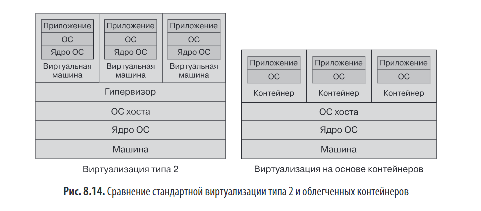  |
| **Контейнер (Docker)**                          | Легковесность, быстрый запуск, хорошая изоляция, стандарт де-факто                                   | Менее строгая изоляция, чем у ВМ                                                                            | ✅✅ **Идеальный выбор** 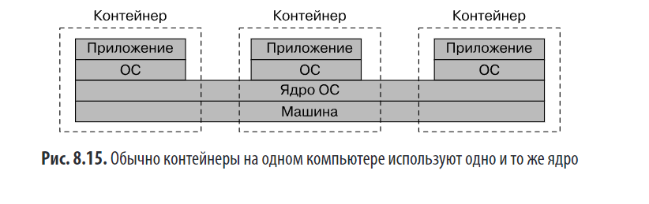                                     |
| **Контейнер приложения** (Tomcat, IIS)          | Экономия ресурсов JVM/.NET                                                                           | Нарушает принцип изоляции, сложно масштабировать, проблемы с жизненным циклом                               | ❌ Не рекомендуется                                                                            |
| **PaaS** (Heroku, App Engine)                   | Простота, быстрый старт, управляемая инфраструктура                                                  | Ограниченная гибкость, «чёрный ящик», сложности при выходе за рамки платформы                               | ✅ Для простых/стандартных сервисов                                                            |
| **FaaS / Serverless** (Lambda, Azure Functions) | Оплата только за использование, автоматическая масштабируемость, почти нулевые операционные издержки | Ограничения по времени выполнения, холодный старт, сложности с состоянием, ограниченный контроль над средой | ✅ Для event-driven, коротких задач                                                            |

#### 💡 Особенности FaaS:
- **Одна функция = один микросервис** → простая модель.
- **Одна функция = один агрегат** → более детализированная модель (сохраняется общая БД).
- **Состояние**: функции stateless → данные хранятся внешними (БД, очереди).
- **Cold start**: проблема для JVM/.NET → лучше использовать Go/Python/Node.js.

ПОДРОБНО :
## Общие принципы выбора инструментов развертывания
- Микросервисы должны работать изолированно и развертываться без простоев
- Инструментарий должен поддерживать:
  - культуру автоматизации
  - определение инфраструктуры и конфигурации в коде (IaC)
  - управление желаемым состоянием (desired state)

---

## 1. Физическая машина
**Описание:** Экземпляр микросервиса развертывается напрямую на физическом оборудовании, без виртуализации.

**Преимущества:**
- Прямой доступ к аппаратным ресурсам

**Недостатки:**
- Низкая утилизация ресурсов: если сервис использует 50% CPU/памяти/I/O — остальные ресурсы теряются
- Нарушение принципа изолированной среды выполнения при попытке разместить несколько сервисов на одной машине
- Сложность реализации:
  - управления желаемым состоянием
  - развертывания без простоя
  - автоматизации на одном уровне абстракции

**Вывод:** Прямое развертывание на физических машинах встречается редко, только при специфических требованиях или ограничениях.

---

## 2. Виртуальная машина (ВМ)
**Описание:** Микросервис развертывается на виртуальной машине, управляемой гипервизором.

**Преимущества:**
- Высокая степень изоляции: каждая ВМ имеет свою ОС и ресурсы
- Возможность перераспределения CPU, памяти, I/O, хранилища между ВМ
- Повышение эффективности использования инфраструктуры
- Возможность настройки ОС под локальные потребности сервиса
- Поддержка автоматизации через API (AWS EC2, Google Cloud, Azure)
- Поддержка групп автоматического масштабирования

**Недостатки:**
- Накладные расходы гипервизора: чем больше ВМ, тем больше ресурсов тратится на управление
- Убывающая отдача при дроблении физического хоста на всё более мелкие ВМ
- Риск потери нескольких экземпляров сервисов при сбое физического оборудования
- Традиционные платформы виртуализации (VMware) часто находятся под централизованным контролем, что ограничивает автоматизацию

**Типы виртуализации:**
- **Тип 1:** ВМ работают непосредственно на оборудовании
- **Тип 2:** ВМ работают поверх хостовой ОС (AWS, VMware, Xen, KVM)

**Пример успешного использования:** Netflix построил микросервисную архитектуру на управляемых ВМ AWS EC2.

**Вывод:** ВМ подходят, когда требуется строгая изоляция или контейнеризация невозможна.

---

## 3. Контейнеры
**Описание:** Микросервис запускается как изолированный процесс в контейнере, использующем общее ядро хоста.

**Ключевые особенности:**
- Контейнеры используют одно ядро ОС хоста (в Linux)
- Не требуется гипервизор
- Контейнер — абстракция над поддеревом процессов, управляемых ядром
- Быстрый запуск: секунды вместо минут у ВМ
- Более тонкий контроль над распределением ресурсов
- Возможность запуска большего количества экземпляров на том же оборудовании

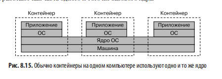

**Преимущества:**
- Экономия ресурсов (нет накладных расходов гипервизора)
- Высокая скорость развертывания и обратной связи
- Гибкость в настройке параметров ресурсов
- Возможность комбинирования с ВМ (например, запуск контейнеров на EC2)
- Абстракция образа Docker скрывает детали реализации: микросервисы на Go, Python, NodeJS управляются одинаково
- Упрощение локальной разработки и тестирования (Docker Desktop)

**Недостатки:**
- Изоляция на уровне процессов, а не на уровне ядра: возможны уязвимости «побега» из контейнера
- Требуются дополнительные инструменты для маршрутизации трафика к контейнерам
- Контейнеры подходят для изоляции доверенного ПО; для недоверенного кода требуется дополнительное исследование

**Контейнеры Windows:**
- Появились с Windows Server 2016
- Проблема: большой размер ОС (Nano Server >1 ГБ против Alpine Linux в несколько МБ)
- Поддержка двух уровней изоляции:
  - Изоляция процессов (как в Linux)
  - Изоляция через Hyper-V (полная виртуализация, выбор при запуске без изменения образа)

**Тренд:** Поиск решений с изоляцией уровня ВМ и легкостью контейнеров (Firecracker, Hyper-V containers).

---

## 4. Docker
**Роль:** Популяризировал контейнеризацию, предоставив удобный инструментарий.

**Возможности:**
- Управление подготовкой контейнеров
- Решение сетевых задач
- Реестр для хранения образов
- Концепция образа Docker как артефакта сборки

**Преимущества:**
- Единый интерфейс управления для микросервисов на разных языках
- Идентичность образов для локальной и производственной среды

**Ограничение:** Docker управляет контейнерами на одной машине; для управления на множестве машин требуется оркестратор (Kubernetes).

---

## 5. Контейнеры приложений

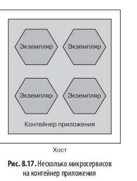

**Описание:** Несколько микросервисов запускаются внутри одного контейнера приложений (IIS, Tomcat, Weblogic).

**Заявленные преимущества:**
- Улучшенная управляемость: кластеризация, мониторинг
- Снижение накладных расходов на среду выполнения (одна JVM на несколько сервисов)

**Недостатки:**
- Ограничение выбора технологического стека
- Ограничение возможностей автоматизации и управления
- Функции управления состоянием сессий в памяти создают проблемы при масштабировании
- Недостаточные возможности мониторинга для микросервисной архитектуры
- Длительное время запуска, влияющее на циклы обратной связи
- Сложность управления жизненным циклом приложений (например, JVM)
- Усложнение анализа использования ресурсов и потоков при совместном использовании процесса
- Коммерческие лицензии и дополнительные затраты ресурсов

**Вывод:** Рекомендуется использовать автономные развертываемые микросервисы как отдельные изолированные процессы.

---

## 6. Платформа как услуга (PaaS)
**Описание:** Абстракция более высокого уровня, где платформа управляет инфраструктурой (Heroku, Google App Engine, AWS Beanstalk).

**Преимущества:**
- Автоматическая подготовка и запуск артефактов (WAR, gem)
- Прозрачное управление масштабированием
- Дополнительные сервисы: запуск экземпляров БД, брокеров сообщений
- Снижение операционных издержек
- Удобный интерфейс для разработчиков

**Недостатки:**
- Ограниченная возможность «залезть под капот» при проблемах
- Эвристика автоматического масштабирования адаптирована под среднестатистическое приложение, а не под конкретный кейс
- Риск конфликта нестандартных приложений с логикой платформы
- Ограниченные возможности самостоятельного размещения (self-hosting)

**Вывод:** PaaS подходит, если приложение укладывается в ограничения платформы; в противном случае — риски эксплуатации.

---

## 7. Функция как услуга (FaaS) / Бессерверные вычисления
**Описание:** Микросервис развертывается как одна или несколько функций, запускаемых по триггеру (AWS Lambda, Azure Functions, Google Cloud Functions).

**Принцип работы:**
- Функция находится в состоянии бездействия до срабатывания триггера (HTTP-запрос, файл в хранилище, сообщение в очереди)
- При триггере функция запускается, после завершения — завершается
- Платформа управляет масштабированием и высокой доступностью

**Преимущества:**
- Оплата только за время выполнения («код, который не выполняется, ничего не стоит»)
- Идеально для низкой или непредсказуемой нагрузки
- Неявная высокая доступность и надежность без дополнительной настройки
- Резкое снижение операционных издержек

**Ограничения:**
- Зависимость от поддержки языков провайдером (Azure — широкий спектр, Google Cloud — ограниченный, AWS — кастомные среды выполнения)
- Ограниченный контроль над ресурсами: управление только памятью, CPU и I/O выделяются косвенно
- Лимиты времени выполнения: Google Cloud Functions — 9 мин, AWS Lambda — 15 мин, Azure — неограниченно (в зависимости от тарифа)
- Stateless-модель: функция не сохраняет состояние между вызовами (требует внешнего хранилища)
- Сложность оркестрации цепочек функций (исключение: Azure Durable Functions)

**Проблемы:**
- **Холодный старт:** задержка при первом запуске функции (особенно для JVM, .NET); решается использованием языков с быстрым стартом (Go, Python, Node, Ruby) и поддержкой «теплых» экземпляров провайдером
- **Масштабирование:** жесткие лимиты на количество одновременных вызовов; риск перегрузки других компонентов инфраструктуры (пример: перегрузка Redis в Bustle)

---

## Сопоставление FaaS с микросервисами

### Модель 1: Одна функция на один микросервис
- Микросервис развертывается как единая функция с одной точкой входа
- Требуется внутренняя диспетчеризация запросов по путям (/чек, /претензия, /отчет)
- Сохраняется концепция микросервиса как единицы развертывания

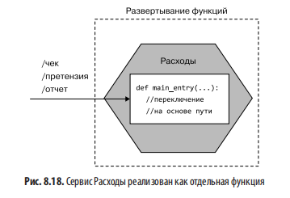

### Модель 2: Одна функция на один агрегат
- Микросервис разбивается на функции по агрегатам (предметно-ориентированное проектирование)
- Каждая функция самодостаточна для управления жизненным циклом своего агрегата
- Микросервис становится логической, а не физической единицей
- **Рекомендации:**
  - Сохранять общий внешний интерфейс для потребителей
  - На начальном этапе допустимо использование общей БД для функций одного сервиса
  - При росте связанности данных — разделение БД на уровне функций

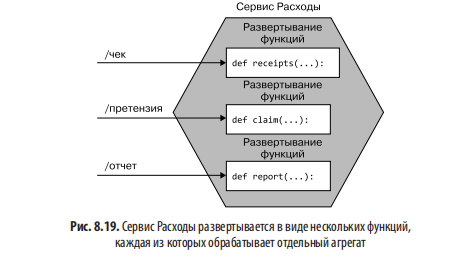

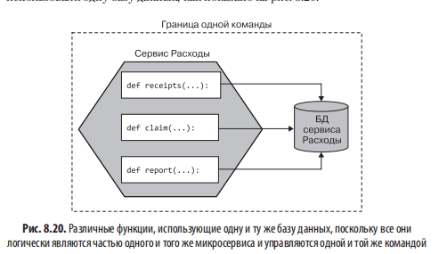

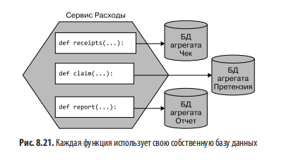

### Модель 3: Детализация до уровня переходов состояния
- Не рекомендуется: нарушение целостности агрегата
- Усложнение обеспечения согласованности при независимом развертывании частей одного перехода состояния
- Требует применения паттернов сага, что оправдано только для сложных бизнес-процессов, а не для управления одним агрегатом

---

## WebAssembly (Wasm) — перспективная технология
**Описание:** Стандарт для запуска изолированных программ на разных языках в браузере и за его пределами.

**Преимущества:**
- Безопасная «песочница» по умолчанию
- Легковесность по сравнению с контейнерами
- Возможность запуска в CDN (Fastly, Cloudflare) через WASI

**Ограничения:**
- Недостаток серверных платформ с нативной поддержкой WASI
- Риск бессмысленного запуска Wasm внутри контейнеров (легкое внутри тяжелого)

**Перспективы:** Планировщики с подключаемой моделью драйверов (например, Nomad) могут лучше подойти для Wasm.

---

## Рекомендации по выбору варианта развертывания

### Базовые правила:
1. **Не чините то, что не сломано.** Не меняйте работающее решение ради моды.
2. **Максимальная автоматизация.** Если PaaS/FaaS может взять на себя всю операционную работу — используйте их.
3. **Контейнеризация как компромисс.** Если PaaS не подходит — контейнеры + Kubernetes обеспечивают баланс между изоляцией, стоимостью и контролем.

### Практические советы:
- Если приложение укладывается в ограничения FaaS — используйте его, чтобы скрыть сложность инфраструктуры
- Если нужен полный контроль или приложение нестандартное — выбирайте контейнеры и Kubernetes
- Если найден удобный PaaS (Heroku, Zeit) и приложение совместимо — перенесите работу на платформу, чтобы сосредоточиться на продукте
- Не позволяйте страху («Kubernetes или провал») диктовать технические решения

---

## Роль инструментов конфигурации (Puppet, Chef, Ansible, Salt)
**Изменения в отрасли:**
- Популярность контейнеров снизила необходимость в Puppet/Chef на уровне развертывания приложений
- Dockerfile позволяет описывать состояние среды аналогично Puppet/Chef, но без сложности повторного применения к одной машине (контейнер создается с нуля)

**Новые роли:**
- Управление устаревшими приложениями и инфраструктурой
- Подготовка кластеров для запуска контейнерных рабочих нагрузок

**Альтернативы для IaC:**
- Terraform: декларативное управление облачной инфраструктурой
- Pulumi: использование обычных языков программирования вместо DSL для управления инфраструктурой

**Тренд:** Разработчики всё реже взаимодействуют с Puppet/Chef напрямую; инструменты смещаются в сторону операций и подготовки инфраструктуры.

---

### 🔹 **7. Kubernetes и оркестрация контейнеров**
- **Kubernetes (K8s)** стал доминирующим решением для оркестрации.
- **Основные концепции**:
  - **Pod** — Минимальная единица планирования; обычно 1 контейнер (экземпляр микросервиса)
  - **Service** — сСтабильная сетевая точка входа к Pod'ам; маршрутизирует запросы к эфемерным подам
  - **Deployment** — управление желаемым состоянием (реплики, обновления, откаты).

Архитектура кластера:** Control plane (управление) + Worker nodes (рабочие нагрузки).

> Терминологическая ловушка: в общем смысле мы «деплоим сервис», но в Kubernetes деплоятся **поды**, которые сопоставляются с **сервисом**.

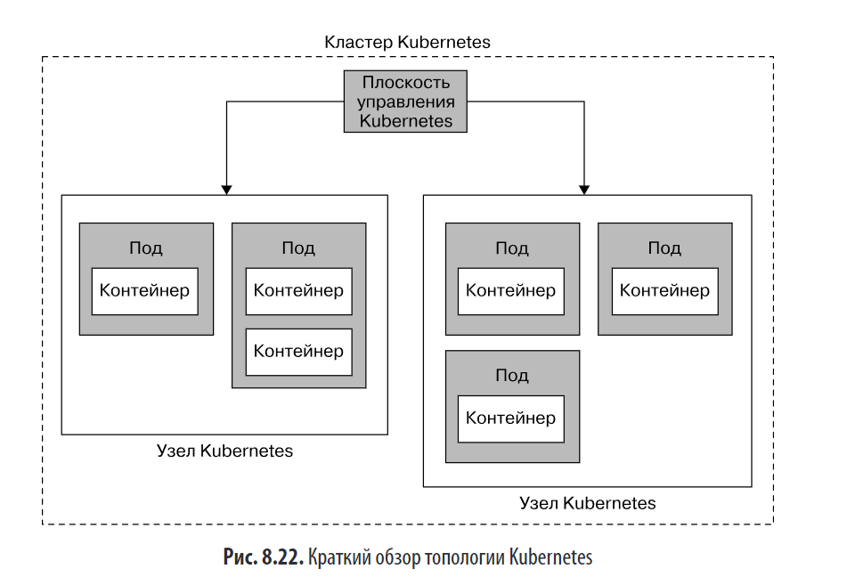

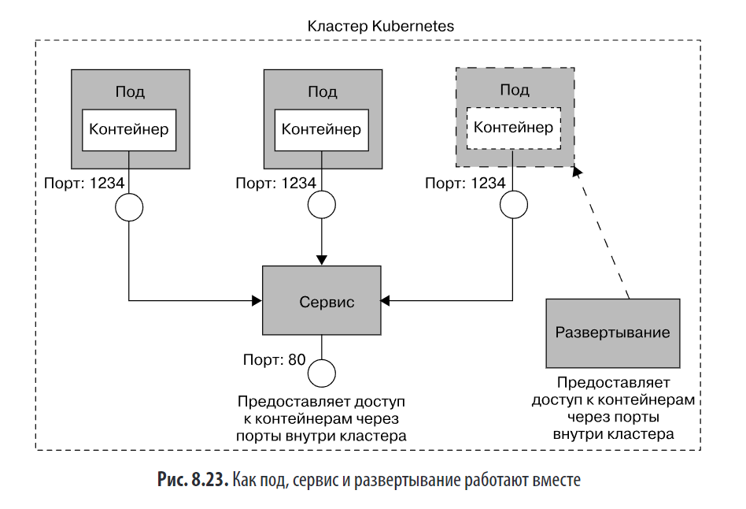

#### 🌐 Мультиарендность и федерация:

**Проблема:** Kubernetes имеет ограниченные встроенные возможности для разграничения доступа между подразделениями.

- Один кластер → проще, но может не хватать изоляции между командами.
- **Федерация** → несколько кластеров + управляющий слой → Сложнее объединять ресурсы между кластерами, но упрощает модернизацию.
- **OpenShift** — enterprise-платформа поверх K8s с улучшенной безопасностью и мультиарендностью.

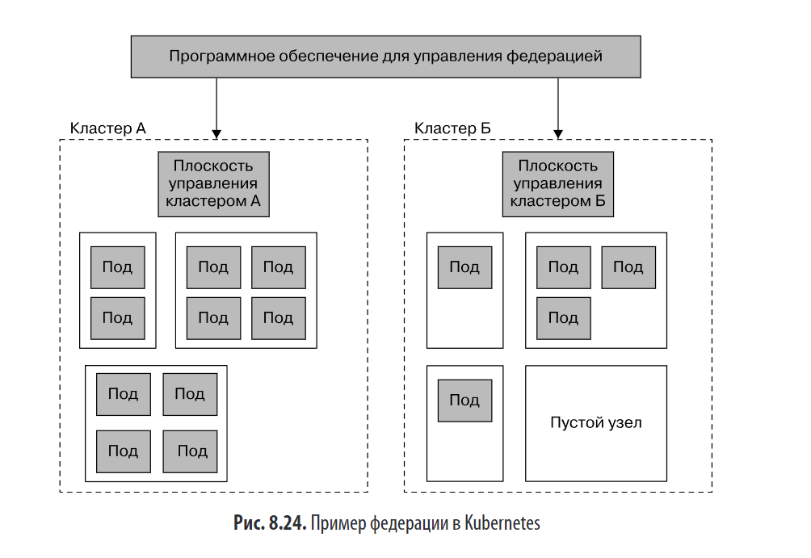

#### 📦 Helm, Operator, CRD:
- **Helm** — менеджер пакетов для K8s.
- **Operator** — автоматизация управления сложными приложениями (например, Kafka).
- **CRD (Custom Resource Definitions)** — расширение API K8s для создания собственных абстракций.

Helm и Operator не исключают друг друга: Helm — для установки, Operator — для операций жизненного цикла.
#### 🚀 Knative:
Предоставляет FaaS-опыт поверх Kubernetes, скрывая его сложность.
- Требует **Istio** (service mesh).
- Пока нестабилен для продакшена. Более консервативная альтернатива — **OpenFaaS** (не требует service mesh, используется в продакшене).
- Google не передала Knative в CNCF — возможно, из желания контролировать направление развития.

ПОДРОБНО: 

# Kubernetes и оркестрация контейнеров

## Введение: почему возникла потребность в оркестрации

**Контекст:**

- По мере роста популярности контейнеров появилась потребность в управлении ими на нескольких машинах
- Существовали различные решения: Docker Swarm, Docker Swarm Mode, Rancher, CoreOS, Mesos
- **Kubernetes** за последние годы стал доминирующим решением в этой нише

**Зачем нужна оркестрация:**

- Контейнеры изолируют ресурсы на базовой машине, но большинство решений требуют запуска ПО на нескольких машинах (для обработки нагрузки, обеспечения отказоустойчивости)
- Платформы оркестрации определяют, **как и где** выполняются рабочие нагрузки контейнеров
- Термин «планирование» (scheduling) отражает суть: оператор говорит «запустить этот блок», оркестратор находит ресурсы, перераспределяет их при необходимости и выполняет детали

**Ключевые функции платформ оркестрации:**

- Управление желаемым состоянием (desired state) — поддержка ожидаемого состояния набора контейнеров
- Распределение рабочих нагрузок для оптимизации ресурсов, задержек или повышения надёжности
- Автоматизация рутинных задач по запуску, подключению к сети и мониторингу контейнеров

> Без такого инструмента управление распределением контейнеров вручную быстро становится неэффективным и трудоёмким.

---

## Упрощённый обзор концепций Kubernetes

### Базовая архитектура (рис. 8.22)

**Кластер Kubernetes состоит из:**

1. **Узлы (nodes)** — набор машин (физических или виртуальных), на которых выполняются рабочие нагрузки
2. **Плоскость управления (control plane)** — управляющее ПО, контролирующее узлы

### Под (Pod)

- Базовая единица планирования в Kubernetes (не контейнер!)
- Состоит из **одного или нескольких контейнеров**, развертывающихся совместно
- В большинстве случаев под содержит **один контейнер** (экземпляр микросервиса)
- Несколько контейнеров в поде имеют смысл в редких случаях, например:
    - Sidecar-прокси (Envoy) как часть сервисной сети

### Сервис (Service)

- Стабильная конечная точка маршрутизации внутри кластера
- Способ сопоставления запущенных подов со стабильным сетевым интерфейсом
- Поды считаются **эфемерными** (могут завершаться/пересоздаваться), сервис — стабильным
- Kubernetes обрабатывает маршрутизацию вызовов к подам и от них, включая обработку завершения или запуска новых подов

> Терминологическая путаница: в общем смысле мы «развертываем сервис», но в Kubernetes вы развертываете **поды**, которые сопоставляются с **сервисом**.

### Набор реплик (ReplicaSet)

- Определяет **желаемое состояние** набора подов
- Пример: «Я хочу четыре таких пода» → Kubernetes обеспечивает это состояние
- На практике разработчики редко работают с ReplicaSet напрямую

### Развертывание (Deployment)

- Высокоуровневый механизм применения изменений к подам и ReplicaSet
- Поддерживает:
    - Непрерывные обновления (rolling updates) — постепенная замена подов без простоев
    - Откаты (rollbacks)
    - Масштабирование (увеличение/уменьшение числа реплик)
    - И другие операции жизненного цикла

**Последовательность развертывания микросервиса:**

1. Определить под с экземпляром микросервиса
2. Определить сервис для доступа к микросервису
3. Применить изменения через Deployment

> На словах просто, на практике — значительный объём материала опущен для краткости.

---

## Мультиарендность и федерация

### Проблема мультиарендности

- Желание объединить все вычислительные ресурсы организации в одном кластере для повышения эффективности
- Kubernetes имеет **ограниченные встроенные возможности** для разграничения доступа между подразделениями
- Это осознанное ограничение области применения Kubernetes

### Подходы к решению:

**1. Платформы поверх Kubernetes**

- Пример: **OpenShift (Red Hat)**
- Предоставляет расширенные средства контроля доступа и управления
- Недостатки:
    - Финансовые затраты
    - Необходимость изучения абстракций конкретного вендора
    - Разработчикам нужно знать и Kubernetes, и платформу поставщика

**2. Федеративная модель (рис. 8.24)**

- Несколько отдельных кластеров с общим слоем управления
- Пользователи работают с одним кластером (знакомый опыт)
- В отдельных случаях — распределение приложения по нескольким кластерам (например, для географической отказоустойчивости)

**Ограничения федерации:**

- Сложность объединения ресурсов: если кластер А загружен, а кластер Б свободен, перераспределение требует дополнительных усилий
- Узел не может одновременно запускать поды из разных кластеров
- Управление федерацией зависит от конкретного ПО и может быть нетривиальным

**Преимущество нескольких кластеров:**

- Упрощение модернизации: проще перенести микросервисы в обновлённый кластер, чем обновлять кластер «на месте»

> Это проблемы масштабирования: не все организации с ними сталкиваются, но для крупных внедрений это критичная область.

## Платформы и мобильность

**Kubernetes как «платформа» — нюанс:**

- «Из коробки» Kubernetes предоставляет только возможность запускать контейнерные рабочие нагрузки
- Большинство пользователей **собирают собственную платформу**, добавляя:
    - Сервисные сети (service mesh)
    - Брокеры сообщений
    - Инструменты агрегации логов
    - И другие компоненты

**Плюсы и минусы:**

- ✅ Совместимая экосистема (во многом благодаря CNCF) позволяет выбирать инструменты под задачу
- ⚠️ Риск «тирании выбора»: перегрузка количеством вариантов
- ✅ Продукты типа OpenShift частично снимают эту проблему, предлагая готовые решения

**Проблема переносимости:**

- На базовом уровне Kubernetes предлагает переносимую абстракцию для выполнения контейнеров
- **На практике**: приложение, зависящее от кастомной платформы (инструменты, процессы, операции), не переносится «из коробки» между кластерами
- Многие организации внедряли Kubernetes из-за страха vendor lock-in, но не учли, что **приложения переносятся между кластерами в теории, но не всегда на практике**

---

## Helm, Operator и CRD

### Проблема управления сторонними приложениями

- Пример: запуск Kafka в кластере Kubernetes
- Можно создать Pod, Service, Deployment вручную, но как управлять:
    - Обновлениями?
    - Задачами обслуживания (backup, масштабирование, мониторинг состояния)?

### Helm

- Позиционируется как «отсутствующий менеджер пакетов» для Kubernetes
- Позволяет упаковывать приложения в чарты (charts) для упрощённой установки и управления

### Operator

- Фокус на **управлении жизненным циклом** приложений (не только установка)
- Автоматизирует операции: обновления, восстановление, масштабирование с учётом состояния приложения

> Helm и Operator не являются взаимоисключающими: Helm можно использовать для установки, Operator — для операций жизненного цикла.

### Custom Resource Definitions (CRD)

- Механизм расширения API Kubernetes
- Позволяет добавлять собственные типы ресурсов и поведение в кластер
- Интегрируются с kubectl, системой контроля доступа и другими механизмами Kubernetes
- Применение:
    - Организация конфигурации
    - Управление сервисными сетями (Istio)
    - Управление кластерным ПО (Kafka, базы данных)

> CRD — мощный и гибкий инструмент, но в сообществе нет единого мнения о лучших практиках их использования. Экосистема продолжает эволюционировать.

---

## Knative

**Цель:**

- Предоставить разработчикам опыт работы в стиле **FaaS** с использованием Kubernetes «под капотом»
- Скрыть сложность Kubernetes, приблизив опыт к Heroku или аналогичным платформам
- Упростить управление полным жизненным циклом ПО для команд разработчиков

**Зависимости:**

- Требует сервисной сети (service mesh)
- На момент написания **только Istio** считается стабильной интеграцией (Ambassador, Gloo — альфа-версии)
- Фактически: использование Knative → необходимость использования Istio

**Статус и риски:**

- Kubernetes и Istio (оба при поддержке Google) долго достигали стадии стабильности
- Kubernetes продолжал меняться после версии 1.0; Istio был полностью перепроектирован
- Прогноз: Knative потребует времени для зрелости; возможны болезненные миграции при изменениях
- Консервативным организациям рассмотреть альтернативы: **Open-FaaS** и подобные проекты (уже используются в продакшене, не требуют service mesh)

**Организационный нюанс:**

- Google не передала Knative в CNCF
- Возможная причина: желание контролировать направление развития инструмента
- Kubernetes выиграл от широкого участия сообщества; жаль, что для Knative выбран иной путь

---

## Будущее Kubernetes

**Прогноз:**

- Нет признаков замедления распространения Kubernetes
- Ожидается рост внедрения:
    - Частные кластеры для on-prem решений
    - Управляемые кластеры в публичных облаках (GKE, AKS, EKS)

**Тренд в использовании:**

- Текущая ситуация: разработчики учатся работать с Kubernetes напрямую
- Будущее: Kubernetes будет **скрыт под слоями абстракций более высокого уровня**
- Пример: Knative от Google — попытка скрыть сложность от разработчиков
- Ожидание: Kubernetes будет повсюду, но разработчики не будут взаимодействовать с ним напрямую

**Что не изменится:**

- Разработчики по-прежнему будут сталкиваться с проблемами распределённых систем
- Не изменится необходимость проектировать отказоустойчивость, согласованность, наблюдаемость
- Изменится: меньше беспокойства о сопоставлении ПО с вычислительными ресурсами

---

## Стоит ли использовать Kubernetes?

### Предупреждение

- Внедрение и управление собственным кластером Kubernetes — **серьёзное мероприятие**, не для слабонервных
- Качество опыта разработчиков зависит от эффективности команды, управляющей кластером
- Многие крупные организации передают управление Kubernetes on-prem специализированным компаниям

### Рекомендации по выбору:

**1. Если есть доступ к публичному облаку:**

- Рассмотрите **полностью управляемые решения** (GKE, AKS, EKS)
- Но сначала спросите: **действительно ли вам нужен Kubernetes?**
    - Для удобной платформы управления развертыванием и жизненным циклом микросервисов:
        - ✅ **FaaS** (AWS Lambda, Azure Functions) — отличное решение
        - ✅ **PaaS** (Azure Web Apps, Google App Engine, Heroku, Zeit) — также стоит рассмотреть

**2. Если рассматриваете Kubernetes:**

- Дайте администраторам и разработчикам **поэкспериментировать** перед принятием решения:
    - Разработчикам: запустить **minikube** или **MicroK8s** на ноутбуке
    - Администраторам: пройти руководства на **Katacoda**, изучить материалы CNCF
- Убедитесь, что те, кто будет использовать систему, имеют практический опыт

**3. Избегайте ловушек:**

- ❌ «Kubernetes, потому что все так делают» — опасное оправдание (как и с микросервисами)
- ❌ Не переоценивайте: если у вас горстка разработчиков и несколько микросервисов, Kubernetes, скорее всего, станет **обузой**, даже на управляемой платформе

> Kubernetes — мощный инструмент, но не универсальное решение. Проведите собственную оценку потребностей, ограничений и компетенций команды перед внедрением.
> 

---

### 🔹 **8. Поэтапная доставка (Progressive Delivery)**
- Цель: **снизить риски релизов** через контролируемое развёртывание.
- **Ключевая идея**: **разделение понятий "развертывание" и "релиз"**.
  - Развертывание = установка кода в production.
  - Релиз = включение функциональности для пользователей.

#### 🛠️ Методы:
1. **Переключатели функций (Feature flags)**:
   - Функция скрыта за флагом.
   - Можно включать для отдельных пользователей/групп.
   - Инструменты: LaunchDarkly, Split.

2. **Канареечный релиз (Canary release)**:
   - Новая версия доступна **малой части трафика**.
   - При успехе — постепенное расширение до 100%.

3. **Параллельное выполнение (Shadowing)**:
   - Запрос отправляется **и старой, и новой версии**.
   - Результаты сравниваются (но клиент получает ответ только от «истинной» версии).
   - Используется при миграции из монолита.

4. **Сине-зелёное развертывание**:
   - Две идентичные среды.
   - Переключение трафика после полной проверки.

> 💡 Эти методы позволяют **часто и безопасно** выпускать изменения → ключевой признак high-performing организаций (по данным книги «Accelerate»).

ПОДРОБНО
# Поэтапная доставка

## Введение: эволюция подхода к внедрению ПО

**Контекст:**

- За последнее десятилетие появились новые методы внедрения ПО, направленные на снижение рисков
- Менее рискованные релизы = возможность выпускать обновления чаще
- Исследования из книги «Ускоряйся!» (Форсгрен, Хамбл, Ким): компании с высокой производительностью
    - внедряют решения чаще
    - при этом имеют более низкую частоту отказов изменений

> «Поспешишь — людей насмешишь» не применимо к доставке ПО: частые поставки и низкие показатели отказов идут рука об руку.

**Суть поэтапной доставки:**

- Функциональность предоставляется пользователям контролируемым образом
- Вместо масштабного развертывания — разумный подход к тому, кто и какую функциональность видит
- Развертывание новой версии для подмножества пользователей

---

## Ключевая концепция: разделение развертывания и релиза

**Определения (Джез Хамбл, «Непрерывная доставка»):**

|Термин|Определение|
|---|---|
|**Развертывание**|Установка версии ПО в определённую среду (часто эксплуатационную)|
|**Релиз**|Предоставление системы или её части (функциональности) пользователям|

**Преимущество разделения:**

- Гарантия, что ПО работает в эксплуатации без сбоев, замеченных пользователями

**Пример: сине-зелёное развёртывание**

- Одна версия ПО работает в реальном времени («синяя»)
- Новая версия развёртывается параллельно («зелёная»)
- Проверка работоспособности новой версии
- Перенаправление трафика на новую версию
- При обнаружении проблемы до полного перехода — клиенты не затронуты

---

## Поэтапная доставка: определение и цели

**Термин ввёл Джеймс Гавернор (RedMonk):**

- Описывает совокупность методов контролируемого внедрения
- Определение: «непрерывная доставка с полным контролем радиуса взрыва»

**Бизнес-аспект (Адам Зимман, LaunchDarkly):**

- Изменение представления: доставка функциональности — не единовременное событие, а поэтапный процесс
- Расширение возможностей владельца продукта: делегирование контроля над функцией тому, кто несёт ответственность за результат
- Требование: владелец продукта должен понимать механику технологии поэтапной доставки (или получать поддержку технически грамотных специалистов)

---

## Методы поэтапной доставки

### 1. Переключатели функций (Feature Toggles / Feature Flags)

**Принцип работы:**

- Развёрнутая функциональность скрывается за переключателем (вкл/выкл)
- Часто используется в магистральной разработке: не готовая функция может быть проверена и развёрнута, но скрыта от пользователей

**Варианты использования:**

- Включение функции в указанное время
- Отключение при возникновении проблем
- Гранулярный подход: состояние флага зависит от характеристик пользователя (например, бета-группа видит функцию, остальные — нет)

**Реализация:**

- Управляемые решения: LaunchDarkly, Split
- Рекомендация: начать с простого (файл конфигурации), затем переходить к специализированным платформам
- Дополнительный ресурс: статья Пита Ходжсона «Переключатели функций»

**Связь с другими методами:**

- Позволяют реализовать канареечное развёртывание

---

### 2. Канареечный релиз

**Происхождение названия:**

- Канарейки в шахтах как система раннего предупреждения об опасных газах

**Принцип работы:**

- Новая функциональность доступна ограниченной группе клиентов
- При возникновении проблемы затрагивается только эта группа
- При успешной работе — постепенное расширение доступности до всех пользователей

**Реализация в микросервисной архитектуре:**

- **Вариант 1:** Переключатель на уровне микросервиса (включение/выключение функциональности для запросов)
- **Вариант 2:** Параллельный запуск двух версий микросервиса с маршрутизацией через переключатель (канареечная логика на уровне сети/маршрутизации)

**Эволюция подхода:**

- **Ручное управление:** автор контролировал процент трафика, видящего новую функциональность, постепенно увеличивал его в течение недели при мониторинге ошибок
- **Автоматизация:** инструменты типа Spinnaker автоматически увеличивают долю вызовов новой версии на основе метрик (частота ошибок, latency и др.)

---

### 3. Параллельное выполнение (Parallel Run)

**Проблема канареечного релиза:**

- Запрос обслуживается либо старой, либо новой версией → невозможно сравнить, как обе версии обрабатывают один и тот же запрос

**Принцип параллельного выполнения:**

- Одновременный запуск двух реализаций одной функциональности
- Отправка запроса к обеим реализациям
- Сравнение результатов

**Варианты реализации:**

- Вызов двух разных версий одного микросервиса
- Сосуществование обеих реализаций внутри одного сервиса (упрощает сравнение)

**Критически важный нюанс:**

- Обычно нужны результаты только одного вызова («источник истины» — как правило, существующая версия)
- Необходимо исключить побочные эффекты: не отправлять клиенту дубликаты обновлений, не производить двойные платежи

**Примеры использования:**

- Миграция функций из монолита в микросервисы (автор, «От монолита к микросервисам», глава 3)
- GitHub: инструмент с открытым исходным кодом **Scientist** для сравнения вызовов при рефакторинге (параллельный запуск в рамках одного процесса)

## Интеграция методов и практические рекомендации

**Комбинирование подходов:**

- Методы могут работать вместе (например, переключатели функций для реализации канареечного развёртывания)
- Не обязательно использовать всё сразу

**Пошаговый подход:**

1. Разделить концепции развёртывания и релиза
2. Найти способы развёртывать ПО чаще, но безопаснее
3. Работать с владельцем продукта и бизнес-стейкхолдерами для понимания, как методы помогают работать быстрее с меньшим количеством сбоев

---

---

### 🔹 **9. Рекомендации автора ("Правила Сэма")**
1. **Не чините то, что не сломано** — не меняйте подход без причины.
2. **Доверяйте автоматизации** — если есть хороший PaaS/FaaS, используйте его.
3. **Контейнеризация — лучший компромисс** для большинства случаев.
4. **Kubernetes — не всегда нужен**:
   - Если у вас < 5–10 микросервисов → скорее всего, избыточен.
   - В облаке → сначала рассмотрите FaaS/PaaS.
5. **Экспериментируйте**: попробуйте minikube, Katacoda перед внедрением.

---

### 🔚 **Итог**
- Развертывание микросервисов — это **баланс между изоляцией, автоматизацией, стоимостью и гибкостью**.
- **Контейнеры + Kubernetes** стали стандартом, но **FaaS и PaaS** могут быть лучше для многих сценариев.
- **Поэтапная доставка** и **инфраструктура как код** — обязательные практики для зрелых команд.
- Главное — **не следовать трендам слепо**, а выбирать то, что решает ваши конкретные проблемы.

## Резюме: принципы развёртывания микросервисов

|Принцип|Содержание|
|---|---|
|**Изолированное выполнение**|Экземпляры микросервиса запускаются изолированно, с собственными вычислительными ресурсами, без влияния на другие экземпляры|
|**Фокус на автоматизации**|С ростом числа микросервисов автоматизация становится критичной; выбирать технологии с высокой степенью автоматизации|
|**Инфраструктура как код**|Конфигурация инфраструктуры в коде для упрощения автоматизации, обмена и воспроизведения сред (хранить в VCS)|
|**Развёртывание без простоя**|Независимое развёртывание новой версии без простоев для пользователей (людей или других микросервисов)|
|**Управление желаемым состоянием**|Платформа поддерживает микросервис в заданном состоянии, запуская новые экземпляры при сбоях или росте трафика|

---

## Рекомендации по выбору платформы развёртывания

1. **Не чините то, что не сломано** — не меняйте работающее решение ради моды
2. **Максимальная автоматизация** — если хороший PaaS (Heroku) или FaaS может взять на себя операционную работу, используйте их
3. **Контейнеризация как компромисс** — баланс между стоимостью изоляции, преимуществами для локальной разработки и степенью контроля; ожидать появления Kubernetes

**Дополнительные соображения:**

- Понимать свои цели и потребности: Kubernetes может быть избыточен, если достаточно более простого решения
- Не стесняться выбирать простые решения или делегировать работу
- При возможности переносить работу в публичное облако для фокусировки на продукте
