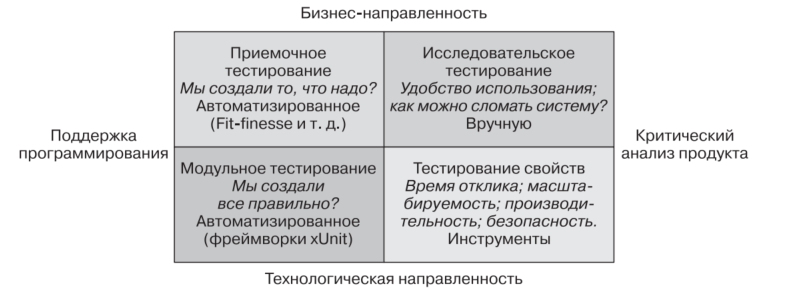
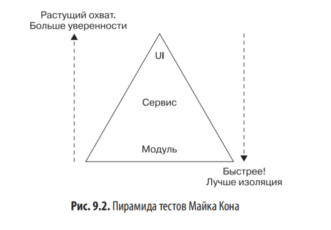
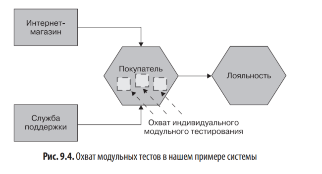
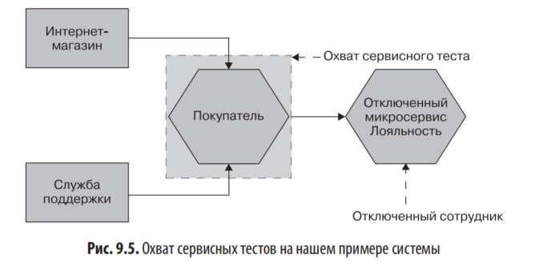
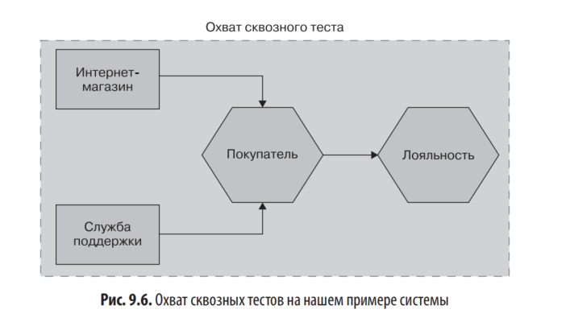
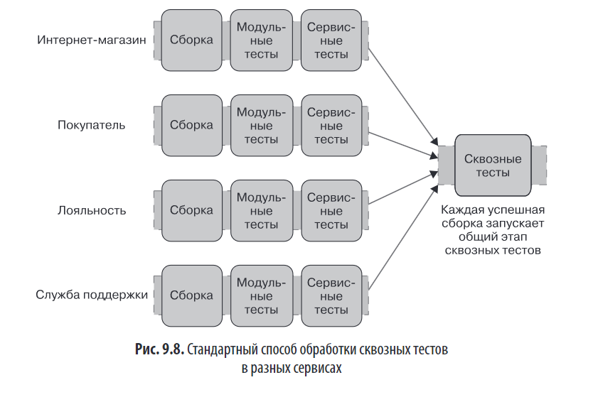
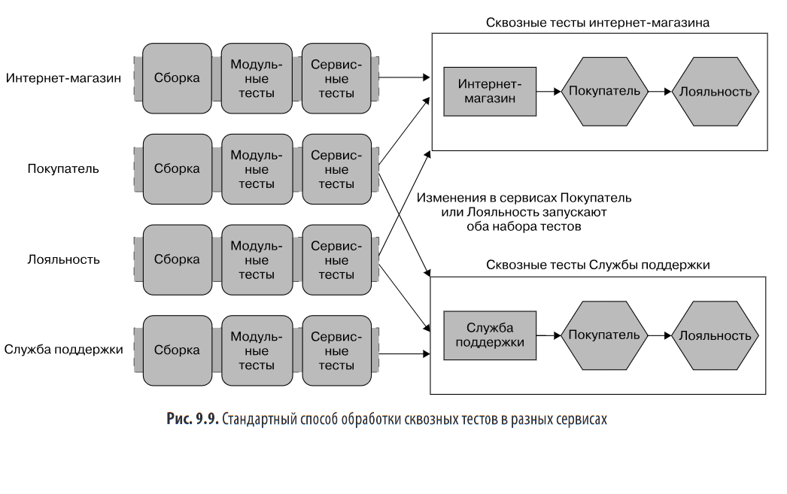
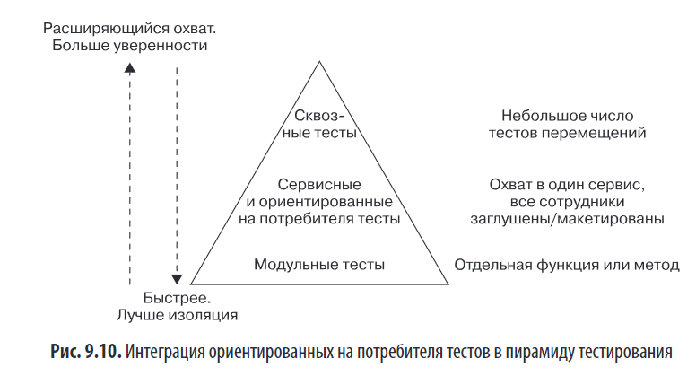

# Глава 9. Тестирование

## 🔷 1. Введение: почему тестирование в микросервисах сложнее

- Распределённые системы добавляют уровень сложности: больше компонентов, сетевые вызовы, асинхронность.
- Цель тестирования — баланс между **скоростью выпуска** и **качеством ПО**.
- Сдвиг парадигмы: от тестирования *до релиза* → к тестированию *в эксплуатации*.

---

## 🔷 2. Классификация тестов: Квадрант Марика

### Ключевые идеи:
Две оси классификации:**
- **По цели:** технологические (помогают разработчикам) vs бизнес-ориентированные (помогают нетехническим стейкхолдерам)
- **По охвату:** узкие (модульные) vs широкие (сквозные)

- **Нижняя половина** → автоматизированные, технологические тесты.
- **Верхняя половина** → бизнес-валидация, ручное/исследовательское тестирование.
- Большинство тестов фокусируется на **продакшен-валидации** (до релиза).
- Тренд: автоматизация повторяющихся задач → освобождение времени для исследовательского тестирования.

**Четыре квадранта:**
- Q1 (Технологические + Узкие): модульные тесты, тесты производительности
- Q2 (Бизнес-ориентированные + Широкие): приемочные тесты
- Q3 (Бизнес-ориентированные + Узкие): исследовательское тестирование вручную
- Q4 (Технологические + Широкие): нагрузочное тестирование, безопасность
>  **Ключевой вывод:** Большинство тестов традиционно сосредоточено на валидации *до* релиза. Однако ценность тестирования *в эксплуатации* растёт.

---

## 🔷 3. Пирамида тестов (Майк Кон)

### Характеристики по уровням:

| Уровень | Охват | Скорость | Изоляция | Сложность отладки | Уверенность в системе |
|---------|-------|----------|----------|-------------------|----------------------|
| **Модульные** | Малый | ⚡ Очень быстро | Высокая | Легко | Низкая |
| **Сервисные** | Средний | 🚶 Умеренно | Средняя | Средне | Средняя |
| **Сквозные** | Большой | 🐌 Медленно | Низкая | Сложно | Высокая |

### Эмпирическое правило:
> Количество тестов должно **увеличиваться на порядок** при движении вниз по пирамиде.

**Антипаттерн**: «Снежный конус» (перевернутая пирамида) — много медленных E2E-тестов, мало быстрых юнит-тестов → долгие циклы обратной связи.

---

## 🔷 4. Типы тестов в деталях

### 🔹 Модульные тесты (Unit)

- Проверяют одну функцию/метод изолированно.
- Не запускают микросервисы, не используют сеть/БД.
- Тысячи тестов за минуты
- **Цель**: быстрая обратная связь, поддержка рефакторинга.
- Выполняются локально при изменении кода.
-  Низкая уверенность в работе системы целиком

### 🔹 Сервисные тесты

- Тестируют один микросервис целиком **без UI**(обходится напрямую через API), обходя внешние зависимости.
- Используют **заглушки (stubs)** или **макеты (mocks)** для нижестоящих сервисов.
- **Изоляция**: сбой теста → проблема в тестируемом сервисе.

#### Заглушки vs Макеты:

| Заглушки (Stubs) | Макеты (Mocks) |
|------------------|----------------|
| Возвращают заранее заданные ответы | Проверяют, что вызов был сделан |
| Не отслеживают количество вызовов | Требуют настройки ожиданий |
| ✅ Более стабильны | ⚠️ Могут сделать тесты хрупкими |

> 💡 Инструмент: **Mountebank** — универсальный сервер заглушек (HTTP, TCP, SMTP), программируемый через API.

# Внедрение сервисных тестов подробно

## Контекст
- Юнит-тесты внедряются просто, документации много.
- Сервисные и сквозные тесты — самые интересные в контексте микросервисов.
- Сервисный тест проверяет функции **внутри одного микросервиса**.
- Пример: для теста микросервиса *Покупатель* разворачивают его экземпляр и «отрезают» микросервис *Лояльность*, чтобы сбой теста однозначно указывал на проблему именно в *Покупателе*.
- После проверки ПО автоматизированная сборка создаёт бинарный артефакт (например, образ контейнера) — развернуть его просто.
- Вопрос: что делать с заглушками нижестоящих потребителей.
- Набор сервисных тестов должен:
  1. Отключить нижестоящие сервисы.
  2. Настроить тестируемый микросервис на подключение к заглушкам.
  3. Настроить заглушки на имитацию ответов реальных сервисов.

## Макетирование или заглушки

### Заглушка (stub)
- Микросервис-заглушка отвечает заготовленными ответами на известные запросы.
- Пример: заблокированный *Лояльность* на запрос баланса клиента 123 возвращает 15 000.
- Тесту **всё равно**, вызвана заглушка 0, 1 или 100 раз.

### Макет (mock)
- Позволяет убедиться, что вызов **был сделан**.
- Если ожидаемый вызов не произошёл — тест падает.
- Требует больше «сообразительности» от псевдосервисов.
- При чрезмерном использовании приводит к уязвимости тестов.

### Когда что использовать
- Макеты полезны для проверки ожидаемых побочных эффектов (пример: при создании покупателя устанавливается баланс баллов).
- Баланс между заглушками и макетами хрупкий, опасен и в сервисных, и в модульных тестах.
- Автор **чаще использует заглушки**, макеты — редко.
- Полезно иметь инструмент, поддерживающий оба подхода.

### Терминология
- Путаница между: заглушки, макеты, подделки, шпионы, манекены.
- Джерард Месзарос объединяет их всех под термином **тестовые дублёры**.

## Более самостоятельная сервис-заглушка

### Прошлый опыт автора
- Разворачивал сервисы-заглушки сам.
- Использовал: Apache, nginx, встроенные контейнеры Jetty, веб-серверы Python из командной строки.
- Многократно повторял одну и ту же работу.

### Mountebank
- Создан Брэндоном Байарсом (Thoughtworks), сайт: http://www.mbtest.org.
- Небольшое приспособление, **программируемое через HTTP**.
- Написан на NodeJS, но вызывающему сервису это незаметно.
- При запуске ему отправляют команды на создание «самозванцев», которые:
  - отвечают на заданный порт,
  - используют определённый протокол (поддерживаются **TCP, HTTP, HTTPS, SMTP**),
  - возвращают заданные ответы.
- Поддерживает настройку ожиданий — можно использовать как макет.
- Один экземпляр mountebank поддерживает нескольких самозванцев → можно отключать несколько нижестоящих сервисов сразу.

### Применение за пределами функционального тестирования
- Capital One заменила с помощью mountebank существующую макетную инфраструктуру для крупномасштабных тестов производительности.

### Ограничение mountebank
- **Нет поддержки заглушек для протоколов обмена сообщениями**.
- Например, для проверки корректной отправки/получения события через брокер нужно другое решение.
- Здесь может помочь инструмент **Pact** (разбирается позже).

## Итог раздела
- Для тестов микросервиса *Покупатель* можно запустить его и mountebank (в роли *Лояльности*) на одной машине.
- При успешных тестах — можно разворачивать *Покупателя*.
- **Но**: остаётся вопрос вызывающих сервисов (служба поддержки, интернет-магазины) — не сломали ли мы их?
- Забыли о важных тестах на вершине пирамиды — **сквозных тестах**.

### 🔹 Сквозные тесты (End-to-End)

- Запускают **всю систему** или её значительную часть.
- Часто эмулируют действия пользователя через UI.
- **Плюс**: высокая уверенность в работоспособности.
- **Минусы**:
  - Медленные (часы/дни)
  - Хрупкие (flaky): сбои из-за сети, таймаутов, состояния гонки
  - Сложная отладка
  - Риск дублирования между командами

---

Цель тестовой пирамиды — баланс между **скоростью обратной связи** и **уверенностью в системе**.

- **Юнит-тесты:** узкий охват, быстрые, дешёвые, легко локализовать ошибки.
- **Интеграционные/E2E:** широкий охват, больше уверенности, но медленные, дорогие в поддержке и тормозят фидбэк.

**Правило:** на каждом нижнем уровне пирамиды тестов должно быть **на порядок больше**. **Оптимизация:** если тесты тормозят → заменяйте медленные широкие тесты быстрыми узкими; если баги доходят до пользователей → не хватает покрытия. **Антипаттерн «снежный конус»** (много E2E, мало юнитов) ведёт к медленной CI, долгим циклам проверки и длительным простоям при поломках.

---

# Внедрение (этих сложных) сквозных тестов

## Что такое сквозные тесты и зачем они нужны
- В микросервисной системе функциональность UI обеспечивается несколькими микросервисами.
- Цель сквозных тестов (по пирамиде Майка Кона) — сопоставить функциональность UI со всем, что под ним, и получить обратную связь о качестве **системы в целом**.

## Как их реализовать
- Нужно развернуть **несколько микросервисов вместе** и запустить тест на всю связку.
- Плюсы: больший охват → больше уверенности в работоспособности системы.
- Минусы:
  - тесты **медленнее**,
  - **сложнее диагностировать** сбой.

## Пример: новая версия микросервиса *Покупатель*
- Задача: быстро выкатить изменение, но не сломать службу поддержки и веб-магазин.
- Решение: развернуть все сервисы вместе и прогнать тесты через службу поддержки и интернет-магазин.
- Наивный вариант — просто добавить сквозные тесты в конец конвейера обслуживания клиентов (рис. 9.7).

## Проблемы наивного подхода

### Проблема 1: выбор версий других микросервисов
- Какую версию *Службы поддержки* и *Веб-магазина* использовать при тестах *Покупателя*?
- Логично — те, что сейчас в эксплуатации.
- Но что делать, если новая версия *Службы поддержки* или *Веб-магазина* уже стоит в очереди на деплой?

### Проблема 2: дублирование сквозных тестов между сервисами
- У *Покупателя* есть свой набор сквозных тестов, разворачивающий кучу сервисов.
- У других микросервисов — свои такие же наборы.
- Если они тестируют одно и то же:
  - перекрываются области покрытия,
  - **дублируется работа** по развёртыванию всех сервисов.

## Решение: «веерное» подключение конвейеров
- Несколько конвейеров «веером» подключаются к **одному общему этапу сквозных тестов**.
- Успешная сборка любого из микросервисов → запуск общих шагов сборки.
- Пример (рис. 9.8): успешная сборка любого из четырёх микросервисов запускает общий этап сквозных тестов.
- Некоторые инструменты CI с продвинутой поддержкой конвейеров реализуют веерные модели «из коробки».

## Итоговый рабочий сценарий
- При изменении сервиса:
  1. Запускаются **локальные тесты** этого сервиса.
  2. При их успехе — **интеграционные тесты**.
- Но: у сквозного тестирования **много недостатков** (разбор — далее).

---

# Проблемы и нюансы сквозных тестов

## Кто пишет сквозные тесты

### Контекст
- Тесты внутри конвейера конкретного микросервиса пишет команда-владелец.
- Но этап сквозных тестов распределён между несколькими командами — кто пишет их?

### Проблема «открытого доступа»
- Тесты становятся открытыми для всех команд без понимания работоспособности всего набора.
- Последствия:
  - всплеск количества тестовых примеров → «тестовый снежный конус»,
  - отсутствие явного владельца → результаты тестов игнорируются, сбой считают «чужой проблемой».

### Подход Эмили Баше
- Назначать конкретные сквозные тесты ответственностью конкретной команды, даже если они пересекаются с чужими микросервисами.
- Веерный этап в конвейере, но набор тестов разделён по функциональным группам между командами (рис. 9.9).

- Пример:
  - изменение *Интернет-магазина* → сквозные тесты команды магазина,
  - изменение *Службы поддержки* → тесты команды поддержки,
  - изменение *Покупателя* или *Лояльности* → запускаются **оба** набора.
- Проблема подхода: сомнительно возлагать ответственность на команду, когда сломать её тесты может чужая команда (например, изменение в *Лояльности* ломает оба набора).

### Отдельная команда тестирования — антипаттерн
- Последствия:
  - команда-разработчик отдаляется от тестирования своего кода,
  - растёт время цикла (ждут, пока тестеры напишут тесты),
  - команда-разработчик меньше вовлечена, хуже понимает, как запускать и чинить тесты.
- Автор: модель распространённая, но вред значительный.

### Итоговая рекомендация
- Не дублировать работу, но и не централизовать до отрыва команд от тестирования.
- Если можно делегировать конкретной команде — делегируйте.
- Если нельзя — рассматривайте сквозной набор как **общую кодовую базу с совместным владением**: команды свободно коммитят, ответственность за работоспособность общая.
- Встречается редко и всегда с проблемами.
- **На определённом уровне развития организации стоит отойти от совместно выполняемых сквозных тестов.**

## Как долго должны выполняться сквозные тесты

### Реальные примеры длительности
- Запуск может занимать до дня и более.
- На одном проекте автора полный регресс занимал **шесть недель**.

### Причины и последствия медлительности
- Команды редко курируют свои наборы, чтобы уменьшить дублирование.
- Редко выделяется время на ускорение тестов.
- Медленные + ненадёжные тесты → катастрофа: к моменту обнаружения сбоя разработчик уже переключился на другую задачу.

### Частичные решения
- Параллельный запуск (например, Selenium Grid).
- Не заменяет реального понимания, **что** надо тестировать, и активного удаления ненужного.

### Проблема удаления тестов
- Удаление тестов — как отмена мер безопасности в аэропорту: вызывает резкую реакцию.
- Похвалят за удаление — может быть; обвинят за пропущенный баг — точно.
- Для наборов с широким охватом умение удалять тесты необходимо.
- Пример: 20 тестов на одну функцию → половину можно выкинуть.
- Требуется качественная оценка рисков — люди в этом плохи.
- Поэтому интеллектуальное курирование широких наборов тестов происходит **невероятно редко**.

## Великое нагромождение

- Длинные сквозные тесты = длинный цикл обратной связи.
- Сбои отвлекают внимание, увеличивая общее время прогона.
- Деплоится только ПО, прошедшее все тесты → до прода доходит меньше сервисов.
- Пока чинят сломавшийся этап, накатываются новые изменения от вышестоящих команд:
  - исправление сборки усложняется,
  - объём развёртываемых изменений растёт.
- Идеал: запрет коммитов при сломанных сквозных тестах, но на практике нереально («30 разработчиков, не коммитьте 7 часов, пока чиним сборку»).
- Если разрешать коммиты на сломанную сборку — она остаётся сломанной дольше, и теряется её смысл как быстрой обратной связи.
- **Правильный ответ — ускорить набор тестов.**
- Чем крупнее релиз — тем выше риск поломки. Надо часто выпускать маленькие, хорошо протестированные изменения.
- Когда сквозные тесты мешают выпускать мелкие изменения — вреда больше, чем пользы.

## Метаверсия

- Соблазн: «Все эти версии сервисов работают вместе — выкатим их одним пакетом, дадим общий номер версии всей системе».
- Цитата Брэндона Байарса: «Теперь у вас 2.1.0 проблем».
- Принимая одновременное изменение и развёртывание нескольких сервисов, мы делаем это **нормой** и теряем главное преимущество микросервисов — **независимое развёртывание**.
- Последствия:
  - сервисы становятся связанными,
  - переплетение растёт незаметно, потому что никто не разворачивает их по отдельности,
  - развёртывание превращается в оркестровку связки,
  - итог может быть **хуже монолита**.

## Отсутствие возможности независимого тестирования

- Независимое развёртывание требует **независимого тестирования**.
- Сквозные тесты снижают автономию команд, усиливают координацию → проблемы.
- Независимость распространяется и на инфраструктуру:
  - общие тестовые среды сильно ограничены,
  - любая проблема в такой среде — серьёзные последствия.
- В идеале — у каждой команды **своя среда тестирования**.
- Исследование из книги «Ускоряйся!»: высокопроизводительные команды чаще **тестируют по запросу, не требуя интегрированной тестовой среды**.

## Следует ли избегать сквозных тестов

### Когда ещё окей
- При небольшом количестве микросервисов сквозные тесты управляемы.

### Когда становится плохо
- При 3, 4, 10, 20 сервисах наборы тестов раздуваются.
- В худшем случае — **декартов взрыв** сценариев.
- Даже при малом числе сервисов проблемы появляются, если тесты используются несколькими командами.
- Общий сквозной набор подрывает цель независимого развёртывания: команда ждёт прогона тестов, которые ей не принадлежат.

### Какую ключевую проблему решают сквозные тесты
- Гарантия, что изменения не повредят потребителям.

### Что с этим делать
- Явные схемы интерфейсов (см. [главу 5, «Структурные и семантические разрывы контрактов»](./ГЛАВА%205%20Реализация%20коммуникации%20микросервисов.md#типы-разрывов-нарушений-контракта)) выявляют **структурные** нарушения и снижают потребность в сквозных тестах.
- Схемы **не ловят семантические** сбои — изменения поведения с обратной несовместимостью.
- Сквозные тесты ловят семантические сбои, но дорого.
- Нужен тип теста, который ловит семантику с меньшим охватом и лучшей изоляцией → быстрее обратная связь.
- Решение — **контрактные тесты и ориентированные на потребителя контракты** (далее).

---

# Контрактное тестирование  (CDC — Consumer-Driven Contracts)

## Что это
- Команда-потребитель внешнего сервиса пишет тесты с описанием **ожидаемого поведения** внешнего сервиса.
- Ключевое свойство: тесты должны успешно проходить как с заглушками/макетами, так и с реальным внешним сервисом.

## Контракты, ориентированные на потребителя (CDC)

### Суть
- Contract tests = программное представление ожиданий **потребителя** (вышестоящий микросервис) от **производителя** (нижестоящий).
- Команда потребителя передаёт контрактные тесты команде производителя.
- Производитель запускает эти тесты как часть **своего** набора при каждой сборке.
- Тесты запускаются **изолированно, только с одним производителем** → быстрее и надёжнее сквозных, могут их заменить.

### Пример
- У микросервиса *Покупатель* два потребителя: *Служба поддержки* и *Интернет-магазин*.
- Создаётся два набора тестов — по одному на каждого потребителя.
- Запускается только сам *Покупатель*, внешние зависимости отключены.
- Эффективный охват ≈ как у сервисных тестов, характеристики производительности схожие.

### Организационный аспект
- Хорошая практика — совместная работа команд производителя и потребителей над тестами.
- CDC:
  - устанавливают чёткие линии связи и сотрудничества между командами,
  - делают существующую межкомандную коммуникацию **явной**,
  - представляют собой явное напоминание о **законе Конвея**.

### Место в пирамиде
- CDC — на том же уровне, что сервисные тесты, но с другой направленностью (рис. 9.10).
- Фокус: **как потребитель использует сервис**.
- Триггер поломки отличается от сервисных тестов: при падении CDC в сборке *Покупателя* сразу видно, какого потребителя это затронет.
- Варианты реакции: починить или начать обсуждение введения критического изменения (см. раздел «Обработка изменений между микросервисами», глава 5).
- **Итог:** CDC позволяют ловить критические изменения до релиза **без** дорогого сквозного тестирования.

## Pact

### Общее
- Сайт: https://pact.io.
- Ориентированный на потребителя тестовый инструмент.
- Изначально разработан в realestate.com.au, сейчас open source.
- Изначально только Ruby + HTTP. Сейчас поддерживает: **JVM, JavaScript, Python, .NET** и обмен сообщениями.

### Как работает
1. Определяются ожидания производителя через DSL на одном из поддерживаемых языков.
2. Запускается **локальный сервер Pact**, в него передаются ожидания → генерируется **файл спецификации Pact** (формальная JSON-спецификация).
3. Файл можно написать руками, но удобнее через SDK.

### Побочная польза локального сервера
- Локальный макет-сервер, генерирующий Pact-файл, **сам работает как локальная заглушка** нижестоящих микросервисов.
- Может заменить mountebank и самописные заглушки/макеты.

### Сторона производителя
- Производитель использует JSON-спецификацию Pact, чтобы вызвать свой микросервис и проверить ответы на соответствие ожиданиям потребителя.
- Нужен доступ к Pact-файлу.
- Потребитель и производитель — в **разных сборках** (см. «Сопоставление исходного кода и сборок с микросервисами», глава 7).
- Варианты доставки файла:
  - положить в репозиторий артефактов CI/CD,
  - использовать **Pact Broker** (https://oreil.ly/kHTkY).

### Pact Broker
- Хранит **несколько версий** Pact-спецификаций.
- Позволяет тестировать CDC против разных версий потребителей (например, прод-версия + свежесобранная).
- Показывает, **когда контракты были проверены**.
- Знает об отношениях потребитель–производитель → показывает **зависимости между микросервисами**.

## Другие варианты

### Spring Cloud Contract
- Ссылка: https://oreil.ly/fjufx.
- В отличие от Pact, полезен только в **чистой экосистеме JVM**.
- Pact изначально проектировался под разные технологические стеки.

# Дело в разговорах

## CDC как инструмент коммуникации
- В Agile пользовательские истории — фундамент для обсуждений. CDC работают так же.
- CDC упорядочивают набор дискуссий о том, как должен выглядеть API сервиса.
- При нарушении контрактов они становятся отправной точкой обсуждения дальнейшего развития API.

## Требования к среде
- CDC требуют **хорошей коммуникации и доверия** между потребителем и производителем.
- Одна команда / один человек на обеих сторонах — проблем нет.

## Ситуации, где CDC буксуют
- **Взаимодействие с третьей стороной** с низкой частотой общения или низким доверием:
  - возможно, придётся ограничиться интеграционными тестами с широким охватом вокруг ненадёжного компонента.
- **Публичный API с тысячами потребителей**:
  - придётся самому играть роль потребителя или работать с подмножеством реальных потребителей при определении тестов.
  - Отключение огромного числа внешних потребителей — плохая идея → важность CDC **возрастает**.

# Заключительное слово (про сквозные тесты)

- У сквозных тестов много недостатков, их количество растёт с числом подвижных элементов.
- По опыту больших внедрений микросервисов: **большинство команд со временем полностью отказываются** от сквозных тестов в пользу:
  - явных схем и CDC,
  - тестирования в эксплуатации,
  - поэтапных методов доставки (канареечные релизы и т. п.).
- Сквозные тесты перед релизом можно воспринимать как **тренажёр**:
  - пока осваиваете CDC, мониторинг и развёртывание — они полезная страховочная сетка,
  - снижение риска в обмен на рост затрат времени.
- По мере улучшения других практик и роста относительной стоимости сквозных тестов — уменьшайте зависимость от них вплоть до полного отказа.
- Легкомысленный и поспешный отказ — плохая идея. Думать над объёмом сквозного тестирования надо **долго и упорно**.

---

## Проблема
- С ростом количества микросервисов **локальный запуск** становится болезненн

# От предварительного тестирования к эксплуатационному

## Проблема классического подхода
- Исторически фокус — тестирование **до релиза**.
- Тесты = модели для проверки системы (функциональные и нефункциональные).
- Если модели несовершенны:
  - ошибки проскальзывают в прод,
  - появляются новые режимы сбоев,
  - пользователи используют систему неожиданным образом.

## Снижение отдачи от наращивания предварительных тестов
- Типичная реакция на проблемы — наращивать тесты и уточнять модели.
- В какой-то момент подход упирается в **снижающуюся отдачу**.
- Свести вероятность сбоя к нулю предварительным тестированием **невозможно**.
- Сложность распределённой системы такова, что выявить все потенциальные проблемы **до** эксплуатации может быть нереально.

## Переосмысление роли тестов
- Цель теста — подтвердить, что ПО достаточно качественное и соответствует требованиям.
- Хочется получить обратную связь **как можно раньше**, до того, как с проблемой столкнётся пользователь.
- Отсюда — большой объём тестов перед релизом.
- Но ограничиваясь только предварительным тестированием:
  - сокращаем места обнаружения проблем,
  - исключаем тестирование качества **в самом важном месте — в проде**.
- Вывод: нужно **тестировать и в эксплуатации**, безопасным способом → обратная связь качественнее, чем у предварительного тестирования.

# Виды эксплуатационных тестов

## Проверка соединения (ping)
- Простая проверка, что микросервис запущен.
- Уже своего рода тест, но обычно воспринимается как операторская задача.

## Дымовое тестирование (smoke test)
- Проводится в рамках развёртывания.
- Гарантирует, что развёрнутое ПО работает правильно.
- Выполняется на **реальном работающем** ПО, до открытия пользователям.

## Канареечные релизы (см. главу 8)
- Механизм, связанный с тестированием.
- Новая версия выпускается для небольшой части пользователей → «тестирование» работоспособности.
- При успехе — открытие доступа большему числу клиентов, возможно автоматически.

## Внедрение фейкового поведения пользователя
- Пример: размещение заказа псевдоклиентом, регистрация искусственного пользователя в реальной системе.
- Проверяет, что система работает как должна.
- Часто отвергается из-за страха влияния на прод.
- При создании — обязательно обеспечить **безопасность**.

# Обеспечение безопасности тестирования в эксплуатации

## Общее правило
- Тесты в проде **не должны вызывать сбоев** — ни через нестабильность, ни через искажение данных.

## По видам тестов

### Ping
- Скорее всего безопасен.
- Если ping вызывает нестабильность — это уже серьёзная проблема (если только сам не устроил DoS).

### Дымовые тесты
- Как правило безопасны — выполняются до релиза.
- Связано с принципом **отделения развёртывания от релиза** (см. «Отделение развертывания от релиза», глава 8).
- Тесты на развёрнутом, но ещё не выпущенном ПО — безопасны.

### Фейковое поведение пользователя
- Самый пугающий вид.
- Решение: **не доводить** до реальных побочных эффектов — заказ не отправлять, оплату не проводить.
- Требует заботы и внимания, но при правильной реализации очень полезен.
- Подробнее — в разделе «Семантический мониторинг» главы 10.

---

# Среднее время восстановления против среднего времени между отказами

## Идея раздела
- Методы **сине-зелёного развёртывания** и **канареечных релизов**:
  - приближают тестирование к пользовательской среде (или помещают в неё),
  - дают инструменты для обработки сбоя, если он произойдёт.
- Использование таких подходов — **молчаливое признание**: обнаружить и устранить все проблемы до релиза невозможно.

## Ключевой компромисс: MTBF vs MTTR
- Иногда вложение ресурсов в **более качественное устранение возникающих проблем** полезнее, чем добавление новых автоматизированных функциональных тестов.
- В мире веб-операций это называют компромиссом между:
  - **MTBF** (mean time between failures) — среднее время наработки на отказ,
  - **MTTR** (mean time to repair) — среднее время восстановления.

## Методы сокращения MTTR
- Могут быть простыми:
  - **мгновенный откат**,
  - **хороший мониторинг** (глава 10).
- Смысл: обнаружили проблему в проде → откатили на ранней стадии → уменьшили негативное влияние на клиентов.

## Баланс MTBF/MTTR
- Соотношение у разных организаций разное.
- Зависит от понимания **истинных последствий** сбоев.
- Типичная проблема: компании тратят время на функциональные тесты, но почти не улучшают мониторинг и восстановление.
- Итог: число дефектов сокращается, но:
  - все дефекты не устраняются,
  - к работе с дефектами в проде организация не готова.

## Другие компромиссы

### Когда тестирование может быть излишним
- Перед созданием надёжного ПО сначала нужно доказать **идею или бизнес-модель**.
- В такой среде:
  - влияние незнания, работает ли идея, **выше**, чем влияние дефекта в проде,
  - тестирование может оказаться излишним.
- В таких ситуациях **может быть разумно вообще избегать тестирования до релиза**.

---

# Кросс-функциональное тестирование

## Что такое нефункциональные требования
- Обобщающий термин для характеристик системы, которые нельзя реализовать как обычную фичу.
- Примеры:
  - допустимая задержка веб-страницы,
  - количество поддерживаемых страницей пользователей,
  - доступность UI для людей с ограниченными возможностями,
  - безопасность данных клиентов.

---

## Термин «кросс-функциональные требования» (CFR)
- Автору не нравится термин «нефункциональный» — многие из этих вопросов функциональные по природе.
- Сара Тарапоревалла предложила термин **cross-functional requirements (CFR)**.
- Лучше отражает суть: такое поведение системы **возникает только в результате сквозной работы**.

## Когда CFR проявляются и как их ловить
- Большинство CFR реально проявляются только **после релиза**.
- Всё равно можно определить стратегии тестирования, чтобы оценить движение к цели.
- Тесты такого рода — квадрант **«Тестирование свойств»**.
- Пример — **тест производительности** (разбирается далее).

## CFR на уровне отдельного микросервиса
- Часть CFR имеет смысл отслеживать индивидуально по сервисам.
- Пример компромисса:
  - платёжный сервис — срок службы значительно выше требуемого,
  - сервис рекомендаций музыки — допустим простой 10+ минут, бизнес выживет без рекомендаций «похожих на Metallica».
- Такие компромиссы сильно влияют на проектирование и развитие системы.
- **Детализированный характер микросервисной архитектуры даёт больше шансов найти эти компромиссы.**
- CFR, за которые отвечает микросервис/команда, обычно становятся частью **SLO (service-level objective)**.
- Подробнее — «Все ли у нас в порядке?» в главе 10.

## Пирамида тестов для CFR
- Тесты CFR тоже следуют пирамидальной модели.
- Некоторые тесты **должны** быть сквозными — например, **нагрузочные**.
- Для других это необязательно:
  - после выявления узкого места в сквозном нагрузочном тесте — написать **тест с меньшим охватом**, который ловит эту проблему в будущем.
- Пример быстрых тестов: проверка HTML-разметки на наличие элементов доступности для пользователей с ограниченными возможностями — выполняется очень быстро, без сетевых обходов.

## Рекомендация
- Разработчики часто думают о CFR **слишком поздно**.
- Автор настоятельно советует:
  - изучать CFR **как можно раньше**,
  - **регулярно пересматривать** их.

---

##  Тесты производительности

## Зачем они нужны
- Проводятся явно, чтобы убедиться, что часть CFR выполнимы.
- При декомпозиции на микросервисы растёт количество вызовов через границы сети:
  - было: один вызов БД,
  - стало: 3–4 вызова через сеть к другим сервисам + соответствующие вызовы БД.
- Это **снижает скорость** работы системы.

## Почему особенно критично в микросервисах
- Важно отслеживать **источники задержек**.
- Если какая-то часть цепочки синхронных вызовов тормозит — это влияет на всё и может дать значительные последствия.
- Поэтому тесты производительности **важнее**, чем в монолите.

## Типичная ловушка
- Тестирование откладывают, потому что одной системы изначально недостаточно для тестов.
- Автор понимает причину, но предупреждает: часто всё заканчивается тем, что **тесты производительности делают только прямо перед первым запуском**,

---

# Тесты надёжности

## Контекст
- Архитектура микросервиса настолько надёжна, насколько надёжно её **самое слабое звено**.
- Поэтому в микросервисы встраивают механизмы повышения надёжности → растёт надёжность всей системы.
- Подробнее — раздел «Шаблоны стабильности», глава 12.

## Примеры механизмов надёжности
- **Несколько экземпляров** микросервиса за балансировщиком нагрузки — сбой одного экземпляра становится допустимым.
- **Автоматические выключатели** (circuit breakers) — программная обработка ситуаций, когда нельзя связаться с нижестоящими микросервисами.

## Суть тестов надёжности
- Тесты, **воссоздающие определённые сбои**, чтобы убедиться: микросервис продолжает работать как единое целое.

## Сложность реализации
- По природе такие тесты сложнее.
- Пример: искусственный **сетевой тайм-аут** между тестируемым микросервисом и внешней заглушкой.

---

## # Резюме

## Ключевые принципы
- Для быстрой обратной связи **оптимизируйте и разделяйте типы тестов** соответствующим образом.
- Избегайте сквозных тестов, охватывающих более одной команды — используйте **CDC** вместо них.
- Используйте CDC как **отправные точки для дискуссий** между командами.
- Ищите компромисс между:
  - усилиями на тестирование,
  - скоростью обнаружения проблем в эксплуатации,
  - то есть балансом **MTBF vs MTTR**.
- Дайте шанс **тестированию в эксплуатации**.

### ✅ Делать:
- Оптимизировать пирамиду тестов: больше быстрых юнит-тестов, меньше медленных E2E.
- Использовать **CDC (Pact)** вместо сквозных тестов для проверки совместимости.
- Внедрять **тестирование в эксплуатации** (канареечные релизы, синтетические транзакции).
- Балансировать усилия между предотвращением сбоев (MTBF) и быстрым восстановлением (MTTR).
- Регулярно курировать наборы тестов: удалять дубли, ускорять, делать стабильными.
- Учитывать кросс-функциональные требования на ранних этапах.

### ❌ Избегать:
- «Снежного конуса» — переизбытка медленных E2E-тестов.
- Централизованной команды тестирования, оторванной от разработки.
- Игнорирования flaky-тестов — они подрывают доверие к тестовой базе.
- Одновременного развёртывания нескольких сервисов «пакетом» — теряется независимость.

---

> 🎯 **Главная мысль главы**:  
> *Тестирование микросервисов — это не про «больше тестов», а про «правильные тесты в нужном месте».  
> Стремитесь к быстрой обратной связи, изоляции сбоев и явной коммуникации между командами.  
> И помните: идеального тестирования не существует — важно находить баланс между риском, скоростью и качеством.*
