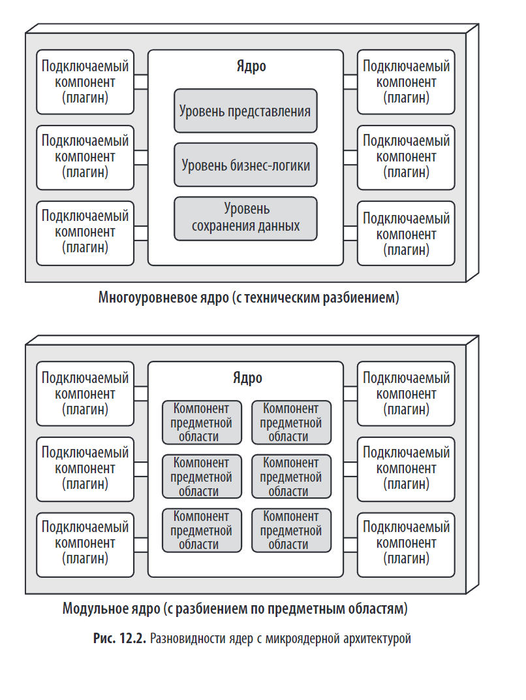
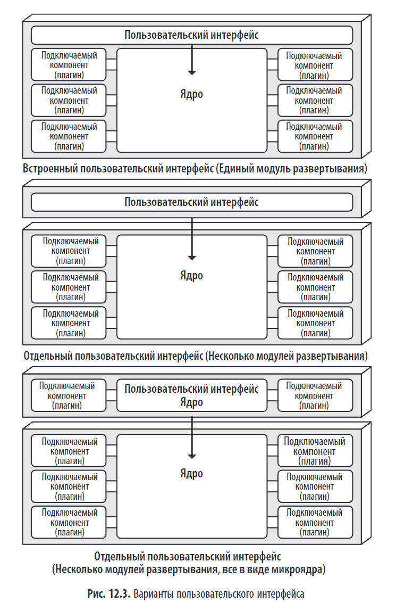
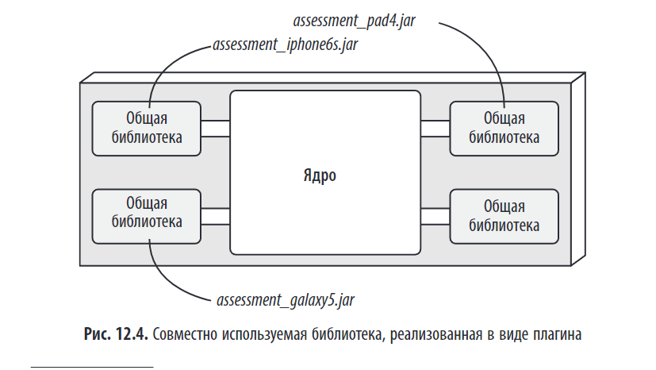

> *"Микроядерный архитектурный стиль (также известный как архитектура плагинов) был придуман несколько десятилетий назад и широко используется в настоящее время."*

---

## Краткое содержание

Глава 12 посвящена **микроядерной архитектуре** — монолитному стилю, в котором логика приложения разделяется между **маленьким ядром** и **независимыми подключаемыми компонентами (плагинами)**.

---

## 🏗️ Что такое микроядерная архитектура?

**Микроядерная архитектура** — это стиль, при котором система состоит из двух основных частей:

1. **Ядро (Core)** — минимальное, отвечает за базовую функциональность, загрузку и управление плагинами.  
2. **Подключаемые компоненты (Плагины)** — расширяют функциональность ядра.

> 💬 *"Микроядерный архитектурный стиль относится к сравнительно простой монолитной архитектуре, состоящей из двух архитектурных компонентов: основной системы, или ядра, и подключаемых компонентов (плагинов)."*

---

## 🔄 Топология

---

## 🔧 Основные элементы

### 1. **Ядро системы (Core)**

- Самая маленькая и простая часть системы.  
- Отвечает за:
  - Загрузку плагинов.
  - Управление жизненным циклом плагинов.
  - Обеспечение базовых сервисов (например, логирование, безопасность).
  - Хранение **реестра** и **контрактов**.

В зависимости от размера и сложности ядро может быть реализовано в виде многоуровневой архитектуры или в виде модульного монолита. В ряде случаев ядро может быть разбито на отдельно развертываемые сервисы предметных областей, где каждый сервис содержит конкретный подключаемый компонент, специфичный для определённой предметной области. Уровень представления ядра может быть встроен в само ядро или же реализован в виде отдельного пользовательского интерфейса, при этом ядро предоставляет бэкенд-сервисы. Собственно говоря, отдельный пользовательский интерфейс может быть также реализован в микроядерном архитектурном стиле.

> 💬 *"Ядро должно быть как можно меньше, чтобы уменьшить цикломатическую сложность и повысить сопровождаемость."*

---

### 2. **Подключаемые компоненты (Плагины)**

- Независимые модули, которые добавляют функциональность.  
- Могут быть:
  - Предметными (например, `PaymentMethodPlugin`).
  - Техническими (например, `LoggingPlugin`).
- Загружаются и управляются ядром.  
- У подключаемых компонентов могут быть свои собственные хранилища данных.

В идеале подключаемые компоненты должны быть абсолютно автономными и между ними не должно быть никаких зависимостей.

> 💬 *"Подключаемые компоненты могут быть добавлены, удалены или изменены без пересборки ядра."*

---

## Совместно используемая библиотека, реализованная в виде плагина

### Определение

**Совместно используемая библиотека, реализованная в виде плагина** — это подход, при котором **общая функциональность** (например, логика для определённого типа устройства) выносится в **отдельную библиотеку**, которая загружается и используется **ядром системы** как **подключаемый компонент (плагин)**.

> 💬 *"Одна из разновидностей подключаемого компонента — это общая библиотека, реализованная в виде плагина."*

### 🧩 Пример: Приложение для утилизации электроники

Рассмотрим приложение, которое оценивает стоимость старых электронных устройств.

- **Ядро** приложения отвечает за общий процесс оценки: ввод данных, вывод результата, управление плагинами.  
- **Плагины** — это библиотеки, реализующие логику оценки для конкретных устройств:
  - `assessment_iphone6s.jar`
  - `assessment_galaxy5.jar`
  - `assessment_pad4.jar`

---

## 🔧 Как это работает?

1. **Ядро** загружает все доступные библиотеки-плагины (например, из папки `plugins/`).  
2. Плагины регистрируются в **реестре**.  
3. При запросе оценки для iPhone 6s ядро находит соответствующий плагин по имени или метаданным.  
4. Ядро вызывает метод `assess()` у плагина через **общий контракт**.  
5. Плагин возвращает результат, который ядро отображает пользователю.

---

### 🔐 Контракт между ядром и плагином

Чтобы ядро могло работать с любым плагином, должен существовать **общий контракт** (интерфейс).

---

### 3. **Реестр (Registry)**

- Центральное хранилище, в котором ядро регистрирует доступные плагины.  
- Позволяет ядру находить и загружать плагины.

---

### 4. **Контракты (Contracts)**

- Чёткие интерфейсы, которые определяют, как ядро и плагины взаимодействуют.  
- Гарантируют, что плагин будет работать с ядром.

> 💬 *"Контракты обеспечивают слабую связанность между ядром и плагинами."*

---

## ✅ Преимущества

| Преимущество                  | Описание                                                                                   |
|------------------------------|-------------------------------------------------------------------------------------------|
| **Независимость разработки** | Команды могут разрабатывать плагины для разных устройств независимо.                      |
| **Простота добавления новых функций** | Новый тип устройства — это просто новая библиотека, без изменения ядра.           |
| **Лёгкость замены и обновления** | Можно обновить только один плагин, не пересобирая всё приложение.                  |
| **Изоляция логики**          | Логика каждого устройства изолирована, что упрощает тестирование и отладку.                |

---

## Оценки архитектурных свойств

### 📊 Оценка архитектурных свойств микроядерной архитектуры

| Архитектурное свойство   | Оценка в звёздах | Обоснование                                                                                                                                                                                                                                                                                            |
|--------------------------|------------------|--------------------------------------------------------------------------------------------------------------------------------------------------------------------------------------------------------------------------------------------------------------------------------------------------------|
| **Тип разбиения**        | Предметный и технический | Микроядерная архитектура уникальна тем, что может иметь как предметное, так и техническое разделение. Хотя для большинства микроядерных архитектур характерно техническое разделение, предметное разделение также присутствует благодаря сильному изоморфизму между предметной областью и архитектурой. |
| **Количество квантов**   | 1                | В микроядерной архитектуре всегда используется только один архитектурный квант, поскольку все запросы проходят через ядро, прежде чем попасть в независимые подключаемые компоненты (плагины).                                                                                                         |
| **Развертываемость**     | ⭐⭐⭐              | Плагины можно легко добавлять, удалять или изменять без необходимости перезапуска всего монолита. Это снижает общий риск развертывания, особенно если плагины развертываются во время работы приложения. Однако сама монолитная структура системы ограничивает гибкость масштабирования.                 |
| **Адаптируемость**       | ⭐                | Низкая оценка из-за монолитности системы. Изменения могут повлиять на всю систему.                                                                                                                                                                                                                      |
| **Эволюционность**       | ⭐⭐⭐              | Высокая оценка благодаря возможности легко добавлять новые функции с помощью плагинов. Плагины можно заменять или модифицировать независимо от других частей системы.                                                                                                                                   |
| **Отказоустойчивость**   | ⭐                | Низкая оценка из-за монолитности. Сбой в одном плагине может повлиять на работу всего приложения.                                                                                                                                                                                                       |
| **Модульность**          | ⭐⭐⭐              | Высокая оценка, так как каждый плагин выполняет одну задачу и может быть изменён/заменён независимо от других.                                                                                                                                                                                         |
| **Общие затраты**        | ⭐⭐⭐⭐⭐            | Дешевле, чем распределённые архитектуры, поскольку система монолитная и простая в создании и сопровождении.                                                                                                                                                                                            |
| **Производительность**   | ⭐⭐⭐              | Чуть выше среднего уровня, так как микроядерные приложения обычно невелики по размеру и не подвержены антипаттерну «архитектурная воронка». Также можно упростить систему, отключив ненужную функциональность.                                                                                          |
| **Надежность**           | ⭐⭐⭐              | Средняя оценка, так как отсутствие сетевого трафика снижает сложность, но монолитное развёртывание увеличивает риск сбоя всей системы.                                                                                                                                                                 |
| **Масштабируемость**     | ⭐                | Низкая оценка из-за монолитности. Масштабирование возможно только до определённого предела.                                                                                                                                                                                                             |
| **Простота**             | ⭐⭐⭐⭐             | Очень высокая оценка, так как структура проста и понятна. Ядро остаётся минимальным, а сложная логика реализована в плагинах.                                                                                                                                                                           |
| **Тестируемость**        | ⭐⭐⭐              | Средняя оценка, так как плагины можно тестировать по отдельности, но для полноценного тестирования требуется сборка монолита.                                                                                                                                                                          |

---

## 🧩 Примеры использования

1. **IDE** (Eclipse, IntelliJ IDEA) — плагины для языков программирования, отладки и форматирования.  
2. **Браузеры** (Chrome, Firefox) — расширения для блокировки рекламы, менеджеры паролей.  
3. **Системы управления задачами** (Jira) — плагины для интеграции с CI/CD, дашборды.  
4. **Системы обработки исков** — разные плагины для разных юрисдикций.

> 💬 _"Можно привести бесчисленное множество примеров продуктового программного обеспечения, но как обстоят дела с крупными бизнес-приложениями? Микроядерная архитектура применима и к ним."_

---

## 🛠️ Практические рекомендации

### 1. **Сделайте ядро минимальным**

- Не размещайте бизнес-логику в ядре.  
- Перенесите сложные задачи в плагины.

### 2. **Определите чёткие контракты**

- Используйте интерфейсы и управление версиями.  
- Поддерживайте обратную совместимость.

### 3. **Используйте реестр**

- Позволяет динамически загружать плагины и управлять ими.

### 4. **Решайте проблемы с чужими плагинами**

- Если плагин не соответствует требованиям, создайте **конвертер**.

> 💬 _"В таких случаях часто создается конвертер между контрактом плагина и вашим стандартным контрактом..."_