> *"Архитектура на основе сервисов (service-based) представляет собой вариант архитектуры микросервисов и считается одной из наиболее прагматичных, главным образом из-за своей гибкости."*

## Краткое содержание
Глава 13 посвящена **архитектуре на основе сервисов** — распределённому стилю, при котором приложение разбивается на несколько **крупномодульных, отдельно развертываемых сервисов предметной области**.   Архитектура на основе сервисов является распределенной, но при этом у нее нет такого же уровня сложности и затратности, как, например, у микросервисов или архитектур, управляемых событиями, что делает ее оптимальным выбором для многих бизнес-приложений. Множество вариантов топологии делают архитектурный стиль на основе серви- сов, наверное, наиболее гибким архитектурным стилем.

---

## 🏗️ Что такое архитектура на основе сервисов?

**Архитектура на основе сервисов** — это распределённый архитектурный стиль, при котором:
- Приложение разбивается на **отдельно развертываемые сервисы**.
- Каждый сервис соответствует **конкретной предметной области** (например, "Оценка устройства", "Статус заказа").
- Сервисы **крупномодульные**, в отличие от мелких микросервисов.

> 💬 *"Сервисы в этом архитектурном стиле представлены, как правило, независимыми и отдельно развертываемыми крупномодульными «порциями приложения»..."*

---

## 🖼️ Топология (Рис. 13.1)
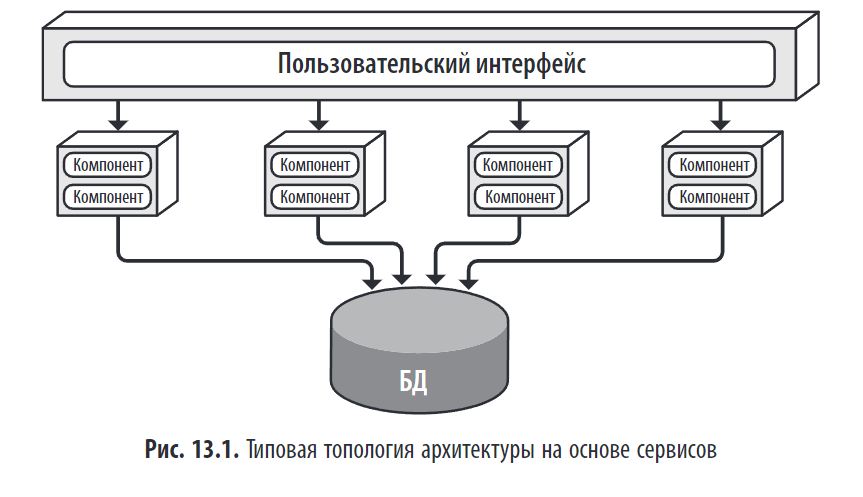
> 📌 **Рис. 13.1**: Типовая топология — отдельно развернутого пользовательского интерфейса, отдельно развернутых удаленных крупномодульных сервисов и монолитной базы данных

---

## 🔧 Основные элементы

### 1. **Сервисы предметной области (Domain Services)**

- Крупномодульные, отдельно развертываемые.
- Каждый отвечает за одну предметную область.
- Примеры: `Quoting`, `ItemStatus`, `Assessment`.

> 💬 _"Каждый сервис, являясь отдельно развернутым модулем программы, ограничен конкретной предметной областью..."_
> Поскольку сервисы обычно совместно используют единую монолитную базу данных, их число в контексте приложения чаще всего варьируется от 4 до 12 единиц, то есть в среднем используется около 7 сервисов.

### 2. **Пользовательский интерфейс**

- Отдельно развертываемый.
- Обращение к сервисам осуществляется с помощью REST,RPC,SOAP также может встречаться и API-уровень, состоящий из прокси-сервера или шлюза

### 3. **База данных**

- **Часто одна и общая** для всех сервисов.
- Позволяет использовать SQL-запросы и соединения, как в монолите.
- Может быть разбита на части, если данные одного сервиса не нужны другим.

> 💬 _"Одним из наиболее важных аспектов архитектуры на основе сервисов является то, что она обычно использует централизованную общую базу данных."_

---

## 🔄 Варианты топологии

| Вариант                                                                                           | Описание                     |
| ------------------------------------------------------------------------------------------------- | ---------------------------- |
| **Общая БД**                                                                                      |                              |
| Единый монолитный пользовательский интерфейс(Разбиение интерфейса - **Общая БД**)                 | 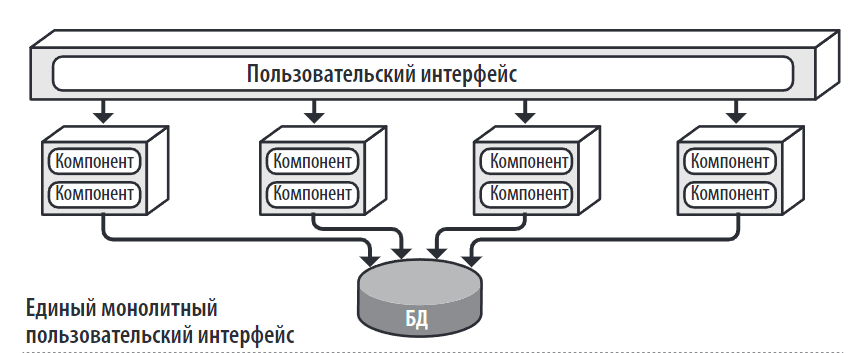 |
| Пользовательский интерфейс, основанный на предметных областях(Разбиение интерфейса -**Общая БД**) | 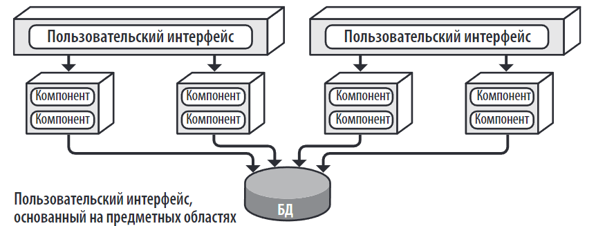 |
| Пользовательский интерфейс, основанный на сервисах(Разбиение интерфейса - **Общая БД**)           | 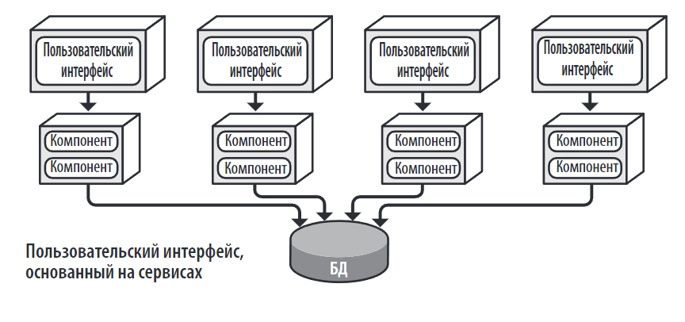 |
| **Раздельные БД**                                                                                 |                              |
| **Раздельные БД**                                                                                 | 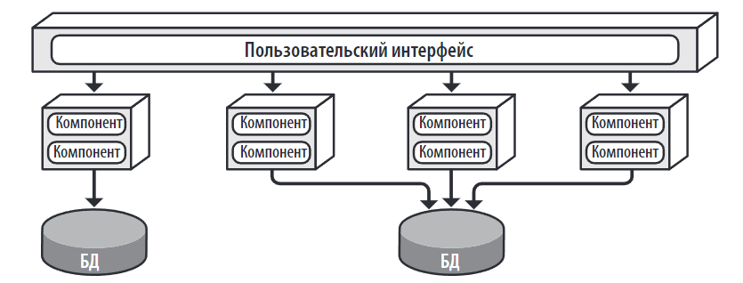 |
| **Раздельные БД**                                                                                 | 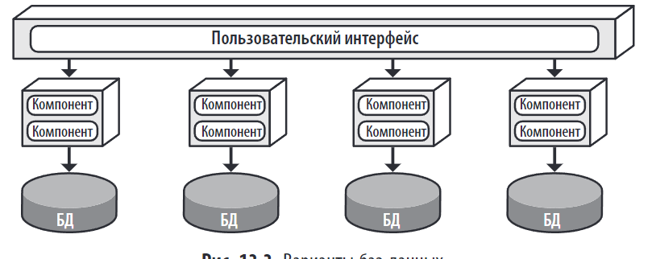 |
| Добавление API уровня                                                                             | 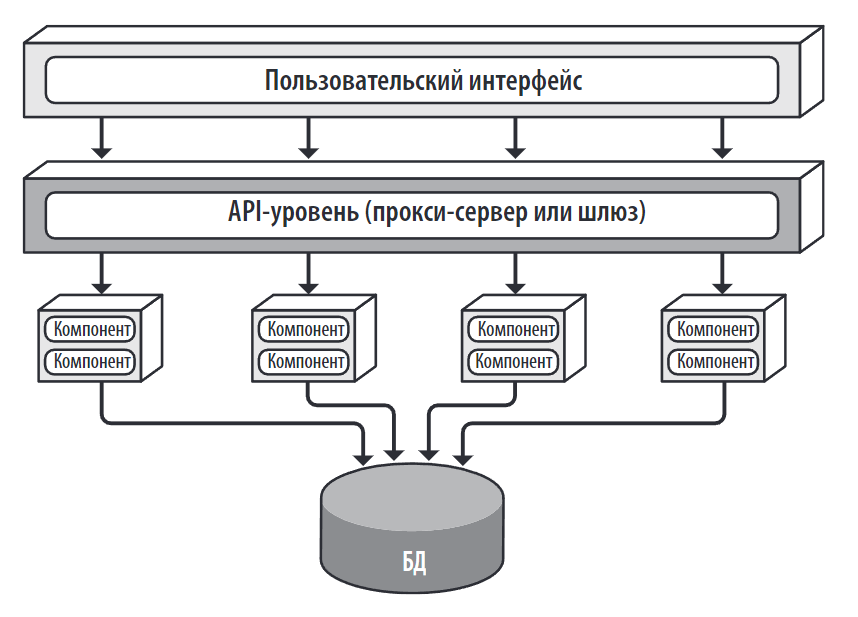 |

| Вариант                                      | Описание                                                                                            |     |
| -------------------------------------------- | --------------------------------------------------------------------------------------------------- | --- |
| Единый монолитный пользовательский интерфейс |                                                                                                     |     |
| **Общая БД**                                 | Все сервисы используют одну базу данных (наиболее распространённый случай).                         |     |
| **Раздельные БД**                            | У каждого сервиса есть своя база данных (как у микросервисов).                                      |     |
| **Многоуровневые сервисы**                   | Каждый сервис построен по многоуровневой схеме (пользовательский интерфейс, бизнес-логика, данные). |     |
| **Модульные сервисы**                        | Сервисы разделены по предметным областям (как модульный монолит).                                   |     |

---
## 🆚 Дизайн сервисов и гранулярность

1. Поскольку сервисы предметной области в архитектуре на основе сервисов обычно крупномодульные, каждый из них разрабатывается с использованием многоуровневого стиля архитектуры, состоящего из уровня внешнего API- интерфейса, уровня бизнес-логики и уровня сохранения данных. 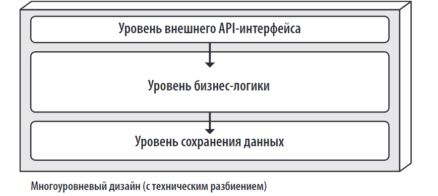

2. Еще один популярный подход к проектированию заключается в предметном разбиении каждого сервиса на основе предметных подобластей, что похоже на модульный монолитный архитектурный стиль
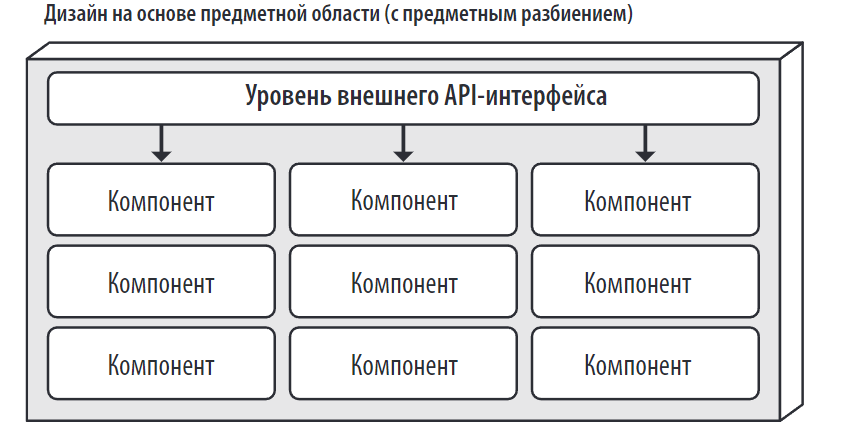
---

## 🆚 Отличие от микросервисов

[Сравнение ACID vs. BASE — транзакции в архитектуре на основе сервисов и микросервисах](../../../topics/Сравнение%20ACID%20vs.%20BASE%20—%20транзакции%20в%20архитектуре%20на%20основе%20сервисов%20и%20микросервисах.md)

| Сервисы                                                                                                                                                              | Микросервисы                                                                                                                                                                                                                                                                                                                 |
| -------------------------------------------------------------------------------------------------------------------------------------------------------------------- | ---------------------------------------------------------------------------------------------------------------------------------------------------------------------------------------------------------------------------------------------------------------------------------------------------------------------------- |
| Единичный запрос к API - затем выполняется вся необходимая функция бизнеса - Единый бизнес-запрос: разместить заказ, создать. внешним управлением на уровне сервисов | В архитектурном стиле микросервисов выполнение запроса было бы похоже на запуск управления множеством отдельно развернутых удаленных узкоспециализированных сервисов. внутренним управлением на уровне классов                                                                                                               |
| обычные ACID-транзакции базы данных  связаны с подтверждениями и откатами в рамках отдельно взятого предметного сервиса.                                             | обладает более высокой степенью детализации сервисов и использует технологию распределенной транзакции, известную как BASE-транзакция оторая полагается на окончательную согласованность, поэтому в ней не поддерживается такой же уровень сохранности базы данных, как у ACID- транзакций в архитектуре на основе сервисов. |
| Будучи крупномодульными, предметные сервисы позволяют обеспечить более высокий уровень достоверности и согласованности данных,                                       |                                                                                                                                                                                                                                                                                                                              |

---
## 🛠️ **Разбиение базы данных

- Можно разбить общую БД на **отдельные БД для каждого сервиса**, если:
    - Данные одного сервиса не нужны другим.
    - Нужно избежать межсервисного обмена данными.
- Это упрощает масштабирование и повышает отказоустойчивость.

> 💬 _"Точно так же не исключается возможность разбиения единой монолитной базы данных на отдельные базы, вплоть до баз данных, соответствующих каждому сервису предметной области..."

В архитектуре на основе сервисов схемы таблиц БД (обычно называемые объектами сущностей — entity objects), представленные в файлах совместно используемых классов, размещаются в специализированных общих библио- теках, используемых всеми предметными сервисами

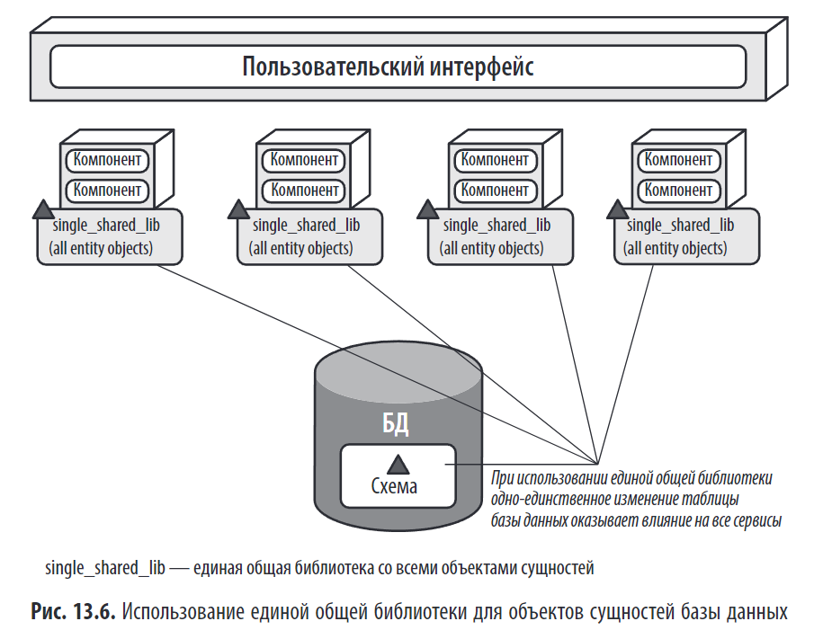

Один из способов уменьшения влияния и снижения риска от изменений, вно- симых в БД, заключается в логическом разбиении базы данных с помощью интегрированных общих библиотек. Обратите внимание, что на рис. 13.7 показано применение общей (common) пред- метной области и соответствующей ей общей библиотеки common_entities_lib, используемой всеми сервисами. Это вполне обычное явление. Такие таблицы являются общими, поэтому изменения в них требуют согласованности во всех сервисах, обращающихся к единой базе данных

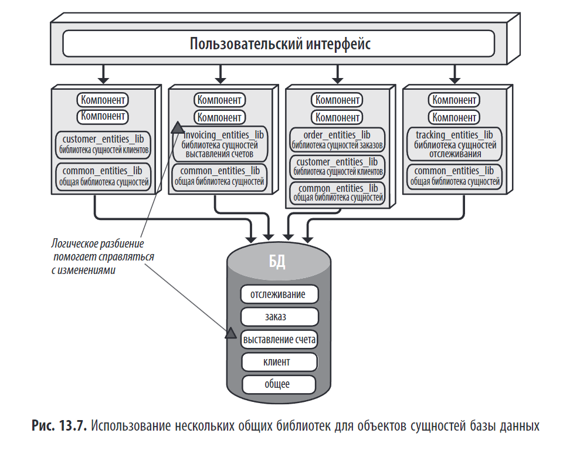
Сделайте логическое разбиение базы данных как можно более детальным, сохраняя при этом четкое обозначение области данных, чтобы лучше контролировать изменения базы данных в архитектуре на основе сер- висов.

---

### 📊 **Оценка архитектурных свойств сервисов**

| Архитектурное свойство | Оценка в звездах        | Обоснование                                                                                                                                                                                                                                                     |
| ---------------------- | ----------------------- | --------------------------------------------------------------------------------------------------------------------------------------------------------------------------------------------------------------------------------------------------------------- |
| **Тип разбиения**      | Предметный              | Разделение происходит по предметным областям (например, «Оценка устройства», «Статус заказа»), а не по техническим уровням (пользовательский интерфейс, бизнес-логика, данные).Это делает структуру более гибкой и понятной.                                    |
| **Количество квантов** | От одного до нескольких | В системе может быть от одного до нескольких квантов, в зависимости от интеграции пользовательского интерфейса и баз данных.Например, в примере с утилизацией электронных устройств есть два кванта: один для клиентской части, другой для внутренних операций. |
| **Развертываемость**   | ⭐⭐⭐⭐                    | Благодаря автономности сервисов можно быстро и часто вносить изменения только в нужные сервисы, что снижает риск сбоев.                                                                                                                                         |
| **Адаптируемость**     | ⭐⭐                      | Из-за крупномодульной структуры сервисов адаптация к новым требованиям сложнее, чем в случае с микросервисами.Однако автономность помогает свести к минимуму влияние изменений на другие компоненты.                                                            |
| **Эволюционность**     | ⭐⭐⭐                     | Сервисы легко добавлять и удалять, поскольку каждый из них ограничен конкретной предметной областью.Это позволяет быстрее внедрять новые функции.                                                                                                               |
| **Отказоустойчивость** | ⭐⭐⭐⭐                    | Автономность сервисов обеспечивает высокую отказоустойчивость, поскольку сбой в работе одного сервиса не влияет на другие.                                                                                                                                      |
| **Модульность**        | ⭐⭐⭐⭐                    | Каждый сервис — это независимый модуль, что обеспечивает высокую модульность.                                                                                                                                                                                   |
| **Общие затраты**      | ⭐⭐⭐⭐                    | Низкие затраты на разработку и поддержку благодаря простоте и автономности сервисов.                                                                                                                                                                            |
| **Производительность** | ⭐⭐⭐                     | Производительность ограничена из-за использования одной базы данных и общего пользовательского интерфейса.Сетевой трафик между сервисами минимален, но масштабирование затруднено.                                                                              |
| **Надежность**         | ⭐⭐⭐⭐                    | Меньше сетевых вызовов и распределённых транзакций, что повышает надёжность.                                                                                                                                                                                    |
| **Масштабируемость**   | ⭐⭐⭐                     | из-за крупномодульности сервисов Масштабируются только те сервисы, которым это действительно необходимо.Остальные остаются в одном экземпляре, что упрощает управление.                                                                                         |
| **Простота**           | ⭐⭐⭐                     | Намного проще, чем микросервисы или архитектура, управляемая событиями.                                                                                                                                                                                         |
| **Тестируемость**      | ⭐⭐⭐⭐                    | Каждый сервис можно тестировать отдельно, что упрощает тестирование системы в целом.                                                                                                                                                                            |

Оркестровкой (orchestration) и хореографией (choreography). [Оркестровка (orchestration) и хореография (choreography)](../../../topics/Оркестровка%20(orchestration)%20и%20хореография%20(choreography).md)
Оркестровка представляет собой координацию работы нескольких сервисов посредством использования отдельного сервиса-посредника, контролирующего рабочий поток транзакции и управляющего этим потоком (наподобие дирижера в оркестре). А хореография, по сути, является координацией работы нескольких сервисов, при которой все сервисы общаются друг с другом без использования центрального посредника (как танцоры в танце). По мере сужения специализации сервисов возрастает и необходимость в оркестровке и хореографии при связывании сервисов воеди- но для завершения бизнес-транзакции. Но поскольку сервисы в обсуждаемом стиле архитектуры чаще всего бывают более крупномодульными, им не нужен такой серьезный уровень координации, без которого не обходится практически ни одна другая распределенная архитектура.

## 🛠️ Практические рекомендации

### 1. **Разбиение базы данных**

- Можно разбить общую БД на **отдельные БД для каждого сервиса**, если:
    - Данные одного сервиса не нужны другим.
    - Нужно избежать межсервисного обмена данными.
- Это упрощает масштабирование и повышает отказоустойчивость.

> 💬 _"Точно так же не исключается возможность разбиения единой монолитной базы данных на отдельные базы, вплоть до баз данных, соответствующих каждому сервису предметной области..."_

### 2. **Управление изменениями в БД**

- Используйте **миграции базы данных**, которые применяются ко всем сервисам.
- Или **децентрализованное управление схемой**, где каждый сервис управляет своей частью.

### 3. **Масштабирование**

- Масштабируйте только те сервисы, которым нужна большая пропускная способность.
- Пример: `Quoting` и `ItemStatus` могут масштабироваться, а `Assessment` — нет.

> 💬 _"Масштабируемость может быть достигнута за счет масштабирования только тех сервисов, для которых требуется более высокая пропускная способность."_