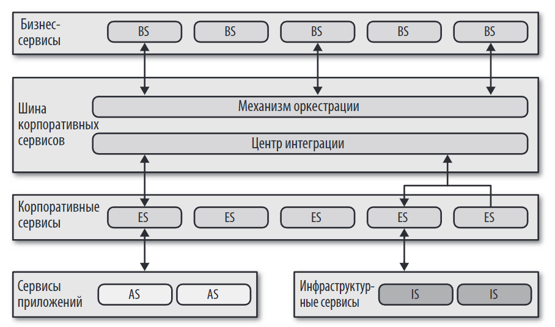
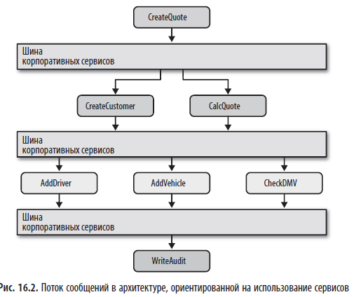
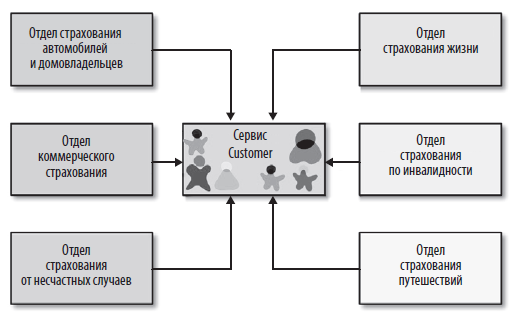

> *"Оркестрированная сервис-ориентированная архитектура (orchestrated service-oriented architecture, SOA) является, пожалуй, самым ярким примером когда-либо созданных архитектур общего назначения с сугубо техническим разбиением."*

## Краткое содержание
Глава 16 посвящена **оркестрированной сервис-ориентированной архитектуре (SOA)** — распределённому стилю, появившемуся в конце 1990-х годов. Его основная цель — **максимальное многократное использование кода** на уровне предприятия. Архитектура строится вокруг **механизма оркестрации** (центрального брокера), который координирует работу **иерархии сервисов** (бизнес-, корпоративных, прикладных, инфраструктурных). Авторы описывают топологию, таксономию, ключевую проблему — **связывание из-за многократного использования**, и оценивают архитектурные свойства.

---

## 🏗️ Что такое оркестрированная сервис-ориентированная архитектура?

**Оркестрированная сервис-ориентированная архитектура (SOA)** — это стиль, при котором:
- Система состоит из **иерархии сервисов**, сгруппированных по уровню абстракции.
- **Центральный механизм оркестрации** управляет взаимодействием между ними.
- Основная цель — **многократное использование кода** на уровне предприятия.

> 💬 *"Основная цель данной архитектуры — добиться многократного использования на уровне сервисов, то есть получить возможность постепенного выстраивания бизнес-поведения, которое можно было бы многократно и с нарастающей интенсивностью использовать в дальнейшем."*

---

## 🖼️ Топология (Рис. 16.1)

## 🧩 Таксономия сервисов

### 1. **Бизнес-сервисы (Business Services)**

- Находятся на вершине иерархии.
- Обеспечивают точку входа для бизнес-операций.
- Примеры: `ExecuteTrade`, `PlaceOrder`.

> 💬 _Определения этих сервисов не содержали кода: в них был только ввод, вывод и иногда информация о схеме. Обычно они определялись бизнес-пользователями, отсюда и название бизнес-сервисы._

### 2. **Корпоративные сервисы (Enterprise Services)**

- Реализуют общие бизнес-функции, используемые несколькими бизнес-сервисами.
- Пример: `Customer` (единый сервис для всех подразделений).

> 💬 _"Архитектор выделил все, что связано с клиентами, в единый сервис Customer, добившись вполне очевидной цели — многократного использования."_

### 3. **Сервисы приложений (Application Services)**

- Конкретные реализации бизнес-логики.
- Часто интегрируются с пакетным ПО или унаследованными системами.

 > 💬 Не всем сервисам данной архитектуры требуется такой же уровень гранулярности и возможности многократного использования, как корпоративные сервисы. Сервисы приложений одноразовые и имеют свою собственную однократную реализацию

### 4. **Инфраструктурные сервисы (Infrastructure Services)**

- Обеспечивают эксплуатационные функции: аутентификацию, ведение журнала, мониторинг.
- Относятся к общей инфраструктуре.

---

## 🔧 Механизм оркестровки (Orchestration Engine)

[Оркестровка (orchestration) и хореография (choreography)](../../../topics/Оркестровка%20(orchestration)%20и%20хореография%20(choreography).md)

### Роль

- **Центр интеграции**: связывает бизнес-сервисы с корпоративными и прикладными.
- **Координатор транзакций**: управляет глобальными транзакциями.
- **Преобразователь сообщений**: конвертирует данные из одного формата в другой.

> 💬 _"Механизм оркестрации является центральной частью данной распределённой архитектуры, объединяющей реализации бизнес-сервисов и выполняющей такие функции, как координация транзакций и преобразование сообщений."_

---

## 🔄 Поток сообщений

- Все запросы проходят через **механизм оркестрации**.
- Даже внутренние вызовы между сервисами проходят через него.
- Это обеспечивает **централизованную логику**, но создаёт **единую точку отказа**.

> 📌 **Рис. 16.2**: поток сообщений через механизм оркестрации.

---

## 🔁 Многократное использование и связывание

### ✅ Преимущество: многократное использование

- Цель SOA — избежать дублирования кода.
- Создаются **канонические сервисы** (например, `Customer`), которые используются всеми подразделениями.

> 📌 **Рис. 16.4**: Создание канонического сервиса `Customer`.

### ⚠️ Недостаток: связывание

- При изменении **корпоративного сервиса** (например, `Customer`) все зависящие от него сервисы могут перестать работать.
- Это приводит к **высокому риску** при внесении изменений.

> 💬 _"Изменения, вносимые в сервис Customer, будут распространяться и на все остальные сервисы, что повлечет за собой высокий риск нанесения ущерба всей системе."_

---
 📊  **Оценка архитектурных свойств оркестрированной сервис-ориентированной архитектуры**

| Архитектурное свойство | Оценка в звездах | Обоснование                                                                                                                                                                           |
| ---------------------- | ---------------- | ------------------------------------------------------------------------------------------------------------------------------------------------------------------------------------- |
| **Тип разбиения**      | Технический      | Разделение происходит по техническому принципу (например, бизнес-сервисы, корпоративные сервисы, прикладные сервисы).Это делает структуру более гибкой с точки зрения инфраструктуры. |
| **Количество квантов** | 1                | В системе обычно используется**один квант**, поскольку все части координируются с помощью центрального механизма оркестрации.                                                         |
| **Развертываемость**   | ⭐                | Низкая из-за жёсткой связи между сервисами и механизмом оркестрации.                                                                                                                  |
| **Адаптируемость**     | ⭐⭐⭐              | Легко адаптируется к изменениям благодаря многократному использованию кода.Однако сложность возрастает из-за связывания.                                                              |
| **Эволюционность**     | ⭐                | Легко добавлять новые функциональные возможности, но при масштабировании сложность возрастает.                                                                                        |
| **Отказоустойчивость** | ⭐⭐⭐              | Репликация данных обеспечивает отказоустойчивость, но при сбое до записи в базу данных сохраняется риск потери данных.                                                                |
| **Модульность**        | ⭐⭐⭐              | Сервисы разделены по уровням абстракции, что обеспечивает высокую модульность.                                                                                                        |
| **Общие затраты**      | ⭐                | Высокие затраты на лицензии и ресурсы.                                                                                                                                                |
| **Производительность** | ⭐⭐               | Производительность ограничена из-за распределённых транзакций и центрального механизма оркестрации.                                                                                   |
| **Надёжность**         | ⭐⭐⭐              | Меньше сетевого трафика между уровнями, что повышает надёжность.                                                                                                                      |
| **Масштабируемость**   | ⭐⭐⭐⭐             | Горизонтальное масштабирование за счёт добавления блоков обработки.                                                                                                                   |
| **Простота**           | ⭐                | Очень сложная архитектура, требующая глубоких знаний.                                                                                                                                 |
| **Тестируемость**      | ⭐                | Тестирование затруднено из-за сложности моделирования высокого уровня масштабируемости и адаптивности.                                                                                |