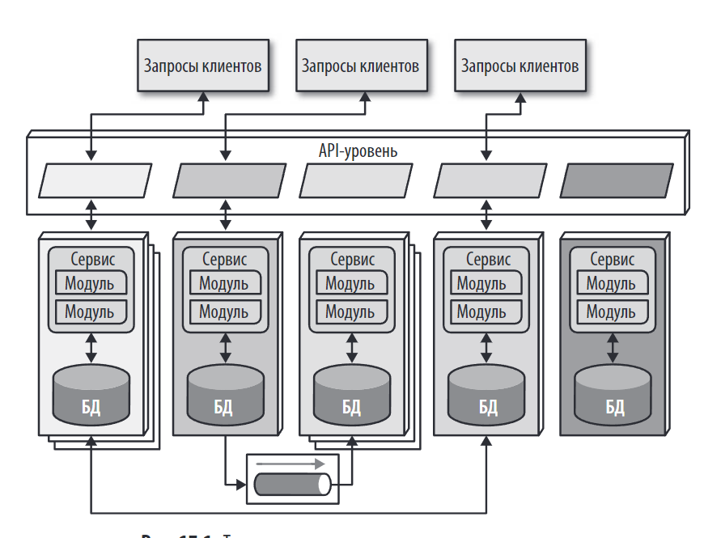
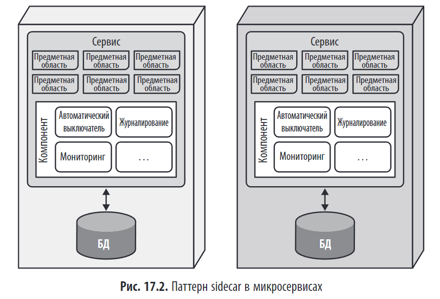
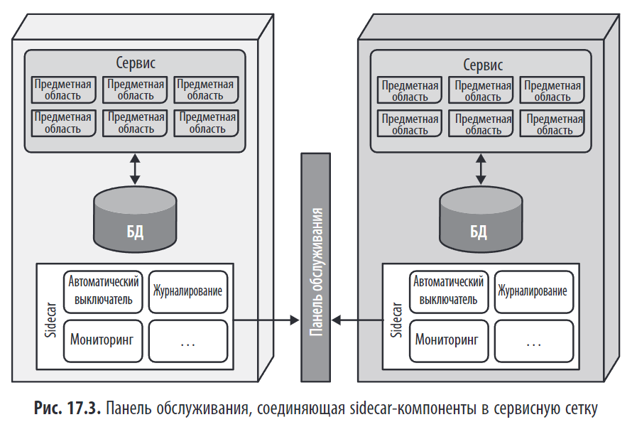
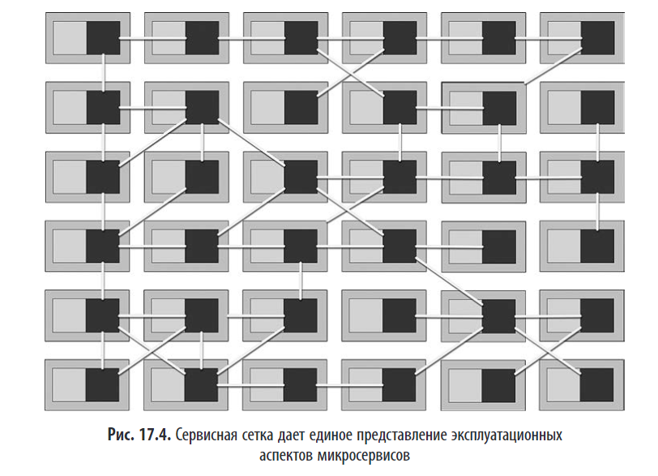
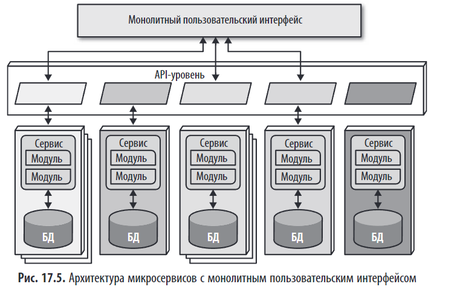
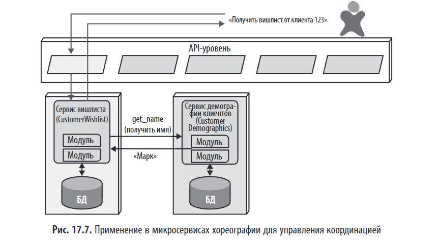
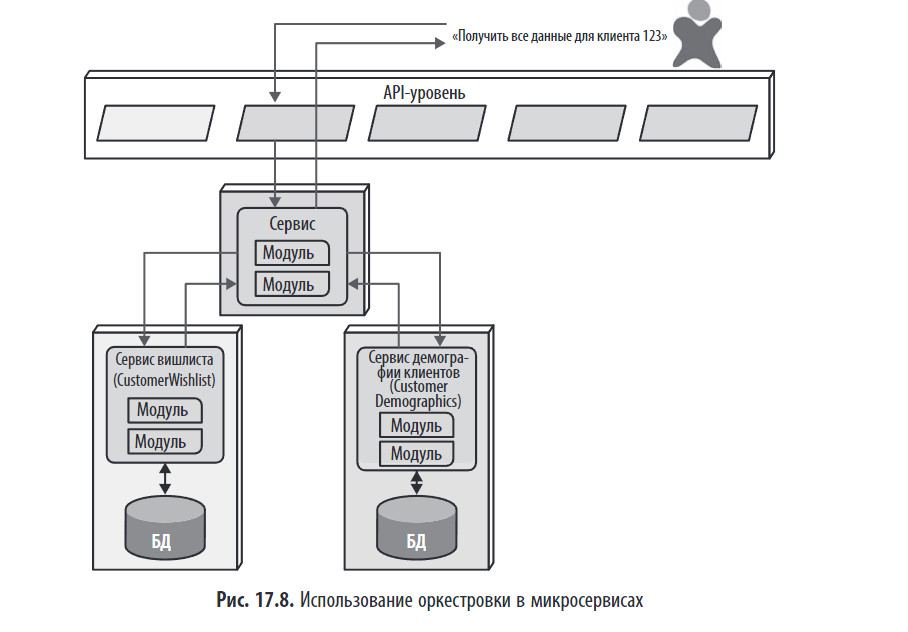
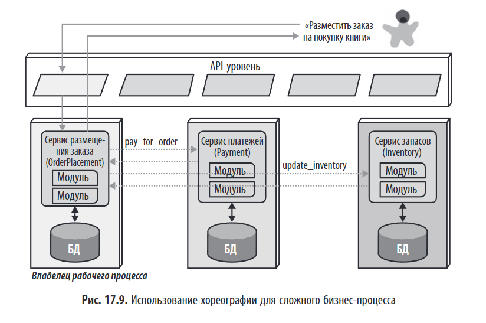
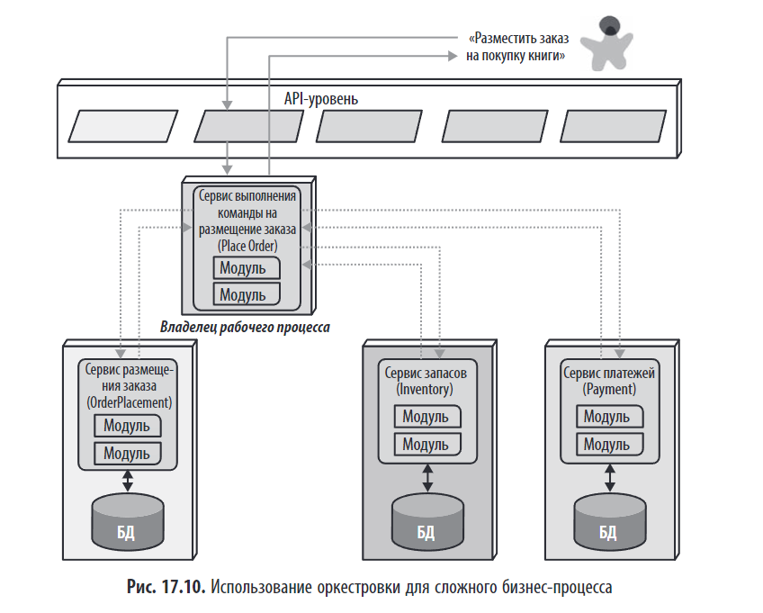
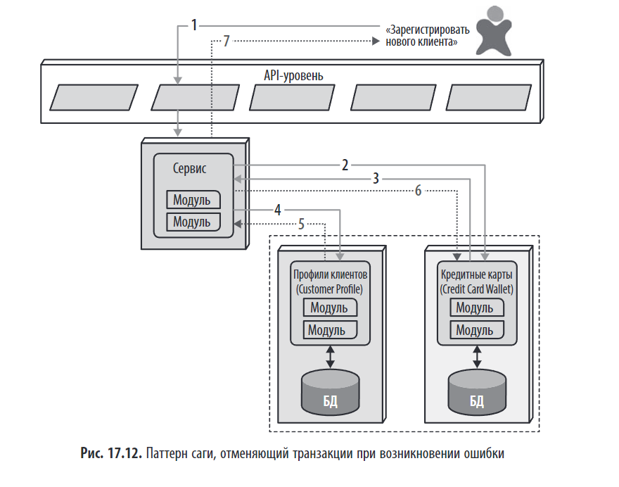

> _«Основной целью создания микросервисов является высокая степень автономности, то есть физическое воплощение логического понятия ограниченного контекста»._

---

## 📌 Краткое содержание главы

**Архитектура микросервисов** — один из самых популярных и обсуждаемых архитектурных стилей в современной разработке. Глава 17 рассказывает:

- **Философия** микросервисов: полное разделение, ограниченный контекст, предметное разбиение.  
- **Топологию** и ключевые элементы: сервисы, уровень API, сайдкар, сервисная сетка.  
- **Ключевые принципы**: детализация, изолированность данных, многократное использование в процессе эксплуатации.  
- **Проблемы**: производительность, транзакции, саги, оркестровка и хореография.

> 💬 _«Микросервисы, несомненно, относятся к предметно-ориентированной архитектуре, в которой все границы сервисов должны соответствовать предметным областям»._

> При всех плюсах повторного использования кода не следует забывать Первый закон архитектуры программного обеспечения, касающийся компромиссов. Негативным последствием многократного использования кода является связанность. Когда архитектор проектирует систему, в которой отдается предпочтение многократному использованию кода, для достижения этой многократности ему приходится мириться со связанностью, либо в виде наследования, либо в виде композиции.  
> Но если целью архитектора является высокая степень развязывания, он отдает предпочтение дублированию кода, а не многократности его использования. Основной целью создания микросервисов является высокая степень развязывания, то есть физическое воплощение логического понятия ограниченного контекста. DDD — ограниченный контекст

---

## 🏗️ Что такое архитектура микросервисов?

### Распределенность

**Микросервисы** — это **распределённый архитектурный стиль**, при котором приложение состоит из **множества небольших, независимо развёртываемых сервисов**, каждый из которых:

- Отвечает за **одну предметную область** или **ограниченный контекст**. (DDD воплоти)  
- Имеет **собственную базу данных**.  
- Взаимодействует с другими сервисами **через API** (синхронно или асинхронно).  
- Может быть написан на **разных языках** и использовать **разные технологии**.

> 💬 _"Каждый сервис включает в себя все необходимое для автономной работы: базы данных и другие зависимые компоненты."_

Большинство архитектурных стилей формируются ретроспективно, когда в практике разработки появляются устойчивые паттерны. Однако **микросервисы стали исключением**: они получили название и чёткое определение **до массового распространения**, благодаря публикации Мартина Фаулера и Джеймса Льюиса в 2014 году.

Эта публикация описала общие черты нового подхода, основанные на принципах **предметно-ориентированного проектирования (DDD)**, особенно на концепции **ограниченного контекста**. Эта концепция предполагает разделение системы на изолированные части, каждая со своей моделью данных.

Ключевая идея микросервисов — **высокая степень развязывания**. В отличие от традиционного стремления к многократному использованию кода (что ведёт к связанности), микросервисы сознательно **жертвуют повторным использованием ради независимости**, делая **ограниченный контекст их физическим воплощением**.

---

## 🖼️ Топология (рис. 17.1)

---

## 🔧 Ключевые элементы и принципы

### Распределенность

Микросервисы — это **распределённая архитектура**, где каждый сервис работает в **отдельном процессе** (контейнере, виртуальной машине), что решает проблемы общего использования ресурсов и обеспечивает изоляцию. Благодаря облачным технологиям и контейнеризации стало возможно выделять отдельную инфраструктуру для каждого сервиса.

Однако распределённость **снижает производительность** из-за накладных расходов на сетевые вызовы и проверку безопасности. Поэтому **транзакции между сервисами не рекомендуются**, а **правильная гранулярность сервисов** становится ключом к успеху архитектуры.

---

### 1. **Ограниченный контекст (Bounded Context)**[Ограниченный контекст (Bounded Context) в DDD](../../topics/Ограниченный%20контекст%20(Bounded%20Context)%20в%20DDD.md)

Ограниченный контекст — это фундамент микросервисов: каждый сервис полностью автономен и охватывает свою предметную область со всеми необходимыми данными и кодом. В отличие от монолитов, где используются общие классы (например, `Address`), микросервисы сознательно **дублируют данные и код**, чтобы избежать связанности. Таким образом, микросервисы становятся **физическим воплощением** идеи предметно-ориентированного проектирования (DDD), доводя принцип предметного разбиения до абсолюта.

> 💬 _"Основной целью создания микросервисов является высокая степень автономности, то есть физическое воплощение логического понятия ограниченного контекста."_

---

### 2. **Гранулярность (Granularity)**

**Гранулярность** — это **размер сервиса**.

- **Цель**: найти **оптимальный уровень детализации**.  
- **Ошибка № 1**: делать сервисы **слишком мелкими** → рост количества сетевых вызовов.  
- **Ошибка № 2**: делать сервисы **слишком крупными** → потеря гибкости.

> 💬 _"Архитекторы стремятся добиться приемлемого уровня детализации сервисов и часто допускают ошибку, делая их слишком мелкими, что вынуждает их снова и снова выстраивать связи между ними для нормальной работы."_

Термин «микросервис» — это **название стиля, а не указание делать сервисы максимально мелкими**. Ошибка многих — создавать слишком мелкие сервисы, что приводит к избыточной связанности и высоким накладным расходам на коммуникацию.

Границы сервиса должны определяться **предметной областью и бизнес-процессом**, а не стремлением к миниатюризации. Ключевые критерии:

- **Назначение**: каждый сервис должен решать одну конкретную задачу. В идеале каждый микросервис должен обладать абсолютной функциональной связностью (cohesion).  
- **Транзакции**: если несколько сущностей часто взаимодействуют в одной транзакции, их стоит объединить.  
- **Хореография**: если сервисы постоянно обмениваются данными, возможно, их нужно объединить в один.

Правильная гранулярность достигается **итеративно**, а не с первого раза.

*Найти приемлемые границы можно с помощью следующих рекомендаций:*

- ***Назначение*** — Самые очевидные границы определяются предметной областью. В идеале каждый микросервис должен обладать абсолютной функциональной связностью (cohesion), обеспечивая только одну важную для всего приложения функциональность.  
- ***Транзакции*** — Ограниченные контексты являются рабочими бизнес-процессами, и зачастую правильная граница сервиса зависит от тех сущностей, которым требуется взаимодействие в рамках транзакции.  
- ***Хореография*** — если архитектор формирует набор сервисов, которые обеспечивают предметным областям абсолютную изолированность, но при этом требуется их постоянное взаимодействие друг с другом для корректной работы, то для снижения коммуникационных накладных расходов стоит объединить эти сервисы в один более крупный сервис.

---

### 3. **Изолированность данных (Data Isolation)**

Каждый микросервис имеет **свою собственную базу данных**, чтобы избежать связанности и соответствовать концепции **ограниченного контекста**. Это исключает общую БД как точку интеграции, но делает невозможным единый источник истины (SSOT). Вместо этого данные синхронизируются через **репликацию, события или кэширование**. Хотя это усложняет согласованность (только окончательная, eventual consistency), это даёт командам свободу выбирать **наиболее подходящую технологию хранения данных** для каждого сервиса.

> *Многие архитектурные стили обращаются к единой базе данных для хранения информации. Однако в микросервисах стараются избегать любых проявлений связанности, в том числе общих схем и баз данных, использующихся в качестве точек интеграции.*  
>  
> *Изолированность данных является еще одним фактором, который архитектор учитывает при выборе гранулярности. Здесь следует избегать попадания в западню сущности а не просто моделировать свои сервисы как отдельные сущности в базе данных.*  
>  
> *Архитекторы обычно используют реляционные базы данных для унификации значений в системе, создавая единый источник истины (single source of truth, SSOT). Но это невозможно при распределении данных по всей архитектуре. Поэтому архитекторы должны выбрать другой вариант решения этой задачи: либо считать одну предметную область источником истины и обращаться к ней для получения значений, либо воспользоваться репликацией базы данных или кэшированием для распределения информации.*

**У каждого микросервиса есть своя база данных**.

- **Запрещено** напрямую обращаться к БД другого сервиса.  
- **Нет центральной БД** как точки интеграции.  
- Это **ключевое отличие** от архитектуры на основе сервисов.

> 💬 _"А в архитектурном стиле микросервисов каждый сервис включает в себя собственную базу данных... создавая внутри этой архитектуры несколько квантов."_

---

### 4. **Уровень API (API Level)**

**Кратко об API-уровне в микросервисах:**

API-уровень (API Gateway, прокси-сервер) — это **необязательный, но популярный** элемент, расположенный между клиентами и микросервисами. Он используется для решения эксплуатационных задач: балансировки нагрузки, аутентификации, мониторинга, обнаружения сервисов.

**Важно:** его **нельзя использовать как медиатор или оркестратор** бизнес-логики. Это нарушило бы основной принцип микросервисов — **предметное разбиение**, при котором вся логика должна находиться внутри ограниченного контекста сервиса, а не в техническом промежуточном слое.

> **Уровень API — это прослойка между клиентами и микросервисами.**  
>  
> **Это можно реализовать тремя способами:**

| Тип                                | Описание                                                 | Когда использовать                                                      |
| ---------------------------------- | -------------------------------------------------------- | ----------------------------------------------------------------------- |
| **Шлюз API**                       | Единая точка входа для всех клиентов.                    | Когда клиенты разные, но нужен единый интерфейс.                        |
| **Бэкенд для фронтенда (BFF)**     | Отдельный API для каждого клиента (веб, мобильный, IoT). | Когда у клиентов разные потребности.                                    |
| **Сервисная сетка (Service Mesh)** | Сетка прокси (sidecar), управляющая коммуникацией.       | Когда требуется централизованное управление (мониторинг, безопасность). |

> 💬 _"Большинство изображений микросервисов содержат уровень API... Он довольно популярен, потому что на этом уровне могут выполняться важные задачи."_  
>  
> **его не следует использовать в качестве медиатора или оркестратора, если архитектор намерен придерживаться основной философии микросервисной архитектуры: вся необходимая архитектурная логика должна находиться в ограниченном контексте, а размещение оркестровки или иной логики в медиаторе нарушает это правило.**

---

### 📝 **Многократное использование в эксплуатации (Operational Reuse)**

> _"В микросервисах архитекторы стараются отделить эти два направления друг от друга: дублирование кода предметной области — ради развязывания, и многократное использование в эксплуатации — ради эффективности."_

#### 🔍 Проблема

В микросервисах **дублируется код предметной области** (например, `Address`, `Customer`) — это **осознанный выбор** ради **развязывания** и независимости сервисов.  
Но что делать с **эксплуатационными функциями**, которые **выигрывают от централизации**?

- Мониторинг  
- Журналирование  
- Автоматический выключатель (circuit breaker)  
- Шифрование (TLS)  
- Обнаружение сервисов  

Если каждая команда реализует их самостоятельно:

- **Потери времени** на дублирование усилий.  
- **Несогласованность** в инструментах и метриках.  
- **Сложность обновления** (каждой команде нужно обновлять свой код).

#### ✅ Решение: Паттерн Sidecar и Сервисная сетка

##### 1. **Паттерн Sidecar**

- Каждый микросервис запускается вместе с **вспомогательным контейнером (sidecar)**.  
- Этот sidecar отвечает за **все эксплуатационные задачи**.  
- Управляется **командой инфраструктуры**, а не командой разработчиков сервиса.

> 💬 _"Sidecar-компонент управляет всеми эксплуатационными задачами, что удобно для совместной работы команд."_  
> 💬 _"Sidecar позволяет избежать дублирования кода и перенести эксплуатационные функции на уровень инфраструктуры."_ На рис. 17.2 общие эксплуатационные задачи показаны внутри каждого сервиса в виде отдельного компонента, которым могут владеть как отдельные команды разработчиков, так и команда общей инфраструктуры. Таким образом, как только приходит время обновить инструменты мониторинга, команда общей инфраструктуры обновляет sidecar-компоненты, и новые функциональные возможности становятся доступны каждому микросервису.

Поскольку команды знают, что каждый сервис включает в себя общий sidecar-компонент, они могут создать сервисную сетку (service mesh), позволяющую обеспечить единый контроль над архитектурой для таких задач, как журналирование и мониторинг. Общие sidecar-компоненты соединяются для формирования единого эксплуатационного интерфейса для всех микросервисов.

---

##### 2. **Сервисная сетка (Service Mesh)**

- Сеть из sidecar-прокси (например, **Istio**, **Linkerd**).  
- Образует **единый эксплуатационный интерфейс** для всей системы.  
- Позволяет централизованно управлять:  
  - Мониторингом  
  - Журналированием  
  - Безопасностью  
  - Обнаружением сервисов  

> 💬 _"Сама сервисная сетка образует консоль, предоставляющую разработчикам единый доступ к сервисам."_

Как показано на рис. 17.4, каждый сервис образует узел в общей сетке. Сервисная сетка формирует консоль, позволяющую командам глобально управлять такими функциями, как мониторинг, журналирование, и другими сквозными эксплуатационными задачами.

Для повышения гибкости микросервисов архитекторы используют инструменты обнаружения сервисов (service discovery). Вместо того чтобы сразу вызвать конкретный сервис, запрос проходит через инструмент обнаружения сервисов, который может отследить количество и частоту запросов, а также запустить новые экземпляры сервисов, чтобы справиться с задачами масштабирования или достичь нужной гибкости. Архитекторы часто включают этот инструмент в сервисную сетку, делая его частью каждого микросервиса. API-уровень часто используется для размещения инструмента обнаружения сервисов, предоставляя единое место для пользовательских интерфейсов или других систем вызова с целью гибкого и согласованного поиска и добавления сервисов.

---

## 🔁 Клиентские стороны приложения (фронтенды)

Предпочтение в микросервисах отдается развязыванию, распространяющемуся в идеале на пользовательские интерфейсы (UI), а также на задачи серверной части (бэкенда). Фактически в первоначальном варианте микросервисов, в соответствии с принципами DDD, пользовательский интерфейс был частью ограниченного контекста. Поэтому в микросервисах обычно используются два стиля пользовательских интерфейсов:

**монолитный фронтенд**  

**микрофронтенда**  

---

## 🔁 Взаимодействие между микросервисами

В микросервисах архитекторы и разработчики сталкиваются с проблемой выбора подходящей гранулярности, которая непосредственно влияет как на обмен данными, так и на изоляцию данных.

По сути, архитекторы должны выбирать между синхронным и асинхронным способом обмена данными.  
Архитектуры микросервисов обычно используют разнородную интероперабельность на основе протокола.

1. **На основе протокола (protocol-aware)**  
   Каждый сервис знает, **как вызывать другие** (REST, gRPC, Kafka), часто с помощью **обнаружения сервисов (service discovery)**.  
   Поскольку обычно в микросервисах, чтобы избежать операционной связанности, нет никакого единого центра интеграции, каждый сервис должен знать, как можно вызывать другие сервисы. Для организации таких вызовов архитекторы обычно придерживаются определенного стандарта: конкретный тип REST-обмена, очереди сообщений и т. д. Следовательно, сервисам должно быть известно (или они должны уметь обнаруживать), каким именно протоколом нужно пользоваться для вызова других сервисов.

2. **Разнородная (heterogeneous)**  
   Сервисы могут быть написаны на **разных языках** (Java, Python, Go) и использовать **разные фреймворки**.  
   Поскольку микросервисы относятся к распределенной архитектуре, каждый сервис может быть написан в рамках того или иного технологического стека. Разнородность предполагает, что микросервисы полностью поддерживают многоязычные среды, где разные сервисы используют разные платформы.

3. **Интероперабельность (interoperability)**  
   Сервисы **взаимодействуют по сети**, не нарушая своей автономии.  
   Это означает, что сервисы вызывают друг друга. Хотя архитекторы стараются не допускать в микросервисах транзакционных вызовов методов, сервисы обычно вызывают другие сервисы по сети для совместной работы и обмена информацией.

Для асинхронного обмена данными архитекторы часто используют события и сообщения, поэтому для внутренних целей применяется архитектура, управляемая событиями, о которой говорилось в главе 14, а брокер и медиатор в микросервисах работают как хореография и оркестровка.

---

## 🎻 Оркестровка (Orchestration) против 🕺 Хореография (Choreography)

Хореография применяет тот же стиль обмена данными, что и брокер в архитектуре, управляемой событиями. Иначе говоря, благодаря соблюдению философии ограниченного контекста, в ней нет центрального координатора. Таким образом, для архитекторов будет вполне приемлемой реализация несвязанных событий между сервисами.

В микросервисах используются два подхода для координации работы сервисов:

1. **Хореография** — децентрализованный подход. Сервисы обмениваются событиями напрямую, без центрального координатора. Это соответствует философии высокой разделённости, но усложняет отладку и обработку ошибок.  
2. **Оркестровка** — централизованный подход. Специальный сервис-медиатор (оркестратор) управляет последовательностью вызовов других сервисов. Это упрощает координацию и обработку ошибок, но создаёт связанность и единую точку отказа.

**Гибридный вариант — паттерн фронт-контроллера**: первый вызванный сервис (например, `OrderPlacement`) берёт на себя роль медиатора и координирует остальные. Это упрощает инициацию, но усложняет сам сервис.

Выбор между ними — компромисс между **разделённостью (хореография)** и **контролем (оркестровка)**.  
Изоморфизм — одно из ключевых свойств, на которое архитекторам следует обратить внимание, оценивая, подходит ли стиль архитектуры для решения конкретной задачи. Изоморфизм предметной области и архитектуры Данный термин описывает соотношение формы архитектуры и конкретного архитектурного стиля.

Так как архитектура микросервисов не содержит глобального медиатора, как в других сервис-ориентированных архитектурах, то при необходимости координации работы нескольких сервисов архитектор может создать свой собственный локализованный медиатор.

На рис. 17.8 показано, что разработчики создали сервис, единственной задачей которого является координация вызова для получения информации о конкретном клиенте. Пользователь вызывает медиатор ReportCustomerInformation, который запускает другие необходимые сервисы.

### Гибридный вариант — паттерн фронт-контроллера:

На рис. 17.9 показано, что первый вызванный сервис должен согласовывать работу широкого круга других сервисов, не только выполняя свои предметные обязанности, но и действуя в качестве медиатора. Эта схема называется **паттерном фронт-контроллера (front controller pattern)**, в котором условный хореографический сервис становится более сложным медиатором для решения той или иной задачи. Недостатком этого паттерна является усложнение сервиса.

Как вариант, для сложных бизнес-процессов архитектор может выбрать оркестровку, показанную на рис. 17.10.

| Критерий               | Оркестровка         | Хореография         |
|------------------------|---------------------|---------------------|
| **Координатор**        | Есть (медиатор)     | Нет                 |
| **Связанность**        | Высокая             | Низкая              |
| **Простота отладки**   | Высокая             | Низкая              |
| **Масштабируемость**   | Ниже                | Выше                |
| **Подходит для**       | Сложные бизнес-процессы | Простые асинхронные потоки |

> 💬 _"Поскольку архитектура микросервисов не содержит глобального медиатора... архитектор может создать свой собственный локализованный медиатор."_ (Рис. 17.8)

---

## 🔄 Транзакции и паттерн саги (Saga Pattern)

Архитекторы стремятся к полной разделенности в микросервисах, но затем довольно часто сталкиваются с проблемой обеспечения координации транзакций между сервисами. Разделенность в архитектуре должна относиться также и к базам данных, поэтому атомарность, которая легко обеспечивается в монолитных приложениях, становится проблемой в распределенных.  
Выстраивание транзакций, пересекающих границы сервисов, нарушает основной принцип разделенности в архитектуре микросервисов (а также создает наихудший вид динамической коннасценции, а именно коннасценцию значений). Лучшим советом для архитекторов, желающих совершать транзакции между сервисами, будет следующий: не делайте этого! Лучше скорректируйте гранулярность компонентов.

**Не используйте транзакции в микросервисах, лучше скорректируйте уровень гранулярности!**

### Проблема

- В монолитах используются **ACID-транзакции**.  
- В микросервисах используются **BASE-транзакции** (базовая доступность, мягкое состояние, возможная согласованность).

координация через транзакции. Для таких случаев существуют паттерны оркестровки транзакций, но с серьезными компромиссами.

### Решение: **Шаблон саги**

**Сага** — это **последовательность локальных транзакций**, каждая из которых выполняется в своём сервисе.

- Если одна транзакция завершается сбоем, запускаются **компенсирующие действия**. **фреймворком отменяемых транзакций (compensating transaction framework)**  
- Может быть **оркестрованной** (с медиатором) или **хореографированной** (через события).

> 💬 _"На рис. 17.11 показан оркестрованный паттерн саги, в котором медиатор ReportCustomerInformation координирует вызовы."_

однако такой дизайн сильно усложняется, когда появляется необходимость обрабатывать асинхронные запросы, особенно при появлении новых запросов, зависящих от ожидающего состояния транзакции. Кроме того, создается большой трафик для координации на сетевом уровне.

Порой без небольшого числа транзакций между сервисами просто не обойтись. Но если они становятся доминантой архитектуры, значит, с ней что-то не в порядке!

---

## 🔄 Сравнение с другими стилями

| Стиль                                  | Разница                                                                                            |
| -------------------------------------- | -------------------------------------------------------------------------------------------------- |
| [Монолит](../chapters/Глава%2010.%20Многоуровневая%20архитектура.md)                            | Микросервисы — распределённые, монолит — это один процесс.                                         |
| [Архитектура на основе сервисов](../chapters/ГЛАВА%2013%20Архитектура%20на%20основе%20сервисов.md)     | Микросервисы — более мелкие, с изолированными базами данных, с более высокой степенью детализации. |
| [SOA](../chapters/ГЛАВА%2016%20Оркестрированная%20сервис-%20ориентированная%20архитектура.md)                                | SOA — централизованная оркестрация, микросервисы — децентрализованные.                             |
| [Архитектура, управляемая событиями](../chapters/ГЛАВА%2014%20Архитектура,%20управляемая%20событиями.md) | Микросервисы часто используют её для асинхронной коммуникации.                                     |

### 📊 **Оценка архитектурных свойств микросервисов**

Микросервисы — это **предметно-ориентированная архитектура** с сильной разделённостью, что обеспечивает **высокую отказоустойчивость и адаптивность**, но требует зрелых практик DevOps и инструментов для управления сложностью.

| Архитектурное свойство | Оценка в звёздах | Обоснование                                                                                                                                                |
|------------------------|------------------|----------------------------------------------------------------------------------------------------------------------------------------------------------|
| **Тип разбиения**      | Предметный       | Разделение происходит по предметным областям (например, `Order Service`, `Payment Service`). Это делает структуру более гибкой с точки зрения бизнес-логики. |
| **Количество квантов** | От одного и более| Каждый сервис — это отдельный квант. Квантов может быть несколько, если используются разные пользовательские интерфейсы или способы обмена данными.         |
| **Развертываемость**   | ⭐⭐⭐⭐             | Независимое развёртывание каждого сервиса. Простое масштабирование отдельных частей системы.                                                                |
| **Адаптируемость**     | ⭐⭐⭐⭐⭐            | Легко адаптируется к пиковым нагрузкам за счёт добавления/удаления сервисов.                                                                               |
| **Эволюционность**     | ⭐⭐⭐⭐⭐            | Легко добавлять новые функциональные возможности с помощью новых сервисов.                                                                                 |
| **Отказоустойчивость** | ⭐⭐⭐⭐             | Сбой в работе одного сервиса не останавливает всю систему. Работает благодаря изоляции сервисов.                                                            |
| **Модульность**        | ⭐⭐⭐⭐⭐            | Высокая степень изоляции сервисов. Каждый сервис автономен.                                                                                                 |
| **Общие затраты**      | ⭐                | Высокие затраты на инфраструктуру и эксплуатацию.                                                                                                          |
| **Производительность** | ⭐⭐               | Сетевые вызовы между сервисами замедляют работу.                                                                                                           |
| **Надёжность**         | ⭐⭐⭐⭐             | Сетевые вызовы могут прерываться, но отказоустойчивость высока благодаря изоляции сервисов.                                                                |
| **Масштабируемость**   | ⭐⭐⭐⭐⭐            | Горизонтальное масштабирование сервисов.                                                                                                                   |
| **Простота**           | ⭐                | Сложная инфраструктура (контейнеры, оркестрация, мониторинг).                                                                                              |
| **Тестируемость**      | ⭐⭐⭐⭐             | Изоляция позволяет тестировать сервисы по отдельности.                                                                                                     |