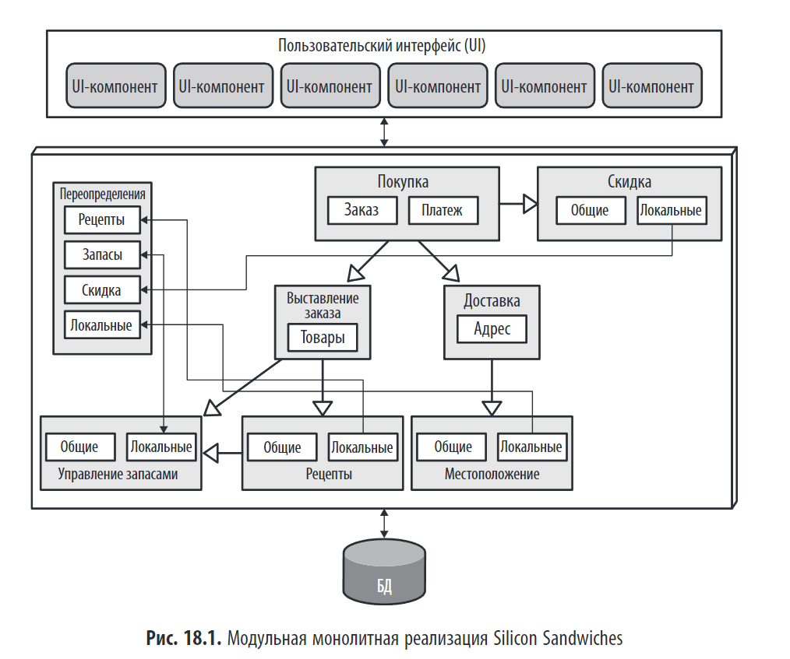
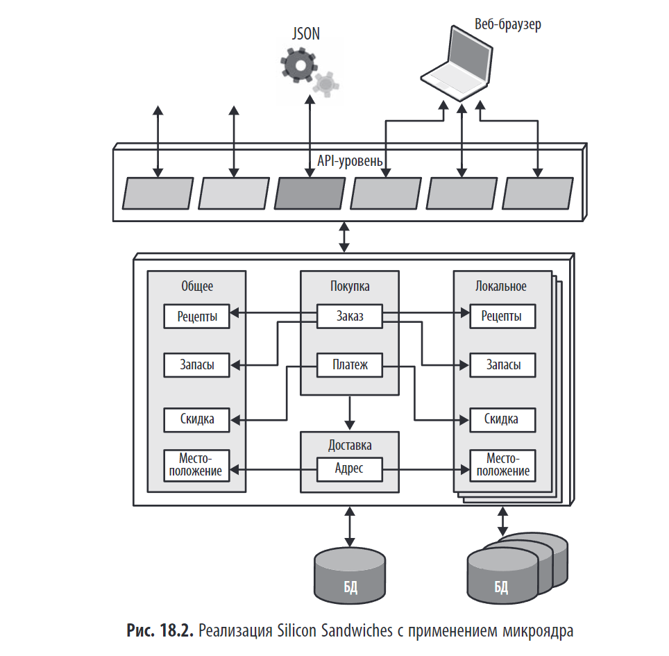
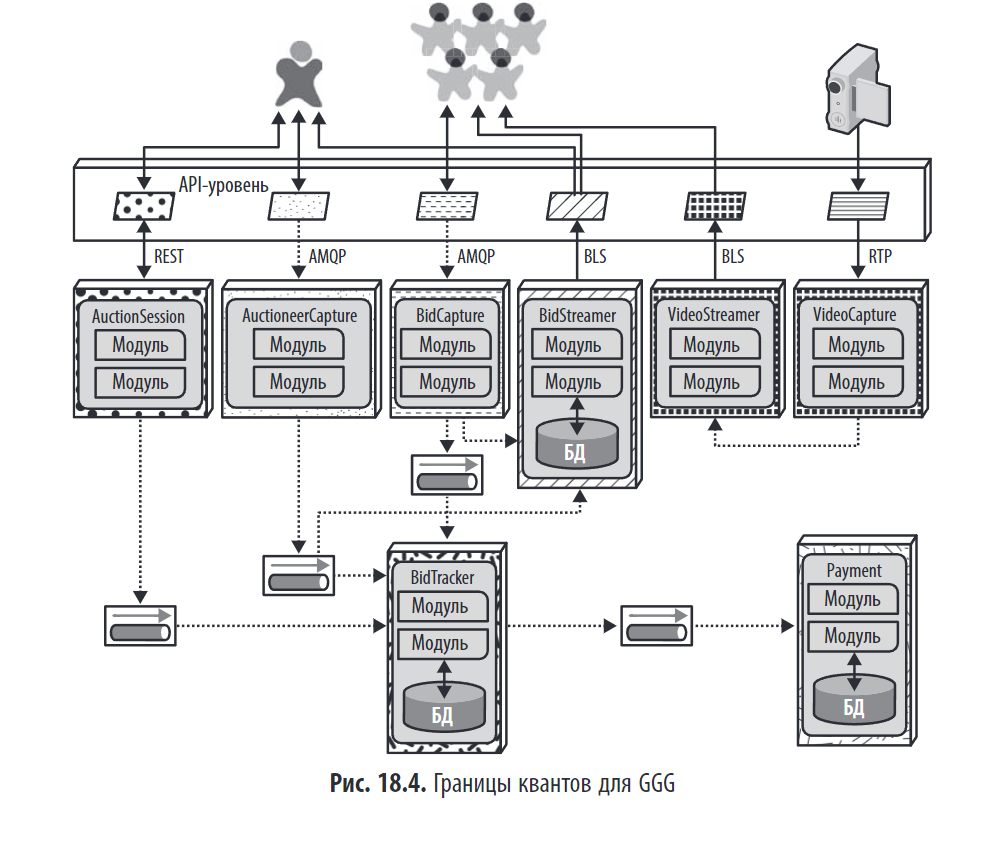

> _"Все зависит от конкретных обстоятельств!"_

## Краткое содержание

Глава 18 — это **практическое руководство по выбору архитектурного стиля**. Авторы подчёркивают, что **не существует универсального "лучшего" стиля**. Выбор зависит от **контекста**: предметной области, бизнес-требований, команды, инфраструктуры и стратегических целей. Глава использует два примера — **Silicon Sandwiches** (монолит) и **Going, Going, Gone** (распределённая архитектура) — чтобы показать, как анализ компонентов, пользователей и требований приводит к разным решениям.

 Часто новые архитектурные проекты являются работой над ошибками предыдущих архитектурных стилей.
 
---

## 💡 Ключевая идея: "Все зависит от контекста"

> _"Выбор архитектурного стиля является результатом анализа и размышлений о компромиссах, допускаемых в отношении архитектурных свойств, специфики предметной области, стратегических целей и множества других вещей."_

- Нет "лучшего" стиля.
- **Микросервисы ≠ всегда лучше монолита**.
- Выбор должен быть **обоснован**, а не следовать моде.

### **Веяния моды в архитектуре**

Архитектурные предпочтения меняются под влиянием:

1. **Опыт прошлых ошибок** — новые стили (например, микросервисы) часто создаются как реакция на недостатки старых (например, избыточная связанность в SOA).
2. **Изменения в экосистеме** — технологии быстро эволюционируют (Docker, Kubernetes), создавая новые возможности и парадигмы.
3. **Развитие предметной области** — бизнес-требования постоянно меняются.
4. **Технологический прогресс и внешние факторы** — появление новых инструментов, смена стратегий, рост затрат.

Архитектор должен **отслеживать тенденции**, но **не следовать моде слепо**. Важно понимать контекст и выбирать решения, соответствующие конкретной задаче, а не текущей моде.

---

## 🛠️ Критерии принятия решения

**Критерии принятия решения при выборе архитектурного стиля**

При выборе архитектуры архитектор анализирует несколько ключевых факторов:

1. **Предметная область** — нужно понимать бизнес-требования и их влияние на систему.
2. **Архитектурные свойства, влияющие на структуру** — определяются критически важные характеристики: масштабируемость, отказоустойчивость, производительность и др.
3. **Архитектура данных** — важно учитывать схему БД и её влияние на проектирование, особенно при интеграции с существующими системами.
4. **Организационные факторы** — бюджет, стратегия компании (слияния, открытые решения), стоимость технологий.
5. **Команды и процессы разработки** — зрелость Agile, DevOps, навыки команды.
6. **Предметно-архитектурный изоморфизм** — насколько стиль архитектуры соответствует структуре предметной области (например, микроядра — для настраиваемых систем, распределённая архитектура — для высоконагруженных).

**Ключевые вопросы:**

- **Монолит или распределённая архитектура?** — Зависит от того, нужен один или несколько архитектурных квантов.
- **Где хранить данные?** — Одна БД или изолированные хранилища?
- **Синхронный или асинхронный обмен?** — По умолчанию выбирайте синхронный, переходите к асинхронному по необходимости.

---

## 🧩 Пример 1: Silicon Sandwiches (Монолит)

**Кратко: Конкретный пример монолита — Silicon Sandwiches**

Для системы онлайн-заказов сэндвичей (Silicon Sandwiches) был выбран **монолитный подход**, так как:

- Система простая.
- Небольшой бюджет.
- Достаточно **одного архитектурного кванта**.

Были рассмотрены два варианта архитектуры:

---

### 1. **Модульный монолит**

- Единая база данных и один развертываемый модуль.
- Компоненты разделены по **предметным областям** (покупка, скидки, рецепты и т.д.).
- Для настроек используется **компонент Override** — централизованное хранение переопределений.
- **Преимущество**: простота, низкие затраты.
- **Плюс для будущего**: разбиение БД по компонентам упростит миграцию на микросервисы.

---

### 2. **Микроядро (Plugin Architecture)**

- Основное ядро содержит базовые компоненты и БД.
- **Настраиваемость реализована через плагины**:
    - Общие настройки — в общих плагинах.
    - Локальные — в отдельных, изолированных плагинах.
- Используется паттерн **BFF (Backends for Frontends)**:
    - API-уровень адаптирует данные под конкретный фронтенд (iOS, Android, веб).
- **Преимущество**: высокая гибкость и расширяемость за счёт плагинов.

---

### Вывод

Оба варианта — **монолиты**, но с разной философией:

- **Модульный монолит** — хорош для простоты и быстрого старта.
- **Микроядро** — лучше, если критична **настраиваемость и расширяемость**.
- 
Обмен данными внутри любой архитектуры  может быть син- хронным: архитектура не предъявляет экстремальных требований к производительности

Выбор зависит от приоритетов: **простота** или **гибкость**.

---

## 🧩 Пример 2: Going, Going, Gone (Распределённая архитектура)

**Кратко: Конкретный пример распределённой архитектуры — Going, Going, Gone (GGG)**

Система онлайн-аукционов GGG требует высокой **масштабируемости, производительности и адаптивности**, что делает **распределённую архитектуру** (в частности, **микросервисы**) лучшим выбором.

---

### 🔍 Ключевые особенности:

- Разные части системы имеют **разные архитектурные требования**:
    - **Организатор торгов (Auctioneer)** — высокая надёжность.
    - **Участники торгов (Bidder)** — высокая масштабируемость и доступность.
- Это делает **монолит неприемлемым** — нужна **гибридная, распределённая архитектура**.

---

### 🛠️ Выбор стиля

Рассматривались:

- **Архитектура, управляемая событиями** — хороша, но часто использует оркестровку.
- **Микросервисы** — **выбраны как наиболее подходящие**, так как позволяют по-разному настраивать сервисы по масштабируемости, производительности и отказоустойчивости.

> 
> -Из всех кандидатур из области распределенных архитектур наиболее соответ- ствует требуемым свойствам либо низкоуровневая архитектура, управляемая событиями, либо микросервисы. Микросервисы лучше поддерживают разли- чающиеся эксплуатационные архитектурные свойства. А вот используемые в чистом виде архитектуры, управляемые событиями, обычно не выделяют какие-либо части для реализации этих эксплуатационных архитектурных свойств; вместо этого они основываются на стиле обмена данными с орке- стровкой, а не с хореографией.
> 
### Микросервисы в GGG
| Сервис                           | Назначение                                 | Обмен данными                  |
| -------------------------------- | ------------------------------------------ | ------------------------------ |
| `BidCapture`                     | Принимает ставки участников. бд не требует | Асинхронно (очередь)           |
| `AuctioneerCapture`              | Принимает ставки организатора              | Асинхронно                     |
| `BidTracker`                     | Отслеживает и объединяет ставки            | Асинхронно                     |
| `BidStreamer`                    | Транслирует ставки участникам              | Асинхронно (только для чтения) |
| `VideoCapture` / `VideoStreamer` | Захват и трансляция видео                  | RTP, асинхронно                |
| `AuctionSession`                 | Управляет сессией аукциона                 | Синхронно (REST)               |
| `Payment`                        | Обработка оплаты                           | Асинхронно (очередь, AMQP)     |

---

### 🔄 Обмен данными

- **Асинхронный обмен** (через очереди, например, AMQP) — основной, чтобы избежать таймаутов и повысить надёжность.
- **Синхронный обмен** (REST) — используется там, где это безопасно (например, `AuctionSession`).
- Использование **событий и сообщений** позволяет гибко управлять потоками.

---

### 🧮 Архитектурные кванты

Анализ выявил **5 квантов** — логических единиц с разными требованиями:

1. Участник торгов (Bidder)
2. Организатор торгов (Auctioneer)
3. Потоки (Streams)
4. Отслеживание ставок (BidTracker)
5. Платежи (Payment)

---

### ✅ Вывод

Решение на основе **микросервисов и событий**:

- Позволяет гибко управлять масштабированием.
- Повышает отказоустойчивость.
- Создаёт основу для будущего развития.

> ⚠️ Это не "единственно верный" дизайн, а **наименее худший вариант** с разумным набором компромиссов.
---

---
