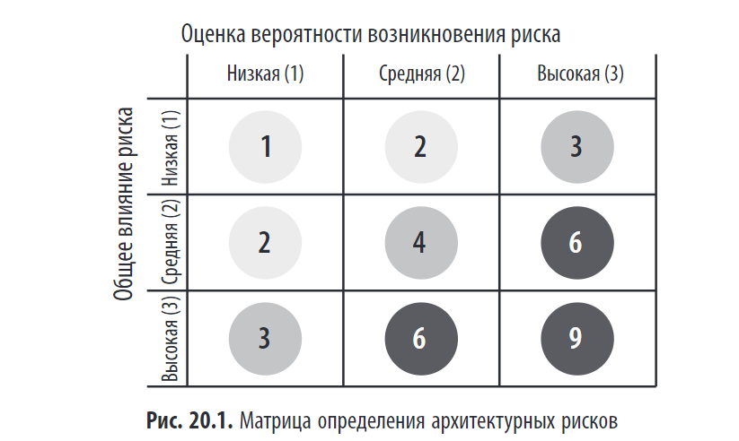
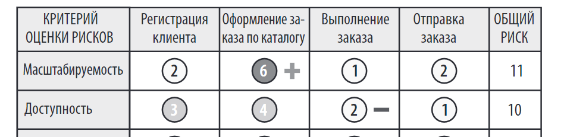
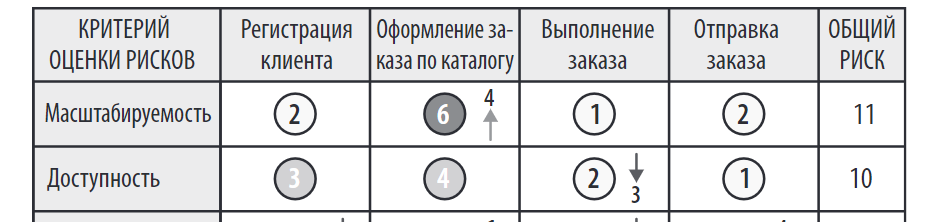
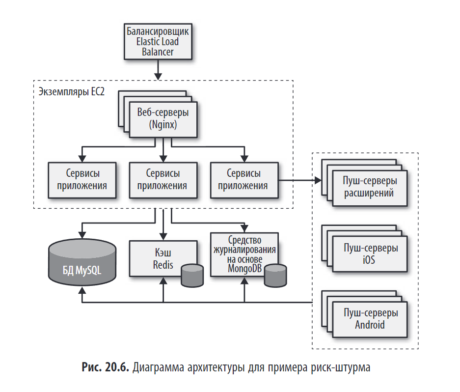
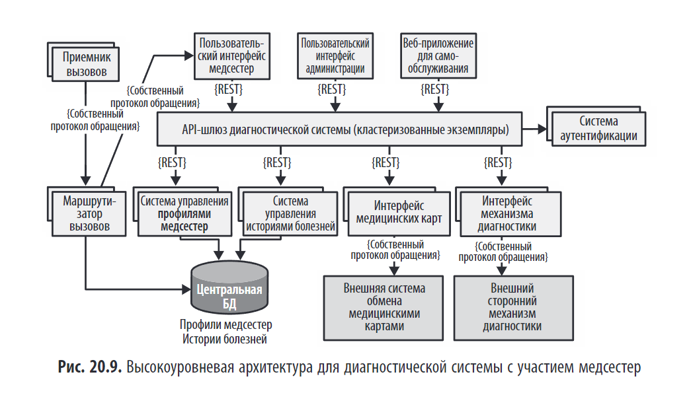
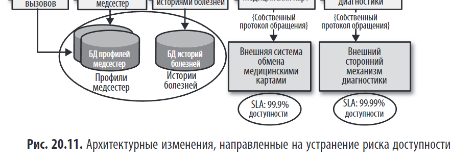
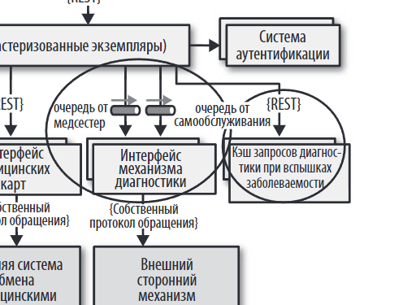
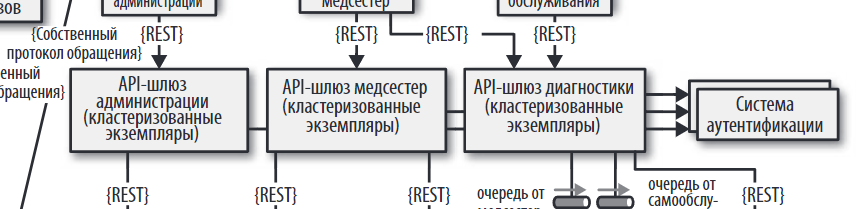
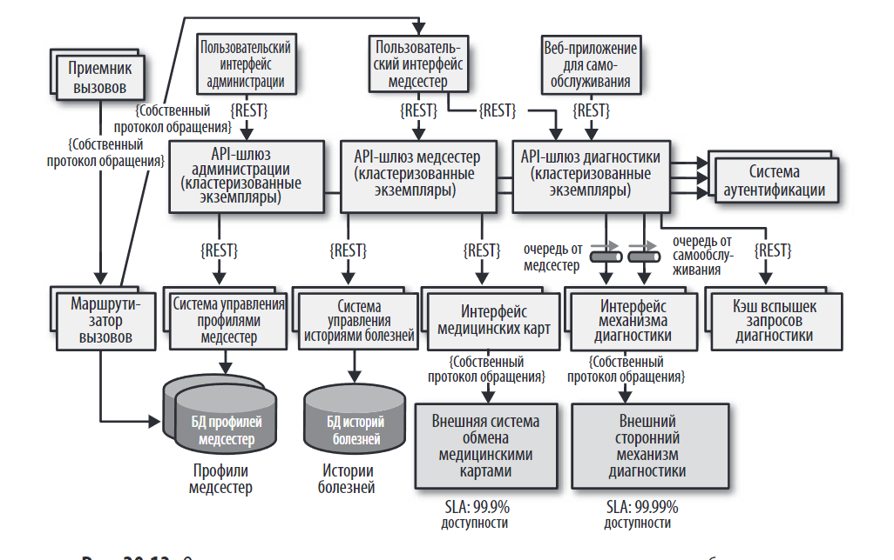

> _"Анализ архитектурных рисков — это процесс выявления, оценки и снижения тех рисков, которые могут поставить под угрозу успех системы."_

## Краткое содержание

Глава 20 посвящена **методу риск-штурма (risk storming)** — структурированному процессу совместного выявления архитектурных рисков. Авторы описывают:

- **Что такое архитектурный риск**.
- **Процесс риск-штурма** в 4 этапа: подготовка, индивидуальное выявление, коллективное обсуждение, снижение рисков.
- **Матрицу оценки рисков** (вероятность × воздействие).
- Как **визуализировать риски** и отслеживать их динамику.
- Пример из практики: **система в сфере здравоохранения (HIPAA)**.

---

## 🏗️ Что такое архитектурный риск?

**Архитектурный риск** — это **потенциальная проблема**, которая:

- Связана с **структурой системы**.
- Может повлиять на **архитектурные свойства** (безопасность, производительность, масштабируемость).
- Требует **принятия архитектурного решения** для устранения.

> 💬 _"Архитектурный риск — это то, что может пойти не так, если мы примем неверное решение."_

### Примеры:

- Высокая связанность между сервисами.
- Отсутствие резервного копирования БД.
- Несоответствие требованиям безопасности (например, HIPAA).

---
## 📊 Матрица оценки рисков

Матрица рисков помогает объективно оценить степень архитектурного риска по двум измерениям:

1. **Общее влияние** (насколько серьёзны последствия)
2. **Вероятность возникновения**

Каждое измерение оценивается по шкале: низкое (1), среднее (2), высокое (3).  
Итоговый риск = **Влияние × Вероятность**.

- **1–2** — низкий риск
- **3–4** — средний риск
- **6–9** — высокий риск

> Пример: Сбой базы данных имеет **высокое влияние (3)**, но при кластеризации — **низкую вероятность (1)** → итоговый риск: **3** (средний).

**Важно**: сначала оценивайте **влияние**, затем — **вероятность**.

---
## 📊** Оценка рисков (Risk Assessment)**

Оценка рисков — это **сводный отчет**, основанный на матрице рисков, который показывает общий уровень угроз для архитектуры с учетом контекстных и значимых оценочных критериев 
по ключевым критериям (масштабируемость, доступность, безопасность и др.) и по областям системы (например, "Регистрация клиента").

- Риски суммируются и визуализируются в таблице (например, по 5 критериям и 4 сервисам).
- Используется цветовая или серая шкала:
    - **1–2** — низкий риск (зеленый/светло-серый)
    - **3–4** — средний риск (желтый/серый)
    - **6–9** — высокий риск (красный/темно-серый)

>
Xотя показанный на рис. 20.2 пример оценки рисков содержит все результаты анализа, в реальности оценку так не презентуют.

**Для анализа используют:**

- **Фильтрацию** — чтобы показать только критичные зоны (например, риски выше 6).
- **Индикацию динамики** — чтобы видеть, улучшается или ухудшается ситуация:
    - **Знак «–»** — риск растёт (ухудшение)
    - **Знак «+»** — риск снижается (улучшение)
    - **Стрелки с числами** — наглядно показывают направление и величину изменения.

Такой подход превращает оценку из **статичного отчёта** в **инструмент для отслеживания прогресса** и принятия решений.

---

## 📊**Проведение риск-штурма**

Риск-штурм — это **коллективный процесс** выявления и анализа архитектурных рисков, потому что один архитектор не может увидеть все угрозы и обладать полными знаниями о всей системе.

**Цель**: выявить зоны риска по ключевым параметрам:

- Производительность, масштабируемость, доступность
- Безопасность, потеря данных, точки отказа
- Непроверенные технологии

**Участники**: архитекторы, техлиды, ведущие разработчики — для привлечения разных точек зрения.

**Процесс состоит из двух частей:**

1. **Индивидуальная (выявление)**: каждый участник **самостоятельно** отмечает риски на архитектурной диаграмме, чтобы избежать группового мышления.
2. **Совместная (консенсус и снижение)**: команда вместе обсуждает риски, достигает согласия по их уровню и вырабатывает решения по устранению.

**Три этапа риск-штурма:**

1. **Выявление** — индивидуальная работа.
2. **Консенсус** — обсуждение и согласование оценок.
3. **Снижение рисков** — определение действий по улучшению архитектуры.

Для проведения используется **архитектурная диаграмма** (контекстная или комплексная), которую обеспечивает ведущий архитектор. - структурная диаграмма элементов 

Диаграмма архитектуры для примера риск-штурма

📊**Этап "Выявление" в риск-штурме**

Этап "Выявление" — это **индивидуальная работа** участников перед совместным обсуждением. Цель — избежать группового мышления и собрать независимые мнения.

**Шаги:**

1. **Подготовка**: Ведущий архитектор рассылает приглашение с диаграммой архитектуры, фокусом анализа (например, производительность) и временем встречи.
2. **Индивидуальный анализ**: Каждый участник использует **матрицу рисков** (влияние × вероятность) для оценки рисков в системе: низкий (1-2), средний (3-4), высокий (6-9).
3. **Подготовка стикеров**: Участники делают цветные стикеры (зеленый, желтый, красный) с указанием степени риска.

**Важно:**

- Работа ведётся **по одной области риска**, чтобы не было путаницы.
- Если анализируется несколько областей (напр., производительность и масштабируемость), название области указывается на стикере рядом с числом.

🔄 **Этап "Консенсус" в риск-штурме**

Этап "Консенсус" — это **совместное обсуждение**, цель которого — достичь единого мнения по всем выявленным рискам.

**Процесс:**

1. Участники
2. Команда анализирует все зоны риска и обсуждает расхождения во мнениях.

**Как достигается консенсус:**

- Если все согласны с оценкой (например, большинство увидело средний риск), решение принимается без обсуждения.
- При **расхождениях** (один участник оценил риск выше) — проводится обсуждение:
    - Участник объясняет свою оценку (например, "балансировщик — единая точка отказа").
    - Остальные приводят контраргументы (например, "но он очень надежен").
    - В итоге команда приходит к согласованной оценке.

**Ключевые примеры из текста:**

- Риск в **пуш-серверах** был выявлен только одним участником благодаря его личному опыту — это показывает ценность вовлечения разных специалистов.
- Риск в **Redis** был завышен, потому что один участник не знал эту технологию. Это демонстрирует, что **неизвестные технологии автоматически считаются высокорискованными (оценка 9)**.

🔄 **Снижение рисков**

После согласования зон риска наступает этап **снижения рисков (risk mitigation)** — самый важный шаг в риск-штурме.

- Цель: уменьшить или устранить выявленные риски с помощью**архитектурных изменений** :

    - Рефакторинг (например, добавление очереди).
    - Масштабирование, кластеризация.
    - Раз
- Любые изменения связаны с **дополнительными затратами**, поэтому архитектор должен **обсудить компромиссы с бизнес-стейкхолдерами**.
    

> Пример: предложение кластеризовать БД за $20 000 было отклонено как слишком дорогое, но компромиссное решение — разделение БД за $8 000 — было одобрено.

**Вывод**: риск-штурм — это не только технический анализ, но и **инструмент для ведения переговоров**, помогающий обосновать инвестиции в архитектуру.

## 🔄 **Примеры риск-штурма (колл-центр для медсестер)**

Риск-штурм продемонстрирован на примере архитектуры медицинского колл-центра. Первоначальный дизайн (рис. 20.9) был проанализирован по трём ключевым направлениям:

---

### 1. **Доступность**

- **Выявленные риски:**
    - Единая центральная БД — высокий риск (6): её отказ парализует маршрутизацию вызовов.
    - Внешний механизм  (механизма диагностики и системы обмена медкартами — высокий риск (9): нет контроля над доступностью.
- **Решение:**
    - Разделить БД на две: **профили медсестер** и **истории болезней**.
    - Зафиксировать SLA внешних систем (99.9%, 99.99%) — риск считается управляемым.

---

### 2. **Адаптируемость (масштабируемость)**

- **Выявленный риск:**
    - Механизм диагностики (500 запросов/сек) не выдержит нагрузки при вспышках заболеваний.
- **Решение:**
    - Ввести **асинхронные очереди** для буферизации запросов.
    - Добавить **кэш запросов при вспышках заболеваний**.
    - Разделить потоки: **очередь для медсестер** и **очередь для самообслуживания**.

---

### 3. **Безопасность (HIPAA)**

- **Выявленный риск:**
    - Один API-шлюз на все типы пользователей — риск несанкционированного доступа пациентов/администраторов к медкартам (оценка 6).
- **Решение:**
    - Ввести **отдельные API-шлюзы** для медсестер, администраторов и пациентов.
    - Это физически исключает путь к медкартам для неавторизованных пользователей.

---

### ✅ Итог

После трёх риск-штурмов архитектура (рис. 20.13) кардинально изменилась:

- Устранены **единственные точки отказа**.
- Обеспечена **масштабируемость** при пиковых нагрузках.
- Гарантирована **безопасность и соответствие HIPAA**.

> 💬 **Вывод:** Риск-штурм — не разовое действие, а **непрерывный процесс**, позволяющий выявлять скрытые угрозы и существенно улучшать архитектуру до выхода в продакшен.
> 
## 💬 Вывод

- **Риски нельзя игнорировать** — их нужно **выявлять системно**.
- **Коллективный подход** лучше, чем индивидуальный — в команде больше знаний.
- **Визуализация** помогает понять приоритеты.
- **Снижение рисков** — это не просто "заметить", а **внести изменения в архитектуру**.

> ✅ **Итог**:
> 
> - Проводите регулярные **риск-штурмы**.
> - Используйте **матрицу рисков**.
> - Фиксируйте решения в **ADR**.

---

ДОП:
## 🔄 КРАТКО Процесс риск-штурма (Risk Storming) 

Риск-штурм — это **коллективное мероприятие**, которое помогает выявить скрытые угрозы.

### 1. **Подготовка**

- Определить **цель сессии** (например, анализ безопасности).
- Выбрать **участников** (архитекторы, разработчики, эксплуатационники).
- Подготовить **инфраструктуру** (доска, стикеры, маркеры).

### 2. **Индивидуальное выявление рисков**

- Участники **поодиночке** записывают риски на стикеры.
- Это предотвращает **эффект доминирования** одного голоса.
- Риски группируются по категориям: безопасность, производительность, доступность и т.д.

### 3. **Коллективное обсуждение**

- Все стикеры выкладываются на доску.
- Участники обсуждают каждый риск:
    - Почему он возник?
    - Каково его **воздействие** и **вероятность**?
    - Нужно ли его фиксировать?
- Достижение **консенсуса** по каждому риску.

### 4. **Снижение рисков**

- Для каждого критического риска разрабатывается **план действий**:
    - Изменить архитектуру.
    - Ввести новое правило.
    - Добавить мониторинг.
- Риски фиксируются в **ADR** или трекере задач.

---

