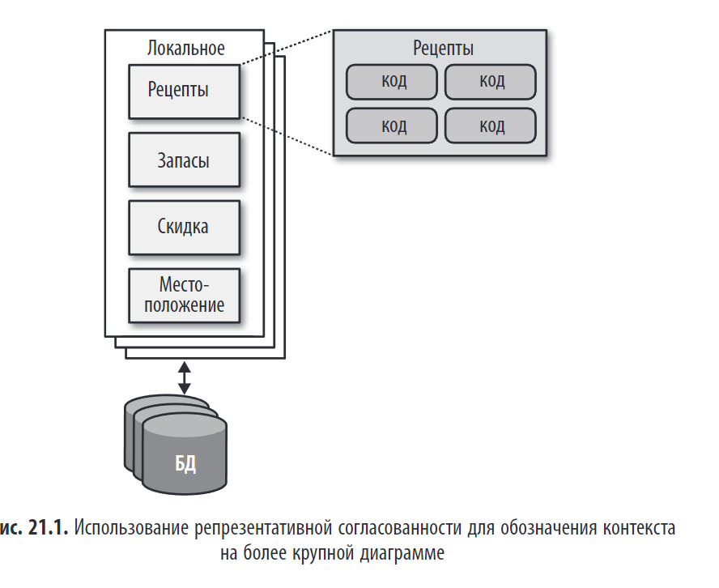

> _"Слайды — лишь половина всей истории. Другая половина — это вы, ваш голос и ваша энергия."_

## Краткое содержание

Глава 21 посвящена **искусству визуализации и коммуникации** для архитекторов. Она объясняет, как:

- Создавать **понятные и эффективные архитектурные диаграммы**.
- Проводить **влиятельные презентации**, которые вызывают диалог, а не просто передают информацию.
- Избегать распространённых ошибок, таких как перегруженные слайды.
- Использовать **постепенное выстраивание** (progressive disclosure) для управления вниманием аудитории.
- Отличать **инфо-дек** от **презентации**.

---
Для начинающих архитекторов часто неожиданностью становится важность **непрофессиональных навыков**, особенно **эффективной коммуникации**. Даже самые гениальные технические идеи бесполезны, если не удаётся убедить руководство в их ценности, а разработчиков — в необходимости их реализации.

**Ключевые навыки:**

- **Составление диаграмм**
- **Проведение презентаций**

Оба инструмента служат для **визуализации архитектурного замысла** и должны быть согласованы по содержанию.

**Репрезентативная согласованность** — принцип, согласно которому при детализации части архитектуры необходимо **всегда показывать её связь с общей структурой**. Это помогает избежать путаницы и позволяет аудитории понять контекст.

> Пример: сначала показывается общая топология системы, а затем — детали (например, взаимодействие плагинов) с указанием места этой части в общей архитектуре.

Такой подход обеспечивает ясность и улучшает восприятие архитектуры.

---

## 🖼️ Составление диаграмм

Топология архитектуры — ключ к взаимопониманию в команде, поэтому навык создания диаграмм должен быть доведён до совершенства.

**Основные принципы:**

- **Начните с грубых набросков** (на доске или планшете), чтобы избежать **иррациональной привязанности к артефакту** — чем больше времени вы тратите на красивую диаграмму, тем сильнее привязываетесь к ней.
- **Не создавайте «красивые» диаграммы слишком рано** — сначала пройдите итерации с командой.
- **Используйте цифровые инструменты** (например, OmniGraffle), но цените простоту (стикеры, карточки, Agile-подход).

**Ключевые функции инструментов:**

- **Слои** — позволяют скрывать детали и использовать диаграмму поэтапно.
- **Трафареты и шаблоны** — обеспечивают единообразие и ускоряют процесс создания.
- **Магниты** — помогают аккуратно соединять элементы.
- Поддержка экспорта и визуального форматирования.

> 💡 Главное — диаграмма должна служить **средством коммуникации**, а не предметом демонстрации мастерства.
---

✅**Стандарты составления диаграмм — UML, C4, ArchiMate**

Для визуализации архитектуры используются три основных подхода:

1. **UML (унифицированный язык моделирования)**
    
    - Формальный стандарт, объединивший подходы 1980-х годов.
    - На практике используются только **диаграммы классов и последовательностей**.
    - Остальные типы диаграмм устарели и редко используются.
    - 
2. **[Модель C4](../../../topics/Модель%20C4.md)** (разработана Саймоном Брауном)
    - Современная альтернатива UML, устраняющая его недостатки.
    - Четыре уровня детализации:
        - **Контекст (Context)** — система в окружении.
        - **Контейнер (Container)** — приложения, базы данных, сервисы.
        - **Компонент (Component)** — внутренние части контейнера.
        - **Класс (Class)** В ОРИГИНАЛЕ КОД CODE — детали реализации (по аналогии с UML).
    - Подходит для **монолитов**, сложнее применим к **микросервисам**.
    - Подходит для стандартизации и коммуникации.

3. **Архимат ArchiMate**
    - Стандарт Open Group для **корпоративной архитектуры**.
    - Моделирует бизнес-процессы, ИТ-инфраструктуру и приложения.
    - Лаконичный язык, акцент на сути, а не на деталях.
    - Популярно среди архитекторов предприятий.

> ✅ **Итог**: UML — устарел, C4 — удобен для разработчиков, ArchiMate — для бизнес-ориентированных архитекторов.

###  **Рекомендации по созданию диаграмм**
Хорошая архитектурная схема должна быть **понятной, последовательной и визуально привлекательной**. Основные рекомендации:

- **Заголовки**: Все элементы должны быть подписаны. Используйте поворот текста для экономии места и лучшего позиционирования.
- **Линии**: делайте их заметными. Используйте **стрелки** для обозначения направления потока данных.
    - **Сплошные линии** — синхронный обмен.
    - **Пунктирные линии** — асинхронный обмен.
- **Фигуры**:
- **Надписи (метки)**: подписывайте все элементы, особенно если они могут быть неочевидны для аудитории.
- **Цвет**: предпочтительнее монохромное оформление, но цвет можно использовать для **различения компонентов** (например, разные микросервисы — разными цветами).
- **Пояснения**: если есть риск недопонимания, добавляйте пояснения. **Плохая диаграмма хуже, чем её отсутствие.**

> 💬 Главное — **ясность и последовательность**. Берите на вооружение лучшие практики и формируйте свой стиль.
> 

---

## 🎤 Проведение презентаций

Презентация — ключевой **гибкий навык** архитектора, но часто презентации проводятся плохо из-за недостатка практики.

### Основные принципы:

- **Презентация ≠ документ**. В презентации докладчик **управляет временем**, а не просто зачитывает слайды.
- **Избегайте антипаттерна «Body-Riddled Corpse» («Тело, изрешеченное пулями»)** — когда слайд переполнен текстом, который докладчик зачитывает дословно. Это перегружает аудиторию и рассеивает внимание.

### Ключевые приёмы:

1. **Постепенное раскрытие (Progressive Disclosure)**:
    
    - Показывайте слайд **по частям**, раскрывая информацию по мере рассказа.
    - Это создаёт интригу и помогает зрителям следить за развитием сюжета.
2. **Управление вниманием**:
    
    - Используйте **переходы и анимацию**, чтобы «связать» слайды в единое повествование.
    - Используйте **стратегическое затемнение экрана** (чёрный слайд), чтобы переключить внимание на себя.
3. **Два информационных канала**:
    
    - **Вербальный** (речь докладчика) и **визуальный** (слайды).
    - Не дублируйте речь текстом на слайде — это перегружает аудиторию.
4. **Инфографика против презентации**:
    
    - **Инфо-дек** — это готовый к прочтению документ (всё включено).
    - **Презентация** — это **диалог**, в котором слайды — это только **половина истории**, вторая половина — это вы.

> 💬 Главное: **презентация — это не демонстрация слайдов, а управление вниманием и коммуникация.**
