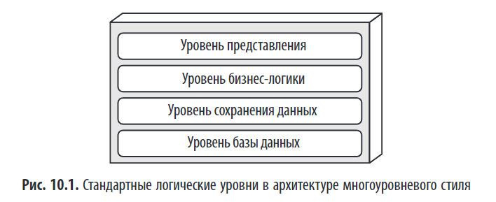
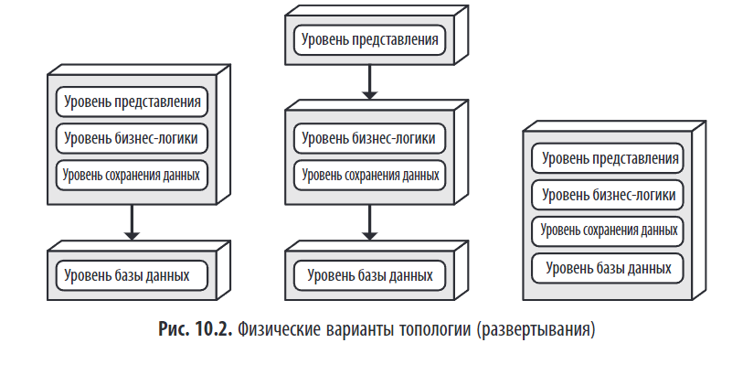
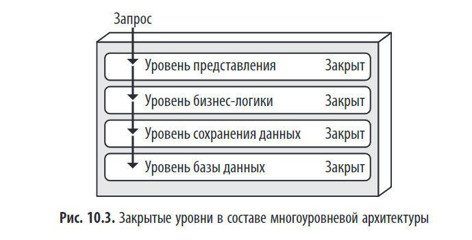
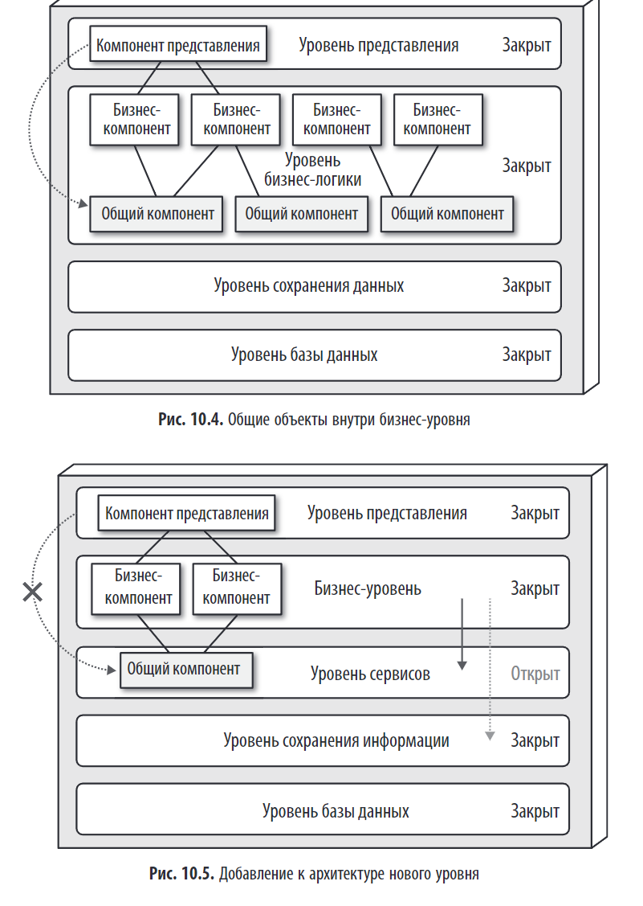

> *"Многоуровневая архитектура — один из самых распространённых и понятных стилей, но его слабые стороны часто недооцениваются."*

## Краткое содержание

Глава 10 посвящена **многоуровневой архитектуре** — классическому стилю, при котором система разделяется на горизонтальные слои: представление, бизнес-логика, доступ к данным и база данных.  
Многоуровневая архитектура является неплохой отправной точкой для большинства приложений, когда ещё точно неизвестно, какой в конечном итоге будет использован архитектурный стиль.

При многоуровневом проектировании также есть риск использования ряда архитектурных антипаттернов, включая [Антипаттерн подразумеваемой архитектуры (Architecture by Implication)](../../topics/Антипаттерн%20подразумеваемой%20архитектуры%20(Architecture%20by%20Implication).md).

> **Антипаттерн подразумеваемой архитектуры (Architecture by Implication)** возникает, когда архитектура системы выбирается не осознанно, а «подразумевается» по умолчанию, например из-за структуры фреймворка или отсутствия архитектурного решения. Это часто приводит к автоматическому выбору многоуровневой архитектуры без анализа её применимости, что может обернуться ограниченной гибкостью, сложностью масштабирования и проблемами в долгосрочной перспективе.

и антипаттерн бессистемной архитектуры (accidental architecture).  
(тоже самое | **Антипаттерн подразумеваемой архитектуры** | | Антипаттерн бессистемной архитектуры | **Антипаттерн случайной архитектуры** |)

---

## 🏗️ Что такое многоуровневая архитектура?

**Многоуровневая архитектура** (n-tier architecture) — это стиль, при котором система делится на **логические горизонтальные уровни**, каждый из которых отвечает за свою зону ответственности.

### Типичные уровни:
1. **Уровень представления (Presentation)** — UI, веб-слои, API.  
2. **Уровень бизнес-логики (Business Logic)** — правила, процессы, доменные объекты.  
3. **Уровень доступа к данным (Data Access)** — репозитории, DAO.  
4. **Уровень базы данных (Database)** — хранение данных.

В некоторых случаях уровень бизнес-логики и уровень сохранения информации объединяются в один бизнес-уровень, особенно когда логика сохранения (например, SQL или HSQL) встроена в компоненты уровня бизнес-логики. Поэтому у небольших приложений может быть только три уровня, а большие и более сложные бизнес-приложения могут состоять из пяти и более.

> 📌 Пример: веб-приложение на Spring MVC: контроллер → сервис → репозиторий → БД.  

различные варианты топологии с точки зрения физического разбиения на уровни (развертывания) модули  

У каждого уровня в архитектуре многоуровневого стиля есть своя особая роль и ответственность в рамках этой архитектуры. Уровень представления отвечает за обслуживание пользовательского интерфейса и за логику взаимодействий в браузере, а уровень бизнес-логики занимается выполнением определённых бизнес-правил, связанных с запросами. Каждый архитектурный уровень формирует некую абстракцию действий, которые необходимы для выполнения конкретного бизнес-запроса.

###### Эта концепция разделения ответственности (separation of concerns) упрощает построение оптимальных ролей и моделей ответственности внутри архитектуры. Компоненты в рамках конкретного уровня ограничены в области действия и работают только с логикой, относящейся к данному уровню.  
###### Это позволяет разработчикам сфокусироваться на технических аспектах только предметной области (например, на логике представления или логике сохранения данных). Но компромисс, на который приходится идти, добиваясь такого преимущества, выражается в отсутствии общей гибкости (способности быстро реагировать на изменения).

###### Многоуровневая архитектура относится к архитектурам, разбиваемым по техническому принципу (в отличие от предметного разбиения). Получается, что ко всему прочему в архитектуре многоуровневого стиля не работает и предметно-ориентированное проектирование.

---

# Уровни изоляции в многоуровневой архитектуре

> *"Концепция уровней изоляции состоит в том, что изменения, сделанные на одном уровне архитектуры, как правило, не влияют на компоненты на других уровнях, при условии, что контракты между ними останутся неизменными."*

## Определение

**Уровни изоляции (layers of isolation)** — это ключевая концепция в многоуровневой архитектуре, которая обеспечивает **независимость уровней** друг от друга. Она достигается за счёт **закрытых уровней**, что гарантирует, что изменения внутри одного уровня не затрагивают другие уровни, если интерфейсы (контракты) остаются неизменными.

---

## 🔐 Как работает изоляция?

Уровни изоляции работают по следующему принципу:

1. **Каждый уровень имеет чёткую ответственность**:  
   - Представление: UI, взаимодействие с пользователем.  
   - Бизнес-логика: правила, процессы.  
   - Доступ к данным: работа с БД.  
   - База данных: хранение.

2. **Взаимодействие происходит только через чётко определённые интерфейсы (контракты)**.

3. **Закрытые уровни** обеспечивают изоляцию:  
   - Запрос должен проходить **все уровни по порядку**.  
   - Нельзя обойти уровень (например, UI → напрямую к БД).

> 💬 *"Закрытые уровни облегчают поддержку уровней изоляции и помогают тем самым изолировать изменения внутри архитектуры."*

---

## 🔒 Закрытые vs. Открытые уровни

| Характеристика        | Закрытый уровень           | Открытый уровень            |
|-----------------------|----------------------------|-----------------------------|
| **Обход уровня**      | ❌ Нельзя                  | ✅ Можно                    |
| **Изоляция**          | ⭐⭐⭐⭐⭐                    | ⭐☆☆☆☆                     |
| **Гибкость**          | ⭐⭐☆☆☆                    | ⭐⭐⭐⭐☆                     |
| **Риск архитектурной воронки** | Низкий               | Высокий                     |
| **Пример**            | UI → Бизнес → Данные → БД | UI может напрямую читать из БД |

> 🖼️ *Рис. 10.3: Закрытые уровни — запрос проходит все уровни.*  
> 

> 🖼️ *Рис. 10.5: Открытый уровень — бизнес-компонент может обойти общий компонент.*  
> 

## ✅ Преимущества уровней изоляции

1. **Изоляция изменений**  
   - Можно заменить UI (например, JSF → React), не затрагивая бизнес-логику.  
   - Можно изменить способ хранения данных, не меняя бизнес-правила.

2. **Повторное использование**  
   - Бизнес-логика может использоваться разными клиентами (веб, мобильное приложение, API).

3. **Поддержка замены компонентов**  
   - *"Концепцией уровней изоляции можно воспользоваться... для замены старых уровней представления JavaServer Faces (JSF) на React.js, не затрагивая при этом никаких других уровней."*

4. **Чёткое разделение ответственности**  
   - Каждый уровень знает только о соседних.

---

## ⚠️ Проблемы открытых уровней

Если уровни **открыты**, возникают риски:

- [**Архитектурная воронка (Architecture Sinkhole)**:]() запросы проходят сквозь уровни без выполнения бизнес-логики (просто "туннель").  
- **Снижение изоляции**: изменение в одном уровне может сломать другие.  
- **Сложность сопровождения**: логика размазана, сложно понять поток данных.

> 💬 *"Если уровень представления может напрямую обращаться к уровню сохранения данных, то концепция уровней изоляции нарушается."*

---

## 🔄 Когда использовать открытые уровни?

Открытые уровни могут быть оправданы в редких случаях:
- Для **очень простых запросов** (например, быстрое чтение данных).  
- В **высокопроизводительных системах**, где задержка критична.

Но даже тогда нужно:
- Чётко документировать исключения.  
- Минимизировать количество таких обходов.  
- Следовать правилу 80/20: не более 20% запросов должны быть "воронками".

---

## 🔁 Принципы взаимодействия

- **Слои взаимодействуют только с соседними уровнями** (вверх/вниз).  
- Обычно **однонаправленная зависимость**: верхние уровни зависят от нижних.  
- Нарушение этого правила → «архитектурная воронка».

> 💬 *"Цель многоуровневой архитектуры — упростить разработку за счёт чёткого разделения ответственности."*

---

### 📊 **Таблица: Оценки архитектурных свойств многоуровневой архитектуры**

| Архитектурное свойство | Рейтинг в звездах | Обоснование                                                                                                                                                        |
|------------------------|-------------------|--------------------------------------------------------------------------------------------------------------------------------------------------------------------|
| **Тип разбиения**      | Технический       | Многоуровневая архитектура основана на **техническом разбиении** (UI, бизнес-логика, доступ к данным, БД). Это отличает её от предметно-ориентированной архитектуры. |
| **Количество квантов** | 1                 | В многоуровневой архитектуре всегда только один архитектурный квант, так как система монолитная.                                                                   |
| **Развертываемость**   | ⭐                 | Низкая оценка из-за монолитного характера системы. Любое изменение требует полного перезапуска всего приложения.                                                   |
| **Адаптируемость**     | ⭐                 | Низкая оценка из-за монолитного характера. Изменения могут повлиять на всю систему.                                                                                |
| **Эволюционность**     | ⭐                 | Низкая оценка из-за сложности добавления новых функций без изменения всей системы.                                                                                 |
| **Отказоустойчивость** | ⭐                 | Низкая оценка из-за монолитного характера. Сбой в одном компоненте может привести к сбою всей системы.                                                             |
| **Модульность**        | ⭐                 | Низкая оценка из-за слабой связанности между уровнями. Уровни часто не являются независимыми.                                                                      |
| **Общие затраты**      | ⭐⭐⭐⭐⭐             | Очень высокая оценка, так как система проста и дешева в создании и сопровождении.                                                                                  |
| **Производительность** | ⭐⭐                | Низкая оценка из-за отсутствия параллельной обработки и антипаттерна "архитектурная воронка".                                                                      |
| **Надежность**         | ⭐⭐⭐               | Средняя оценка, так как отсутствие сетевого трафика снижает сложность, но монолитное развертывание увеличивает риски сбоя всей системы.                            |
| **Масштабируемость**   | ⭐                 | Низкая оценка из-за монолитного характера. Масштабирование возможно только до определённого предела.                                                               |
| **Простота**           | ⭐⭐⭐⭐⭐             | Очень высокая оценка, так как структура проста и понятна.                                                                                                          |
| **Тестируемость**      | ⭐⭐                | Низкая оценка из-за необходимости тестирования всего монолита при любых изменениях.                                                                                |

---

## 🚫 Антипаттерны

### 1. [**Архитектурная воронка (Architectural Funnel)**]()

- Когда **верхние уровни напрямую зависят от нижних**, минуя промежуточные.  
- Пример: UI напрямую вызывает методы БД, минуя бизнес-логику.

> ❌ Нарушает слоистость → снижает тестируемость и поддерживаемость.

### 2. **Открытый уровень (Open Layer)**

- Уровень, который **может быть обойдён** другими слоями.  
- Пример: бизнес-логика напрямую обращается к БД, минуя уровень доступа к данным.

> 📌 На рис. 10.5 показано: бизнес-компонент может использовать общий компонент напрямую (сплошная стрелка) или обходить его (пунктирная стрелка) → это и есть открытый уровень.

### 3. **Связанность по образцу (Pattern Cohesion)**

- Все контроллеры в одном модуле, все репозитории — в другом.  
- Нарушает **предметное разбиение**, ведёт к слабой модульности.

---

## 🧰 Практические рекомендации

### 1. **Используйте закрытые уровни**
- Убедитесь, что все вызовы проходят через бизнес-уровень.  
- Запретите прямые вызовы к БД из UI.

### 2. **Изолируйте общую логику**
- Общие сервисы (например, `EmailService`) должны быть в отдельном модуле.  
- Избегайте «CommonUtils» — они нарушают коннасценцию.

### 3. **Ограничьте доступ между слоями**
- Используйте модульные системы (Java 9+ modules, OSGi) или соглашения.  
- В IDE можно использовать проверки зависимостей (например, ArchUnit).

---