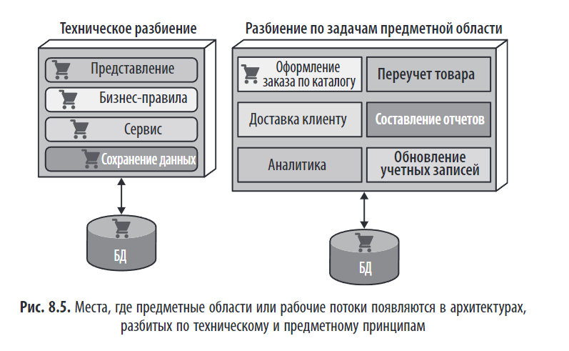
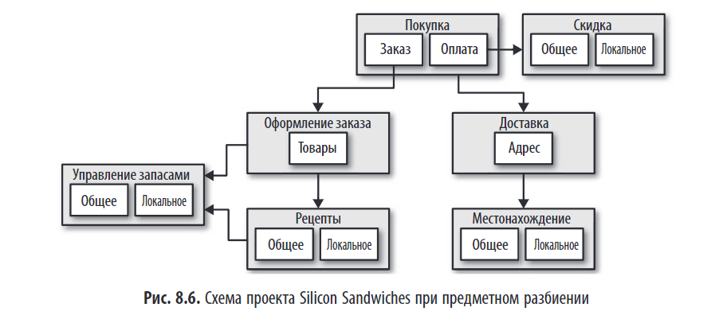
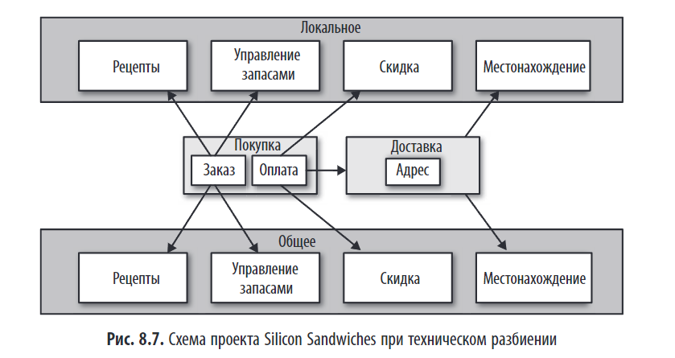
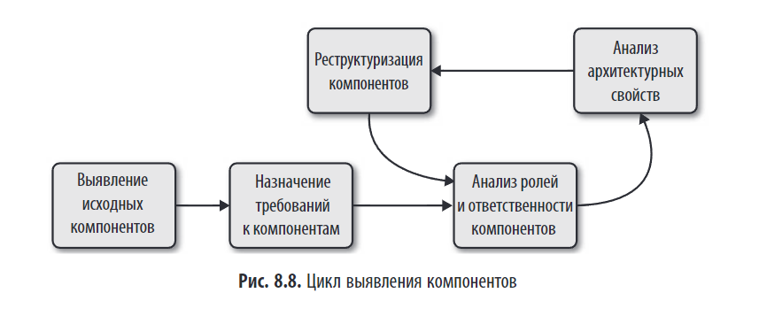

# Компонентно-ориентированное мышление

> *"Архитекторы мыслят в понятиях компонентов, являющихся физическим воплощением модуля."*

## Основные идеи
- Архитектура системы должна проектироваться через призму **компонентов** — строительных блоков, отвечающих за определённые функции.  
- Компонент — это **физическое воплощение абстрактного модуля**.  
- Проектирование идёт итеративно: от грубого разбиения к детализации.

---

## 🧱 Что такое компонент?

Компонент — это физическое воплощение модуля, который:
- Состоит из группы классов, файлов, пакетов.  
- Может быть упакован и развернут независимо (или как часть монолита).  
- Является **реализацией абстрактного модуля**.  

Компоненты также выступают в роли подсистем или уровней архитектуры, как развертываемая единица для многих обработчиков событий.

Компоненты крайне важны для архитекторов, потому что являются основным строительным блоком для создания модулей. По сути, одним из первостепенных обязательных решений, принимаемых архитектором, является высокоуровневая разбивка на компоненты.

Это минимальная единица, с которой архитектор работает напрямую (за исключением метрик кода).

### Примеры компонентов
- `.jar`-файл в Java  
- Docker-контейнер  
- npm-пакет  
- WAR-файл  
- Подсистема в монолите  

> 💡 **Ключевое отличие от модуля**:  
> Модуль — логическая группировка (например, "Оплата"),  
> Компонент — его физическая реализация (например, `payment-service.jar`).

Разница между **модулем** и **компонентом** — это разница между **логическим** и **физическим** уровнями проектирования программной системы.

| Понятие       | Характеристика                                             | Уровень                      |
| ------------- | ---------------------------------------------------------- | ---------------------------- |
| **Модуль**    | Логическая группировка взаимосвязанного кода               | Абстрактный (проектирование) |
| **Компонент** | Физическое воплощение модуля, строительный блок приложения | Реальный (реализация)        |

## 🧱 Что такое **модуль**?

### Определение

> _«Мы используем понятие модульности для описания логической компоновки взаимосвязанного кода, в качестве которой может выступать группа классов в объектно-ориентированном языке или функций в структурном или функциональном языке»._

- **Модуль** — это **абстрактная, логическая единица**.  
- Он не привязан к конкретной упаковке или среде выполнения.  
- Это **идея** о том, какие классы, функции или объекты следует сгруппировать вместе, поскольку они выполняют общую задачу.

### Примеры модулей
- `Оплата`  
- `Управление запасами`  
- `Оформление заказа`  
- `Аналитика`  

> 💬 Модуль — это то, **что вы рисуете на архитектурной диаграмме**, ещё до того, как будет решено, как это будет реализовано технически.

---

## 🔗 Связь между модулем и компонентом

| Характеристика | Модуль                       | Компонент                           |
| -------------- | ---------------------------- | ----------------------------------- |
| Природа        | Логическая, абстрактная      | Физическая, реализуемая             |
| Цель           | Группировка по смыслу        | Упаковка и развёртывание            |
| Пример         | «Оплата» (идея)              | `payment-service.jar`, Docker-образ |
| Уровень        | Архитектурное проектирование | Реализация и инфраструктура         |
| Изменяемость   | Меняется редко (логика)      | Может меняться (JAR → контейнер)    |

🔍 **1. Модуль — это логическая группировка, а не физическая единица**  
Да, модуль — это абстрактное понятие, но не в смысле «не существующее», а в смысле «не привязанное к конкретной упаковке или уровню детализации».

💬 *"Мы используем понятие модульность для описания логической компоновки взаимосвязанного кода, в качестве которой может выступать группа классов в объектно-ориентированном языке либо функций в структурном или функциональном языке."* — Глава 3

Это означает:
- Модуль — это идея о том, какие части кода должны быть вместе, потому что они выполняют общую задачу.  
- Он может существовать даже без явной физической упаковки (компонента).

🔍 **2. Компонент — это физическое воплощение модуля**  
💬 *"Разработчики упаковывают модули различными способами... Физическая упаковка модулей называется компонентом."* — Глава 8

Компонент — это то, что можно собрать, развернуть, измерить.  
Это `.jar`, `.dll`, Docker-образ, npm-пакет и т.д.  
💬 *"Компонент, как правило, является самым низким уровнем программной системы, с которым архитектор работает напрямую..."* — Глава 8

🔍 **3. Почему в микросервисе может не быть компонентов?**  
Авторы приводят рисунок 8.2:

💬 *"У микросервиса может быть так мало кода, что компоненты ему не понадобятся."* — Рис. 8.2

Что это значит?
- Микросервис — это уже сам по себе компонент (развёртываемая единица).  
- Внутри него может быть только один модуль, например, `BidTracker`.  
- Если логика проста, то разбивать этот модуль на подкомпоненты (например, service, repository, dto) — избыточно.  
- Нет смысла создавать отдельные JAR-файлы или пакеты внутри одного сервиса.

🔍 **4. Может ли модуль существовать без компонента?**  
Да, но с оговоркой.

- Модуль как идея — всегда существует.  
- Модуль как структура кода — тоже существует (например, папка `bidtracker/`).  
- Но компонент как физическая упаковка — нужен только если есть необходимость в независимой развёртываемости, повторном использовании или измерении.  

💬 *"От архитекторов не требуется обязательно работать с компонентами, просто зачастую целесообразно использовать уровень модульности выше минимально предлагаемого самим языком."* — Глава 8

🔍 **5. Аналогия: дом и кирпичи**  
- Модуль — это комната (спальня, кухня). Она определяется назначением.  
- Компонент — это блок кирпичей, скреплённых раствором, который можно поднять краном (развёртываемая единица).  
- В большом доме (монолите) комнаты строятся из нескольких блоков (компонентов).  
- В маленьком домике (микросервисе) вся комната — это один блок.  
→ Модуль есть, а подкомпонентов — нет.

🔍 **7. Почему это не противоречит идее «модуль — абстрактный»?**  
Потому что:

- Абстрактность здесь — не про "неналичие", а про независимость от реализации.  
- Вы можете мыслить в терминах модуля `BidTracker`, даже если он не упакован в отдельный JAR.  
- Вы можете переупаковать его позже в компонент, если он вырастет.  
- Вы можете заменить реализацию, оставив модуль (логику) прежней.

✅ Модуль — это **что делает система**.  
Компонент — это **как это упаковано и развёрнуто**.

> 💡 **Основная мысль книги**:  
> Архитекторы мыслят **модулями**, но работают с **компонентами**, потому что именно компоненты можно развёртывать, масштабировать и контролировать.

## 🛠️ Роль архитектора
- Определяет границы компонентов.  
- Гарантирует соответствие архитектурным свойствам.  
- Управляет компромиссами между:
  - Масштабируемостью и сложностью  
  - Независимостью и производительностью  
  - Гибкостью и стабильностью  

---

## Высокоуровневого разбиения архитектуры на части

## 🔍 **Основная цель разбиения**

Разбиение архитектуры — это **ключевой шаг в проектировании системы**, который определяет:
- Как код будет организован.  
- Какие компоненты будут созданы.  
- Какие архитектурные свойства будут поддерживаться.  
- Как команды будут работать с кодом.  

> 💬 _"Архитектор должен определиться с компонентами в самом начале разработки нового проекта. Но перед этим необходимо научиться разбивать архитектуру на части."_

## 🧩 Два подхода к разбиению системы

### 1. Предметное (domain-driven) разбиение  
Разделение по **бизнес-функциям** или **рабочим потокам**.

#### ✅ Преимущества
- **Логика одного процесса сосредоточена в одном месте**.  
- Соответствует бизнес-логике.  
- Поддерживает **обратный закон Конвея** — команды могут быть организованы вокруг бизнес-функций.  
- Больше подходит для архитектурных стилей модульного монолита и микросервисов.  
- Лучше масштабируется при переходе к микросервисам.

#### ⚠️ Недостатки
- Настроечный код имеется сразу в нескольких местах.

---

### 2. Техническое (layer-based) разбиение  
Модель — Представление — Контроллер  
Разделение по **уровням абстракции**:
- **Представление** (UI)  
- **Бизнес-правила**  
- **Сервисы**  
- **Сохранение данных**  
- **Общие компоненты**

#### ✅ Преимущества
- **Упрощает поиск кода**: весь код, связанный с сохранением данных, находится в одном месте.  
- Соответствует классическим шаблонам, таким как **MVC** (модель-представление-контроллер).  
- Подходит для **простых систем** и **новичков**.  
- Больше подходит для паттерна многоуровневой архитектуры.

#### ⚠️ Недостатки
- **Разбивает бизнес-логику** на уровни.  
- Например, процесс **«Оформление заказа по каталогу»** (`CatalogCheckout`) оказывается **разделенным** между всеми уровнями.  
- При изменении одного рабочего потока необходимо внести правки **на многих уровнях**.  
- Усложняет независимое развёртывание.  
- Может привести к "толстым" слоям и слабой модульности.

---

## 🔄 Процесс выявления компонентов

1. **Определить исходные компоненты** по предметной области.  
   - На основе требований, ролей пользователей и рабочих процессов.  
   - Пример: в системе аукциона — `Bidder`, `Auctioneer`, `System`.

> Прежде чем для программного проекта будет написан какой-либо код, архитектор должен определить исходные высокоуровневые компоненты на основе выбранного принципа высокоуровневого разбиения. Помимо этого, архитектор может задать любые нужные ему компоненты, а затем сопоставить с ними функционал предметной области, чтобы понять, где именно будет закладываться нужное поведение программы.

2. **Назначение требований к компонентам**  
   - Каждый компонент должен отвечать за определённый набор функций и архитектурных свойств.  
   - Это может привести к созданию новых компонентов, объединению существующих или к разбиению компонентов на части с меньшей функциональностью.

3. **Назначить ответственности** и архитектурные свойства.  
   - Выбор правильной степени детализации:  
     - Что делает компонент?  
     - Какие у него зависимости?  
     - Какие архитектурные свойства он должен поддерживать?

4. **Проанализировать** связанность, коннасценцию, масштабируемость.  
5. **Реструктурировать** при необходимости (слияние/разделение).

---

## 🧩 **Конкретный пример: Going, Going, Gone (GGG)**

Система интернет-аукциона с тремя ролями:
- `Bidder` (участник торгов)  
- `Auctioneer` (организатор)  
- `System` (внутренние процессы)

### Проблема
- `Bidder` и `Auctioneer` имеют **разные архитектурные требования**:  
  - `Auctioneer` требует **высокой доступности и надёжности**.  
  - `Bidder` — **масштабируемость** (тысячи участников).  
- Один и тот же компонент `BidCapture` не может эффективно поддерживать оба набора свойств.

### Решение
- Разделить `BidCapture` на два компонента:  
  - `BidCapture` — для участников.  
  - `AuctioneerCapture` — для организатора.

> 💬 _"Поскольку здесь явно прослеживаются разные уровни архитектурных свойств, архитектор решает разделить компонент BidCapture на BidCapture и AuctioneerCapture, чтобы каждый из этих двух компонентов мог поддерживать разные архитектурные свойства."_

## 🔤 Гранулярность компонентов

**Гранулярность компонентов** — это **степень детализации**, с которой система разбита на компоненты. Она определяет, насколько крупными или мелкими являются компоненты.

- **Слишком мелкая**: избыточные сетевые вызовы, сложность управления. Слишком мелкое дробление влечет за собой увеличение количества взаимодействий между компонентами.  
- **Слишком крупная**: потеря гибкости, трудности с развёртыванием. Наоборот, грубая степень детализации приводит к высоким показателям внутренней связанности.

> ⚖️ Компромисс: между независимостью и производительностью.

---

## 🔤 Выявление компонентов

Антипаттерн **Западня сущности** складывается тогда, когда архитектор неверно отождествляет связи в базе данных с рабочими процессами в приложении.  
Вместо компонента `Оформление заказа`, создаются:
- `OrderManager`  
- `CustomerManager`  
- `ProductManager`  
- `PaymentManager`

#### Почему это плохо:
- Логика одного процесса размыта.  
- Увеличивается связанность.  
- Снижается контрастность.  
- Сложно вносить изменения.

---

**Подход «актор — действия»** — это метод выявления компонентов, при котором архитектор:
1. Определяет **акторов** (роли пользователей или систем).  
2. Определяет **действия**, которые эти акторы могут выполнять в системе.  
3. На основе этих действий выявляет **начальный набор компонентов**.

> Подход актор — действия (actor/actions) (например, _клиент оформляет заказ_) является весьма популярным способом, с помощью которого архитекторы выявляют соответствие требований и компонентов. При этом подходе, изначально созданном в рамках методологии Rational Unified Process, архитекторы определяют акторов, выполняющих действия в приложении, и действия, которые могут выполняться этими акторами.

---

**Штурм событий (Event Storming)** — это **коллаборативная техника проектирования**, при которой команда (архитекторы, разработчики, бизнес-аналитики) выявляет **события предметной области**, а затем строит вокруг них архитектуру системы, включая компоненты, команды и процессы.

> 💬 *"При штурме событий архитектор предполагает, что в проекте для обмена данными между различными компонентами будут использоваться сообщения и/или события."*

### 🧩 Как работает штурм событий?

Процесс включает несколько ключевых шагов:

1. **Выявление событий предметной области**  
   - Что происходит в системе?  
   - Примеры: `ЗаказСоздан`, `СтавкаПринята`, `ОплатаПолучена`.

2. **Определение команд и агрегатов**  
   - Какие команды вызывают события?  
   - Какие сущности (агрегаты) участвуют?

3. **Построение компонентов вокруг обработчиков событий**  
   - Каждый компонент отвечает за обработку одного или нескольких событий.  
   - Пример: `OrderCreatedHandler` → компонент `OrderProcessing`.

---

## **Выводы**

- **Ни один подход не лучше другого** — всё зависит от контекста (см. **Первый закон архитектуры**).  
- **Предметное разбиение** становится стандартом для современных систем, особенно при переходе на микросервисы.  
- **Техническое разбиение** по-прежнему актуально для простых систем и команд с узкой технической специализацией.  
- Разбиение на этапы — **итеративный процесс**, требующий анализа, реструктуризации и постоянного контроля.

## 🧮 Архитектурный квант

**Архитектурный квант** — минимальная единица развёртывания и масштабирования.

### Пример: Going, Going, Gone (GGG)
- 5 квантов:
  1. `AuctionSession`  
  2. `CaptureBid`  
  3. `BidTracker`  
  4. `VideoStreamer`  
  5. `Payment`

> 🖼️ См. рис. 18.4: Границы квантов

> ❓ Вопрос: *Могут ли разные кванты использовать одну БД?*  
> ➤ Нет — нарушается изолированность данных. Каждый квант должен иметь **собственную БД**.

---

### ✅ Вывод

- **Компоненты** — физические единицы системы, от модулей до сервисов.  
- **Предметное разбиение** предпочтительнее для сложных масштабируемых систем.  
- **Техническое разбиение** удобно для простых систем и специализированных команд.  
- **Избегайте «ловушки сущности»** — проектируйте процессы, а не таблицы.  
- **Рабочий процесс** — более зрелый подход к выявлению компонентов, чем «актор — действие».

Эти принципы лежат в основе **компонентно-ориентированного мышления** архитектора.

---
