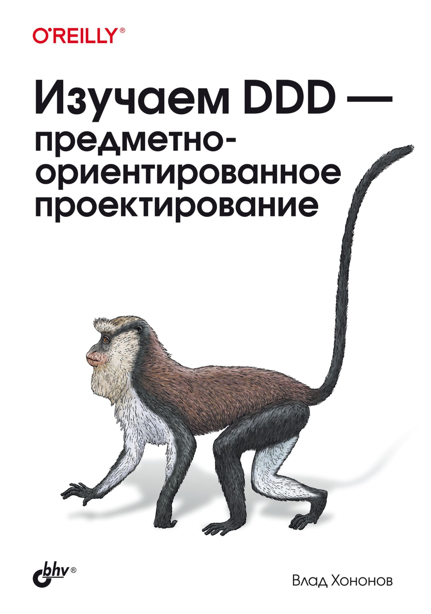

# 📖 Изучаем DDD – предметно-ориентированное проектирование

Конспект книги 
Изучаем DDD – предметно-ориентированное проектирование
Влад Хононов

## 📚 О книге

Эта книга представляет собой комплексное руководство по предметно-ориентированному проектированию (DDD), охватывающее:
- Анализ и понимание предметной области
- Работу с экспертами предметной области
- Моделирование сложной бизнес-логики
- Интеграцию ограниченных контекстов
- Архитектурные паттерны и паттерны взаимодействия
- Практические техники проектирования (EventStorming)
- Применение DDD в современных архитектурах (микросервисы, событийно-ориентированная архитектура, Data Mesh)

## 📑 Структура конспекта

### Главы
- [01. Анализ предметной области](./chapters/ГЛАВА%201%20Анализ%20предметной%20области.md)
- [02. Экспертные знания о предметной области](./chapters/ГЛАВА%202.%20Экспертные%20знания%20о%20предметной%20области.md)
- [03. Как осмыслить сложность предметной области](./chapters/ГЛАВА%203%20Как%20осмыслить%20сложность%20предметной%20области.md)
- [04. Интеграция ограниченных контекстов](./chapters/ГЛАВА%204%20Интеграция%20ограниченных%20контекстов.md)
- [05. Реализация простой бизнес-логики](./chapters/ГЛАВА%205%20Реализация%20простой%20бизнес-логики.md)
- [06. Проработка сложной бизнес-логики](./chapters/ГЛАВА%206%20Проработка%20сложной%20бизнес-логики.md)
- [07. Моделирование фактора времени](./chapters/ГЛАВА%207%20%20Моделирование%20%20%20фактора%20времени.md)
- [08. Архитектурные паттерны](./chapters/ГЛАВА%208%20%20Архитектурные%20паттерны.md)
- [09. Паттерны взаимодействия](./chapters/ГЛАВА%209%20Паттерны%20взаимодействия.md)
- [10. Эвристика проектирования](./chapters/ГЛАВА%2010%20Эвристика%20проектирования.md)
- [11. Эволюция проектных решений](./chapters/ГЛАВА%2011%20Эволюция%20проектных%20решений.md)
- [12. EventStorming](./chapters/ГЛАВА%2012%20EventStorming.md)
- [13. Предметно-ориентированное проектирование на практике](./chapters/ГЛАВА%2013%20Предметно-ориентированное%20проектирование%20на%20практике.md)
- [14. Микросервисы](./chapters/ГЛАВА%2014%20Микросервисы.md)
- [15. Событийно-ориентированная архитектура](./chapters/ГЛАВА%2015%20Событийно-ориентированная%20архитектура.md)
- [16. Сеть данных (Data Mesh)](./chapters/ГЛАВА%2016%20Сеть%20данных%20(Data%20Mesh).md)

### Дополнительные материалы
- [ГЛАВА 3.5 ДОП - общее глав 1-3](./comparisons/ГЛАВА%203.5%20ДОП%20-%20общее%20глав%201-3.md)

