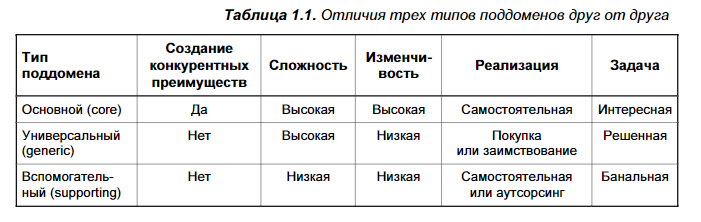

# 📚 Глава 1. Анализ предметной области
## 🔍 Основные понятия

### 🏗️ Предметная область (Domain) — Основной домен

Область деятельности компании — то, чем она занимается и какие услуги предоставляет клиентам.

**Примеры:**

- **FedEx** — курьерская доставка
- **Starbucks** — кофе и кофейни
- **Walmart** — розничная торговля

> 💡 Компании могут работать в нескольких предметных областях (например, **Amazon** — облачные сервисы и ритейл).
---

### 🧩 Поддомен (Subdomain)

Часть предметной области, отвечающая за конкретную бизнес-функцию. В совокупности поддомены формируют полную картину предметной области.

> 📌 Поддомен — это четко определённая область деловой активности. Из всех поддоменов образуется предметная область компании.
## ☕ Пример

**Компания Starbucks:**

- **Кофейная деятельность** — основной поддомен
- **Аренда недвижимости**, **нанимание персонала**, **управление финансами** — другие поддомены

> ⚠️ Ни один поддомен сам по себе не обеспечивает успеха компании. Только их **совокупность** позволяет конкурировать в бизнесе.
----

### 🗂️ Типы поддоменов

| Тип поддомена                    | Цель                              | Сложность | Изменчивость | Реализация                                | Пример                                                  |
| -------------------------------- | --------------------------------- | --------- | ------------ | ----------------------------------------- | ------------------------------------------------------- |
| **Основной (Core)**              | Создаёт конкурентное преимущество | Высокая   | Высокая      | Самостоятельная, внутри компании          | Алгоритм ранжирования Google, система рекомендаций Uber |
| **Универсальный (Generic)**      | Общие для всех компаний задачи    | Высокая   | Низкая       | Покупка или использование готовых решений | Аутентификация, бухгалтерия, оплата                     |
| **Вспомогательный (Supporting)** | Поддержка основного бизнеса       | Низкая    | Низкая       | Самостоятельная или аутсорсинг            | Каталог баннеров, управление категориями заявок         |
> 🔄 **Важно**: поддомены могут менять тип со временем (например, вспомогательный → основной при монетизации).

## 🎯 Основные поддомены (Core Subdomains)
_(также называют основными предметными областями)_
### 📌 Определение

**Основной поддомен** — это то, что **выделяет деятельность компании от конкурентов**, обеспечивая **конкурентное преимущество**.
### 📊 Характеристики

| Характеристика                | Описание                                                                                                     |
| :---------------------------- | :----------------------------------------------------------------------------------------------------------- |
| **Сложность**                 | Обычно сложен и требует значительных усилий для реализации.                                                  |
| **Источники преимущества**    | Может быть технологическим (алгоритмы, инновации) или нетехнологическим (уникальный дизайн, бизнес-ноу-хау). |
| **Конкурентное преимущество** | Основной поддомен — источник конкурентных преимуществ компании.                                              |
| **Входные барьеры**           | Высокие — конкурентам сложно скопировать или сымитировать.                                                   |
| **Влияние на прибыль**        | Непосредственно влияет на бизнес-результаты компании.                                                        |

### 🆚 Отличие от основного домена (предметной области)

Основной поддомен — это часть общей предметной области, имеющая ключевое значение для бизнеса. Хотя термины «основной поддомен» и «основная предметная область» часто используются как синонимы (например, у Эрика Эванса), предпочтительнее говорить именно о **поддомене**, потому что:

1. Это подчёркивает, что он — **часть** общей предметной области, а не вся область целиком.
2. Поддомены могут **менять свой тип** со временем (например, из основного стать универсальным), и термин «поддомен» лучше отражает эту динамику.

---
# 🧰 Универсальные поддомены (Generic Subdomains)

### 📌 Определение

Универсальные поддомены — это бизнес-деятельность, которую **все компании выполняют одинаково**.

### 📊 Характеристики

| Характеристика | Описание |
| :--- | :--- |
| **Конкурентное преимущество** | Не дают никакого конкурентного преимущества. |
| **Сложность** | Как правило, сложны и труднореализуемы. |
| **Источники решений** | Используются проверенные, общедоступные решения (например, аутентификация, бухгалтерия). |
| **Инновации** | Не отличаются нововведениями или оптимизациями. |

## Примеры

*   **Аутентификация и авторизация пользователей**
*   **Бухгалтерский учет**
*   **Безналичные платежи**
*   **Шифрование данных**

## Принципы реализации

*   **Использование готовых решений** — выгоднее использовать существующие решения, чем создавать собственные.
*   **Избегание изобретения велосипеда** — использование проверенных решений более надежно и безопасно.

> дизайн ювелирных изделий является основным поддоменом, а интернет-магазин — универсальным поддоменом. Использование для розничной торговли такой же онлайн-платформы, т. е. того же универсального решения, что и у конкурентов, не повлияет на конкурентное преимущество нашего производителя
---
# 🛠️ Вспомогательные поддомены (Supporting Subdomains)

### 📌 Определение

Вспомогательные поддомены — это **поддержка бизнеса компании**, но **не обеспечивают конкурентных преимуществ**.

##  📊Характеристики

| Характеристика | Описание |
| :--- | :--- |
| **Конкурентное преимущество** | Не дают никакого конкурентного преимущества. |
| **Сложность** | Низкая. |
| **Изменчивость** | Низкая. |
| **Реализация** | Могут быть реализованы собственными силами или переданы на аутсорсинг. |
| **Входные барьеры** | Низкие. |

## Бизнес-логика

*   **Простая**: Напоминает CRUD-интерфейсы (создание, чтение, обновление, удаление).
*   **Не требует сложных решений**: Не связано с инновациями или оптимизацией.

## Стратегия реализации

*   **Собственные силы**: Если реализация проста и не требует высоких затрат.
*   **Аутсорсинг**: Если реализация сложна или не является приоритетом.

---

## 🔍 Критерии различия поддоменов
### 1️⃣ Конкурентное преимущество

- Только **основные** поддомены дают конкурентное преимущество.
- Универсальные и вспомогательные — нет.

> 💡 Сложные задачи не ограничиваются предоставлением услуг потребителям — они могут заключаться, например, в оптимизации и повышении эффективности бизнеса. К примеру, конкурентным преимуществом также является предоставление того же уровня обслуживания, что и у конкурентов, но с меньшими эксплуатационными расходами.

### 2️⃣ Сложность

- **Основные**: сложная бизнес-логика, инварианты, алгоритмы.
- **Вспомогательные**: CRUD-интерфейсы, ETL-процессы.
- **Универсальные**: сложны, но уже решены другими (лучше использовать готовые решения).

> 💻 С сугубо технической точки зрения важно определить основные поддомены, сложность которых повлияет на разработку программного продукта. Еще один ведущий принцип определения основных поддоменов, связанных с программным обеспечением, заключается в оценке сложности бизнес-логики, которую придётся моделировать и воплощать в программном коде. Будет ли она чем-то вроде бизнес-логики CRUD-интерфейсов для ввода данных, или же придётся заняться реализацией сложных алгоритмов или бизнес-процессов, управляемых замысловатыми бизнес-правилами и инвариантами? В первом случае это будет признаком вспомогательного поддомена, а во втором — типичным основным поддоменом. Если для поддержки функций поддомена существует общее решение, то тип этого поддомена определяется в зависимости от того, насколько проще и (или) дешевле встроить это решение, чем создать функцию с нуля.

### 3️⃣ Изменчивость

- **Основные**: часто меняются в поиске оптимизации.
- **Универсальные**: могут со временем изменяться.
- **Вспомогательные**: не подвержены частым изменениям.

### 4️⃣ Стратегия решения (solution)

- **Основные**: разрабатываются внутри компании, требуют лучших специалистов. Позволяют компании конкурировать. Решение должно быть таким, чтобы его было удобно сопровождать и легко развивать.
- **Универсальные**: используют готовые решения (библиотеки, SaaS).
- **Вспомогательные**: можно передать на аутсорсинг или реализовать быстро. Без привлечения топовых спецов — можно дать джунам на обучение.

---

##  🗺️ Определение границ поддоменов

> 🎯 Поддомены и их типы определяются бизнес-стратегией компании: её предметными областями и тем, как она отличается от других компаний, чтобы конкурировать с ними в той же сфере.

> 🚫 Не стремитесь к максимальной детализации. Достаточно выделить поддомены, которые помогут принять архитектурные и стратегические решения.

- **Анализ организационной структуры** — отправная точка. **Отделы и подразделения** — служат хорошей отправной точкой.
- Поддомены выделяются на основе **бизнес-стратегии** и **предметной области**, а не организационной структуры, хотя отделы компании могут служить отправной точкой.

- Важно **глубже проанализировать бизнес-функции**: крупные области (например, «обслуживание клиентов») часто включают в себя **основные**, **вспомогательные** и **универсальные** поддомены.
- **Границы поддомена** определяются как **набор согласованных сценариев использования** с общими участниками, данными и бизнес-правилами.
- **Основные поддомены** требуют максимально точного выделения, чтобы исключить всё лишнее и сосредоточиться на конкурентных преимуществах.
- Для **вспомогательных и универсальных** поддоменов излишняя детализация не нужна, если она не влияет на проектирование.
- Не все бизнес-функции связаны с программным обеспечением — такие поддомены можно **игнорировать** при проектировании программной системы.

> ✅ **Главное:** поддомены — это инструмент для принятия архитектурных решений, а не просто описание бизнеса.

---

##  🧪Примеры анализа

### Gigmaster (платформа продажи билетов)
- **Основные поддомены**:  
  - Система рекомендаций  
  - Анонимизация данных  
  - Мобильное приложение  
- **Универсальные**:  
  - Шифрование  
  - Бухгалтерия  
  - Оплата  
  - Аутентификация  
- **Вспомогательные**:  
  - Интеграция с музыкальными стримингами
  -  Интеграция с соцсетями
  - Модуль посещённых концертов  

### BusVNext (гибрид такси и автобуса)
- **Основные поддомены**:  
  - Алгоритм маршрутизации  
  - Аналитика  
  - Мобильные приложения  
  - Управление автопарком  
- **Универсальные**:  
  - Интеграция с трафиком  
  - Бухгалтерский учет
  - Оплата  
  - Авторизация  
- **Вспомогательные**:  
  - Управление акциями и скидками  

---

### 👔 Кто такие специалисты (эксперты) в предметной области?

Это **представители бизнеса**, обладающие глубокими знаниями в предметной области, которую моделирует программное обеспечение. Они:

- **Не аналитики и не программисты**, а **носители бизнес-экспертизы** (например, менеджеры, операторы, бизнес-аналитики).
- Формулируют **реальные бизнес-задачи** и предоставляют **ключевые знания** о процессах.
- Могут быть **универсальными экспертами** или специализироваться на **конкретных поддоменах**.
- Являются **источником истины** при проектировании системы в рамках предметно-ориентированного проектирования.

> 🤝 Их участие крайне важно для создания точной и полезной модели предметной области.

---

##  🧠 Выводы

- Предметная область = сфера деятельности компании.
- Поддомены — строительные блоки предметной области.
- Тип поддомена определяет:
  - Сложность реализации
  - Стратегию разработки
  - Архитектурные решения
- Правильная классификация поддоменов — ключ к эффективному проектированию ПО.

---
## 🐺 Практический разбор: WolfDesk

Рассмотрим описание WolfDesk (см. Предисловие), той самой компании, которая предоставляет систему управления заявками службы поддержки: 
1. В чем именно заключается суть предметной области WolfDesk? 
Система управления заявками службы поддержки с оплатой за количество заявок.

2. Что является основным (core) поддоменом (или основными поддоменами) WolfDesk? 
   - Алгоритм управления жизненным циклом заявок  
   - Система выявления мошенничества  
   - Функция автопилота поддержки  

3. Что является вспомогательным (supporting) поддоменом (или вспомогательными поддоменами) WolfDesk? 
   - Управление категориями заявок  
   - Управление продуктами арендатора  
   - Ввод графиков работы агентов  

1. Что является универсальным (generic) поддоменом (или универсальными под- доменами) WolfDesk?
  - Аутентификация/авторизация (включая SSO)  
   - Бессерверная инфраструктура  
