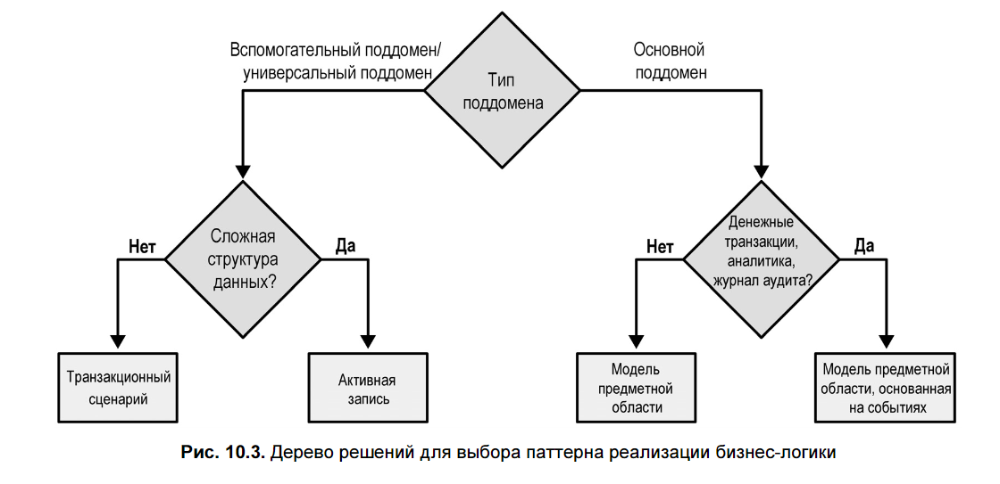
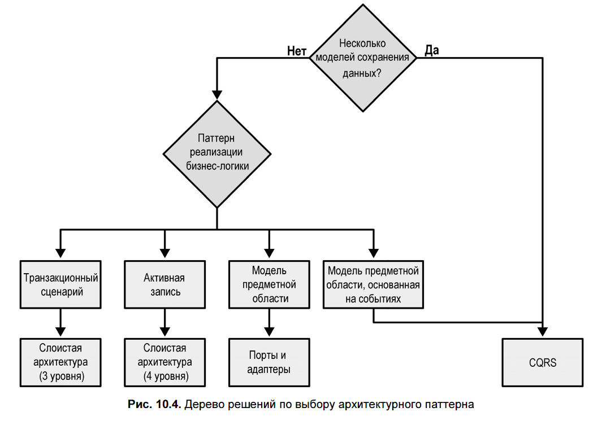
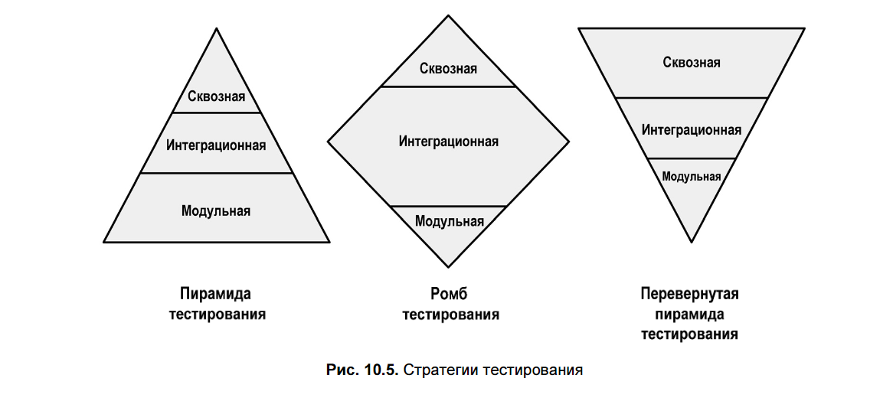
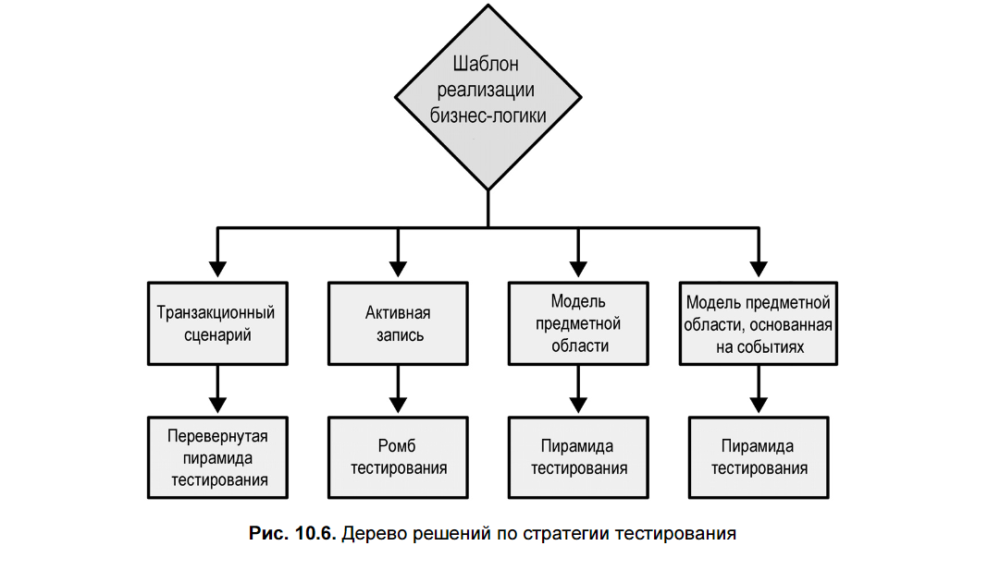
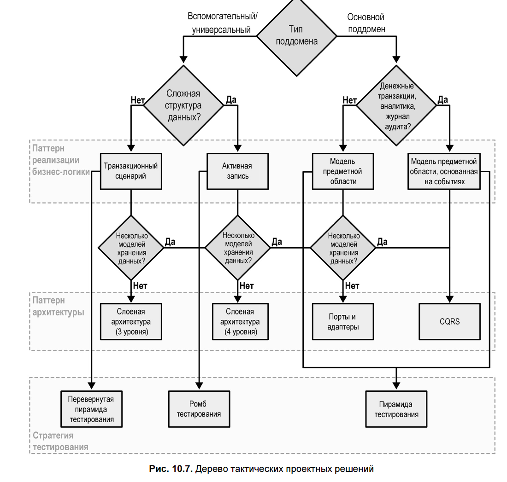

## 📌 **Основная идея главы**

Разработка программного обеспечения редко подчиняется жёстким правилам — **всё зависит от контекста**.  
Глава предлагает **эвристический подход** к принятию архитектурных и тактических решений: не абсолютные правила, а **практические рекомендации**, основанные на природе предметной области и типах поддоменов.

---

## 🔍 Что такое эвристика?

- **Эвристика** — это **эмпирическое правило**, не гарантирующее идеального результата, но **достаточно эффективное** на практике.
- Она помогает **игнорировать шум** и сфокусироваться на главных «силах» — ключевых факторах, влияющих на проектирование.

---

## 🧱 1. Ограниченные контексты (Bounded Contexts)

### Проблема:
- Насколько **широкими или узкими** должны быть границы ограниченного контекста?
- Часто границы отождествляют с микросервисами → стремление к **максимальной декомпозиции**.

### Эвристика:
> **Размер ограниченного контекста — это функция модели, а не наоборот**.
> Вместо превращения модели в функцию желаемого размера (проводя оптимизацию под небольшие ограниченные контексты) гораздо эффективнее сделать обратное: рассматривать размер ограниченного контекста как функцию модели, которую он охватывает.

### Практические рекомендации:
- **На ранних этапах** (особенно для **Core Subdomains**) лучше использовать **широкие границы** — они:
  - Уменьшают риск неправильного выделения контекстов.
  - Позволяют дешевле реструктурировать **логические** границы (в отличие от физических).
- По мере **углубления понимания предметной области** — границы можно **сужать**.
- Универсальные и вспомогательные поддомены — более стабильны → могут иметь **более узкие** контексты.

---

## 💼 2. Паттерны реализации бизнес-логики

Рассматриваются четыре паттерна:

| Паттерн | Подходит для | Критерии выбора |
|--------|--------------|------------------|
| **Транзакционный сценарий (Transaction Script)** | Простая логика, CRUD | Нет сложных структур данных |
| **Активная запись (Active Record)** | CRUD с более сложной структурой данных | Инкапсуляция маппинга в БД |
| **Модель предметной области (Domain Model)** | Сложная бизнес-логика (Core) | Наличие инвариантов, составных правил |
| **Event-Sourced Domain Model** | Core-поддомены с аудитом, аналитикой, финансовыми транзакциями | Нужен аудит, восстановление состояния, аналитика поведения |

### Дерево решений:
1. **Требуется ли аудит / аналитика / работа с деньгами?** → **Event-Sourcing**  
2. **Есть ли сложная бизнес-логика (инварианты, правила)?** → **Domain Model**  
3. **Сложные структуры данных?** → **Active Record**  
4. **Иначе** → **Transaction Script**

> ⚠️ **Важно**: если вы считаете поддомен *core*, но он реализуется как *Active Record* — стоит **пересмотреть его тип**. Это сигнал к уточнению модели.

---

## 🏗️ 3. Архитектурные паттерны

Выбор архитектуры зависит от паттерна бизнес-логики:

| Паттерн бизнес-логики | Рекомендуемая архитектура |
|------------------------|----------------------------|
| **Event-Sourced Domain Model** | **CQRS** (обязательно) — для эффективных запросов |
| **Domain Model** | **Ports and Adapters** (Hexagonal Architecture) — для инверсии зависимостей и чистоты модели |
| **Active Record** | **Слоистая архитектура** с сервисным слоем над AR |
| **Transaction Script** | **Минимальная слоистая архитектура** (3 слоя: UI–Service–DB) |

> 💡 **Исключение**: CQRS может быть полезен и в других случаях, если требуется **несколько моделей представления данных** (например, для отчётов и UI).

---

## 🧪 4. Стратегии тестирования

Тип паттерна определяет **приоритеты в тестировании**:

| Паттерн | Стратегия тестирования | Почему |
|--------|------------------------|--------|
| **Domain Model / Event-Sourcing** | **Пирамида тестирования** (много unit-тестов) | Агрегаты и value objects легко тестируются изолированно |
| **Active Record** | **Ромб тестирования** (фокус на интеграционные тесты) | Логика распределена между слоями → нужно тестировать взаимодействие |
| **Transaction Script** | **Перевёрнутая пирамида** (акцент на end-to-end тесты) | Минимум слоёв → проще тестировать сценарии целиком |

---

## 🌳 5. Дерево тактических проектных решений

объединяет всё в единую **эвристическую схему**:
1. Определить тип поддомена (Core / Supporting / Generic).
2. Выбрать паттерн бизнес-логики по сложности и требованиям.
3. Подобрать архитектурный стиль.
4. Определить стратегию тестирования.

> Но! **Это — руководство, а не догма**.  
> Команды с глубоким опытом могут выбирать один подход (например, всегда event-sourcing) — и это может быть рационально **в их контексте**.

---

## ✅ Выводы

- **Эвристики** — инструмент для **осознанного выбора**, а не замена критического мышления.
- Глава связывает **стратегическое** (DDD, поддомены) и **тактическое** (паттерны, архитектура) проектирование.
- **Контекст — ключевой фактор**. Нет универсального «лучшего» решения.
- Важно **пересматривать решения** по мере эволюции системы — тема следующей главы.

---

Если нужно — могу визуализировать дерево решений в виде текстовой схемы или подготовить карточки для повторения.