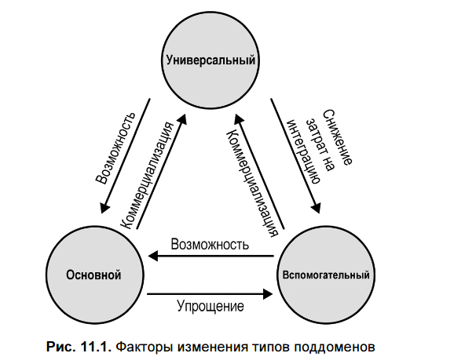
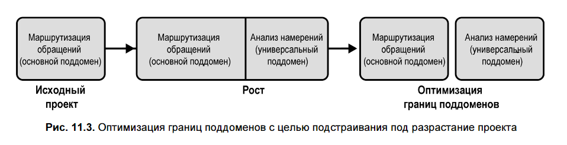

## 📌 **Цель главы**  
Программные системы живут в условиях постоянных изменений. Глава посвящена **эволюции проектных решений** под влиянием:
1. Изменений в **предметной области**  
2. **Организационных изменений**  
3. **Углубления или потери знаний** о предметной области  
4. **Роста проекта** (функциональности, команды и т.д.)

> **Ключевая мысль**: проектные решения — не статичны. Они должны **эволюционировать** вместе с бизнесом и окружением.

---

## 🧩 1. Изменения в предметной области

В DDD выделяют **три типа поддоменов**:
- **Core (основной)** — источник конкурентного преимущества  
- **Supporting (вспомогательный)** — делает что-то уникальное, но не даёт конкурентного преимущества  
- **Generic (универсальный)** — стандартные функции, одинаковые у всех

### 🔁 Трансформации типов поддоменов

| Направление | Пример | Последствия |
|-------------|--------|--------------|
| **Core → Generic** | Компания разрабатывала собственный алгоритм доставки, но появился SaaS-сервис с лучшим решением → конкурентное преимущество исчезло | Можно перейти на внешний сервис, упростить внутреннюю систему |
| **Generic → Core** | Компания заменяет стандартную систему управления запасами на собственную с продвинутым прогнозированием спроса | Стала источником конкурентного преимущества → требует инвестиций и защиты |
| **Supporting → Generic** | Внутренняя CRM уступает open-source аналогу с OCR и полнотекстовым поиском → логичнее интегрировать внешнее решение |
| **Supporting → Core** | Вспомогательная логика начинает приносить прибыль или экономить значительные ресурсы | Требует пересмотра архитектуры: от CRUD к Domain Model |
| **Core → Supporting** | Сложность больше не оправдана бизнес-ценностью → компания упрощает логику |
| **Generic → Supporting** | Интеграция внешнего сервиса оказалась дороже/сложнее, чем собственная реализация | Возвращение к внутренней разработке |

> 💡 **Важно**: тип поддомена — **не фиксированная характеристика**, а **динамическая**.

---

## 🧭 2. Стратегические аспекты проектирования

Изменение типа поддомена влияет на:
- **Границы ограниченных контекстов (Bounded Contexts)**  
- **Паттерны интеграции** между контекстами:
  - **Open-Host Service** и **Anti-Corruption Layer** — для Core
  - **паттерн разных путей (separate ways)** — допустим для Supporting/Generic, но **недопустим**, если поддомен стал Core
- **Реализацию**:
  - Core → **внутренняя разработка**, близко к бизнес-экспертам 
  - Supporting/Generic → можно **аутсорсить**, использовать как  проект для новичков

> ⚠️ Если Supporting становится Core — **переносите разработку внутрь компании**.

---

## 🛠️ 3. Тактические аспекты проектирования

Сложность логики часто **опережает** изначальный дизайн. Это сигнал к эволюции.

### 🔄 Эволюция паттернов бизнес-логики

| С чего → Во что                        | Признак необходимости                                             | Как преобразовать                                                                                                                                                                                                                                                                                                |
| -------------------------------------- | ----------------------------------------------------------------- | ---------------------------------------------------------------------------------------------------------------------------------------------------------------------------------------------------------------------------------------------------------------------------------------------------------------- |
| **Transaction Script → Active Record** | Усложнились структуры данных, много дублирующего кода работы с БД | Инкапсулируйте данные и поведение в объекты                                                                                                                                                                                                                                                                      |
| **Active Record → Domain Model**       | Появились инварианты, правила, дублирование логики в сервисах     | <ul><li>Выделите Value Objects и бизнес-логику и сделайте ее частью объектов-значений</li><li> Найдите границы транзакций и переместите в границы соответствующих объектов, Aggregates </li><li> Сделайте методы всех других внутренних объектов в агрегате закрытыми и вызываемыми только из агрегата</li></ul> |
| **Domain Model → Event-Sourced Model** | Нужен аудит, восстановление истории, аналитика                    | <ul><li>Замените мутации на события</li><li>Решите вопрос миграции старых данных:</li><ul><li>**Генерация событий по состоянию** — неточно, но функционально</li><li>**Событие миграции** — честно признаёт отсутствие истории</li></ul></ul>                                                                    |

> 🔧 **Практический совет**: начните с закрытия сеттеров — компилятор покажет, где логика управляет состоянием извне.
> 

---

## 👥 4. Организационные изменения

Изменения в структуре компании влияют на **интеграцию контекстов**:

| Сценарий | Изменение паттерна интеграции |
|--------|-------------------------------|
| Команда разделилась / переехала в другой офис | **Partnership → Customer-Supplier** (меньше совместной работы) |
| Команды перестали эффективно взаимодействовать | **Customer-Supplier → Separate Ways** (дублирование функционала выгоднее, чем интеграция) |

> 📏 **Один ограниченный контекст = одна команда** (по закону Конвея).

---

## 🧠 5. Знания о предметной области

- Знания **приобретаются постепенно** → изначальные модели часто **недостаточны**.
- На ранних этапах — **широкие ограниченные контексты** (дешевле реструктуризировать логически).
- Со временем, по мере уточнения границ — **сужайте контексты**.
- **Потеря знаний** (уход сотрудников, устаревшая документация) ведёт к деградации кода → **EventStorming** помогает восстановить понимание.

---

## 📈 6. Рост проекта

Рост — **естествен**, но без управления приводит к **"Big Ball of Mud"**
> «Большой ком грязи» — беспорядочный, расползающийся, состоящий из костылей и изоленты лапшекод (спагетти-код). Подобные системы имеют явные признаки бес- порядочного роста из-за необходимости постоянного внесения хаков и костылей.
> 
> Неконтролируемый рост, приводящий к формированию больших комков грязи, является результатом расширения функциональности программной системы без пересмотра ее проектных решений. Рост расширяет границы компонентов, все больше расширяя их функциональные возможности. Изучать влияние роста на дизайн крайне важно, в частности потому, что многие инструменты предметно- ориентированного проектирования связаны с установлением границ: структурные бизнес-блоки (поддомены), модель (ограниченные контексты), неизменяемость (объекты-значения) или согласованность (агрегаты).
### Как бороться:

#### 🔹 Поддомены
- Пересматривайте границы: ищите **скрытые поддомены**.
- Используйте эвристику: **если сценарии работают с одними и теми же данными — возможно, это один поддомен**.
- Особенно важно **выделять Core** от всего остального.

#### 🔹 Ограниченные контексты
- Не допускайте превращения контекста в «всё понемногу».
- Следите за **"болтливостью"** — если контекст постоянно вызывает другие, возможно, границы заданы неверно.
- Стремитесь к **автономности**.

#### 🔹 Агрегаты
- **Минимализм**: агрегат включает **только то**, что нужно для строгой согласованности.
- Не добавляйте новую логику «для удобства» в существующие агрегаты.
- При росте — **выделяйте новые агрегаты**, возможно, даже **новые контексты**.

---

## ✅ **Выводы и рекомендации**

1. **Мониторьте эволюцию поддоменов** — пересматривайте их типы регулярно.
2. **Адаптируйте стратегию**:
   - Интеграцию
   - Границы контекстов
   - Внутреннюю/внешнюю реализацию
3. **Эволюционируйте тактические решения**:
   - От простых паттернов к сложным — **по мере необходимости**
4. **Учитывайте организационную динамику** — она отражается в архитектуре.
5. **Инвестируйте в знания** — без них любая архитектура деградирует.
6. **Управляйте ростом**:
   - Пересматривайте границы (поддомены → контексты → агрегаты)
   - Удаляйте **непреднамеренную сложность**
   - Сохраняйте **сфокусированность** каждого компонента

> 🔄 **Проектирование — это не разовое событие, а непрерывный процесс адаптации к изменяющейся реальности**.
