## 📌 **Основная цель EventStorming**

**EventStorming** — это **коллаборативный, визуальный метод моделирования бизнес-процессов**, созданный Альберто Брандолини.  
Главный фокус — **обмен знаниями** между участниками и **создание единого языка (Ubiquitous Language)**, а не просто «нарисовать схему».

> 💡 **Ключевая мысль**:  
> *Настоящая ценность EventStorming — в процессе, а не в результате.*

---

## 👥 **Кто участвует?**

- Идеально: **разнородная группа** (5–10 человек):
  - Эксперты предметной области (Domain Experts)
  - Разработчики
  - Продуктовые менеджеры / владельцы продукта
  - Тестировщики
  - UI/UX-дизайнеры
  - Специалисты поддержки
- **Не более 10 человек** — чтобы все могли участвовать активно.
- Цель: **максимально быстро извлечь и согласовать знания**.

---

## 🧰 **Что нужно для проведения?**

| Элемент          | Описание                                                             |
| ---------------- | -------------------------------------------------------------------- |
| **Пространство** | Большая стена с рулонной бумагой или огромная доска                  |
| **Стикеры**      | Много и разных цветов (стандартная палитра — см. ниже)               |
| **Маркеры**      | Достаточно для всех участников                                       |
| **Зал**          | Без столов и стульев (или минимум) — участники **стоят и двигаются** |
| **Пожрать**      | Сессия длится 2–4 часа → нужна энергия                               |

> 📝 **Совет**: вынесите стулья — это **активный процесс**, а не пассивная встреча.

---

## 🎨 **Цветовая кодировка (стандарт)**

| Цвет | Элемент | Пример |
|------|--------|--------|
| **Оранжевый** | События предметной области (Domain Events) | «Заказ отправлен», «Платёж подтверждён» |
| **Светло-голубой** | Команды (Commands) | «Отправить заказ», «Подтвердить платёж» |
| **Жёлтый (маленький)** | Действующие лица (Actors / Personas) | «Клиент», «Менеджер» |
| **Лиловый** | Правила (Policies / Automation Rules) | «Если платёж не подтверждён через 24ч → отменить заказ» |
| **Зелёный** | Модели чтения (Read Models) | «Корзина», «Список заказов» |
| **Розовый** | Внешние системы (External Systems) | «CRM», «Платёжный шлюз» |
| **Розовый (ромбом)** | Проблемные места (Pain Points) | «Нет API для проверки статуса доставки» |
| **Жёлтый (большой)** | Агрегаты (Aggregates) | Группировка команд и событий |
| **Вертикальная черта** | Ключевые события (Pivotal Events) | Разделяют этапы процесса |

---

## 🔁 **10 этапов EventStorming**

### **1. Неструктурированный мозговой штурм**
- Участники **пишут любые события** (в прошедшем времени!) на оранжевых стикерах.
- Нет порядка, нет фильтрации — **всё, что приходит в голову**.
- Продолжать, пока скорость добавления не замедлится.
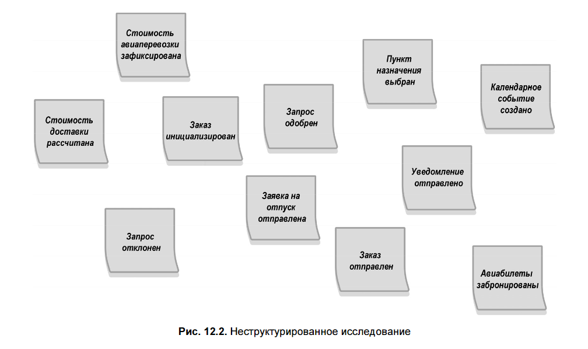
### **2. Хронологическое упорядочение**
- События выстраиваются **по времени**.
- Сначала — **«счастливый путь» (happy path)**.
- Потом — **альтернативные сценарии**, ошибки, исключения.
- Удаляются дубли, исправляются неточности.
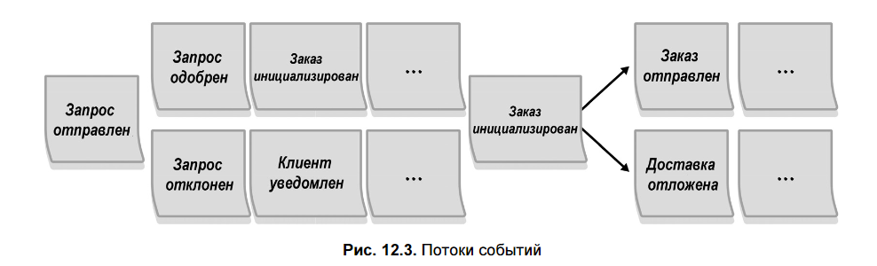
### **3. Выявление проблемных мест (Pain Points)**
- Отмечаются **розовыми стикерами в форме ромба**.
- Примеры:
  - «Неясно, как подтвердить платёж»
  - «Ручная обработка заказов — узкое место»
- Фиксируются **в реальном времени** по ходу обсуждения.
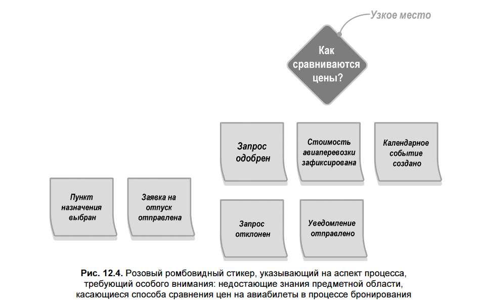
### **4. Ключевые события (Pivotal Events)**
- События, **меняющие контекст** или **завершающие этап**.
- Отмечаются **вертикальной чертой**.
- **Подсказка для границ ограниченных контекстов**.
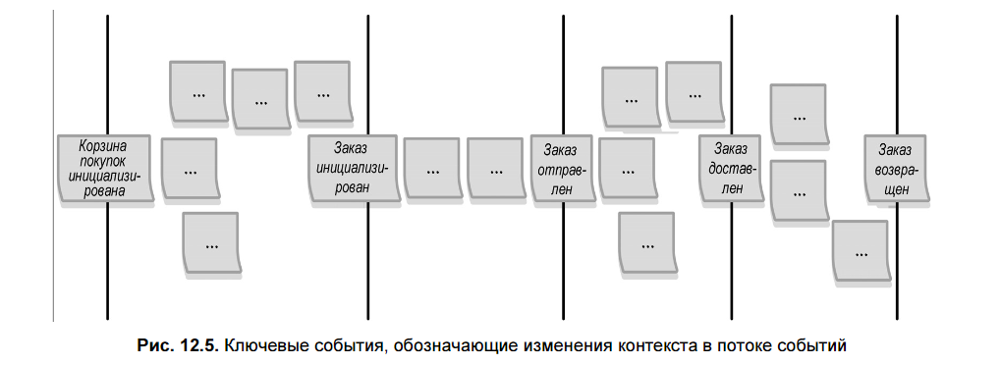
### **5. Выявление  команд (Commands)**
- Команды — **причины событий**, формулируются в повелительном наклонении.
- Пишутся **перед событием** на **голубых стикерах**.
- Если команда инициируется  действующим лицом (actor)  — перед ней ** маленький жёлтый стикер с ролью**.
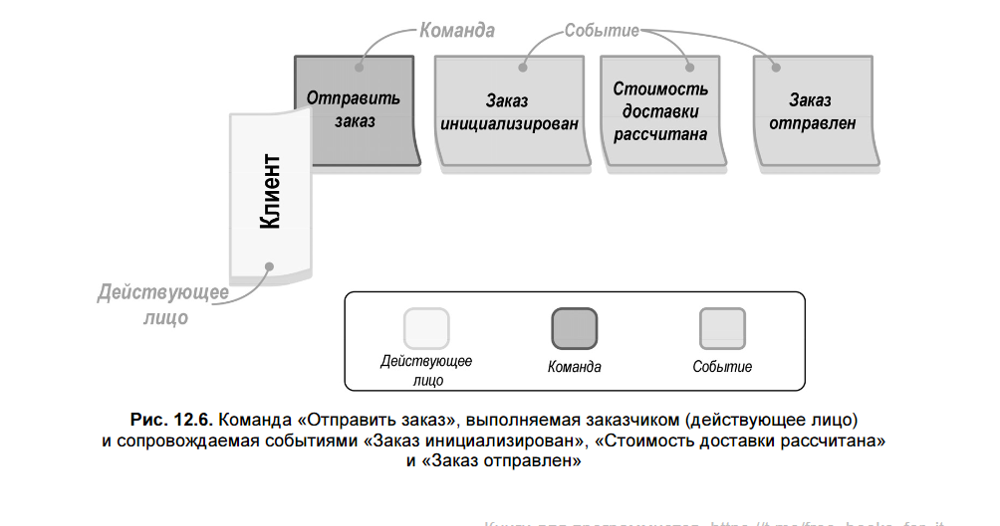
### **6. Выявление правил (Policies) автоматизации**
- Автоматические реакции: **событие → команда**.
- Записываются на **лиловых стикерах**, соединяют событие и команду.
- Можно указывать **условия** (например, «только для VIP»).
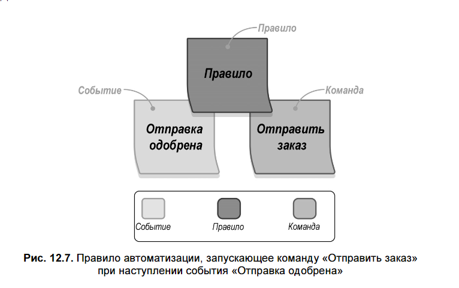
### **7. Модели чтения (Read Models)**
- Данные, которые **пользователь видит перед действием**.
- Зелёные стикеры **перед командой**.
- Пример: «Панель администратора», «История заказов».
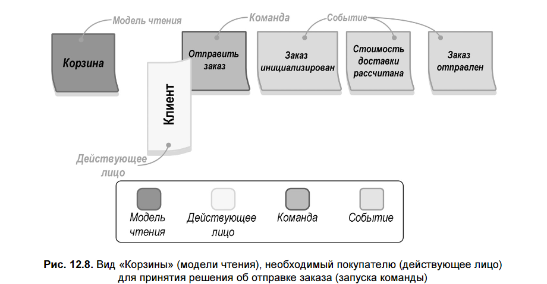
### **8. Внешние системы (external systems)**
Внешней считается любая система, не являющаяся частью исследуемой предметной области.
- Любые **внешние интеграции**: API, SaaS, legacy-системы.
- Обозначаются **розовыми стикерами**.
- Могут **инициировать команды** или **получать события**.

> ✅ К этому моменту **все команды** должны иметь источник:  
> — пользователь (actor),  
> — правило (policy),  
> — внешняя система  (external system).
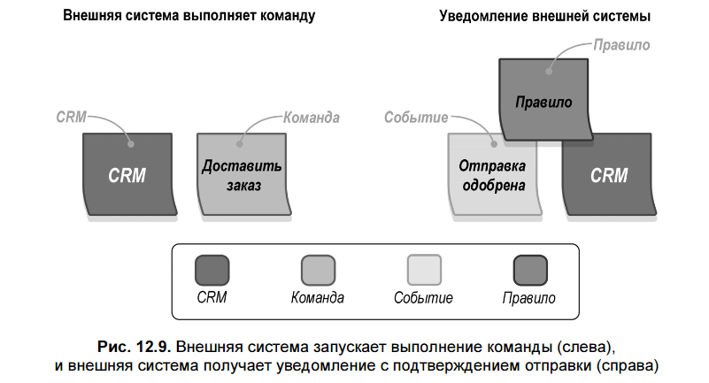
### **9. Выявление агрегатов**
- Группировка: **какие команды и события принадлежат одному логическому объекту?**
- Обводятся **большим жёлтым стикером**.
- Агрегат **принимает команды → генерирует события**.
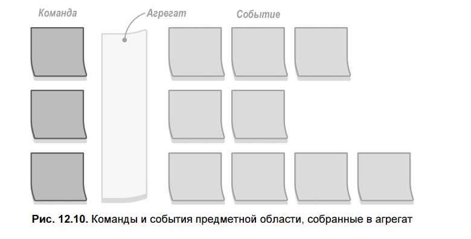
### **10. Определение ограниченных контекстов**
- Группы агрегатов, **работающих вместе** или связанных правилами.
- Обводятся сплошной линией → **кандидаты на Bounded Contexts**.
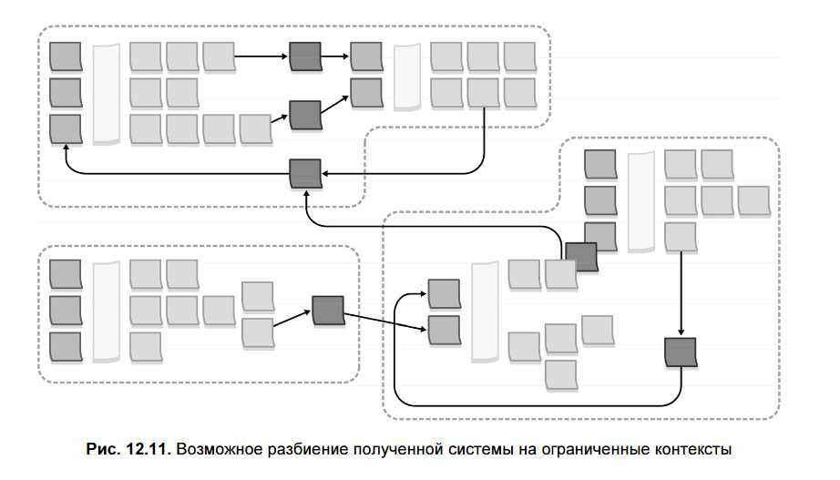
---

## 🧪 **Варианты применения**

EventStorming можно проводить:

1. **Для всей предметной области** — обзорный сеанс (этапы 1–4).
2. **Для конкретного бизнес-процесса** — полный сеанс (все 10 этапов).
---
Проводите EventStorming, если нужно:

- 🗣️ **Выработать единый язык** (Ubiquitous Language) между командой и экспертами.
- 🧩 **Смоделировать бизнес-процесс** и выявить агрегаты / ограниченные контексты.
- 🔍 **Уточнить новые требования** и обнаружить граничные случаи.
- 🧠 **Восстановить утраченные знания** (особенно в legacy-системах).
- 📈 **Найти возможности улучшения** существующего процесса.
- 👩‍💻 **Помочь новым сотрудникам** быстро погрузиться в предметную область.

**Не стоит проводить**, если процесс **простой, линейный и не содержит сложной бизнес-логики**.

---
## 💡 **Советы по проведению**

- **Перед началом** — кратко объясните процесс и покажите цветовую легенду (рис. 12.12).
- **Следите за динамикой**: если замедление — задавайте наводящие вопросы.
- **Вовлекайте всех**: спрашивайте тихих участников.
- **Делайте перерывы** — EventStorming энергозатратен.
- После перерыва — **кратко перескажите текущее состояние модели**.
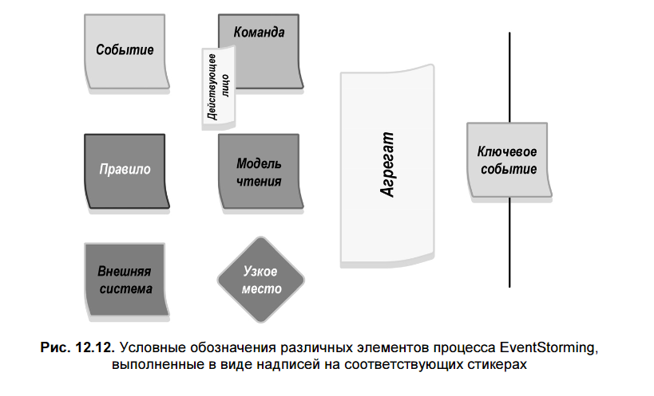
---

## 🌐 **Удалённый EventStorming**

- Изначально **не предполагался**, но возможен (например, через **Miro**, **Mural**).
- **Максимум 5 участников** онлайн.
- Эффективность **ниже**, чем при личной встрече.
- При большом числе людей — проводите **несколько сессий**, потом объединяйте модели.
- Как только возможно — **возвращайтесь к очному формату**.

---

## ✅ **Итоги и выводы**

- **EventStorming — это обучение через совместное моделирование**.
- Результат — **не только модель**, но и:
  - Согласованные ментальные модели
  - Единый язык (Ubiquitous Language)
  - Выявленные противоречия и пробелы в знаниях
- Модель можно использовать как основу для:
  - **Event-Sourced Domain Model**
  - Проектирования **агрегатов и ограниченных контекстов**
  - Планирования микросервисов
- **Главное** — начать. Не нужно быть экспертом.  
  > *«EventStorming — как езда на велосипеде: легче научиться, чем читать об этом».*
