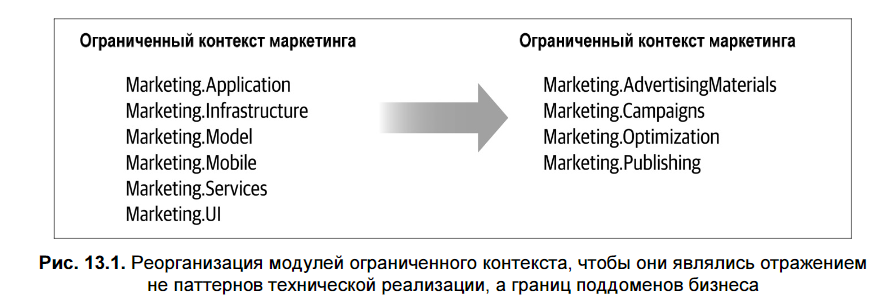
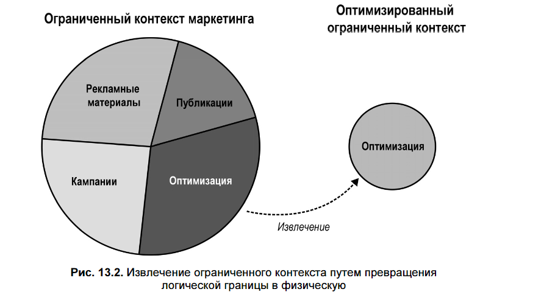
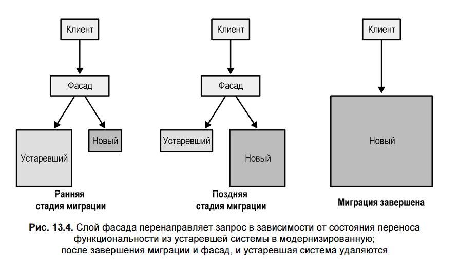

## 📌 **Главный посыл главы**
> **DDD не требует идеальных условий**. Наибольшую пользу он приносит **именно в реальных проектах**: legacy-системах, запущенных в production решениях с техническим долгом.  
> **Не нужно внедрять всё сразу** — DDD — это **набор инструментов**, а не догма «всё или ничего».

---

## 🔍 **1. Стратегический анализ: понять бизнес**

### Шаг 1. Осмыслить предметную область
Задайте ключевые вопросы:
- В чём суть бизнеса компании?
- Кто клиенты?
- Какую ценность она создаёт?
- В чём её **конкурентное преимущество**?

### Шаг 2. Выявить поддомены
Используйте эвристики:

| Тип поддомена | Как определить |
|---------------|----------------|
| **Core (основной)** | <ul><li>Что отличает компанию от конкурентов?</li><li>Интеллектуальная собственность, уникальные процессы</li><li>**ИЛИ**: «грязный» компонент, который нельзя заменить, потому что он критичен для бизнеса</li></ul> |
| **Generic (универсальный)** | Есть ли готовые решения (SaaS, OSS), которые можно интегрировать без потери конкурентного преимущества? |
| **Supporting (вспомогательный)** | То, что нельзя заменить внешним решением, но что не даёт конкурентного преимущества и редко меняется. |

> 💡 **Совет**: не пытайтесь выявить **все** поддомены. Сфокусируйтесь на тех, что **влияют на вашу систему**.

---

## 🏗️ **2. Изучение текущего проекта**

### Что анализировать:
- **Высокоуровневые компоненты** (даже если это не Bounded Contexts).
- **Жизненные циклы**: какие части можно разрабатывать/тестировать/развёртывать независимо?
- **Границы**: есть ли логическое разделение (пакеты, модули, схемы БД)?

---

## 🗺️ **3. Оценка архитектуры**
### Тактическая оценка:
- Соответствует ли паттерн бизнес-логики сложности поддомена?
  - Core реализован через **Transaction Script**? → **Сигнал к модернизации**.

### Стратегическая оценка:
- Постройте **карту контекстов** (Context Map) на основе существующих компонентов.
- Ищите **антипаттерны**:
  - Несколько команд работают над одним контекстом
  - Дублирование Core-логики
  - Core реализован аутсорсером
  - Навязывание модели legacy-системой

---

## 🛠️ **4. Стратегия модернизации**

### 🔸 Начните с логической декомпозиции
- Переместите код в пакеты/модули по поддоменам.
- Примените ту же логику к **хранимым процедурам, serverless-функциям и т.п.**

### 🔸 Когда выделять физические контексты (микросервисы)?
Задайте вопросы:
- Работают ли **несколько команд** над одним компонентом? → Выделяйте.
- Есть ли **конфликтующие модели**? → Разделяйте.

### 🔸 Паттерны интеграции для модернизации:
| Паттерн | Когда применять |
|--------|----------------|
| **Customer-Supplier** | Команды больше не могут работать как партнёры (например, из-за географии) |
| **Anti-Corruption Layer** | Защита от legacy-системы или нестабильного API |
| **Open-Host Service** | Чтобы зафиксировать публичный API и изолировать внутренние изменения |
| **Separate Ways** | Если функция не критична (не Core), а сотрудничество вызывает конфликты |

---

## 🔄 **5. Тактическая модернизация**

### 🔸 Восстановите знания
- Проведите **EventStorming**, особенно для legacy-систем без документации.
- Создайте **единый язык (Ubiquitous Language)** — используйте его в коде, документации, обсуждениях.

### 🔸 Выберите путь модернизации:
#### **Вариант A: Паттерн «Душитель» (Strangler Fig)**
- Создаёте **новый контекст** рядом со старым.
- Новые функции и миграция — в новый контекст.
- Используйте **фасад** для маршрутизации запросов.
- Обе системы могут временно использовать **одну БД** (но только как промежуточный шаг).

> 🌿 **Метафора**: как инжир-душитель — новый контекст «задушит» старый.

#### **Вариант B: Рефакторинг на месте**
- Постепенно улучшайте дизайн:
  - Сначала **Value Objects**
  - Затем — **Aggregates на основе состояния**
  - И только потом — **Event Sourcing** (если нужно)
- Не пытайтесь переписать всё за раз.

> ⚠️ **Важно**: при рефакторинге защищайте новую модель от старой через **Anti-Corruption Layer**.

---

## 🤫 **6. «Законспирированное» DDD: как внедрять без шума**

### 🔹 Единый язык
- Слушайте, как говорят бизнес-эксперты.
- Используйте **их термины** в коде.
- Устраняйте **синонимы и омонимы**.
- Пейте пиво с бизнес-экспертами.

### 🔹 Ограниченные контексты
- Объясняйте пользу:  
  > «Если две команды работают в одном коде — они будут мешать друг другу. Давайте разделим границы».

### 🔹 Тактические решения
- Не ссылайтесь на книгу — **объясняйте логику**:
-  **Чёткие границы транзакций** — для защиты **согласованности данных**.
- **Одна транзакция — один агрегат** — чтобы не нарушать **границы согласованности**.
- **Изменение агрегата только через его методы** — чтобы вся логика была **централизована**, без дублирования.
- **Логика не должна уходить в хранимые процедуры** — иначе она **рассинхронизируется** с кодом приложения.
- **Агрегаты должны быть минимальными** — это упрощает поддержку и **повышает производительность**.
- **События как источник данных ≠ простой лог-файл** — только полная, управляемая модель событий даёт **гарантии согласованности**.

### 🔹 Event Sourcing
- Не называйте его «Event Sourcing» — покажите **выгоду**:
  - «Мы сможем увидеть, **как** клиент дошёл до текущего состояния»
  - «Можно откатить любую операцию, потому что у нас полная история»

---

## ✅ **Итоги и рекомендации**

1. **Начинайте с бизнеса**, а не с кода.
2. **Фокусируйтесь на Core** — там наибольшая отдача.
3. **Модернизируйте постепенно** — риски «большого переписывания» огромны.
4. **Используйте DDD-инструменты даже без официальной поддержки** — внедряйте тихо и прагматично.
5. **Говорите на языке бизнеса**, а не архитектуры.

> 🔄 **DDD — это не про агрегаты и события. Это про то, чтобы бизнес управлял архитектурой**.
