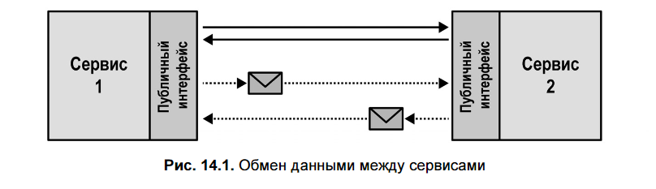
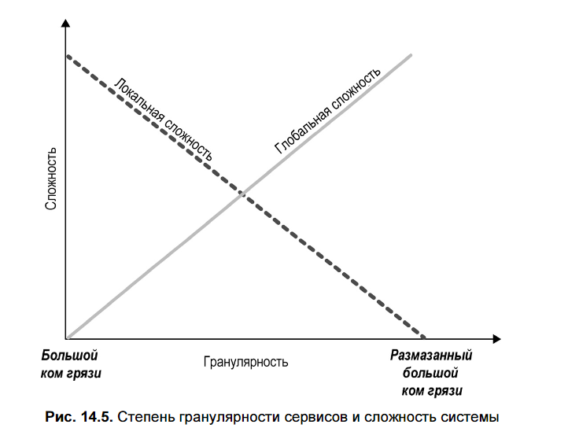
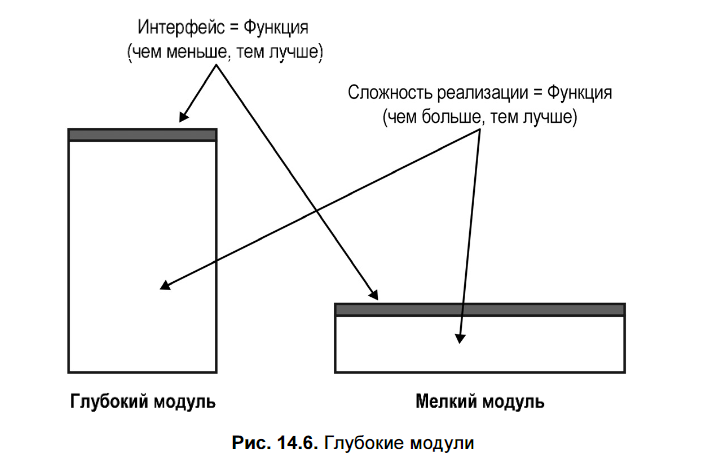
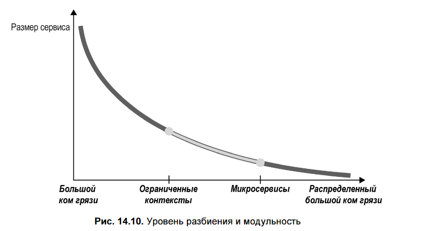
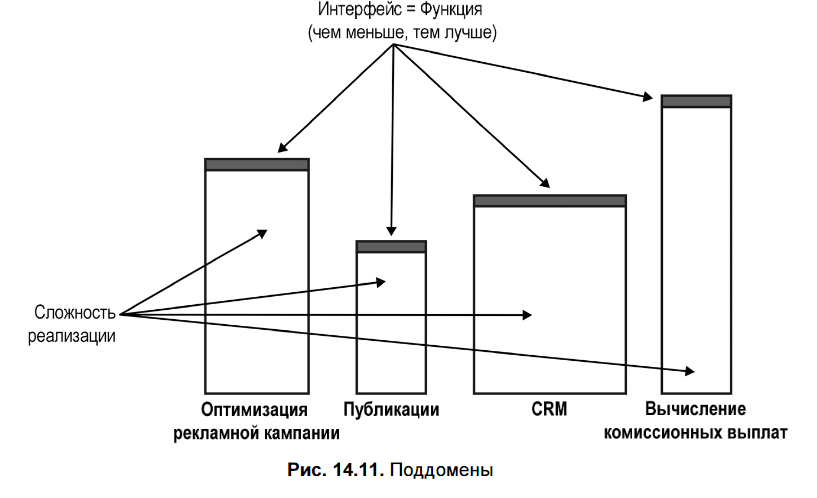

## 📌 **Основная идея**
> **Микросервисы ≠ ограниченные контексты**, хотя часто их путают.  
> Успешная микросервисная архитектура требует **баланса между локальной и глобальной сложностью** — и **DDD даёт инструменты для нахождения этого баланса**.

---

## 🔍 **1. Что такое сервис и микросервис?**

### Сервис (по OASIS)
- **Механизм**, предоставляющий одну или несколько **бизнес-компетенций** через **предписанный интерфейс**(prescribed interface).
- Интерфейс может быть **синхронным** (REST) или **асинхронным** (события).

### Микросервис
- Это **сервис с «микроинтерфейсом»** — то есть **узким, сфокусированным публичным API  (входной микродверью)**.
- **Инкапсулирует свою БД**: доступ только через API, **никакого прямого SQL извне**.
- Цель: **упростить понимание, изменение, масштабирование**.

> 💡 Метафора Рэнди Шоупа: API — это **входная дверь**. У микросервиса — **маленькая дверь**.

---

## ⚠️ **2. Антипаттерн: «Метод как сервис» (Method as a Service)**

- Попытка разбить монолит **по методам** → каждый метод = отдельный микросервис.
- **Результат**:  
  - Каждый «сервис» инкапсулирует свою БД.  
  - Но логика тесно связана → появляются **внутренние API для интеграции**.  
  - Система превращается в **распределённый «большой ком грязи»**.

> ❌ **Ошибка**: оптимизация локальной простоты в ущерб глобальной архитектуре.

Цель проектирования микросервисов — не максимальное упрощение отдельных компонентов, а создание **гибкой и взаимосвязанной системы в целом**. Упрощённая декомпозиция (по одному методу на сервис) не работает, потому что:

1. **Сервисы не могут быть полностью независимыми** — им нужны интеграционные интерфейсы.
2. **Локальная простота ведёт к глобальной сложности** — система в совокупности становится значительно сложнее.
3. **Система определяется через взаимодействие компонентов**, поэтому проектирование должно учитывать не только внутреннюю структуру сервисов, но и их взаимосвязи.

Итог: баланс между локальной простотой и общей согласованностью — ключ к удачной архитектуре.

---

## 🧩 **3. Сложность: локальная vs глобальная**

- **Локальная сложность** — сложность одного сервиса.
- **Глобальная сложность** — сложность взаимодействия между сервисами.

| Стратегия | Последствие |
|----------|-------------|
| Один монолит | Минимум глобальной сложности, максимум локальной → risk of Big Ball of Mud |
| Слишком много микросервисов | Минимум локальной сложности, максимум глобальной → **распределённый Big Ball of Mud** |

---

## 📐 **4. Глубокие vs мелкие сервисы**

По Джону Оустерхауту (*The Philosophy of Software Design*):

- **Глубокий модуль**:
  - **Узкий интерфейс** (простая функция)
  - **Сложная реализация** (инкапсулированная логика)
  - ✅ Хорошо: скрывает сложность

- **Мелкий модуль**:
  - Интерфейс = реализация (например, `AddTwoNumbers`)
  - ❌ Плохо: добавляет «движущиеся части» без пользы

> 🔸 **Микросервис должен быть «глубоким»**: простой API, сложная бизнес-логика внутри.

---

## 🧱 **5. DDD и границы микросервисов**

### ❌ **Ограниченный контекст ≠ микросервис**
- **Все микросервисы — это ограниченные контексты**, но **не все ограниченные контексты — микросервисы**.
- Ограниченный контекст — **наиболее широкая допустимая граница**:
  - Может содержать **несколько поддоменов**.
  - Может быть реализован как **монолит** (но **не Big Ball of Mud!** — он логически согласован).
- Разбиение **шире**, чем Bounded Context → **конфликт моделей**, грязь.
- Разбиение **уже**, чем нужно → **избыточная декомпозиция**, распределённая грязь.

> 🎯 **Ограниченный контекст — верхняя граница**.  
> **Микросервис — нижняя граница**.  
> Безопасная зона — **между ними** (рис. 14.10).

### ❌ **Агрегат ≠ микросервис**
- Агрегат — **самая узкая граница** согласованности.
- Делить агрегат на несколько сервисов → **нарушение транзакционной целостности**.
- Агрегаты часто **тесно связаны** → выделение каждого в отдельный сервис **увеличит глобальную сложность**.

### ✅ **Поддомен — лучшая эвристика для микросервиса**
- Поддомен = **бизнес-компетенция** («что делает бизнес?»).
- Объединяет **связанные сценарии использования**, данные, правила.
- Естественно формирует **глубокий модуль**:
  - Функция: «Управление заказами»
  - Логика: сложные правила валидации, оплаты, отмены — всё внутри.

> 💡 **Правило**: **один Core/Generic/Supporting поддомен → один микросервис** (в большинстве случаев).

---

## 🛡️ **6. Как сделать микросервис «глубже»?**

### 🔸 **Сервис с открытым протоколом (Open-Host Service)**
- Отделяет **внутреннюю модель** от **публичного API**.
- Использует **опубликованный язык (Published Language)** — упрощённую, стабильную модель для потребителей.
- Позволяет:
  - Менять внутреннюю реализацию без ломки API
  - Скрыть ненужные детали от клиентов

### 🔸 **Предохранительный слой (Anti-Corruption Layer, ACL)**
- Защищает сервис от **чужой модели** (например, legacy-системы).
- Может быть реализован **как отдельный сервис**.
- Преобразует **внешнюю модель → внутреннюю**.
- Упрощает логику **основного сервиса** → делает его глубже.

---

## ✅ **Выводы**

1. **Микросервис — это не про размер кода**, а про **глубину и автономность**.
2. **Не разбивайте «по методам»** — это путь к распределённой спагетти-архитектуре.
3. **Используйте DDD как руководство**:
   - **Поддомены** — отличная отправная точка для границ микросервисов.
   - **Ограниченные контексты** — верхняя граница допустимой связности.
   - **Агрегаты** — нижняя граница транзакционной целостности (не делите их!).
4. **Упрощайте API** через:
   - Open-Host Service
   - Anti-Corruption Layer
5. **Цель — не микросервисы ради микросервисов**, а **гибкая, понятная, изменяемая система**.

> 🔄 **Помните**: микросервисы — это **инструмент**, а не цель. DDD помогает **выбрать правильные границы**, чтобы этот инструмент работал.
