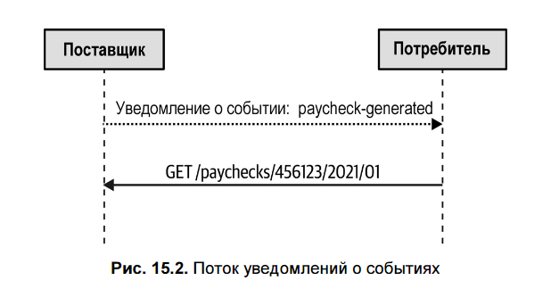
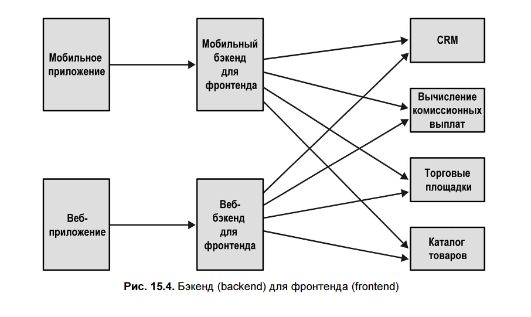
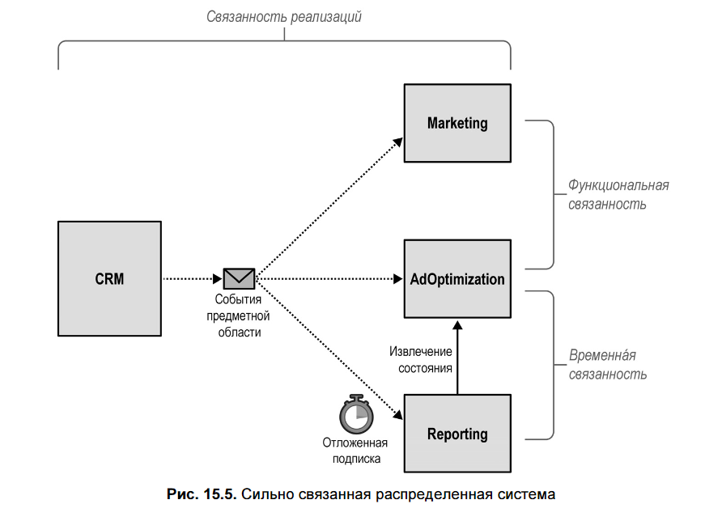
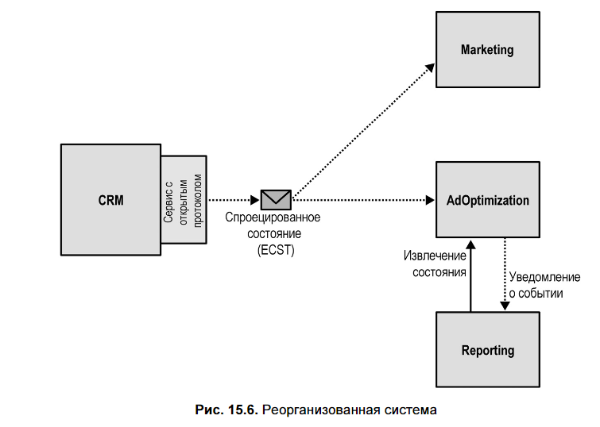

## 📌 **Главная мысль главы**

> **События — не волшебная таблетка**. Неправильное использование событий в EDA (Event-Driven Architecture) превращает систему в **распределённый «большой ком грязи»**.  
> **DDD и EDA связаны**, но **события предметной области ≠ события для интеграции**.  
> Успешная EDA требует **осознанного выбора типа событий** и **защиты границ контекстов**.

---

## 🔁 **1. Что такое событийно-ориентированная архитектура (EDA)?**

- Архитектурный стиль, где компоненты **взаимодействуют асинхронно через события**.
- Вместо REST-вызовов — **публикация и подписка на события**.
- Типичный паттерн: **Saga** (для транзакций через сервисы).

> ⚠️ **Важно**: EDA ≠ Event Sourcing!  
> - **Event Sourcing** — внутренний механизм хранения состояния (внутри одного сервиса).  
> - **EDA** — внешний механизм интеграции (между сервисами).

---

## 📨 **2. События, команды и сообщения**

| Тип | Описание | Особенности |
|-----|---------|-------------|
| **Сообщение** | Общий контейнер данных для передачи | Техническая сущность |
| **Команда** | «Сделай что-то!» | Может быть **отклонена**, пишется в повелительном наклонении |
| **Событие** | «Что-то уже произошло» | **Нельзя отменить**, только компенсировать; формулируется **в прошедшем времени** |

Пример события:
```json
{
  "type": "delivery-confirmed",
  "event-id": "uuid",
  "timestamp": 1615718833,
  "payload": { ... }
}
```

---

## 🧩 **3. Три типа событий в EDA**

### 1. **Уведомление (Event Notification)**
- **Цель**: сигнализировать о факте изменения.
- **Данные**: минимум — обычно только ID и ссылка.
- **Потребитель** должен **сам запросить детали**.

✅ **Плюсы**:
- Безопасность: конфиденциальные данные не уходят в шину.
- Актуальность: потребитель получает **свежие данные** при запросе.
- Подходит для **конкурирующих потребителей** (с блокировкой).

Пример:
```json
{ "type": "paycheck-generated", "event-id": "537ec7c2-d1a1-2005-8654-96aee1116b72", "delivery-id": "05011927-a328-4860-a106-737b2929db4e", "timestamp": 1615726445, "payload": { "employee-id": "456123", "link": "/paychecks/456123/2021/01" } }
```


---

### 2. **Передача состояния с помощью события (Event-Carried State Transfer, ECST)**
- **Цель**: передать **изменённое состояние** целиком или частично.
- **Данные**: полный снимок или только изменённые поля.
- Позволяет строить **локальный кеш** → работает даже при недоступности источника.

✅ **Плюсы**:
- Отказоустойчивость
- Производительность (меньше вызовов)

Пример:
```json
{ "type": "customer-updated", "payload": { "status": "active", "version": 5 } }
```


---

### 3. **Событие предметной области (Domain Event)**
- **Цель**: **моделировать бизнес-процесс**, а не интегрироваться.
- Содержит **бизнес-смысл**: **что именно произошло**, а не просто «что изменилось».
- Используется в **Event Sourcing** для восстановления состояния.

⚠️ **Не для интеграции!**  
- Потребителям не нужны все детали внутренней модели.
- Подписка на Domain Events **связывает потребителя с реализацией** источника.

Пример:
```json
{ "type": "married", "payload": { "partner-id": "456", "assumed-partner-name": true } }
```

> ❗ **Ключевое различие**:  
> - **ECST** говорит: *«статус клиента стал “активен”»*  
> - **Domain Event** говорит: *«клиент подтвердил подписку»*

---

## 🧪 **4. Антипаттерн: распределённый «большой ком грязи»**

### Сценарий провала:
- CRM использует **Event Sourcing**.
- Marketing и AdsOptimization **подписываются напрямую на все Domain Events** CRM.
- Reporting слушает те же события, но **с задержкой**.

### Проблемы:

| Тип связанности | Проявление |
|------------------|-----------|
| **Временная** | Reporting зависит от порядка обработки AdsOptimization → задержка не гарантирует корректность |
| **Функциональная** | Marketing и AdsOptimization дублируют логику проекции → изменения нужно вносить в два места |
| **Связанность реализации** | Любое изменение в Domain Events CRM ломает подписчиков |

> 🚫 **Итог**: система **хрупкая, несопровождаемая, негибкая**.

---

## 🔧 **5. Как правильно проектировать EDA**

### ✅ Принцип 1. **Предполагайте худшее**
- Сеть медленная, сервера падают, события дублируются и приходят не по порядку.
- **Решения**:
  - **Outbox Pattern** — гарантия доставки событий
  - **Idempotency** — защита от дублей
  - **Saga + Process Manager** — управление сложными workflow

---

### ✅ Принцип 2. **Разделяйте публичные и приватные события**
- **Domain Events** — **приватные**, для внутреннего использования.
- Для интеграции — создавайте **публичные события**, часть **Published Language**.
- Используйте **Open-Host Service**: преобразуйте внутренние события во внешние.

> 🛡️ **Цель**: **инкапсулировать реализацию**, выставить **стабильный интерфейс**.

---

### ✅ Принцип 3. **Выбирайте тип события по требованиям согласованности**


| Требование                                                         | Тип события                        |
| ------------------------------------------------------------------ | ---------------------------------- |
| Нужен **актуальный снимок** → можно работать с устаревшими данными | **ECST** (передача состояния)      |
| Нужны **последние данные** → нельзя использовать кеш               | **Уведомление** + запрос по ссылке |
|                                                                    |                                    |

---

## 🎯 **Реорганизация примера из главы**

**Было**:
- Все подписываются на Domain Events CRM → сильная связанность.

**Стало**:
1. CRM **сам проецирует** нужные модели для Marketing и AdsOptimization.
2. Публикует **специализированные ECST-события** (не Domain Events!).
3. AdsOptimization, завершив обработку, **публикует уведомление** → Reporting запускается по событию, **не по таймеру**.

→ **Устранены все три типа связанности**.

---

## ✅ **Выводы**

1. **Не путайте Domain Events и интеграционные события**.
2. **Domain Events — для моделирования, не для публикации**.
3. **Используйте три типа событий осознанно**:
   - Уведомления — для безопасности и актуальности
   - ECST — для отказоустойчивости и производительности
   - Domain Events — только внутри контекста
4. **Защищайте границы** через Published Language и Open-Host Service.
5. **Проектируйте с учётом сбоев** — EDA требует идемпотентности, упорядочения, надёжной доставки.

> 🔁 **EDA — это не про технологии, а про проектирование границ и контрактов**.  
> **DDD — ваш главный союзник** в создании слабосвязанной, устойчивой системы.
