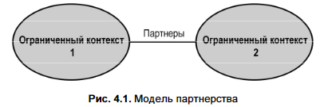
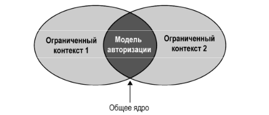
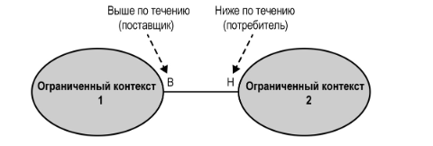
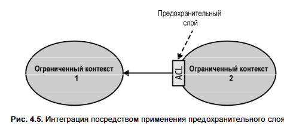
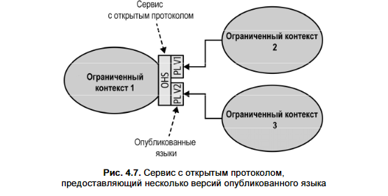
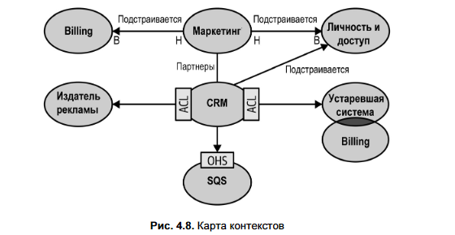
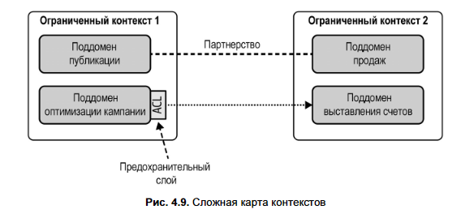

> Ограниченный контекст (Bounded Context) защищает согласованность единого языка (Ubiquitous Language) внутри своих границ и открывает возможности к по- строению моделей. Построить модель, не определив цель ее существования, т. е. не зафиксировав ее границы, невозможно. Эта граница — граница ответственностей языков, она означает, что одни и те же бизнес-сущности в разных ограниченных контекстах могут использоваться для решения различных задач

Ограниченный контекст (Bounded Context) — это граница, внутри которой **единый язык и модель согласованы** и служат **конкретной цели**. Одна и та же сущность может иметь **разные значения** в разных контекстах.

Несмотря на **независимую разработку**, контексты **должны интегрироваться**, так как система работает как единое целое. Точки интеграции — это **контракты**, которые необходимо явно определять, поскольку **языки и модели в контекстах различаются**.

---
### 🔑 Основная идея

Ограниченные контексты (ОК) **не могут быть полностью изолированы** — они должны **взаимодействовать**, но при этом сохранять внутреннюю согласованность. Для этого в DDD используются **паттерны интеграции**, основанные на характере взаимодействия команд.

---

### 🤝 Типы взаимодействия и паттерны

#### 1. **Сотрудничество (Cooperation)**

Паттерны сотрудничества применяются, когда команды **тесно взаимодействуют** и их успехи взаимозависимы. Два основных паттерна:

- **Партнёрство (Partnership)**  
    - Команды **согласовывают изменения** в режиме реального времени.  
    - Интеграция гибкая, без навязывания модели.
    - Двусторонняя коммуникация, гибкость, общая ответственность.  
    - Требует **частой синхронизации** и **непрерывной интеграции**.
    

- **Общее ядро (Shared Kernel)**  
    - Часть модели **совместно используется** несколькими контекстами.  
    - Реализуется как общий код (библиотека или часть монорепозитория).  
    -  **Опасность**: сильная связанность → изменения затрагивают все контексты.  
    - Применяется, когда **дублирование обходится дороже координации** (чаще в **основных поддоменах**).  
    -  Это **исключение из правил** DDD, требует осторожного применения и автоматизированных тестов.
    - Используется временно (например, при рефакторинге legacy) или одной командой .
    
    **«Общие рамки» (Shared scope)** — это **не отдельный паттерн**, а **описание последствий** использования паттерна **«Общее ядро» (Shared Kernel)**.
    Чтобы снизить риски:
	- Общая часть должна быть **минимальной** — только то, что действительно нужно всем.
	- В идеале — только **интеграционные контракты и DTO**, без бизнес-логики.
	-  Чётко **ограничивать его границы**, чтобы избежать каскадных изменений.
    
    

    

---

#### 2. **Потребитель–Поставщик (Customer–Supplier)**

Один контекст зависит от другого, но интересы не всегда совпадают. В отношениях «поставщик (upstream) → потребитель (downstream)» команды **независимы**, что создаёт **дисбаланс сил**.

- **Конформист (Conformist)**  
    - Потребитель **принимает модель поставщика как есть**.  
    - Подходит, если модель поставщика **стандартна или устраивает**.
    
- **Предохранительный  слой (Anti-corruption Layer, ACL)**  
    - Потребитель **отказывается от модели поставщика** и **преобразует** её в свою.  
    -  Используется, если:  
	    • нисходящий (downstream) ограниченный контекст содержит основной под- домен (core subdomain и его модель мешает проектированию основного поддомена,  
	    • восходящая (upstream) модель неэффективна или не соответствует нуж- дам потребителя, поставщик — устаревшая система,  
	    • интерфейс часто меняется.  
    - Защищает внутреннюю модель от «загрязнения».
    

- **Сервис с открытым протоколом (Open-Host Service)**  
    - Поставщик **сам предоставляет стабильный публичный интерфейс** (**опубликованный язык (Published Language)**).  
    - Внутренняя модель может меняться независимо от внешней.  
    - Поддержка **нескольких версий API** для плавного перехода.
    

---

#### 3. **Разные пути (Separate Ways)**

Команды **отказываются от интеграции** и **дублируют функциональность**.

Применяется, когда:

- Сотрудничество **слишком дорого или невозможно** (организационные барьеры).
- Поддомен **универсальный** (например, логирование).
- Модели **слишком различаются**, а реализация предохранительного уровня/конформизм невыгодны.

> ❌ **Не относится к основным поддоменам** — дублирование основной логики противоречит бизнес-стратегии.

---

### 🗺️ Карта контекстов (Context Map)

- **Визуальное представление** всех  ограниченных контексто и их взаимодействий.
- Показывает:
    - Границы контекстов,
    - Типы интеграции (ACL, партнёрство и т. д.),
    - Командные и организационные зависимости.
- Должна **постоянно обновляться** и поддерживаться **совместно командами**.
- Может быть реализована как **диаграмма** или **код** (например, с помощью Context Mapper).

Составление карты контекстов может быть сложно, потому что:

- Один ограниченный контекст может охватывать **несколько поддоменов**,
- Между двумя контекстами может использоваться **несколько паттернов интеграции одновременно** (например, и _партнёрство_, и _предохранительный слой_),
- Даже внутри одного поддомена разные модули могут требовать **разных стратегий интеграции**.

→ Карта контекстов часто оказывается **сложной и многоуровневой**, а не простой схемой «один контекст — один паттерн».

---

### 💡 Ключевые выводы

- Интеграция — **неотъемлемая часть** архитектуры на основе ОК.
- Выбор шаблона зависит от:  
    → характера отношений между командами,  
    → типа поддомена (основной/общий/вспомогательный),  
    → стоимости дублирования по сравнению с интеграцией.
- **Цель** — сохранить **гибкость**, **независимость** и **ясность модели** в любом контексте.

> Глава завершает **стратегическое проектирование** и подводит к **тактическим паттернам** DDD (модели, агрегаты, репозитории и т. д.).