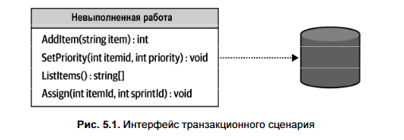
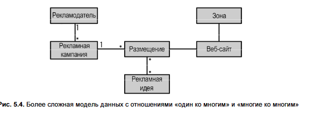

### 🔑 Главная мысль

Бизнес-логика — **ядро ПО**. Но не вся логика одинаково сложна. Для **простых случаев** (вспомогательные и универсальные поддомены) достаточно **простых паттернов**, таких как **транзакционный сценарий** и **активная запись**.

---

### 1. **Транзакционный сценарий (Transaction Script)**

Паттерн **транзакционного сценария** представляет публичный интерфейс системы как набор **бизнес-транзакций** (операций), каждая из которых реализуется отдельной процедурой. Эти операции — границы инкапсуляции: они либо полностью выполняются, либо не выполняются вовсе, обеспечивая целостность системы. 

Реализация:
В паттерне **транзакционного сценария** каждая процедура — это простой сценарий, работающий с БД напрямую или через лёгкую абстракцию. Главное требование — **транзакционность**: операция либо полностью завершается успешно, либо откатывается, чтобы система всегда оставалась в согласованном состоянии.

- **Что**: Процедура = одна бизнес-операция (например, «зарегистрировать визит»).
- **Обязательно**: Операция должна быть **транзакционной** — либо всё прошло, либо ничего.

#### ⚠️ Типичные ошибки:

##### - **Отсутствие транзакции** → частичные обновления → несогласованность данных.
Если несколько операций с БД (например, UPDATE и INSERT) выполняются **без общей транзакции**, сбой между ними приводит к **несогласованности данных** (одна операция выполнена, другая — нет).
**Решение:** обернуть все изменения в **единую транзакцию** с `StartTransaction`, `Commit` и `Rollback` при ошибке.
Это работает в реляционных БД, но **не применимо** в системах с несколькими хранилищами или без поддержки транзакций — там нужны другие подходы (например, паттерн Outbox).

##### - **Распределённые операции** (БД + шина сообщений) → нельзя обернуть в одну транзакцию → риск потери сообщения или дублирования.
В распределённых системах часто нужно **обновить БД и отправить сообщение** (например, в шину). Если между этими действиями происходит сбой, система приходит в **несогласованное состояние** (данные обновлены, но сообщение не отправлено).
Классические распределённые транзакции (двухфазный коммит) **избегают** из-за сложности и плохой масштабируемости.
**Решения:**
- Паттерн **Outbox** (сообщение сохраняется в БД вместе с данными, затем надёжно публикуется).
- Архитектура **CQRS** (раздельная обработка команд и событий).
Эти подходы обеспечивают **надёжность без распределённых транзакций**.

##### - **Неявные распределенные транзакции** → повторный вызов при ошибке сети → некорректные данные (например, счётчик +2 вместо +1).
Даже простой метод вроде `UPDATE visits = visits + 1` может стать **неявной распределённой транзакцией**, если вызывающая сторона не получает подтверждение об успехе (например, из-за сетевого сбоя). В этом случае она может повторить вызов, что приведёт к **дублированию действия** (счётчик увеличится дважды).
**Решения:**
1. **Идемпотентность**: передавать **итоговое значение** (`visits = N`), а не команду «увеличить».
2. **Оптимистическая блокировка**: передавать **ожидаемое текущее значение**, обновлять только если оно не изменилось (`WHERE visits = @expected`).

#### ✅ Когда использовать:

- В **вспомогательных поддоменах** (supporting).
- Для **ETL**, интеграций, простых CRUD.
-  при **интеграции с внешними системами** (универсальные поддомены, или в качестве части предохранительного слоя ACL).
- **Не использовать** в **основных поддоменах (core)** — не масштабируется при росте сложности.

**Плюсы:** простота, производительность, понятность.  
**Минусы:** плохо масштабируется на сложную логику.

Транзакционный сценарий часто критикуют как антипаттерн, потому что при использовании для **сложной логики** он превращается в «большой ком грязи». Однако он **широко распространён** и служит **основой для всех более сложных паттернов** транзакционного типа 

---

### 2. **Активная запись (Active Record)**
Паттерн **активная запись** подходит для **простой бизнес-логики**, но позволяет удобно работать с **более сложными структурами данных** (иерархии, связи «один ко многим» и т.п.), избегая дублирования кода маппинга, которое неизбежно при использовании транзакционного сценария.

Реализация:
Активная запись — это объект, сочетающий **данные** и **методы доступа к БД** (CRUD). Он инкапсулирует маппинг между объектом и таблицей (часто через ORM).
Бизнес-логика по-прежнему организована как **транзакционный сценарий**, но вместо прямых SQL-запросов он работает с **объектами активных записей**.
Такие объекты могут содержать **простую логику** (валидация, обработка данных), но обычно имеют **публичные поля**, что разделяет данные и поведение — в отличие от богатой доменной модели.
Операции остаются **транзакционными**: либо всё успешно завершается, либо откатывается.
> Разница между этими двумя паттернами заключается в том, что в данном случае вместо прямого доступа к базе данных транзакционный сцена- рий манипулирует объектами активной записи. 

- **Что**: Объект = строка в БД + методы для **CRUD** и простой валидации.
- **Как**: Объект сам знает, как сохраняться/загружаться (инкапсуляция доступа к данным).
- **Отличие от Transaction Script**: Работает с **объектами**, а не напрямую с SQL.

#### Особенности:

- Подходит для **иерархий и связей** («один ко многим» и т.п.).
- Часто реализуется через ORM (но паттерн ≠ фреймворк Active Record).
- Может содержать **простую бизнес-логику** (валидация, форматирование), но **не сложные правила**.

#### ✅ Когда использовать:

Паттерн **активная запись** подходит для **простой бизнес-логики** (в основном CRUD с базовой валидацией) и используется в:

- **вспомогательных поддоменах**,
- **интеграции с универсальными поддоменами**,
- **преобразовании моделей**.

Он эффективно решает задачу **маппинга сложных структур данных** на схему БД, избегая дублирования кода.

**Важно:**  
— Это **паттерн проектирования** (по Мартину Фаулеру), а не только фреймворк.  
— Не является антипаттерном **при правильном применении** — вред возникает только при использовании в сложных, core-поддоменах.  
— Для простых задач **избыточная сложность более «продвинутых» паттернов** тоже вредна.

---

### 💡 Прагматизм важнее догмы

- В высоконагруженных системах (например, IoT) **абсолютная согласованность** может быть излишней.
- Допустимы **ослабленные гарантии**, если бизнес это позволяет (например, потеря 0,001% событий — не критична).
- Главное — **осознанно оценивать риски**, а не следовать правилам слепо.

---

### 📌 Вывод

- **Transaction Script** и **Active Record** — **простые, эффективные инструменты** для **простой логики**.
- Они **не подходят для core-поддоменов**, где нужна **богатая доменная модель** (о ней — в следующей главе).
- **Правильный выбор паттерна = соответствие сложности задачи**. Не усложняйте простое — и не упрощайте сложное.

**ранзакционный сценарий (Transaction Script)** и **Активная запись (Active Record)** — это два паттерна для реализации **простой бизнес-логики**, но они различаются по структуре и уровню абстракции.

---
✅ СРАВНЕНИЕ:
### 🔹 **Транзакционный сценарий**

- **Что**: Процедура = одна бизнес-операция (например, «зарегистрировать визит»).
- **Как**: Последовательный код, часто с **прямым SQL-доступом к БД**.
- **Данные и логика разделены**: данные — в БД, логика — в процедуре.
- **Нет объектной модели**: работа идёт с «примитивами» (строки, числа) и таблицами.
- **Пример**:
    
    public void LogVisit(Guid userId, DateTime visitedOn)
{
    _db.Execute("UPDATE Users SET last_visit = @p1 WHERE user_id = @p2", visitedOn, userId);
    _db.Execute("INSERT INTO VisitsLog ...");
}
    

> ✅ Подходит для **очень простых операций**, ETL, интеграций.

---

### 🔹 **Активная запись**

- **Что**: Объект = строка в БД + методы для **CRUD и простой логики**.
- **Как**: Инкапсулирует **данные + поведение + доступ к БД** в одном классе.
- **Объектная модель есть**: `User.Save()`, `Order.Delete()`.
- **Часто используется с ORM** (например, Rails ActiveRecord, Laravel Eloquent).
- **Пример**:
    
    var user = new User { Name = "Alice", Email = "alice@example.com" };
user.Save(); // внутри — INSERT в БД

> ✅ Подходит, когда есть **иерархии данных**, но логика всё ещё простая (валидация, базовые правила).

| Критерий | **Транзакционный сценарий** | **Активная запись** |
|---|---|---|
| **Структура** | Процедурный код | Объектно-ориентированный |
| **Модель данных** | Нет (работа с таблицами) | Есть (объект = строка БД) |
| **Доступ к БД** | Прямой или через простую абстракцию | Встроен в объект |
| **Повторное использование** | Низкое (логика дублируется) | Выше (методы переиспользуются) |
| **Сложность данных** | Плоские структуры | Поддерживает связи (например, `user.Orders`) |
### 💡 Когда что использовать?

- **Transaction Script** — для **одноразовых, линейных операций** (ETL, адаптеры, простые API).
- **Active Record** — когда нужно **немного ООП**, но логика всё ещё **не сложная** (вспомогательные поддомены).

> ❗ Оба паттерна **не подходят для core-поддоменов** с богатой бизнес-логикой — там нужна **модель предметной области (Domain Model)**.