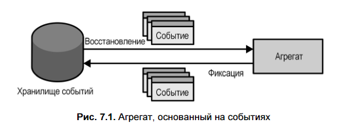

### 🔑 Основная идея
### Event Sourcing (в контексте DDD)
Паттерн хранения состояния агрегата (объекта предметной области) **не как текущего снимка**, а как **последовательности событий**, которые привели к этому состоянию.
- Используется **внутри границы агрегата** — это **паттерн моделирования домена**.

**Модель предметной области, основанная на событиях (Event-Sourced Domain Model)**, сохраняет не **текущее состояние**, а **все изменения** в виде **событий предметной области**. Эти события становятся **источником истины** и позволяют восстановить состояние агрегата в любой момент времени.

---

### 📌 События как источник данных (Event Sourcing)

- В отличие от традиционного подхода, где сохраняется **текущее состояние** (например, таблица с лидами и их статусами), **Event Sourcing** сохраняет **все изменения** в виде **последовательности событий** (например: «лид создан», «связались», «назначен повторный звонок», «оплата подтверждена»).
- Пример: вместо `status = "CONVERTED"` — цепочка событий:  
    `lead-initialized → contacted → followup-set → order-submitted → payment-confirmed`.
-  **Преимущество**: видна **полная история** — как и почему объект пришёл к текущему состоянию.
-  **Состояние воссоздаётся** путём последовательного применения событий к проекции (`Apply`-методы).
-  Позволяет **«путешествовать во времени»** — получить состояние на любой момент.
- События — **неизменяемый журнал**, который становится **источником истины**.

> Паттерн «События как источник данных» (Event Sourcing) вводит в модель данных фактор времени. Вместо схемы, отражающей текущее состояние агрегатов, систе- ма, в которой источником текущего состояния являются события, сохраняет собы- тия, фиксирующие каждое изменение в жизненном цикле агрегата.

{ "lead-id": 12, "event-id": 0, "event-type": "lead-initialized", "first-name": "Casey", "last-name": "David","phone-number": "555-2951", "timestamp": "2020-05-20T09:52:55.95Z" },
{ "lead-id": 12, "event-id": 1, "event-type": "contacted", "timestamp": "2020-05-20T12:32:08.24Z" }, 
{ "lead-id": 12, "event-id": 2, "event-type": "followup-set", "followup-on": "2020-05-27T12:00:00.00Z", "timestamp": "2020-05-20T12:32:08.24Z" }, 
{ "lead-id": 12, "event-id": 3, "event-type": "contact-details-updated", "first-name": "Casey", "last-name": "Davis", "phone-number": "555-8101", "timestamp": "2020-05-20T12:32:08.24Z" },
{ "lead-id": 12, "event-id": 4, "event-type": "contacted", "timestamp": "2020-05-27T12:02:12.51Z" },
{ "lead-id": 12, "event-id": 5, "event-type": "order-submitted", "payment-deadline": "2020-05-30T12:02:12.51Z", "timestamp": "2020-05-27T12:02:12.51Z" },
{ "lead-id": 12, "event-id": 6, "event-type": "payment-confirmed", "status": "converted", "timestamp": "2020-05-27T12:38:44.12Z" }

> Итерация по событиям агрегата и их последовательная передача в соответствую- щий переопределенный метод Apply создаст точно такое же представление состоя- ния, которое смоделировано в таблице 7.1. Обратите внимание на поле версии Version, значение которого увеличивается после применения каждого события. Его значение представляет собой общее количество модификаций, внесенных в бизнес-сущность

---

### 🔄 Как работает агрегат на основе событий

1. **Загрузка** всех событий агрегата из **хранилища событий (event store)**.
2. **Восстановление состояния** путём последовательного применения событий к проекции (`Apply`-методы).
3. **Выполнение команды** → генерация **новых событий** (не изменение полей напрямую!).
4. **Сохранение** новых событий в хранилище (с проверкой версии для оптимистичной блокировки).

> Агрегат **не хранит состояние**, а **воссоздаёт его из событий**.

---

> 
Чтобы паттерн «События как источник данных» работал, все изменения состояния объекта должны быть представлены и сохранены как события. Эти события стано- вятся для системы источником истины (отсюда и название паттерна). База данных, в которой хранятся системные события, — это единственное строго согласованное хранилище: системный источник истины. Базу данных, используе- мую для сохранения событий, принято называть хранилищем событий (event store).

---

✅ **Хранилище событий (Event Store)**

- Это **append-only** хранилище: события **нельзя изменять или удалять** (только в исключительных случаях, например, при миграции).
- Поддерживает две ключевые операции:
    - `Fetch(instanceId)` — получить все события для сущности.
    - `Append(instanceId, events, expectedVersion)` — добавить новые события с проверкой версии.
- **`expectedVersion`** обеспечивает **оптимистичную блокировку**: если сущность уже изменили, операция отклоняется.
- Является **источником истины** — текущее состояние воссоздаётся проецированием событий (как в бухгалтерском журнале).

---
**Модель предметной области, основанная на событиях:**

Это подход, при котором **все изменения состояния агрегата выражаются исключительно через события предметной области**. Состояние **не сохраняется напрямую**, а **воссоздаётся** путём последовательного применения событий.

**Жизненный цикл операции:**

1. Загрузка всех событий агрегата из **хранилища событий**.
2. **Восстановление состояния** проецированием событий (через методы `Apply`).
3. Выполнение команды → генерация **новых событий** (а не прямое изменение полей).
4. Сохранение новых событий в хранилище.

> Такой подход делает события **источником истины**, обеспечивает полную историю изменений и позволяет строить разные проекции состояния под разные задачи.

Название **«модель предметной области, основанная на событиях»** подчёркивает, что события используются **внутри богатой доменной модели** (с агрегатами, инвариантами и т.д.), а не просто как технический приём.

---
### ✅ Преимущества Event Sourcing

1. **Путешествие во времени** — можно восстановить состояние на любой момент.
2. **Журнал аудита** — события — неизменяемая история, требуемая в финансах, GDPR и т.д.
3. **Гибкость анализа** — из одной цепочки событий можно строить **разные проекции**:
    - для поиска (все имена и телефоны),
    - для аналитики (количество эскалаций),
    - для UI (текущий статус).
4. **Глубокое понимание бизнеса** — события отражают **намерения**, а не просто изменения данных.
5. **Улучшенное управление конкурентностью** — можно анализировать конфликты на уровне предметной области.

---

### ⚠️ Недостатки и сложности

- **Крутая кривая обучения** — отличается от привычного CRUD.
- **Сложность эволюции модели** — события **неизменяемы**, изменение схемы требует миграций.
- **Архитектурная сложность** — требует CQRS, event store, проекций.
- **Производительность** — при очень большом числе событий (>10 000) может потребоваться **снапшот (snapshot)**.

---

### 💡 Практические решения

- **Снапшоты** — периодически сохраняют агрегированное состояние, чтобы не проигрывать все события с нуля.
- **Сегментирование хранилища** — масштабирование по ID агрегата.
- **GDPR и удаление данных** — шифрование конфиденциальных полей + удаление ключа шифрования (_forgettable payload_).

---

### ❌ Почему не подойдут простые аналоги?

- **Лог-файлы** — не транзакционны, легко рассинхронизируются с БД.
- **Журнальные таблицы** — легко забыть записать событие; нет бизнес-контекста.
- **Триггеры истории** — фиксируют **что изменилось**, но не **почему** → теряется смысл.

---

### 📌 Когда применять?

- В **основных поддоменах (core)** с **высокой сложностью** и **ценностью истории**.
- Когда нужен **аудит**, **аналитика**, **отладка по истории**.
- Когда бизнес-процессы **временные** и **состояние зависит от последовательности действий**.

---

### 🔚 Вывод

Event Sourcing — это **мощный, но сложный** паттерн, который:

- превращает **историю изменений** в **основу системы**,
- даёт **полный контроль и прозрачность** над жизненным циклом агрегатов,
- требует **архитектурной зрелости**, но оправдывает себя в сложных доменах.

> Глава завершает тактическое проектирование и готовит переход к архитектурным паттернам (CQRS и др.).