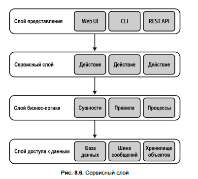
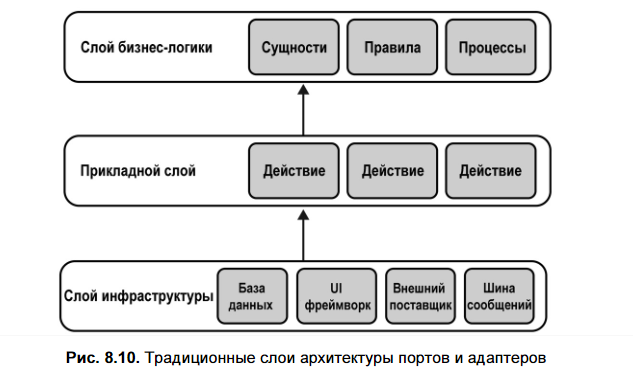
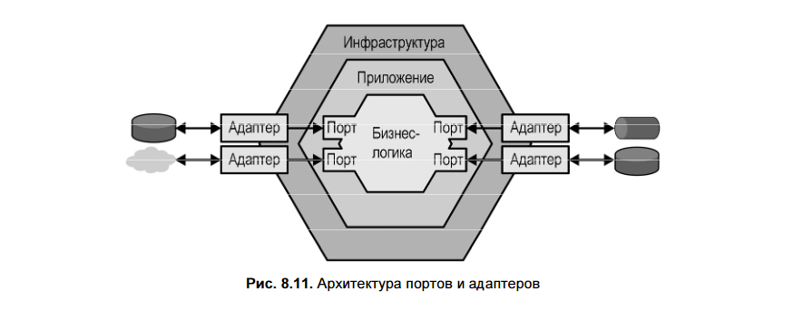
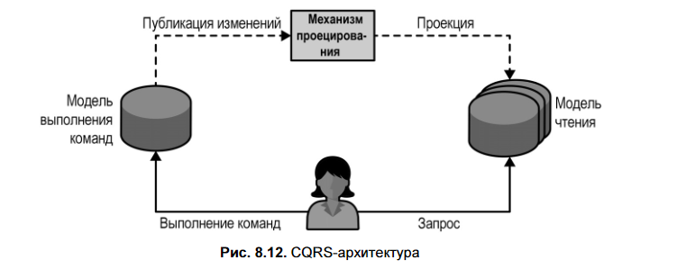
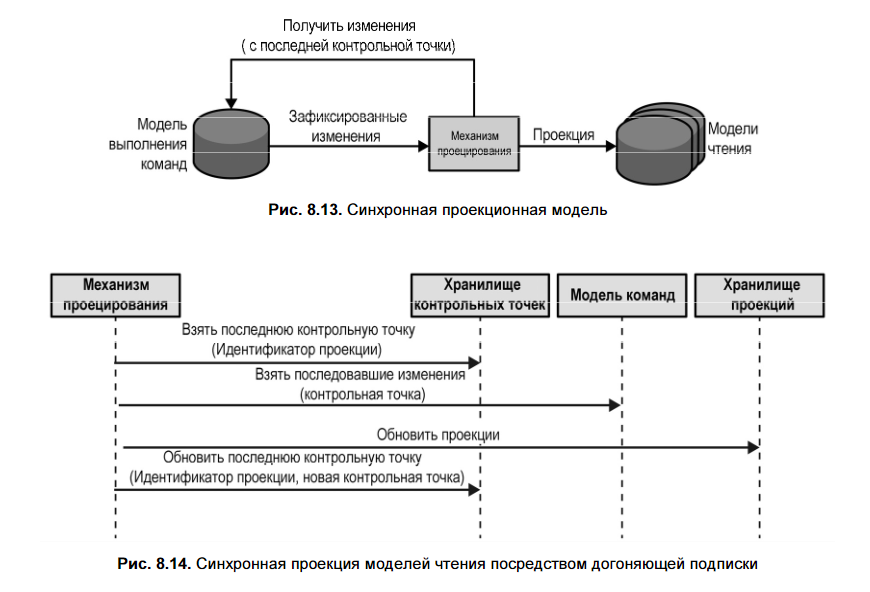
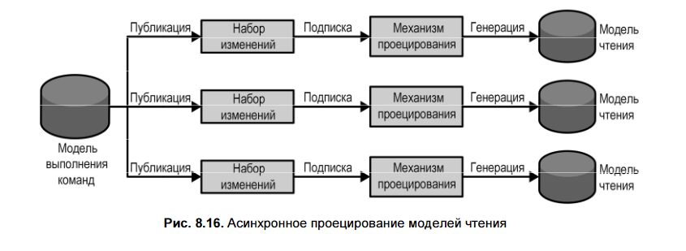
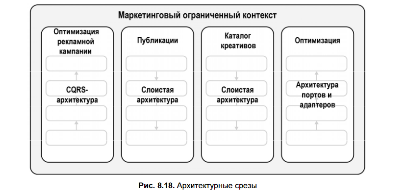

### 🔑 Основная цель

Организовать кодовую базу так, чтобы **бизнес-логика** была **чётко отделена** от инфраструктурных деталей (UI, БД, внешние сервисы), что упрощает поддержку, тестируемость и эволюцию системы.

---

## 🧱 Три ключевых архитектурных паттерна

### 1. **Слоистая архитектура (Layered Architecture)**  
В книге по архитектуре это — *Многоуровневая архитектура* [[Глава 10. Многоуровневая архитектура]]

#### 🏗️ Структура

- **Слой представления** (слой пользовательского интерфейса) — публичный интерфейс программы  
  - Графический интерфейс пользователя (GUI)  
  - Интерфейс для интеграции с другими системами (API)  
  - Интерфейс командной строки (CLI)  
  - Топики сообщений для публикации исходящих событий.

- **Сервисный слой** (прикладной слой) *(нужен не всегда)* — _оркестрация операций_  
  > **Логическая граница приложения**, выступающая посредником между слоем представления и бизнес-логикой.  
  > Это **фасад над бизнес-логикой**, а не физический микросервис.  
  > Сервисный слой **не нужен**, если бизнес-логика уже реализована как **транзакционный сценарий** — он сам выполняет роль сервисного слоя.  
  > Он **нужен**, когда используется **активная запись**: тогда сервисный слой (с транзакционными сценариями) оркестрирует операции, а активные записи остаются на уровне бизнес-логики.
  
> 	  Но стоит все же отметить, что необходимость в сервисном слое возникает не все- гда. Например, когда бизнес-логика реализована в виде транзакционного сценария, то она, по сути, и представляет собой сервисный слой, поскольку уже предоставля- ет набор методов, формирующих публичный интерфейс системы. В таком случае API сервисного слоя будет просто повторять публичные интерфейсы транзакцион- ных сценариев без абстрагирования и инкапсуляции какой-либо сложности. Следо- вательно, будет вполне достаточно либо сервисного слоя, либо слоя бизнес-логики. С другой стороны, потребности в сервисном слое будут возникать, если паттерну бизнес-логики станет необходим внешний оркестратор, как в случае с паттерном активной записи. Тогда на сервисном слое будет реализован паттерн транзакцион- ного сценария, а активные записи, с которыми он работает, будут находиться на слое бизнес-логики.

  **Отвечает за:**
  - Определение публичных операций системы (например, `CreateUser`, `PublishCampaign`)
  - Координацию бизнес-логики, управление транзакциями и инкапсуляцию взаимодействия с нижележащими слоями
  - Отделение представления (UI/API) от бизнес-логики → упрощает поддержку и тестирование
  - Повторное использование разными интерфейсами (веб, API, CLI)

  **Когда нужен:**
  - При использовании **активных записей** или других паттернов, требующих оркестрации
  - **Не нужен**, если бизнес-логика уже реализована как **транзакционный сценарий** — в этом случае он сам играет роль сервисного слоя

- **Слой бизнес-логики** (слой предметной области = слой модели)  
  Реализует паттерны бизнес-логики (например, активные записи, транзакционные сценарии, модель предметной области).  
  Именно здесь живёт **суть домена**.

- **Слой доступа к данным** (слой инфраструктуры)  
  Отвечает за **всё взаимодействие с внешними источниками данных**, включая:
  - Реляционные, документные, in-memory базы и поисковые индексы
  - Объектные хранилища (например, AWS S3) для файлов
  - Шины сообщений для внутренней коммуникации
  - Интеграции с внешними API (облачные сервисы, аналитика, переводы и т.д.)

---

#### 🔗 Зависимости

Строго **сверху вниз**:  
`UI / API → Сервисный слой → Бизнес-логика → Доступ к данным`

---

#### ✅ Плюсы

- Простота понимания и реализации
- Хорошо подходит для небольших и средних приложений

#### ❌ Минусы

- Бизнес-логика **зависит от инфраструктуры**
- Плохо совместима с **моделью предметной области (DDD)**

---

#### 🎯 Когда использовать

Слоистую архитектуру **предпочтительно использовать** для систем с **простой бизнес-логикой**, реализованной через **транзакционный сценарий** или **активную запись** (во **вспомогательных или универсальных поддоменах**).

> Она **не подходит для модели предметной области (DDD)**, так как нарушает принцип отсутствия зависимости бизнес-логики от инфраструктуры.

В **слоистой архитектуре** (например, presentation → application → domain → infrastructure) зависимости обычно направлены **сверху вниз**: верхние слои зависят от нижних. Это означает, что если вы хотите, чтобы доменная модель (агрегаты, объекты-значения) взаимодействовала с инфраструктурой (например, сохраняла себя в БД или отправляла события), ей приходится **знать о репозиториях, ORM или других инфраструктурных деталях**, либо вызывать их напрямую — что **нарушает принцип чистоты домена**.

#### Дополнительно: сравнение слоев и уровней (N-Tier / многоуровневой)

- **Слой (Layer)** — **логическая** граница в коде (например, UI, бизнес-логика, доступ к данным).  
  → Все слои **развёртываются вместе** как единое приложение.

- **Уровень (Tier)** — **физическая** граница (например, браузер, веб-сервер, БД-сервер).  
  → Каждый уровень **развёртывается и масштабируется независимо**.

> Слои — про **архитектуру кода**, уровни — про **инфраструктуру и развёртывание**.

---

### 2. **Порты и адаптеры (Ports and Adapters / Гексагональная архитектура)**

Также известна как **гексагональная**, **луковичная** или **чистая архитектура**.  (И все же эти паттерны можно ошибочно считать концептуально разными. Это еще один пример важности единого языка.)

Основана на **принципе инверсии зависимостей (DIP)** и идеально подходит для сложной бизнес-логики, особенно при использовании **модели предметной области (DDD)**.

#### 🔄 Основная идея

Архитектура **инвертирует зависимости**:  
вместо того чтобы бизнес-логика зависела от инфраструктуры (как в слоистой архитектуре),  
**инфраструктурные компоненты зависят от абстракций, определённых в ядре**.

#### 🏗️ Структура

- **Ядро (Core / Domain Layer)** — центр системы, **слой бизнес-логики = слой предметной области**  
  - Содержит **чистую бизнес-логику**  
  - **Не зависит ни от чего внешнего**: ни от БД, ни от фреймворков, ни от UI  
  - Определяет **порты** — интерфейсы для взаимодействия с внешним миром

- **Порты (Ports)**  
  - Абстракции (интерфейсы), описывающие **как** ядро хочет взаимодействовать с внешними системами  
  - Пример: `IMessaging`, `IUserRepository`, `INotificationService`

- **Адаптеры (Adapters)** — реализации портов на стороне инфраструктуры  
  - Конкретные классы, подключаемые к портам через DI или конфигурацию  
  - Пример: `SQSBus : IMessaging`, `PostgresUserRepository : IUserRepository`

- **Инфраструктурный слой**  
  - Объединяет всё внешнее: базы данных, API, очереди, CLI, GUI и т.д.  
  - Содержит **адаптеры**, но **не знает о внутреннем устройстве ядра**

- **Прикладной слой (Application Layer)** = **сервисный слой** = **слой пользовательского сценария**  
  - Фасад над ядром, определяющий **публичные операции системы** (`CreateUser`, `PublishCampaign`)  
  - Оркестрирует вызовы к ядру и управляет транзакциями  
  - Аналог сервисного слоя в слоистой архитектуре, но **не зависит от инфраструктуры**

---

#### 🔁 Зависимости

Все зависимости направлены **внутрь**, к ядру:    
→ **Ядро остаётся полностью независимым**

---

#### ✅ Преимущества

- Полное **отделение бизнес-логики от технологий**
- Легкое **тестирование** (можно мокать порты)
- Гибкость: можно **заменить адаптер** без изменения ядра (например, перейти с RabbitMQ на Kafka)
- Поддержка **DDD**, **event sourcing**, **CQRS**

#### ❌ Сложности

- Более высокий порог входа по сравнению со слоистой архитектурой
- Требует дисциплины в проектировании и понимания **DIP** — Принцип инверсии зависимостей (Dependency Inversion Principle):  
  > *Высокоуровневые модули, реализующие бизнес-логику, не должны зависеть от низкоуровневых модулей.*

---

#### 🎯 Когда использовать

- При реализации **сложной предметной области**
- Когда важна **тестируемость** и **гибкость интеграций**
- В системах с **долгим жизненным циклом** и частыми изменениями инфраструктуры

> 💡 **Порт** — это _как_ система хочет взаимодействовать.  
> **Адаптер** — это _как именно_ это делается с конкретной технологией.

---

### 3. **CQRS (Command-Query Responsibility Segregation)**

Паттерн **CQRS** основан на тех же принципах организации бизнес-логики и инфраструктуры, что и паттерн портов и адаптеров. Но он отличается способом управления данными системы.

> 💡 CQRS **не требует Event Sourcing**, но отлично с ним сочетается.

---

## 🌐 Мультипарадигменное моделирование (Polyglot Modelling)

- Одна модель данных **не подходит** и для транзакций (OLTP), и для аналитики (OLAP).
- **Нет универсальной СУБД** — компромиссы между масштабируемостью, согласованностью и типами запросов неизбежны.
- Решение: **Polyglot Persistence** — использовать разные хранилища:
  - Документная БД — для операционной работы.
  - Колоночная БД — для аналитики.
  - Поисковый движок (Elasticsearch) — для полнотекстового поиска.

- **CQRS** поддерживает этот подход: разделяет модель на **команды** (запись) и **запросы** (чтение), позволяя проецировать данные в разные хранилища.
- CQRS **не привязан к Event Sourcing** — применим и с другими паттернами бизнес-логики.
> Первоначально CQRS был определен для преодоления ограничений в выполнении запросов при использовании модели, основанной на событиях (event sourced domain model): за один раз можно было запрашивать собы- тия только одного экземпляра агрегата. Паттерн CQRS предоставляет возможность материализации моделей, спроецированных в физические базы данных, подходя- щих для гибких (flexible) запросов
---

## 🧠 Основная идея

Разделение модели на две независимые части:

- **Модель выполнения команд** (**Write Model**) — **источник истины**:  
  - Содержит бизнес-логику и инварианты.  
  - Обеспечивает **строгую согласованность**, атомарность и целостность.  
  - Поддерживает **оптимистичную блокировку**.  
  - **Единственная точка записи** в системе.

- **Модели чтения** (**Read Models** / проекции) — **представления для потребителей**:  
  - Создаются **столько, сколько нужно** для разных потребителей (UI, аналитика, внешние системы).  
  - Являются **предварительно построенными, кешированными представлениями** данных (в БД, файле или памяти).  
  - **Полностью перестраиваемы**: можно удалить и воссоздать с нуля из источника истины.  
  - **Только для чтения**: никакие операции не изменяют их напрямую — обновление происходит через проецирование изменений из модели команд.

---

## 🔁 Обновление проекций

Чтобы модели чтения отражали актуальные данные, их нужно **обновлять на основе изменений из модели команд** — как материализованные представления.

### 1. **Синхронное проецирование** (через *догоняющую подписку* / *catch-up subscription*)

1. Механизм запрашивает в OLTP-базе записи, новые или обновленные записи после последнего контрольной точки (checkpoint).
2. На основе этих данных обновляются **модели чтения**.
3. После обработки сохраняется **новая контрольная точка**, чтобы следующий цикл начался с нужного места.

Для работы схемы OLTP-система должна:
- Присваивать каждой изменённой записи **уникальный и монотонно возрастающий идентификатор** (например, с помощью `rowversion` в SQL Server или собственного счётчика).
- Гарантировать **непропуск записей** при запросах по checkpoint.

✅ **Преимущество**: легко перестроить проекцию — сбросить checkpoint на `0`.

### 2. **Асинхронное проецирование** (через шину сообщений)

- Модель команд **публикует события** в шину сообщений.
- Проекции **подписываются** на эти сообщения и обновляют свои данные.

**Плюсы**: масштабируемость, производительность.  
**Риски**:
- Нарушение порядка или дублирование → **несогласованность**.
- Сложность добавления или перестроения проекций.

> 🛠️ **Рекомендация**: использовать **синхронную проекцию как основу**, а асинхронную — только при необходимости.  
> Оба подхода обеспечивают **согласованность** между записью и чтением, но с разными компромиссами.

---

## ❌ Распространённое заблуждение

> «Команда не должна возвращать данные».

**На самом деле**:  
Команда **может и должна** возвращать:
- Статус выполнения (успех/ошибка),
- Причины ошибок (валидация, техническая проблема),
- Идентификаторы или обновлённые данные.

**Зачем?**
- Улучшает UX (мгновенная обратная связь).
- Упрощает бизнес-процессы.
- Избегает лишних round-trip запросов.

⚠️ **Важно**: возвращаемые данные берутся **только из модели команд**, **не из проекций**, чтобы сохранить согласованность.

---

## ✅ Преимущества CQRS

- Возможность использовать **разные БД** под разные задачи (polyglot persistence).
- Гибкость: новые проекции — без изменения core-логики.
- Естественное сочетание с **Event Sourcing** (решает проблему запросов к событиям).
- Чёткое разделение ответственности → проще тестировать и развивать.

---

### 🧩 Где применять паттерны?

- **Не нужно применять один паттерн ко всему контексту**.
- В **одном ограниченном контексте** могут быть **разные поддомены** → для каждого — **свой подход**:
  - **Core** → **Порты и адаптеры + CQRS** (если нужно).
  - **Supporting** → **Слоистая архитектура**.
  - **Generic** → **Готовые решения**, интеграция через адаптеры.
- **Вертикальное разбиение** на модули по поддоменам предотвращает "большой ком грязи".

---

### ✅ Вывод

| Паттерн                  | Подходит для                            | Особенность                                | Модель                                                                                                                                                                               |
| ------------------------ | --------------------------------------- | ------------------------------------------ | ------------------------------------------------------------------------------------------------------------------------------------------------------------------------------------ |
| **Слоистая архитектура** | Простой логики (CRUD, ETL)              | Зависимость сверху вниз                    | Активных записей                                                                                                                                                                     |
| **Порты и адаптеры**     | Сложной DDD-логики (core)               | Бизнес-логика не зависит от инфраструктуры | Паттерна модели предметной области                                                                                                                                                   |
| **CQRS**                 | Систем с разными потребностями в данных | Разделение write/read моделей              | Модели предметной области, основанной на событиях (event-sourced domain model); также применим в любых системах, которым требуется работа с несколькими моделями хранения информации |

> Архитектура — инструмент, а не догма. Выбирайте паттерн **под задачу**, а не наоборот.

--- 
### 🔄 CQRS + Event Sourcing + Hexagonal Architecture

Эти паттерны отлично сочетаются:

- **Гексагональная архитектура** обеспечивает чистое ядро и гибкие адаптеры.
- **CQRS** разделяет операции записи и чтения.
- **Event Sourcing** служит надёжным источником правды для восстановления состояния и построения read-моделей.