### 🔗 Цель главы  
Рассмотреть паттерны для **взаимодействия между компонентами и ограниченными контекстами**, выходя за пределы одного агрегата или контекста.

---

## 🔄 1. Преобразование моделей

**Преобразование моделей** между ограниченными контекстами требуется, когда их **единые языки несовместимы**.

### Способы интеграции
- Партнёрство  
- Общее ядро (Shared Kernel)  
- Отношения клиент–поставщик  

### Механизмы преобразования
- **Предохранительный слой (ACL)** — нижестоящий контекст **адаптирует** модель вышестоящего под свои нужды.  
- **Сервис с открытым протоколом (OHS)** — вышестоящий контекст **предоставляет стабильный интерфейс**, скрывая изменения своей модели.

### Типы логики преобразования
1. **Без сохранения состояния** — преобразование «на лету» при запросах (просто, быстро).  
2. **С сохранением состояния** — требует БД и сложной логики (например, для синхронизации или агрегации).

> ACL и OHS используют **одну и ту же логику преобразования**, различаясь лишь направлением интеграции.

---

## Преобразование моделей без сохранения состояния

Используется для интеграции между **ограниченными контекстами** и реализуется с помощью паттерна проектирования **прокси (Proxy)** для перехвата входящих и исходящих запросов и сопоставления исходной модели с целевой моделью ограниченного контекста.

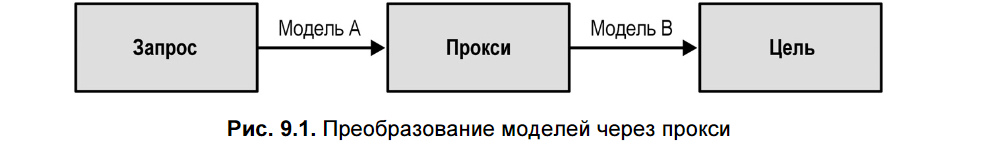

### Синхронный режим

Преобразование может быть реализовано двумя способами:

#### 1. Встраивается в код контекста
- В сервисе с открытым протоколом (**Open-Host Service**, OHS) преобразование во **внешний (публичный) язык** происходит:
  - при обработке **входящих запросов**,
  - на уровне **предохранительного слоя (Anticorruption Layer)** — при вызове вышестоящего ограниченного контекста.

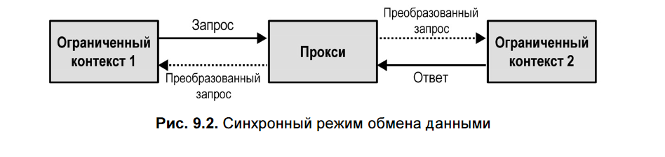

#### 2. Выносится в API-шлюз
- Используются решения вроде **Kong**, **AWS API Gateway** и др. для преобразования запросов/ответов «на лету».
- Для OHS-сервисов **опубликованный язык (Published Language)** оптимизирован именно для интеграции.
- API Gateway упрощает управление и сопровождение **нескольких версий API**.

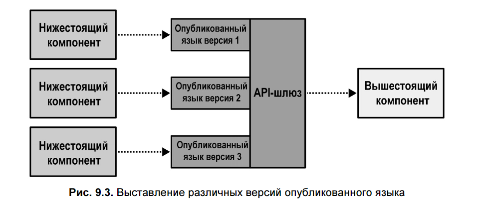

> **Предохранительный слой (Anticorruption Layer)**, реализованный через API Gateway, может обслуживать **несколько нижестоящих контекстов**.  
> В таких случаях он выступает как отдельный **ограниченный контекст интеграции**, часто называемый **контекстом обмена**.

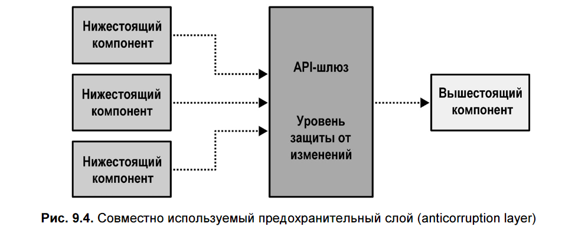

---

### Асинхронный режим

При асинхронной интеграции используется **промежуточный прокси-компонент**, который:
- **Подписывается** на события из исходного контекста,
- **Преобразует** их из внутренней модели в **опубликованный язык (Published Language)**,
- **Пересылает** целевому получателю.

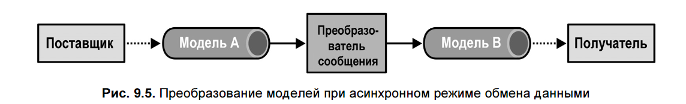

#### Преимущества
- Скрывает внутреннюю реализацию (**инкапсуляция**),
- Позволяет различать **внутренние** и **публичные** события,
- Может **фильтровать нерелевантные сообщения**, снижая «шум».

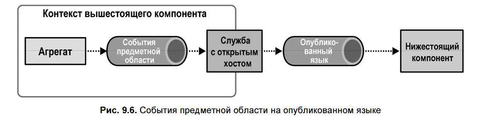

> Это надёжный способ интеграции, особенно для **сервиса с открытым протоколом (OHS)**.

---

## Преобразование моделей с отслеживанием состояния

Используется, когда требуется:
- **Агрегировать** входящие запросы (пакетная обработка),  
  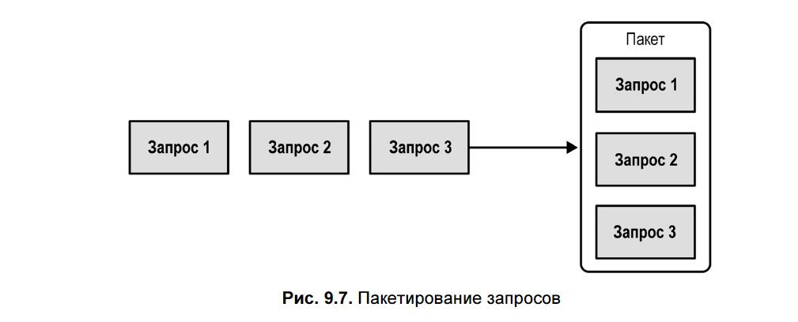
- **Объединять** несколько событий в одно,  
  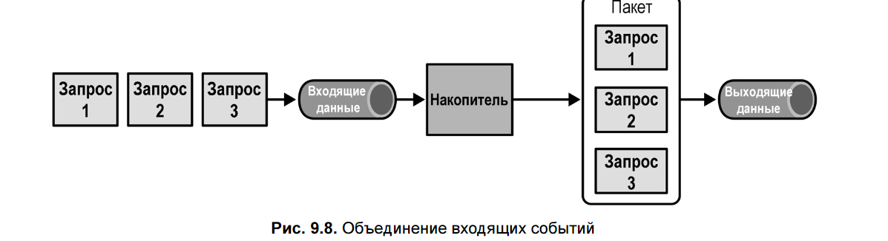
- **Собирать данные из нескольких источников** (например, для BFF или сложной бизнес-логики).

Такое преобразование:
- **Требует постоянного хранилища** (состояния),
- **Не может быть реализовано через API Gateway**.

### Типичные технологии
- Потоковые платформы: **Kafka**, **AWS Kinesis**  
- Инструменты пакетной обработки: **Spark**, **NiFi**, **AWS Glue**

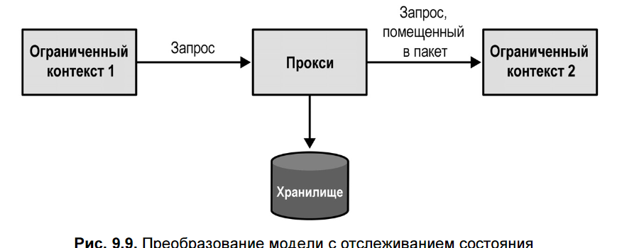

> Такой компонент может выступать в роли **предохранительного слоя**, накапливающего и нормализующего данные перед передачей в основной контекст.

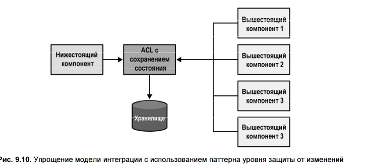

---
**Интеграция агрегатов через события предметной области** требует **надёжной публикации событий**, чтобы избежать несогласованности.

### Проблемы наивных подходов:

1. **Публикация из агрегата** (до коммита БД):
    
    - Событие уходит **до сохранения состояния** → подписчики видят несуществующие изменения.
    - При **откате транзакции** событие уже не отменить → система в несогласованном состоянии.
2. **Публикация после коммита на уровне приложения**:
    
    - Состояние сохранено, но событие **может не отправиться** (падение сервера, ошибка шины).
    - Результат: данные в БД есть, а подписчики **ничего не узнали**.

### Решение:

Использовать паттерн **исходящих сообщений (Outbox Pattern)**:

- События сохраняются в **той же транзакции**, что и изменения агрегата (в специальной таблице `outbox`).
- Отдельный процесс **надёжно доставляет** их в шину сообщений.
- Гарантирует **атомарность**: либо и данные, и событие сохранены, либо ничего.

> Это обеспечивает **согласованность** между состоянием агрегата и внешними реакциями на него.

## 📤 2. Паттерн исходящих сообщений (Outbox Pattern)

Решает проблему **надёжной публикации событий предметной области**.

### Как работает
1. **Атомарная запись**:  
   Состояние агрегата и новые события сохраняются **в одной транзакции**:
   - В реляционных БД — в отдельной таблице `outbox`.
   - В NoSQL — события встраиваются в документ агрегата (поле `outbox`).

   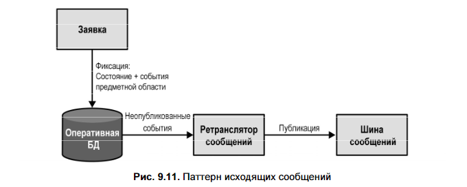  
   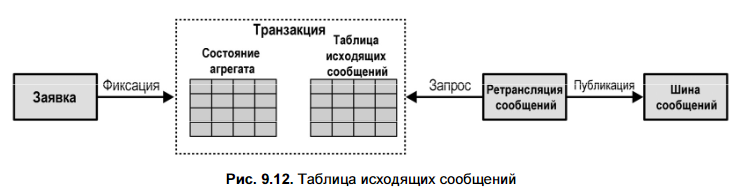

2. **Ретранслятор (relay)**:
   - Извлекает неопубликованные события из `outbox`.
   - Публикует их в шину сообщений.
   - После успешной публикации **помечает события как опубликованные** или удаляет.

3. **Механизмы извлечения событий**:
   - **Pull-модель**: ретранслятор периодически опрашивает БД (требует индексов для эффективности).
   - **Push-модель**: БД уведомляет ретранслятор через:
     - Журнал транзакций (реляционные СУБД),
     - Change Streams (например, DynamoDB Streams).

### Гарантии и особенности
- Обеспечивает **at-least-once delivery** (сообщение может быть отправлено повторно при сбое после публикации, но до подтверждения).
- Подходит как для **реляционных**, так и для **NoSQL** баз данных.
- Устраняет риск **несогласованности** между состоянием системы и внешними реакциями на события.

> Используется для надёжной интеграции агрегатов и преодоления ограничений, связанных с транзакционной целостностью при публикации событий.

---

## 🧩 3. Сага (Saga)

**Сага** — это **длительный бизнес-процесс**, охватывающий **несколько агрегатов** и **несколько транзакций**. Используется, когда одна бизнес-операция затрагивает разные сущности, которые **не должны быть объединены в один агрегат**.

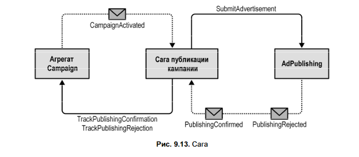

### Ключевые особенности
- **Нарушает правило "один агрегат — одна транзакция"**, но сохраняет согласованность через **компенсирующие действия**.
- **Реагирует на события** и **отправляет команды** другим компонентам.
- При ошибке на одном из шагов запускает **откат (compensation)** — например, помечает кампанию как отклонённую.

> **Пример**:  
> Активация рекламной кампании → отправка материалов издателю → ожидание подтверждения/отклонения → обновление статуса кампании.

### Реализация
1. **Без сохранения состояния** (простой случай):  
   - Сага — обычный обработчик событий, вызывающий команды.  
   - Не хранит историю, работает реактивно.

2. **С сохранением состояния** (для надёжности):  
   - Сага сохраняет **все полученные события и отправленные команды** (часто как событийный агрегат).  
   - Отправка команд выносится **асинхронно** (например, на подобии _Outbox_), чтобы избежать потери при сбое.

### Согласованность
- Сага обеспечивает **итоговую согласованность (eventual consistency)**.
- **Строгая согласованность** возможна **только внутри одного агрегата**.
- Сага **не должна компенсировать плохое проектирование агрегатов** — если данные должны быть строго согласованы, они должны быть в одном агрегате.

> 💡 Сага — инструмент для **координации распределённых бизнес-процессов**, а не замена правильной модели агрегатов.  
> Подходит для **линейных процессов** без сложной логики принятия решений.

---

## 🧭 4. Диспетчер процессов (Process Manager)
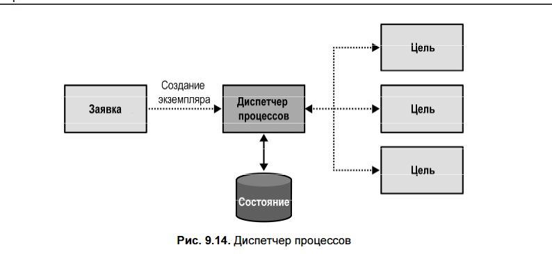
**Диспетчер процессов** — это паттерн для реализации **сложных, состоятельных бизнес-процессов**, управляемых **бизнес-логикой**, а не просто реактивным сопоставлением событий и команд.

- Имеет **состояние** и **явно создаётся** (в отличие от саги).
- Содержит **бизнес-логику**: условия, циклы, повторные попытки.

### Чем отличается от саги

| Характеристика          | **Сага**                                     | **Диспетчер процессов**                         |
| ----------------------- | -------------------------------------------- | ----------------------------------------------- |
| **Логика**              | Простое сопоставление событий → команд       | Содержит **бизнес-логику** (ветвления, условия) |
| **Создание экземпляра** | Неявно (по первому событию)                  | **Явно** (инициируется командой/запросом)       |
| **Состояние**           | Может быть без состояния                     | **Обязательно хранит состояние процесса**       |
| **Цель**                | Обеспечить согласованность через компенсацию | Управлять **многошаговым рабочим процессом**    |

> 💡 Если в саге появляются `if-else` или сложная логика выбора следующего шага — это, скорее всего, **диспетчер процессов**.

### Пример использования  
**Процесс бронирования командировки**:
1. Выбор маршрута → запрос подтверждения у сотрудника.  
2. Если отклонён → запрос на альтернативный маршрут → согласование с руководителем.  
3. Бронирование рейса → бронирование отеля.  
4. Если отель недоступен → **отмена рейса** (компенсация).
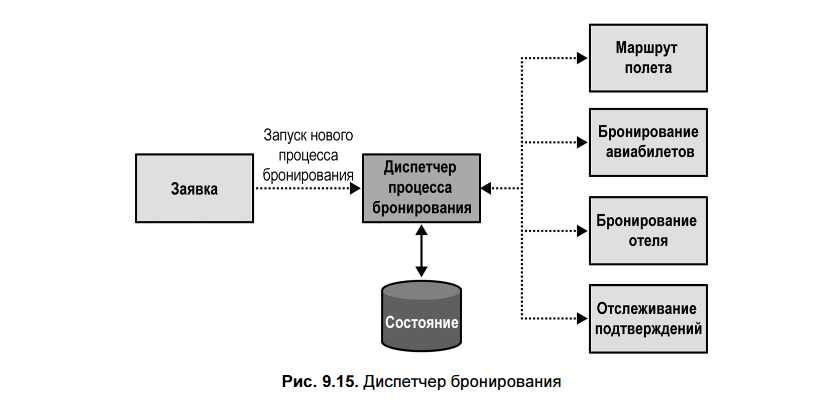
Нет единого агрегата, инициирующего всё — это **процесс как отдельная сущность**.

### Реализация
- Диспетчер часто моделируется как **агрегат**, хранящий:
  - Идентификатор процесса (`BookingId`),
  - Текущее состояние (маршрут, даты, статусы),
  - Историю событий.
- Реагирует на события (`RouteConfirmed`, `FlightBooked` и т.д.).
- Генерирует **команды через `CommandIssuedEvent`**, которые выполняются асинхронно (например, через *Outbox*).

> Диспетчер процессов — это **координатор сложного workflow**, а не просто реактивный маршрутизатор. Он **владеет логикой процесса** и **явно создаётся** для его выполнения.

---

### 💡 Ключевые принципы
- **Не используйте саги для исправления плохих границ агрегатов** — если данные должны быть строго согласованы, они должны быть в одном агрегате.  
- **Всё взаимодействие — через события и команды**, а не напрямую.  
- **Инфраструктурные детали (шины, шлюзы) — вне модели предметной области**.

---

### ✅ Вывод  
Глава завершает тактическое проектирование, показывая, как:
- **интегрировать** разные модели,
- **надёжно публиковать** события,
- **координировать** процессы между агрегатами.

Эти паттерны — основа для построения **масштабируемых, отказоустойчивых и согласованных** распределённых систем на основе DDD.