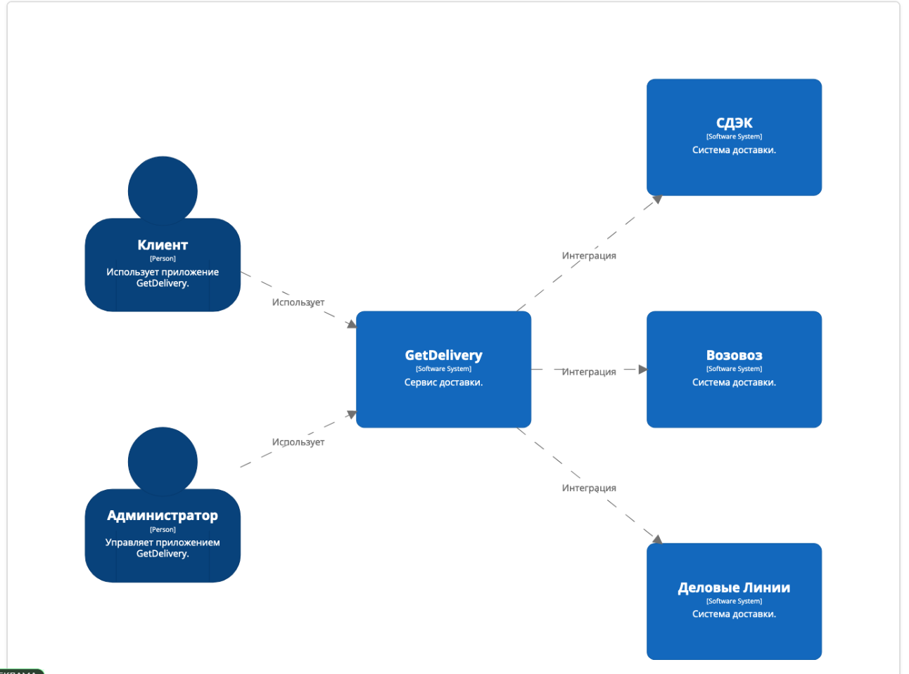
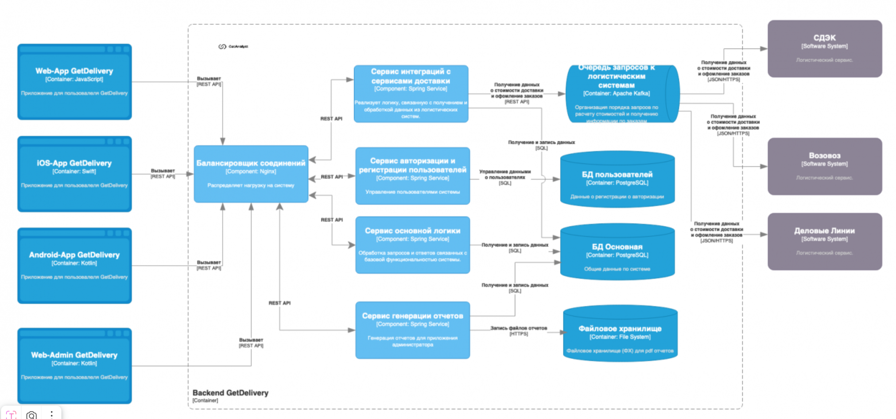
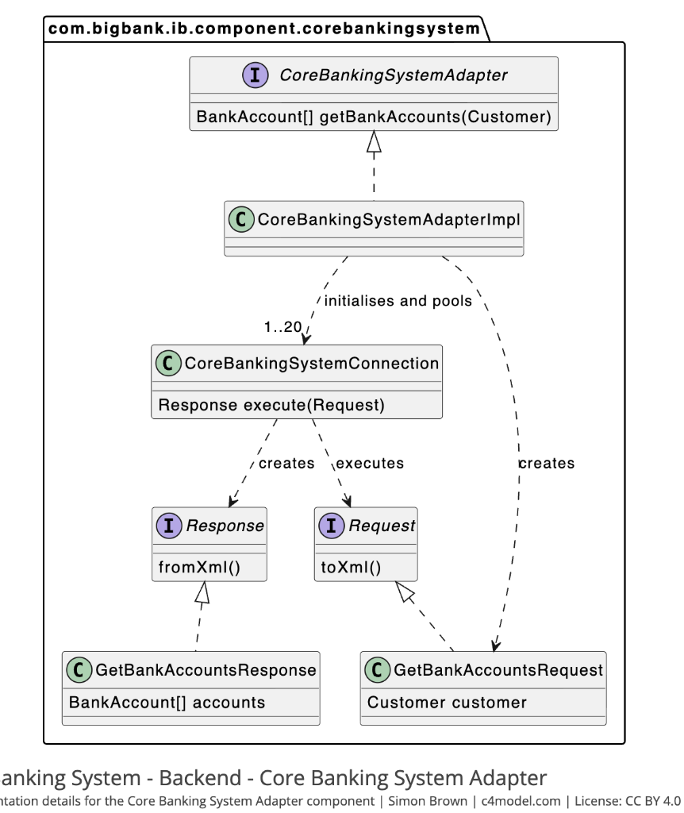

# Модель C4: Визуализация архитектуры программного обеспечения

> _"C4 — это простой способ объяснить людям свою архитектуру ПО."_  
> — **Саймон Браун (Simon Brown)**

## Что такое модель C4?

**C4 Model** — это **иерархический подход к визуализации архитектуры программного обеспечения**, разработанный Саймоном Брауном. Она помогает архитекторам создавать **понятные, последовательные и полезные диаграммы** для разных аудиторий.

> 💬 _"C4 представляет собой технологию составления диаграмм, разработанную Саймоном Брауном для устранения недостатков UML и модернизации используемого в нем подхода."_

### Основные принципы

- **Иерархичность**: От общего к частному.
- **Независимость от нотации**: Можно использовать любые инструменты.
- **Фокус на коммуникации**: Диаграммы — средство диалога, а не самоцель.

---

## Четыре уровня C4

Четыре «C» расшифровываются как:

|||||
|---|---|---|---|
|**1. Context**|Контекст|**Что это за система и как она вписывается в ИТ-ландшафт?**|Бизнес, нетехнические стейкхолдеры, разработчики|
|**2. Container**|Контейнеры|**Какие основные технические компоненты (контейнеры) её составляют?**|Разработчики, архитекторы, эксплуатационники|
|**3. Component**|Компоненты|**Из каких компонентов состоят контейнеры?**|Разработчики|
|**4. Code**|Код|**Как выглядят ключевые классы и их взаимодействие?**|Разработчики (на уровне реализации)|

---

### 1. Контекст (Context)

Показывает, как система взаимодействует с внешними сущностями (пользователями, внешними системами). Сразу видно интеграции.

Обычно используют на начальных этапах проектирования, для понимания общего контекста.

Элементы:  
- системы,  
- пользователи,  
- взаимосвязи.

**Цель**: Показать систему в её окружении.

---

### 2. Контейнеры (Container)

Описывает верхнеуровневую архитектуру и технологии. Используется для понимания технологического стека и разделения зон ответственности.  
  
Элементы:  
- контейнеры (например, веб-приложения, базы данных),  
- взаимосвязи,  
- технологии

---

### 3. Компоненты (Component)
Детализирует структуру внутри контейнера системы, т.е. описывает более детально только один контейнер из предыдущего уровня.  
  
Используется для проектирования и документирования внутренней структуры компонентов системы.

**Элементы:**  
- компоненты,  
- взаимосвязи,  
- технологии,  
- зависимости.

---

### 4. Код (Code)
Показать реализацию ключевых сценариев..  
  
Используется для документирования структуры кода. На практике не используется, т.к. разработчикам это не надо. **ЭтоДиаграммы классов (UML) или последовательности (sequence diagrams): вроде полезно понимать, а по факту не нужна.**  
  
Элементы:  
- классы,  
- интерфейсы,  
- отношения между ними.

> 💬 _"В C4 используется тот же стиль диаграмм классов, что и в UML, который вполне эффективен и поэтому не требует замены."_