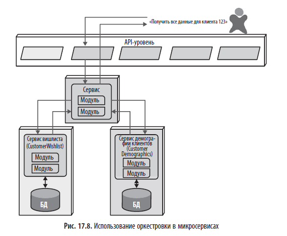
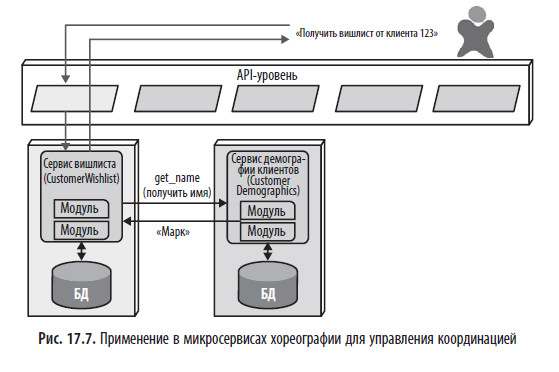

# Оркестровка (orchestration) и хореография (choreography)

> *"Оркестровка представляет собой координацию работы нескольких сервисов посредством использования отдельного сервиса-посредника, контролирующего рабочий поток транзакции и управляющего этим потоком (наподобие дирижера в оркестре). А хореография, по сути, является координацией работы нескольких сервисов, при которой все сервисы общаются друг с другом без использования центрального посредника (как танцоры в танце)."*

## Краткое содержание
**Оркестровка** и **хореография** — это два паттерна координации **многих сервисов** для выполнения **сложной бизнес-транзакции**. Они используются в распределённых архитектурах (микросервисы, сервис-ориентированные архитектуры), когда одна операция требует взаимодействия нескольких сервисов.

---

## 🎻 Оркестровка (Orchestration)

### Определение
**Оркестровка** — это **централизованный** способ координации сервисов, при котором **один сервис (оркестратор)** управляет **всем рабочим потоком**, вызывая другие сервисы в нужном порядке.

> 💬 *"Оркестровка представляет собой координацию работы нескольких сервисов посредством использования отдельного сервиса-посредника, контролирующего рабочий поток транзакции и управляющего этим потоком (наподобие дирижера в оркестре)."*

### Как работает?
1.  Пользователь отправляет запрос.
2.  **Оркестратор** (например, `OrderProcessor`) получает запрос.
3.  Оркестратор **последовательно вызывает** другие сервисы:
    - `PaymentService` → `InventoryService` → `NotificationService`.
4.  Собирает результаты и возвращает ответ.

> 🖼️ *Рис. 17.8: Использование оркестровки в микросервисах*

### Пример
Пользователь: "Оформить заказ"
          ↓
[Orchestrator: OrderProcessor]
          ↓
[PaymentService] → Оплатить
          ↓
[InventoryService] → Зарезервировать товар
          ↓
[NotificationService] → Отправить email
          ↓
Ответ пользователю

### ✅ Преимущества

|Плюс|Описание|
|---|---|
|**Простота понимания**|Весь поток виден в одном месте.|
|**Контроль над ошибками**|Оркестратор может обрабатывать сбои и запускать компенсирующие действия.|
|**Простота отладки**|Легко проследить цепочку вызовов.|

### ⚠️ Недостатки

|Минус|Описание|
|---|---|
|**Единая точка отказа**|Если оркестратор упадёт — весь процесс остановится.|
|**Связанность**|Все сервисы зависят от оркестратора.|
|**Централизация**|Нарушает принцип децентрализации микросервисов.|

---

## 💃 Хореография (Choreography)

### Определение

**Хореография** — это **децентрализованный** способ координации, при котором сервисы **взаимодействуют друг с другом через события**, без центрального координатора.

> 💬 _"Хореография... является координацией работы нескольких сервисов, при которой все сервисы общаются друг с другом без использования центрального посредника (как танцоры в танце)."_

### Как работает?

1. Пользователь отправляет запрос.
2. Первый сервис (например, `OrderService`) обрабатывает его и **публикует событие**:
    - `OrderPlaced`.
3. Другие сервисы **подписаны** на это событие:
    - `PaymentService` → `ProcessPayment`
    - `InventoryService` → `ReserveItems`

Каждый сервис **самостоятельно** реагирует на события.

> 🖼️ _Рис. 17.7: Использование хореографии в микросервисах_

### Пример

Пользователь: "Оформить заказ"
          ↓
[OrderService] → Сохраняет заказ
          ↓
Публикует: OrderPlaced(order_id=123)
          ↓
[PaymentService] ← Получает событие → Обрабатывает оплату
[InventoryService] ← Получает событие → Резервирует товар
[NotificationService] ← Получает событие → Отправляет email

Пользователь: "Оформить заказ"

↓

[OrderService] → Сохраняет заказ

↓

Публикует: OrderPlaced(order_id=123)

↓

[PaymentService] ← Получает событие → Обрабатывает оплату

[InventoryService] ← Получает событие → Резервирует товар

[NotificationService] ← Получает событие → Отправляет email

### ✅ Преимущества

|Плюс|Описание|
|---|---|
|**Слабая связанность**|Сервисы не знают друг о друге.|
|**Масштабируемость**|Каждый сервис может развиваться независимо.|
|**Отказоустойчивость**|Сбой одного сервиса не останавливает всю систему.|

### ⚠️ Недостатки

|Минус|Описание|
|---|---|
|**Сложность отладки**|Трудно проследить цепочку событий.|
|**Сложность управления ошибками**|Нужны сложные механизмы (например, саги).|
|**Риск "невидимых" зависимостей**|Сервисы зависят от событий, но это неочевидно.|

---

## 🆚 Сравнение

|Критерий|Оркестровка|Хореография|
|---|---|---|
|**Централизация**|Да (есть оркестратор)|Нет (децентрализовано)|
|**Связанность**|Высокая (все зависят от оркестратора)|Низкая (через события)|
|**Простота понимания**|Высокая (весь поток в одном месте)|Низкая (рассеян по сервисам)|
|**Отладка**|Проще|Сложнее|
|**Гибкость**|Ниже|Выше|
|**Подходит для**|Простых, линейных процессов|Сложных, асинхронных процессов|
|**Аналогия**|Дирижёр оркестра|Танцоры в танце|

---

## 🔁 Связь с другими архитектурными стилями

|Стиль|Использует|
|---|---|
| [Оркестрированная сервис-ориентированная архитектура](../books/fundamental-software-architecture/chapters/ГЛАВА 16 Оркестрированная сервис- ориентированная архитектура.md) | В основном**оркестровку**(через центр интеграции) |
| [Архитектура, управляемая событиями](../books/fundamental-software-architecture/chapters/ГЛАВА 14 Архитектура, управляемая событиями.md) | В основном**хореографию**(через брокер событий) |
| [Архитектура микросервисов](../books/fundamental-software-architecture/chapters/ГЛАВА 17 Архитектура микросервисов.md) | **Оба стиля**— выбор зависит от сложности процесса |

> 💬 _"В микросервисах популярным паттерном транзакций является паттерн саги (saga pattern)."_
> 
> - **Оркестрованная сага** — использует оркестратор.
> - **Хореографированная сага** — использует события.

---

## 💬 Вывод

|Ситуация|Выбирайте|
|---|---|
|Простой, линейный процесс|**Оркестровка**|
|Сложный, асинхронный процесс|**Хореография**|
|Нужна простота и контроль|**Оркестровка**|
|Нужна гибкость и масштабируемость|**Хореография**|

> ✅ **Итог**:
> 
> - **Оркестровка** — как дирижёр: всё под контролем, но если он упадёт — оркестр замолчит.
> - **Хореография** — как танец: каждый танцор знает свою роль, но общую картину трудно увидеть.

---

## 💬 Вопросы для обсуждения (в книжном клубе)